# Business Game

**Source**: [Business Strategy Lecture Video](https://lemida.biu.ac.il/blocks/video/viewvideo_biu.php?id=342177&courseid=106274&type=2)

## Business Strategy Lecture

## Table of Contents
1. [Introduction to Strategy](#introduction)
2. [Porter's Basic Strategies](#porters-strategies)
3. [Strategy Types & Examples](#strategy-types)
4. [Industry Analysis & Strategy Selection](#industry-analysis)
5. [Organizational Management Structures](#management-structures)

---

## Introduction to Strategy {#introduction}

### What is Strategy?

**Strategy** is used in business and military contexts:
- **Strategy** = The end goal, the bigger picture, where we want to be
- **Tactics** = The way/methods to get there

### Business Strategy Goal
> Create a **sustainable competitive advantage** over other companies

When executed well, strategy allows a company to:
- Gain advantage over competitors
- Earn more revenue
- Be competitive in specific segments or regions

---

## Porter's Basic Strategies {#porters-strategies}

The simulation implements Porter's basic strategies globally. Three key questions define your strategy:

### Three Strategic Questions

| Question | Options |
|----------|---------|
| **Geographic Scope** | Local OR Global |
| **Market Scope** | Niche OR Broad |
| **Competitive Advantage** | Cost Leadership OR Differentiation |

### Strategy Visualization

```mermaid
graph TD
    Start([🎯 Strategic Planning<br/>Answer 3 Questions]) --> Q1
    
    Q1{🌍 QUESTION 1<br/>Where will you compete?<br/><br/>Consider: Market size,<br/>shipping costs, complexity}
    
    Q1 -->|LIMITED:<br/>1-2 countries<br/>Lower investment<br/>Easier to manage| Local[✓ LOCAL]
    Q1 -->|WORLDWIDE:<br/>All regions<br/>Higher investment<br/>More complex| Global[✓ GLOBAL]
    
    Local --> Q2L{📊 QUESTION 2<br/>Who are your customers?<br/><br/>Consider: Product range,<br/>management complexity}
    Global --> Q2G{📊 QUESTION 2<br/>Who are your customers?<br/><br/>Consider: Product range,<br/>management complexity}
    
    Q2L -->|FOCUSED:<br/>Either Low Tech<br/>OR High Tech| Niche1[✓ NICHE<br/>3-4 products<br/>in ONE segment]
    Q2L -->|EVERYONE:<br/>Both Low Tech<br/>AND High Tech| Broad1[✓ BROAD<br/>Products span<br/>BOTH segments]
    
    Q2G -->|FOCUSED:<br/>Either Low Tech<br/>OR High Tech| Niche2[✓ NICHE<br/>3-4 products<br/>in ONE segment]
    Q2G -->|EVERYONE:<br/>Both Low Tech<br/>AND High Tech| Broad2[✓ BROAD<br/>Products span<br/>BOTH segments]
    
    Niche1 --> Q3A{⚡ QUESTION 3<br/>How will you win?<br/><br/>Consider: Investment needs,<br/>competitive advantage}
    Broad1 --> Q3B{⚡ QUESTION 3<br/>How will you win?<br/><br/>Consider: Investment needs,<br/>competitive advantage}
    Niche2 --> Q3C{⚡ QUESTION 3<br/>How will you win?<br/><br/>Consider: Investment needs,<br/>competitive advantage}
    Broad2 --> Q3D{⚡ QUESTION 3<br/>How will you win?<br/><br/>Consider: Investment needs,<br/>competitive advantage}
    
    Q3A -->|PRICE WAR:<br/>Lowest cost<br/>High automation<br/>Volume production| S1[💰 Local Niche<br/>Cost Leader]
    Q3A -->|PREMIUM:<br/>Best product<br/>High R&D<br/>Premium pricing| S2[⭐ Local Niche<br/>Differentiator]
    
    Q3B -->|PRICE WAR:<br/>Lowest cost<br/>High automation<br/>Volume production| S3[💰 Local Broad<br/>Cost Leader]
    Q3B -->|PREMIUM:<br/>Best product<br/>High R&D<br/>Premium pricing| S4[⭐ Local Broad<br/>Differentiator]
    
    Q3C -->|PRICE WAR:<br/>Lowest cost<br/>Huge capacity<br/>Global efficiency| S5[💰 Global Niche<br/>Cost Leader]
    Q3C -->|PREMIUM:<br/>Best product<br/>Innovation focus<br/>Rolls-Royce model| S6[⭐ Global Niche<br/>Differentiator<br/>EASIEST GLOBAL]
    
    Q3D -->|PRICE WAR:<br/>Lowest cost<br/>Massive scale<br/>IKEA model| S7[💰 Global Broad<br/>Cost Leader<br/>HARDEST TO ACHIEVE]
    Q3D -->|PREMIUM:<br/>Best product<br/>Brand power<br/>Apple model| S8[⭐ Global Broad<br/>Differentiator<br/>HIGH COMPETITION]
    
    style Start fill:#4fc3f7,color:#000
    style Q1 fill:#fff59d,color:#000
    style Q2L fill:#fff59d,color:#000
    style Q2G fill:#fff59d,color:#000
    style Q3A fill:#fff59d,color:#000
    style Q3B fill:#fff59d,color:#000
    style Q3C fill:#fff59d,color:#000
    style Q3D fill:#fff59d,color:#000
    style S1 fill:#ef9a9a,color:#000
    style S3 fill:#ef9a9a,color:#000
    style S5 fill:#ef9a9a,color:#000
    style S7 fill:#b71c1c,color:#fff
    style S2 fill:#a5d6a7,color:#000
    style S4 fill:#a5d6a7,color:#000
    style S6 fill:#2e7d32,color:#fff
    style S8 fill:#66bb6a,color:#000
```



---

## Strategy Types & Examples {#strategy-types}

### 1. Local Niche Cost Leader

**Positioning:** Focus on Low Tech segment, one or two regions

**Product Strategy:**
- 3-4 products in Low Tech segment only
- All products positioned for cost-sensitive customers
- Lower prices = priority

**Real World Example:** Low-cost airlines (e.g., Cyprus, Greece routes)
- Don't fly worldwide, only nearby destinations
- Provide local service with cost leadership

#### Why Multiple Products in Same Segment?

**Market Share Advantage:**
- With 1 product among 6 competitors = 1/6 ≈ 16% market share
- With 2 products among 7 total = 2/7 ≈ 28% market share

**Synergistic Benefits:**
- Sales channels are **shared** across products in same segment
- If investing \$1M in sales for each of 2 products = effectively \$2M channel investment
- Competitors with 1 product need \$2M investment to match
- **Result:** Less sales expense per product + higher accessibility

#### Cost Reduction Methods in Simulation

| Method | Impact |
|--------|--------|
| **Automation** | Reduces labor costs |
| **Reduce Service Life/MTBF** | Lowers material costs |
| **HR Investment** | Production team training → fewer employees needed |
| **Plant Location** | Consider labor costs, shipping, tariffs |

#### Real World Cost Reduction: Low-Cost Airlines

- **Standardization:** Same aircraft type → less training needed
- **Bulk Purchasing:** Volume discounts on aircraft
- **Fees:** Food, luggage, seat selection (mainly to disincentivize baggage = less fuel)
- **Airport Choice:** Secondary airports (e.g., Luton vs Heathrow) → cheaper landing fees
- **New Fleet:** Better fuel efficiency, less maintenance
- **Quick Turnaround:** 15-20 minutes between flights

**Key Insight:** Fees aren't the main profit source; biggest savings come from fuel efficiency, maintenance, and airport costs.

#### Implementation Strategy

- **Automation Level:** High automation required
- **Material Costs:** Minimum
- **Factory Utilization:** Produce at high capacity
- **Margins:** Maintain profitable margins while staying competitive

---

### 2. Local Niche Differentiator

**Positioning:** Focus on High Tech segment, one or two regions

**Product Strategy:**
- 3-4 products in High Tech segment
- Products positioned at ideal spot (upper right of perceptual map)
- Best performance = priority

**Key Success Factors:**

| Factor | Importance | Why? |
|--------|-----------|------|
| **R&D** | Critical | Must offer best performance |
| **Time to Market** | Critical | Be first with new products |
| **Positioning** | High | Keep products at ideal spot |
| **Regional Kit** | Medium | Takes 3 months, plan ahead! |
| **Pricing** | Above average | Premium pricing strategy |
| **Marketing Budget** | High | Promo + Sales investment |

#### HR Focus for Differentiators

**Priority:** R&D Scientists recruitment & training
- Shortens development time
- Maintains innovation edge
- Can also support sales team training for increased demand

#### Product Management Considerations

**Challenge:** As market evolves, segments separate
- Low Tech circle moves differently than High Tech
- Products at ideal spots become increasingly important
- Need continuous R&D to stay ahead

---

### 3. Global Niche Cost Leader

**Same as Local Niche Cost Leader, but:**
- Serve ALL regions (not just 1-2)
- Higher investment requirements
- More complex capacity planning

#### Plant Location Strategy

**Considerations:**

| Factor | Optimal Location |
|--------|-----------------|
| **Market Size** | Largest market for segment |
| **Shipping Costs** | Central location or near major markets |
| **Labor Costs** | Low labor cost regions |

**For Low Tech (Cost Leadership):**
- **Starting:** US (good shipping to all regions)
- **Long-term:** China (biggest Low Tech market + lowest labor costs)

**For High Tech (Differentiation):**
- **Option:** Germany (2nd largest market, will surpass US)
- **Advantage:** Lowest defect rates

#### Main Challenge: CAPACITY

**Problem:** Need massive capacity + high automation = expensive

**Planning Requirements:**
1. Cannot go global immediately
2. Must balance demand creation with production capacity
3. Don't create demand without products to sell
4. Don't overbuy capacity without demand

**Strategy:** Plan ahead, expand capacity progressively as you enter new markets

---

### 4. Global Niche Differentiator

**Example:** Rolls-Royce

**Strategy:**
- High-end products globally
- Performance segments only
- High prices worldwide

#### Why Easier Than Cost Leadership?

**Lower Initial Investment:**
- Can start with LOW automation
- Customers willing to pay premium prices
- Don't need high automation from day 1
- Can increase automation later for better margins

**Capacity Planning:**
- Less pressure than cost leadership
- Premium pricing covers higher per-unit costs
- Easier to balance investment and returns

---

### 5. Global Broad Cost Leader

**Example:** IKEA

**Strategy:**
- Serve BOTH Low Tech and High Tech segments
- ALL regions
- Cost leadership across the board

#### IKEA's Sustainable Competitive Advantage

**How IKEA Reduces Costs:**

1. **Customer Assembly**
   - No labor costs for assembly
   - Customers convinced it's "fun" to build furniture

2. **Customer Shipping**
   - Flat packaging fits in cars
   - Customers transport products themselves
   - Eliminates delivery costs

3. **Flat Packaging Benefits**
   - Reduced shipping costs in supply chain
   - Lower warehouse costs (efficient storage)
   - Store = warehouse (no separate facility needed)

4. **Standardization**
   - Common components across products
   - Bulk purchasing power
   - Simplified logistics

**Result:** **No competitor can match their cost structure**

#### Broad Strategy Characteristics

**Product Positioning:**
- Products span both segments
- Some products in Low Tech circle
- Some products overlap both circles (serve both markets)

**Market Coverage:**
- Don't leave any market to competitors
- Capture demand from both segments
- Higher initial sales volume

#### Challenges & Complexity

**Product Management:**
- 2 products serve BOTH segments
- Must forecast demand from Low Tech AND High Tech for each product
- More complex calculations: Units from Low Tech + Units from High Tech

**Example Calculation:**
```
Product A Total Demand = Low Tech Demand + High Tech Demand
Need to analyze each segment separately, then combine
```

**Marketing Complexity:**
- Different promotional needs per segment
- Sales channels shared within segment
- Must manage expectations across different customer types

**R&D Challenge:**
- As markets evolve, segments separate
- Overlap area becomes smaller
- Harder to stay relevant to both markets
- Niche competitors may become stronger in later rounds

**Management Workload:**
- If global → calculations for EVERY market
- Each product needs dual-segment analysis
- Significantly more decision-making required

---

### 6. Global Broad Differentiator

**Example:** Apple

**Strategy:**
- High-end products
- Both segments
- Global presence

#### Apple Product Portfolio

**Positioning on Perceptual Map:**
- **iPhone 16** (latest): Top right (High Tech ideal)
- **iPhone 15, 14**: Still relevant for High Tech, not for Low Tech
- Regional kits applied to all products

**vs. Cost Leader Alternative:**
- **Xiaomi**: Broad Cost Leader
  - Serves everyone
  - Lower cost positioning
  - Broader accessibility, lower prices

**Apple Differentiation:**
- Premium positioning
- Latest technology
- Relevant across markets but at high-end

---

### 7. Local Broad Cost Leader

**Same as Global Broad Cost Leader**
- Limited to 1-2 regions instead of worldwide
- All other characteristics identical

---

### 8. Local Broad Differentiator

**Same as Global Broad Differentiator**
- Limited to 1-2 regions instead of worldwide
- All other characteristics identical

---

## Strategy Comparison Matrix

| Strategy Type | Geographic | Market | Focus | Investment | Complexity | Competition Risk |
|--------------|------------|--------|-------|------------|------------|------------------|
| **Local Niche Cost** | 1-2 regions | Low Tech only | Price | High automation | Medium | Low (sustainable) |
| **Local Niche Diff** | 1-2 regions | High Tech only | Performance | R&D heavy | Medium | Medium |
| **Global Niche Cost** | All regions | Low Tech only | Price | Very High | High | Low (sustainable) |
| **Global Niche Diff** | All regions | High Tech only | Performance | Moderate start | Low-Medium | Medium-High |
| **Local Broad Cost** | 1-2 regions | Both segments | Price | Very High | High | Low |
| **Local Broad Diff** | 1-2 regions | Both segments | Performance | High | High | Medium-High |
| **Global Broad Cost** | All regions | Both segments | Price | Extremely High | Very High | Low (if achieved) |
| **Global Broad Diff** | All regions | Both segments | Performance | High | Very High | High |

---

## Which Strategies Are Most Difficult?

### Most Complex to Implement: BROAD Strategies

**Why Broad is Challenging:**
- Serve different segments with different requirements
- Different demand patterns
- Different customer needs
- More products to manage
- More forecasting complexity

**Short-term Advantage:**
- Access to both markets immediately
- Higher initial revenue potential

### Extreme Strategies: Cost Leadership

**Why Difficult in Short-Term:**

**Starting Position:**
- First product starts in the MIDDLE of perceptual map
- If you immediately move to High Tech → product exits Low Tech circle
- **Loss:** 2/3 of market (Low Tech is larger)
- First companies to do this lose significant sales

**Major Investment Challenge:**

**Starting Capital:** ~$15M first year

**What's Needed:**
- High automation for products
- Large capacity for multiple products
- Need to launch 3-4 products quickly

**The Problem:**
1. Invest heavily in capacity & automation
2. Raise significant capital
3. Can't reduce prices initially (need to cover costs)
4. High demand but need profitable margins
5. Planning is VERY difficult

**Long-term Advantage:**
- Once established (Round 4-5): high automation, large capacity
- Competitors CAN'T easily imitate
- Takes too much time to catch up
- Sustainable competitive advantage (like IKEA)

### Moderately Complex: Differentiator Strategies

**Easier to Enter:**
- Launch product in right position
- Can compete relatively quickly
- Less initial capital required

**Challenge:**
- More susceptible to competition
- Competitors can match positioning
- Must constantly innovate
- Expect competition throughout the game

---

## Industry Analysis & Strategy Selection {#industry-analysis}

### How to Pick Your Strategy

#### Step 1: Industry Analysis

Analyze the following data:

| Analysis Area | What to Examine |
|--------------|----------------|
| **Growth Rates** | Different segments in each country over 8 years |
| **Market Size** | Total quantities across 8 years by segment/region |
| **Pricing Trends** | Price evolution by segment |
| **Investment Costs** | Capital requirements for each strategy type |
| **Plant Location** | Shipping costs, tariffs, labor costs, defect rates |

#### Step 2: Competitor Consideration

**Unknown Variables:**
- What will other companies do?
- Need flexibility in your plan

**Approach:**
- Develop **Plan A** (primary strategy)
- Develop **Plan B** (alternative)
- Decide pivot point (after Round 2-3?)
- Understand when it's too late to change strategy

#### Step 3: Implementation Assessment

**Team Capacity Questions:**
- Can your team manage this strategy's complexity?
- Do you have the skills for this management style?
- How will you coordinate decisions?

**Complexity by Strategy:**
- **Lowest Complexity:** Global Niche Differentiator
- **Moderate Complexity:** Niche strategies (local/global cost)
- **High Complexity:** Broad strategies
- **Highest Complexity:** Global Broad Cost Leader

### Strategy Implementation Tactics

Once strategy is chosen, determine tactics for all 8 years:


**Key Decisions Per Department:**

| Department | Key Decisions |
|-----------|---------------|
| **R&D** | Product positioning, regional kits, development priorities |
| **Marketing** | Product launch timing, regional entry, promo/sales budgets |
| **Production** | Capacity purchases, automation levels, plant locations |
| **Finance** | Capital raising pace, budget allocation, profitability targets |

**Timeline Questions:**
- When to launch each product?
- Which regions first?
- When to go global (if applicable)?
- When to invest in capacity/automation?

---

## Organizational Management Structures {#management-structures}

### 1. Functional Structure

**Organization Chart:**


**Role Distribution (6 people):**
- CEO (overall strategy & coordination)
- R&D Manager
- Marketing Manager
- Production Manager
- Finance Manager
- Business Intelligence (competitor analysis)

#### Advantages ✅

| Advantage | Description |
|-----------|-------------|
| **Expertise** | Everyone becomes expert in their function |
| **Steep Learning Curve** | Deep knowledge in specific area |
| **Clear Responsibilities** | Each person owns their domain |

#### Challenges ⚠️

| Challenge | Impact |
|-----------|--------|
| **Lack of Coordination** | Departments work in silos |
| **Function Conflicts** | Marketing wants speed, R&D wants perfection, Finance wants budget control |
| **Low Market Awareness** | Only CEO & Marketing Manager see full market picture |
| **Forecasting Nightmare** | Marketing Manager must forecast: 3 countries × 4 products = 12 scenarios |
| **No Redundancy** | If Marketing Manager gets sick, no one can cover |
| **Specialization Risk** | One person overwhelmed, others can't help |

**Who is Market-Aware?**
- CEO (partially)
- Marketing Manager (fully - but overloaded!)

**The Problem:**
Marketing Manager = sole person aware of all market dynamics across all products and regions

---

### 2. Product/Regional Manager Structure

**Organization Chart:**


**Alternative:** Regional Managers instead of Product Managers (same concept)

**Role Distribution:**
- Each person manages ONE product completely
- Responsible for: R&D, Marketing, Production for their product
- One person takes Finance (company-wide)

#### Advantages ✅

| Advantage | Description |
|-----------|-------------|
| **High Redundancy** | Everyone knows R&D, Marketing, Production |
| **High Market Awareness** | Each manager monitors market for their product |
| **Simple Learning Curve** | After solo, everyone has necessary skills |
| **Accountability** | Clear ownership per product |
| **Cross-Coverage** | Anyone can cover for sick colleague |

#### Challenges ⚠️

| Challenge | Description |
|-----------|-------------|
| **Must Master All Functions** | Each person needs R&D, Marketing, Production skills |
| **Coordination Issues** | Product 1 manager wants high automation, Product 2 manager also wants it → budget conflict |
| **Potential Conflicts** | Competition for resources between products |

**Solution to Challenges:**
- Team meetings to coordinate
- Everyone accepts overall strategy
- Agree on pace and priorities
- Align on investment timing

**Popularity:** Very popular management system for students (cultural fit for Israel)

---

### 3. One-Player Approach (Committee Management)

**Structure:**


**Everyone is involved in every decision**

#### Advantages ✅

| Advantage | Description |
|-----------|-------------|
| **Shared Knowledge** | Everyone knows everything |
| **Better Decisions?** | Multiple perspectives on each issue |
| **Full Awareness** | Everyone monitors all aspects |
| **No Responsibility Fear** | Shared accountability |
| **Democratic** | Everyone has input |

#### Challenges ⚠️ (HUGE)

| Challenge | Impact | Severity |
|-----------|--------|----------|
| **Time-Consuming** | Everyone discusses: R&D for 4 products × 3 countries × Marketing × Production | CRITICAL |
| **Averaging Decisions** | Compromise solutions, not optimal ones | High |
| **Risky Decisions Avoided** | Group conservatism | Medium |
| **Dominant Voices** | Some people don't contribute | High |
| **No Expertise Focus** | No one becomes truly professional in any area | High |
| **No Clear Responsibility** | When things fail, who's accountable? | CRITICAL |

**Reality Check:**
- Works for Round 1-2 (1-2 products)
- Becomes **nightmare** by Round 3-4
- Many teams start this way → must change later

#### When It Works

**Good for:**
- First 1-2 rounds only
- Simple decisions
- Building team cohesion initially

**Must Change When:**
- Managing 3+ products
- Operating in multiple regions
- Time pressure increases

---

### Recommended Approach: STRUCTURED Management

Even if you want everyone involved:

#### Required Structure

**Before Meetings:**

1. **Assign Responsibilities**
   - Someone analyzes R&D
   - Someone analyzes Marketing
   - Someone analyzes Production
   - Someone analyzes Competitors

2. **Preparation Requirements**
   - Each person comes with:
     - Data collected
     - Analysis completed (not raw data!)
     - Recommendations ready

3. **Meeting Process**
   - Responsible person presents their area
   - Everyone discusses and decides
   - But ONE person owns the analysis

**Key Principle:**
> Not everyone can do everything all the time - it just doesn't work!

**Why This Works:**
- ✅ Maintains involvement for all
- ✅ Ensures proper preparation
- ✅ Speeds up decision-making
- ✅ Creates accountability
- ✅ Produces analyzed (not raw) information

---

## Deliverable: Strategy Presentation

### What to Prepare for Team Meeting

**Template Provided:** Use the uploaded template

#### Slide 1: Overall Strategy (Round 1 → Round 6-8)

**Include:**
- Chosen strategy type
- Geographic scope plan
- Market scope (niche/broad)
- Competitive advantage approach (cost/differentiation)
- Timeline overview

**Example:**
```
Round 1-2: Start with 1 product, Local (US + Germany), Niche Differentiator
Round 3-4: Launch 2nd & 3rd products, maintain focus
Round 5-6: Expand to global (add remaining regions)
Round 7-8: Optimize and defend market position
```

#### Slide 2: Product & Market Launch Plan

**Specify:**

| Element | Details |
|---------|---------|
| **Regions** | Which regions, in what order? |
| **Products** | When to launch each product? |
| **Market Entry** | Timeline for regional expansion |

**Example Timeline:**
- Round 1: Product A in US
- Round 2: Product A in Germany, Product B in US
- Round 3: Product B in Germany
- Round 4: Product C launches...

#### Slide 3: Department Strategy

**For Each Department:**

**R&D:**
- Positioning targets
- Regional kit timing
- Development priorities

**Marketing:**
- Promo budget approach
- Sales budget approach
- Regional entry strategy

**Production:**
- Capacity investment plan
- Automation roadmap
- Plant location strategy

**Finance:**
- Capital raising plan
- Budget allocation priorities

#### Slide 4: Team Management Structure

**Specify:**
- Management approach (Functional/Product/Mixed)
- Role assignments
- Decision-making process
- Meeting structure
- Coordination mechanisms

---

## Key Takeaways

### Strategy Success Factors

1. **Plan Long-Term** (all 8 years)
2. **Understand Your Market** (growth, prices, demand)
3. **Know Your Costs** (investment requirements)
4. **Match Team Capability** (can you execute?)
5. **Stay Flexible** (Plan A & B)
6. **Coordinate Well** (management structure matters)

### Common Pitfalls to Avoid

- ❌ **Don't:** Create demand without capacity
- ❌ **Don't:** Buy capacity without demand
- ❌ **Don't:** Choose strategy without team capability assessment
- ❌ **Don't:** Use one-player approach beyond Round 2
- ❌ **Don't:** Forget to analyze competitors
- ❌ **Don't:** Ignore the importance of timing

### Success Formula

```
Strategic Planning
    + Tactical Execution
    + Team Coordination
    + Market Awareness
    + Continuous Adaptation
    ________________________________
    = Sustainable Competitive Advantage
```

---

## Next Steps

1. **Holiday Assignment:** Think about strategy choice
2. **Industry Analysis:** Use provided data to analyze markets
3. **Team Discussion:** Agree on approach
4. **Pre-Competition Meeting:** Present your strategy plan
5. **Execute:** Implement with discipline over 8 rounds

**Remember:** All strategies can be profitable if executed well. The key is execution quality, not just strategy choice.
