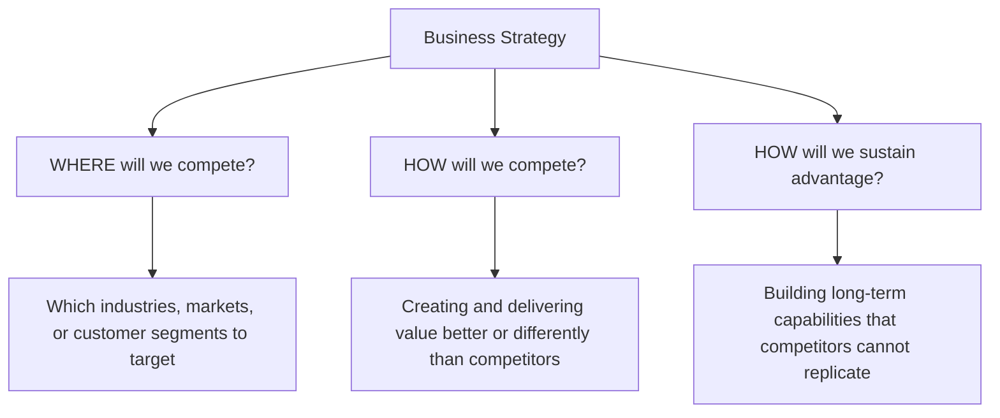
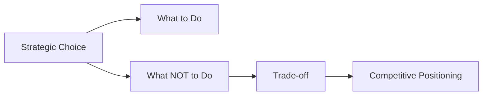
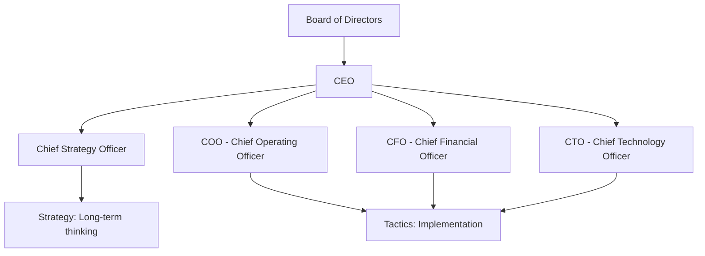
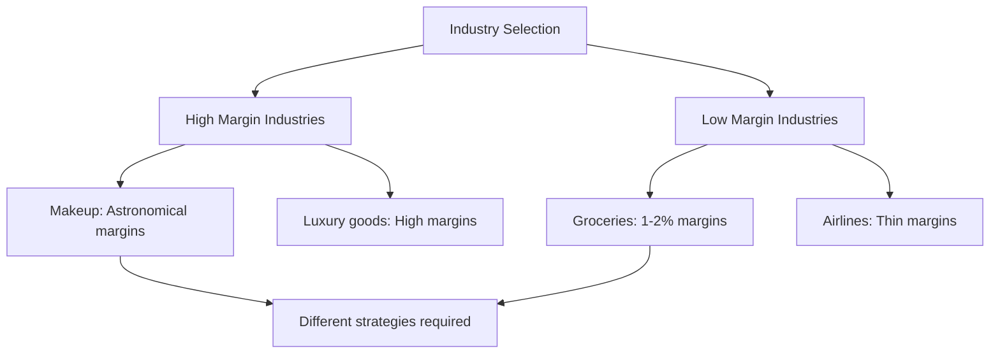
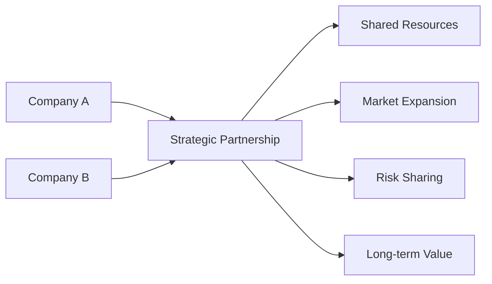
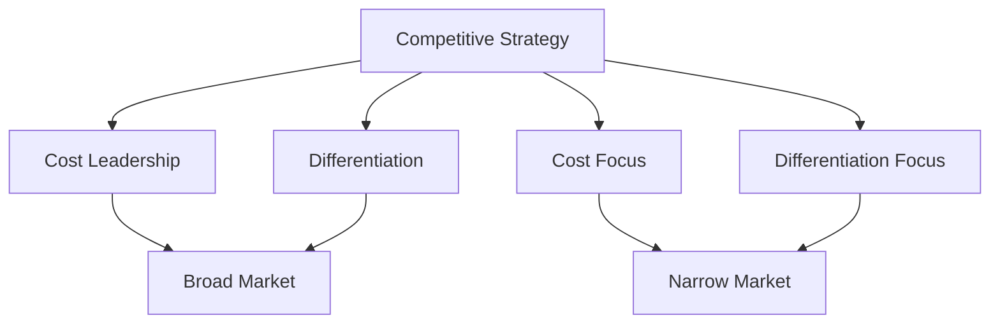
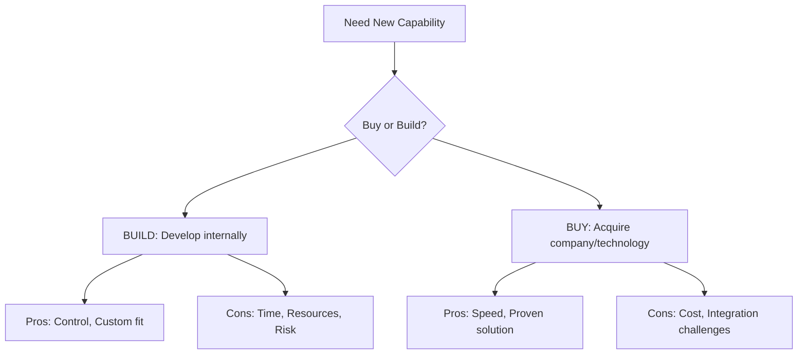
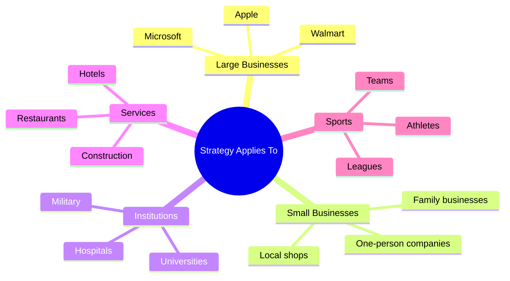

# Business Strategy

## Course Overview

**Course Focus:** Strategic thinking and long-term business planning

---

## What is Business Strategy?

### Core Definition

**Business Strategy** is the integrated set of decisions and actions a company takes to achieve sustainable competitive advantage and superior performance in its market.

**Key Principle:** "Begin with the End in Mind"

### Three Fundamental Questions

### What Strategy IS:

- Making deliberate trade-offs
- Choosing what NOT to do
- Creating a unique value proposition
- Aligning firm's internal capabilities with external market opportunities

### What Strategy IS NOT:

- Only about operational efficiency
- Copying industry best practices (necessary but not sufficient)
- Doing everything

---

## The Trade-Off Principle

**"There are no solutions, just trade-offs"** - Thomas Sowell

This applies to everything in business and life. Understanding trade-offs is fundamental to strategy.

### Examples of Strategic Trade-Offs:

**Walmart:**

- Trade-off: Does NOT cater to wealthy customers
- Result: Walmart family members worth ~$60 billion each
- Focus: Inexpensive goods for middle and lower-middle class

**Porsche/Ferrari:**

- Trade-off: Only sell limited number of cars annually
- Result: High margins, luxury positioning
- Note: Porsche later changed strategy by acquiring Volkswagen

**Apple:**

- Trade-off: Premium pricing excludes budget-conscious customers
- Result: High margins, strong brand loyalty

---

## Strategy vs. Tactics

### Key Distinctions

| Aspect | Strategy | Tactics |
|--------|----------|---------|
| **Time Horizon** | Long-term (months to years) | Short-term (days to months) |
| **Focus** | Overall positioning and competitive advantage | Specific actions and steps |
| **Level of Detail** | Broad, directional decisions | Detailed, actionable plans |
| **Example** | Competing through product differentiation in premium markets | Launching an ad campaign targeting high-income customers |
| **Who Designs It** | Senior executives, leadership teams (CEO, Board, Chief Strategy Officer) | Middle managers, operational teams (COO, CFO, CTO) |
| **Purpose** | Define "where to compete" and "how to win" | Execute specific tasks to achieve strategic objectives |

### Organizational Hierarchy

**Key Insight:** Strategy gets approved by CEO and Board. Implementation is handled by COO and operational teams.

---

## Strategic Positioning

### Three Approaches to Market Positioning:

1. **Serving few needs of many customers**
   - Example: Jiffy Lube (only car maintenance services)

2. **Serving broad needs of few customers**
   - Example: Bessemer Trust (only ultra-wealthy clients, minimum $5M investment)

3. **Serving broad needs of many customers in a narrow market**
   - Example: Super Mosheva (Jerusalem boutique grocery store in German Colony)

### Creating 'Fit' Among Activities

Strategic positioning attempts to achieve sustainable competitive advantage by preserving what is 'distinctive' about a company.

---

## Critical Strategic Terms

### Operational Effectiveness (OE)

- Performing similar activities **better** than rivals
- Includes but is not limited to efficiency
- **Important:** OE alone is NOT sufficient for long-term strategy
- Can lead to acquisition if done exceptionally well

### Strategic Positioning

- Attempts to achieve sustainable competitive advantage
- Preserves what is 'distinctive' about the company

### Productivity Frontier

- The maximum value a company can deliver at a given cost
- Given the best available technology, skills, and management techniques

### Strategic Objectives

- Measurable goals aligned with mission and vision

### Competitive Advantage

- The edge a firm has that allows it to outperform rivals

### Mission Statement

- Organization's purpose and reason for existence
- **Homework Assignment:** Visit company websites and read mission statements
- Note: Sometimes stated mission differs from actual practice

### Strategic Fit

- Alignment of internal strengths with external opportunities

---

## Industry Selection: The "Where"

Strategy begins with choosing which industry to compete in - this fundamentally shapes everything else.

### Examples of Different Industry Strategies:

**Grocery Store Industry:**

- Margins: 1-2% (worldwide standard for large stores)
- Strategy: High volume, low margins
- Example: Rami Levi (Israel) - multiple stores, cheap prices, thin margins

**Makeup Industry:**

- Margins: Astronomical (extremely high)
- Strategy: Premium pricing, brand positioning

**Construction Industry:**

- Some companies only build roads (highly specialized)
- Some only do foundations
- Strategy: Deep specialization, become the best in narrow field

**Carpentry Example (Tel Aviv):**

- High-end carpentry for luxury apartments
- 6-month waiting list
- Father (80 years old) inspects all work
- Premium pricing, customers don't question costs
- Strategy: Craftsmanship, exclusivity, quality control

---

## The "How": Creating Value

### Key Question:

How will you create and deliver something **better and different** for the customer?

**Critical Point:** If you create something the same as your competitor, you may do okay, but you won't do great.

### Example: Airline Industry Transformation

**Before Deregulation:**

- Prices regulated by governments worldwide
- Only middle-to-upper-middle class could afford tickets
- Uniform service standards

**After Deregulation:**

- Discount airlines emerged
- Strategy: Charge for everything ("charge you for breathing air")
- Result: Made air travel accessible to lower-middle class
- Examples: Different from British Air, Singapore Air (best airline), American Airlines

### How to Keep Competitive Advantage

Once you have distinction and advantage, maintaining it is crucial.

**Apple Example:**

- Constantly changing cables/connectors
- Forces customers to buy new accessories
- Cable production cost: ~$0.05
- Retail price: ~$35
- Strategy: Ecosystem lock-in through proprietary standards

---

## Real-World Strategy Examples

### Apple Inc.

**Business Strategy:**

- Premium design and user-friendly interfaces
- High-margin hardware (iPhone, MacBook, iPad)
- Integration of hardware, software, and services
- Protecting intellectual property and brand reputation

**Product Tactics:**

- Annual incremental hardware improvements
- Proprietary chips (M1/M2) for performance differentiation
- Sleek, minimalist design aesthetics

**Pricing Tactics:**

- Premium pricing to reinforce exclusivity
- Bundled services (iCloud, Apple Music, Apple TV+)
- Increase customer lifetime value

**Marketing Tactics:**

- Iconic campaigns: "Think Different," "Shot on iPhone"
- Heavy investment in in-store experience
- Apple Stores: design, service, aesthetic

**Operational Tactics:**

- Tight supply chain control
- Strategic partnerships with carriers
- In-store checkout innovation (employee helping you checks you out immediately)

**Professor's Note:** "It's absolutely brilliant. I appreciate the brilliance of ripping me off to make me buy something else."

### Walmart

**Strategy:**

- Sell very inexpensive goods
- Target customers who cannot afford expensive goods

**Key Tactics:**

- Ruthless negotiation with suppliers
- "This is the price. If you sell to us, we're going to buy more than you can possibly make"
- Lowest prices in the industry - no one pays less
- Some luxury brands (like Prada) refuse to sell to Walmart

**Requirements for Success:**

- Cheap/affordable labor
- Exceptional logistics
- High volume

**Result:** Most profitable family-run business in America

### Toyota → Lexus (Strategy Change)

**Original Strategy:** Make practical, reliable cars (Toyota, Accord)

**Strategy Change:**

- Wanted to enter high-end car market
- Created Lexus brand
- **Key Insight:** A Lexus is really a Toyota with:
  - Better wood
  - Leather seats
  - Enhanced instrumentation
  - Better design
  
**Incremental Cost:** Not much more than an Accord

**Pricing Difference:** Huge markup

**Result:** Brilliant strategy change - captured luxury market while maintaining operational efficiency

### University Strategy Example

**Small Private Universities (U.S.):**

- Were relatively inexpensive
- To raise enrollment: **Raised prices by 20-25%**
- Result: 
  - Enrollment increased 30%
  - Financial aid requests decreased
  - Moved into different class/market segment

**North Carolina University Example:**

- Regional #1 in Southeast
- Ridiculously high tuition
- Beautiful facilities: pools, massages, campus steakhouse
- **Unique Strategy:** Teach students:
  - Proper dining etiquette (multiple forks, spoons)
  - Wine ordering
  - Professional interview skills
- Preparation for high-end job interviews

### Hotel Industry Strategies

**Classification System:**

Hotels tell you their strategy through star ratings (2-star, 3-star, 5-star, 7-star)

**Dubai 7-Star Hotel:**

- Entry to lobby: €100
- Presidential suite: $25,000/night
- Strategy: Ultimate exclusivity, "keep the riff-raff out"

**Tokyo Airport Hotels:**

- Inside terminal (no need to leave)
- Rent by the hour (2-3 hours)
- Nice rooms with views
- Target: Travelers with long layovers
- Value proposition: Shower, rest, work, repack

**Amman Business Class Lounge:**

- One of best in world
- Showers, beds, presentation rooms
- High-end experience (unexpected for Amman location)
- Always packed - extremely profitable
- Strategy: Premium experience in unexpected location

### McDonald's

**Strategy:** Consistency everywhere

**Professor's Experience in Moscow (First McDonald's):**

- One hour wait to enter
- Identical to McDonald's in New York, San Francisco, Dallas
- Same experience, different language
- First owner made enormous fortune

**Key:** Same in-store experience globally

### Tiffany's

**Strategy:** Premium experience and brand

**Key Point:** "You can go around the corner to 47th Street, buy the same diamond for half the price. But that box? Wow."

**Elements:**

- Beautiful store
- Well-dressed, attractive staff
- Exclusive atmosphere
- The experience justifies premium pricing

### Strategic Partnerships Examples

**OpenAI and Microsoft:**

- Microsoft needed to be in AI business
- Long-term strategic partnership
- Microsoft invested heavily in OpenAI

**Credit Cards and Airlines:**

- American Airlines Visa card
- Points from both airline and credit card company
- Mutual customer acquisition

**Airlines and Hotels:**

- Marriott partnerships
- Points across services
- Cross-promotion

**Duolingo and LinkedIn:**

- Marketing partnerships

**Universities and Programs:**

- Bar-Ilan University started international business program
- Original strategy (1979): Core Israeli students, post-army, living nearby
- Strategy evolved: International programs, diverse student body

---

## Porter's Competitive Strategies

**Professor Michael Porter:** "The guru of strategy" - Harvard Business School

Every strategy consultant mirrors Porter's work. Required reading for the course.

### Four Generic Competitive Strategies

### 1. Cost Leadership

**Goal:** Become the lowest-cost producer in the industry

**How it Works:**

- Achieving economies of scale
- Efficient production and supply chain management
- Tight cost control
- Standardized products targeting price-sensitive customers

**Target Scope:** Broad market

**Examples:**

- **Walmart:** Large-scale operations, efficient logistics, aggressive supplier negotiations
- **Ryanair:** Low-cost airline with minimal frills

### 2. Differentiation

**Goal:** Offer unique products/services that customers perceive as superior

**How it Works:**

- Innovation in design, features, or technology
- Strong brand identity
- Superior quality or customer service
- Unique distribution channels

**Target Scope:** Broad market

**Examples:**

- **Apple:** Sleek product design, user experience, integrated ecosystem
- **Starbucks:** Premium coffee experience with strong branding

### 3. Cost Focus

**Goal:** Apply cost leadership within a specific market segment or niche

**How it Works:**

- Targeting narrow customer group with lower-priced products
- Efficiency and standardization for niche markets

**Target Scope:** Narrow market

**Examples:**

- **Aldi:** Affordable groceries for cost-conscious shoppers, limited product range

### 4. Differentiation Focus

**Goal:** Offer unique products tailored to specific market segment or niche

**How it Works:**

- Deep understanding of niche customer needs
- Customization, exclusivity, or specialized services
- Higher prices justified by uniqueness

**Target Scope:** Narrow market

**Examples:**

- **Rolex:** Premium watches for luxury buyers, emphasizing craftsmanship and exclusivity
- **Tesla (early years):** High-performance electric vehicles for tech-savvy, environmentally conscious consumers
- **Emilio Pucci:** Ultra-high-end fashion stores (Rome), most beautiful stores, experiential shopping

### Summary Table

| Strategy | Competitive Advantage | Target Scope | Example |
|----------|----------------------|--------------|---------|
| Cost Leadership | Lowest cost | Broad market | Walmart |
| Differentiation | Unique product/service | Broad market | Apple |
| Cost Focus | Lowest cost | Narrow market | Aldi |
| Differentiation Focus | Unique product/service | Narrow market | Rolex |

### Critical Warning: "Stuck in the Middle"

Companies must choose a clear strategy and avoid being "stuck in the middle," where they fail to achieve either differentiation or cost leadership effectively, leading to weak competitive positioning.

---

## Strategy Changes and Adaptations

### When to Change Strategy

**Key Insight:** Most startup companies change strategies fairly early on

**Reasons for Strategy Change:**

1. **Internal factors:** Company learns more about its capabilities
2. **External events:** Market conditions, regulations, competition
3. **Forced changes:** Competitors, technology disruption

**Venture Capitalist Perspective:**

- VCs expect companies to change strategies
- They nod when hearing initial strategy because they know it will likely change
- This is normal and expected

### Example: Strategy Change Necessity

**Company in Israel (name withheld):**

- Hired Chief Strategy Officer from IDF background
- Not originally from the industry
- Older than most executives
- Brought fresh perspective
- Result: Successfully steered company in new direction

**Problem Identified:**

- Revenues remained flat
- Profits declining incrementally each year
- Year 1: Small decline (dismissed as "blip")
- Year 2: Another decline
- Year 3-4: "Oh my god, what are we doing?"
- Costs rising, competition increasing
- Eventually revenues follow profits down

**Solution:**

- Outside perspective from experienced strategist
- Overcame internal resistance ("he's not one of us")
- CEO made courageous choice

### Founder Challenge

**Common Problem:**

- Founders get "married" to their original idea
- Spent years in school developing concept
- Finally got funding
- Emotionally invested
- Resist change even when necessary

**Professor's Advice:**

"If you start a company, hire some older person to be your Chief Operating Officer. They have been through a lot. You're smarter than they are, you know more about the idea, but they have to push you in the direction you need to go."

---

## Supply Chain Management

### Definition

Managing the entire chain of suppliers, manufacturers, and distributors to ensure smooth operations.

### Importance as a Tactic

**Example: Silicon Shortage (2012)**

- Silicon used in both semiconductors and solar panels
- Tax law changed → semiconductor industry ordered massive amounts of silicon
- Created supply shortage
- Affected solar panel industry
- Companies in unrelated industries had to be aware of supply chain issues

**Key Learning:** Supply chain disruptions can affect your strategy even if you're not directly involved in the problematic sector.

### Car Manufacturing Example

**Porsche:**

- Doesn't make their own tires
- Buys Pirelli tires (some of best tires in world)
- **Pirelli's supply chain:** Must source:
  - Rubber (best quality)
  - Coating materials
  - Other components
- Must ensure no supply chain backups

**When Tactics Affect Strategy:**

If supply chain management (tactic) fails, Chief Strategy Officer and CEO must be informed immediately - it becomes a strategic problem.

---

## Buy or Build Decision

### Strategic Choice Framework

**Context:** "Everybody's in AI now, everybody."

**Question for Any New Business Area:**

- Build capability yourself?
- Buy existing company/technology?

**Example Consideration:**

- Microsoft and OpenAI: Microsoft chose strategic partnership/investment rather than building from scratch

---

## Aligning Strategy with Firm Capabilities

### Critical Principle

Strategy must align with your firm's capabilities, or you must change capabilities (hire different people).

### Hospital Example

**Scenario:** Hospital with small emergency room but amazing neurological center

**Strategic Question:** When getting customers (patients), what should be biggest part of strategy?

**Answer:** Promote neurological center - align with what you're best at

**Key Elements:**

- Focus on strengths
- Hire/retain best doctors in specialty
- Market distinctive capabilities

### The Discipline Challenge

**Most Difficult Aspects of Strategy:**

1. Implementation
2. Discipline to stick with strategy
3. Actively choosing what NOT to do

**Professor's Role (as COO):**

"I'm the old grouchy guy that keeps everybody from doing crazy things."

**CEO vs. COO Dynamic:**

- CEO: Wants to do everything, be everywhere
- COO: Pulls back, maintains focus
- Example: Solar/wind/hydro development company
  - Can't be everywhere in Africa
  - Don't have money or manpower
  - Some African locations not suitable
  - Must maintain strategic focus
- "Although we are building a project in South Sudan, that's really crazy, but what can you do?"

---

## Strategy in Different Organization Sizes

### Large Companies

**Structure:**

- Chief Strategy Officer
- Large strategy staff below CSO
- Different team members analyze:
  - Different industry parts
  - New products
  - New directions
  - Market trends

**Strategy Staff Characteristics:**

- For "thinkers"
- Sit around and think about future
- Come up with ideas
- Present to CSO before reaching CEO

**Benefits of Large Companies:**

- Different roles for different people
- Thinkers can focus on strategy
- Operators can focus on implementation

### Small to Medium Companies

**Key Difference:**

"By virtue of working for relatively small to medium-sized companies, you will get involved in strategy one way or the other. Whether you know it or not, or whether you like it or not."

**Professor's Company Example:**

- Very small company
- Has Chief Strategist
- Everyone gets involved in strategy
- "We argue about it constantly"
- Constant debate is normal and healthy

**Reality:**

- You may not know you're arguing about strategy
- But you are
- This is part of strategic process

### Everything Has Strategy

**Key Insight:** "Strategy is everything. Everything is strategy, whether your company is one person, or whether your company is 100,000 people."

**Military:**

- Where many strategy terms originate
- Strategy is "super important"

**Sports Teams:**

- Every team has different strategy
- Yankees vs. Orioles: different approaches
- Hire strategy specialists
- Sports industry: one of highest-paying in world
- Often overlooked in business school

---

## Key Takeaways and Principles

### 1. The Thinking Class

"This is a thinking class, not a memorization class."

**Implication:**

- Focus on understanding concepts
- Articulate ideas clearly
- Apply principles to real situations
- No formula memorization

### 2. You Already Know This

**Professor's Philosophy:**

"You guys know all this already. It's the ability to articulate it is the key."

**Examples:**

- You know difference between Ferrari and Volkswagen
- You know cheap goods require cheap sourcing
- You understand brand positioning

**Goal:** Learn to articulate what you instinctively understand

### 3. Academic to Practice

"The idea into practice - greatest idea in the world needs to become practice."

**Bridge:**

- Academic concepts → Real business decisions
- Classroom discussions → Meeting room conversations
- Theory → Implementation

**Professor's Approach:**

- 50% of exam questions come from actual meetings
- Usually from negative examples ("knuckleheads")
- Carries notebook to conferences
- Writes down real-world strategy failures and successes

### 4. Reading is Essential

**Do NOT Wait Until Last Minute:**

- Strategy builds on itself
- Material interconnected
- Understanding develops over time

**Harvard Business Review:**

- Professor has subscription
- Much course material from HBR
- Porter's work extensively featured

**Porter's Essential Reading:**

- "What is Strategy?" (Session 1 assignment)
- Four books total
- Foundation of strategic thinking

### 5. Grades and Performance

**Professor's Philosophy:**

"From my perspective, if everybody got an A, then I'm doing my job."

**Requirements for Success:**

1. Do the reading
2. Don't be late with assignments
3. Participate in class
4. Ask questions when confused

**Different Students, Different Strengths:**

- Some memorize well → Quiz favors them
- Some speak well → Class participation favors them
- Some write well → Assignments favor them
- Varied assessment methods to accommodate different skills

**Flexibility:**

- Professor understands students have lives
- Children, army service, other commitments
- Communicate beforehand if issues arise
- "I have 5 children. They're all gonna be at my house when I get home. So, I know how it is."

---

## Practical Advice

### For Starting a Company

1. **Hire experienced operators**
   - Older person with experience
   - Someone who's "been through a lot"
   - Balance founder's passion with practical wisdom

2. **Expect to change strategy**
   - Normal and healthy
   - VCs expect it
   - Don't be emotionally rigid

3. **Focus is critical**
   - Can't do everything
   - Actively choose what NOT to do
   - Resist temptation to chase every opportunity

### For Strategy Staff Roles

**If You're a Thinker:**

- Strategy staff is good fit
- Get to analyze and think
- Come up with ideas
- Work on future direction

**Required Skills:**

- Know the business and industry well
- Think long-term
- Understand trade-offs
- Communicate clearly with CEO and board

### In Meetings

**Common Issues:**

- People talk about "strategy" but mean "tactics"
- Important to distinguish
- Use correct terminology
- Frame discussions properly

**When to Escalate to Strategy Level:**

- Tactics failing consistently
- External events requiring change
- Long-term performance declining
- New opportunities emerging

---

## Homework and Assignments

### Immediate Assignment

**Visit company websites and read mission statements**

**Purpose:**

- Understand how companies present strategy
- Compare stated vs. actual mission
- First exam question will likely reference this

**Note:** "Some people didn't listen to me [last time], and that was the first question on the exam."

### Quiz Preparation (Week 3 or 4)

**Format:**

- In person
- Short paragraph answers
- No multiple choice ("the world is not multiple choice")

**Content:**

- Definitions of key terms
- Operational effectiveness
- Strategic positioning
- Productivity frontier
- Competitive advantage
- Mission statements
- Strategic fit
- All terms discussed in lectures

**Purpose:**

"I'm forcing you to know these terms, so when I give you something to read in 5 weeks, you'll know what... you're not going to sit there and not... because you can go through a document, you'll see a word, you know what the words mean, but you totally miss it."

---

## Final Thoughts

### Strategy vs. Success

**Two Paths to Success:**

1. **Great Strategy + Poor Implementation = Limited Success**
2. **Mediocre Strategy + Excellent Implementation = Can Still Succeed**

**Ideal:** Great strategy + Great implementation

**Examples:**

- Apple: Both great strategy AND great implementation
- Walmart: Both great strategy AND great implementation

### Steve Jobs vs. Tim Cook

**Steve Jobs:**

- Visionary
- Product genius
- Created things we didn't know we wanted
- "You're gonna buy this"

**Tim Cook:**

- Chief Operating Officer background
- Brought business mindset
- Took Apple to next level
- "Brought the business mindset, not just the vision"

**Key Learning:** Need both vision (strategy) and operational excellence (tactics/implementation)

### The Discipline of Strategy

**Hardest Parts:**

1. Sticking with strategy long-term
2. Resisting temptation to do everything
3. Making and maintaining trade-offs
4. Knowing when to change vs. when to persist

**Success Factors:**

- Clear articulation of strategy
- Alignment throughout organization
- Consistent implementation
- Periodic strategic review
- Willingness to adapt when necessary

