# Business Strategy: Industry Analysis

## Session Overview

**Topic:** Industry Structure & Profitability, Five Forces Framework, Value Chain Analysis  

**Key Focus:** Understanding how industry structure determines profitability and competitive dynamics

---

## 1. Core Strategy Concepts Review

### Begin with the End in Mind

- **Definition:** Define your long-term objective or desired outcome first, then work backwards
- **Also called:** Backwards planning
- **Example:** Planning route to Aroma coffee shop - strategy is getting coffee daily, tactics are which gate to use, payment method, etc.

### Strategy vs. Tactics

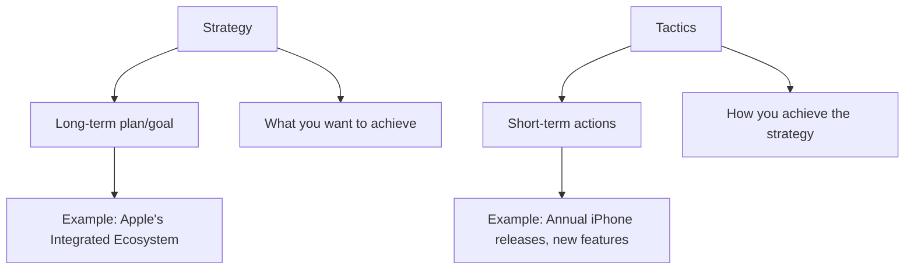

**Key Distinction:**

- **Strategy:** Long-term, overarching plan (e.g., Apple creating an integrated ecosystem)
- **Tactics:** Specific actions to implement strategy (e.g., annual product releases, new cameras, upgraded processors)

### Examples from Class Discussion:

- **Apple Strategy:** Create integrated ecosystem to capture customers
  - **Tactics:** New iPhone models yearly, $30 cables, processor upgrades, camera improvements
  - **Result:** "Sticky money" - customers locked into ecosystem
  
- **Singapore Airlines vs. Southwest:**
  - **Singapore:** Premium service, multiple cabin classes, high capex, luxury experience
  - **Southwest:** Cost leadership, single aircraft family, point-to-point, quick turnarounds, low fares

---

## 2. Economies of Scale

### Definition

**Economies of Scale:** When a company's average cost per unit decreases as its output increases

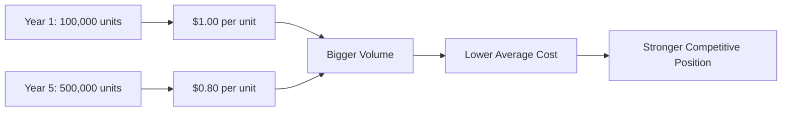

### Key Points:

- Selling more units at lower cost per unit
- Example: Walmart negotiating with suppliers
  - Customer buying 1 hammer vs. 100,000 hammers/month for 10 years
  - Volume customers get lower prices
  - Walmart sets prices with suppliers, not vice versa

### Important Consideration:

**Applies to both goods AND services:**

- Lawyer with $50,000/month retainer client vs. one-time $25,000 client
- Apple negotiating with law firms: "$1,200/hour → $800/hour"
- Large customers have pricing power even in service industries

---

## 3. Competitive Strategies

### The Four Generic Strategies

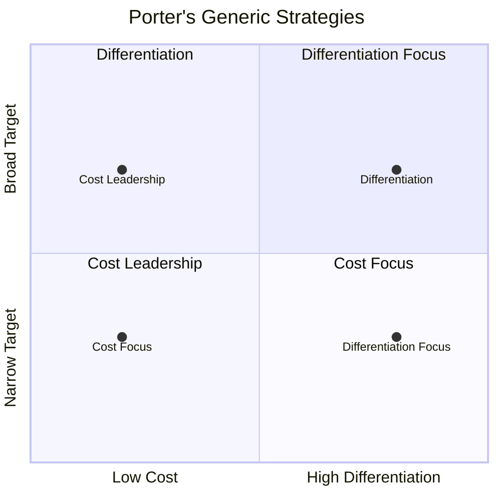

### 1. Cost Leadership

- **Goal:** Be the lowest-cost producer in the industry
- **Requirements:**
  - Efficient production
  - Supply chain management excellence
  - Tight cost control
  - Standardized products
- **Examples:** Walmart, Ryanair
- **Key:** Lower margins but higher volume

### 2. Differentiation

- **Goal:** Make products/services unique and sought-after
- **Methods:**
  - Superior quality (Starbucks)
  - Brand identity (Apple)
  - Innovative design
  - Premium experience
- **Examples:**
  - **Apple iPod:** Changed personal music experience
  - **Starbucks:** Consistent premium experience globally (same comfort in Vienna, Vietnam, Shanghai)
  - **Wachtell, Lipton, Rosen & Katz:** Most profitable law firm - specializes in M&A, charges premium, fewer lawyers

### 3. Cost Focus

- **Goal:** Low-cost offering to specific niche segment
- **Examples:**
  - **Aldi/Hofer:** Lower-priced supermarket targeting cost-conscious consumers
  - **Regal Cinema:** Only in cities with fewer than 200,000 people, slightly cheaper than major chains
  - **Israeli examples:** Osherod, Ami Levi, Rami Levy

### 4. Differentiation Focus

- **Goal:** Unique products for specific niche
- **Watch Industry Example:**

| Brand | Price Range | Target Market | Revenue | Strategy |
|-------|-------------|---------------|---------|----------|
| Patek Philippe | $50,000 - $1M | Ultra-high net worth | $2B | Luxury, generational heirloom |
| Rolex | $5,000 - $50,000 | Affluent professionals, aspirational buyers | $11B | Quality, status, resale value |
| Timex | $10 - $200 | Everyday consumers | N/A | Affordable, reliable |

---

## 4. Industry Structure & Profitability

### Core Principle

**Industry structure is a key determinant of profitability**

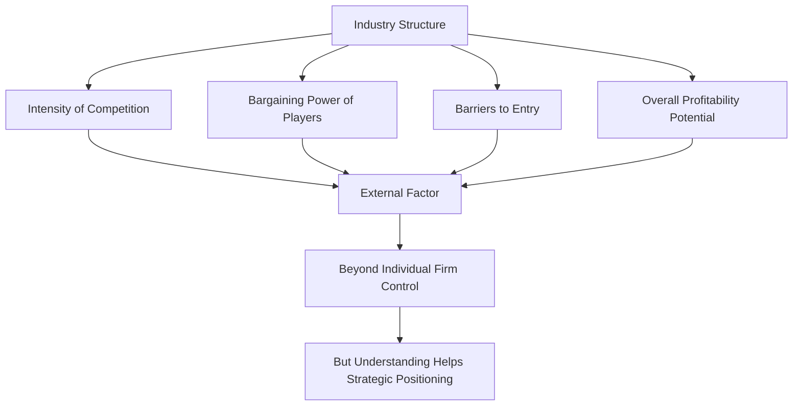

### Key Insight:

- Structure of industry determines profitability, NOT:
  - Market size
  - Firm management quality
  - Short-term factors
- Some industries naturally more profitable than others

---

## 5. Barriers to Entry

### Definition

**Barriers to Entry:** Obstacles that make it difficult for new competitors to enter a market

### Types of Barriers:

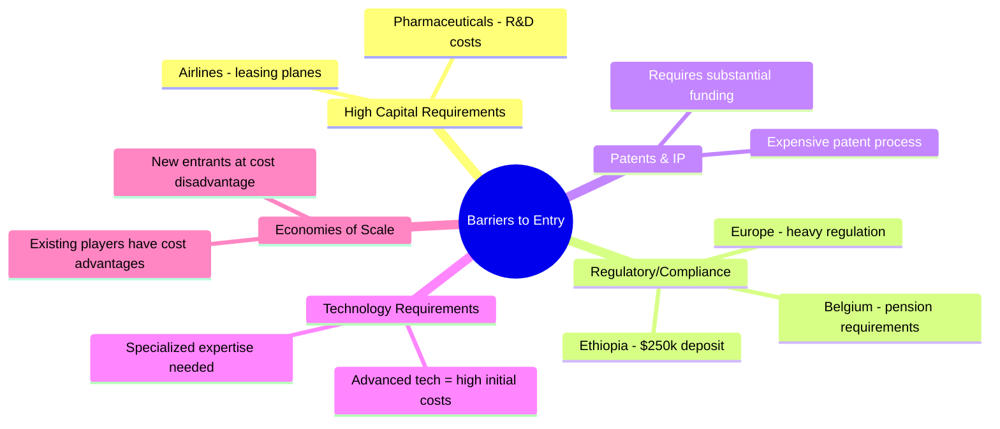

### Examples from Discussion:

**HIGH Barriers:**

1. **Pharmaceuticals:**
   - Tens of billions in development costs
   - FDA approval process
   - Patent requirements
   - Few rivals as result

2. **Regulatory Markets:**
   - European markets heavily regulated
   - Belgium example: Must pay pensions for designated employees even if none work there
   - Ethiopia: $250,000 deposit to open company as foreigner

3. **Airlines (Complex):**
   - High capital costs BUT
   - Can lease planes and hangars
   - Use retired pilots
   - Regional airlines find ways around barriers
   - Example: Small family airlines (NY to Albany) - millionaires with 4 flights/day

**LOW Barriers:**

1. **Small Supermarkets/Grocery Stores:**
   - Lower investment needed
   - New stores open monthly in every city
   - Competition through convenience (corner location near apartments)
   - Don't need own brands initially

2. **Service Businesses:**
   - Example: Theoretical physicist repairing dryers
   - Low barrier for him due to education
   - High barrier for average person
   - Now teaches physics part-time, makes "really good living" repairing dryers

---

## 6. Industry Structure Comparison Matrix

| Industry | Barriers to Entry | Rivalry | Profitability | Key Characteristics |
|----------|------------------|---------|---------------|---------------------|
| **Pharmaceuticals** | Very High | Low (few rivals) | Very High | Patents, FDA, tens of billions in costs; 100 products, only 20 make money |
| **Fast Food** | Moderate | High | Moderate | Strong differentiation possible, depends on positioning |
| **Airlines** | Moderate-High | Very High | Low | Price wars, oil volatility, low differentiation |
| **Smartphones** | High | Very High | Mixed | Rapid innovation cycles; only Apple, Samsung highly profitable; Nokia example of rise and fall |
| **Supermarkets (small)** | Low | High | Low-Moderate | Convenience-based, higher prices than chains |

### Industry-Specific Cost Considerations:

**Airlines:**

1. **Biggest cost:** Oil/Fuel
   - Historical impact: Every penny oil goes up/down = $100M to industry
   - Airlines have "very little control"
2. Second biggest: Employees
3. Surprisingly NOT planes (depreciation, tax benefits)

---

## 7. Porter's Five Forces Framework

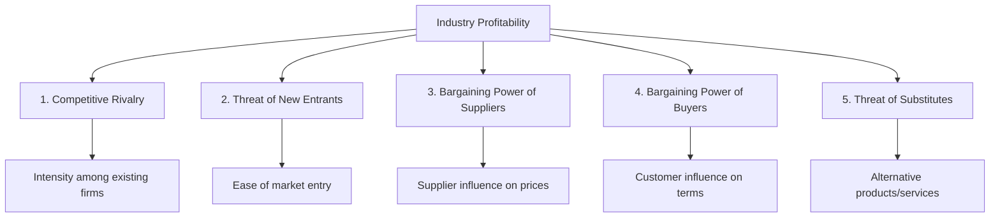

### Key Insight

**"Profitability is driven by the structure of competition, not by chance or short-term factors"**

### The Five Forces Explained:

#### 1. Competitive Rivalry

- Intensity of competition among existing firms
- High rivalry limits pricing power and reduces profitability
- More competitors → lower margins
- Example: Industry A (many competitors) has lower margins than Industry B (few competitors)
- **Why?** Competition forces price reductions

#### 2. Threat of New Entrants

- Ease or difficulty with which new competitors can enter
- High barriers to entry protect incumbents and sustain profits
- Examples:
  - Pharmaceuticals: Protected by high costs, patents
  - Supermarkets: Easy entry, new stores open constantly

#### 3. Bargaining Power of Suppliers

- Ability of suppliers to influence prices or quality
- Powerful suppliers can erode industry margins
- Examples:
  - Airlines: Boeing/Airbus dominate aircraft market
  - Walmart: Sets prices WITH suppliers due to volume

#### 4. Bargaining Power of Buyers

- Influence customers have on pricing and terms
- Strong buyer power squeezes industry profits
- Examples:
  - Airlines: Price-sensitive buyers, online comparison shopping
  - Apple: Negotiates lower rates with law firms due to volume

#### 5. Threat of Substitutes

- Risk of customers switching to alternative products/services
- More substitutes = more competition = reduced pricing flexibility
- Examples:
  - Airlines: Trains, cars for short distances; digital meetings replacing business travel
  - Watches: Phones replacing watches for younger generations

### Framework Application:

Helps companies:

- Understand industry attractiveness
- Identify key external threats to profitability
- Develop strategies to defend against competitive pressures
- Position themselves to defend or improve profitability

---

## 8. Case Study: Airline Industry

### Industry Overview

- High demand yet historically low profitability
- Highly fragmented market
- Frequent bankruptcies and mergers
- Major players: BA, United, Delta, Emirates, Ryanair

### Five Forces Analysis:

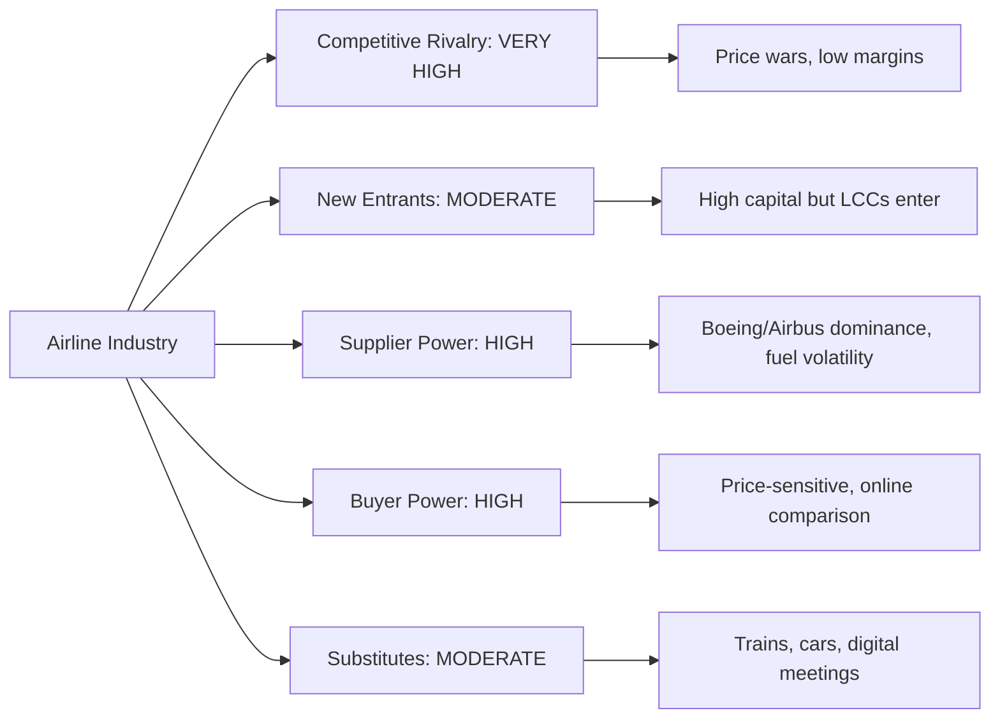

**Result:** Challenging industry structure → Low profitability despite high demand

### Key Insight:

"Can strategy overcome industry structure? Are low margins inevitable?"

- Some firms outperform through differentiation (Singapore Airlines) or cost leadership (Southwest, Ryanair)
- But industry structure fundamentally limits profitability potential

---

## 9. Organizational Structure: Strategy vs. Operations

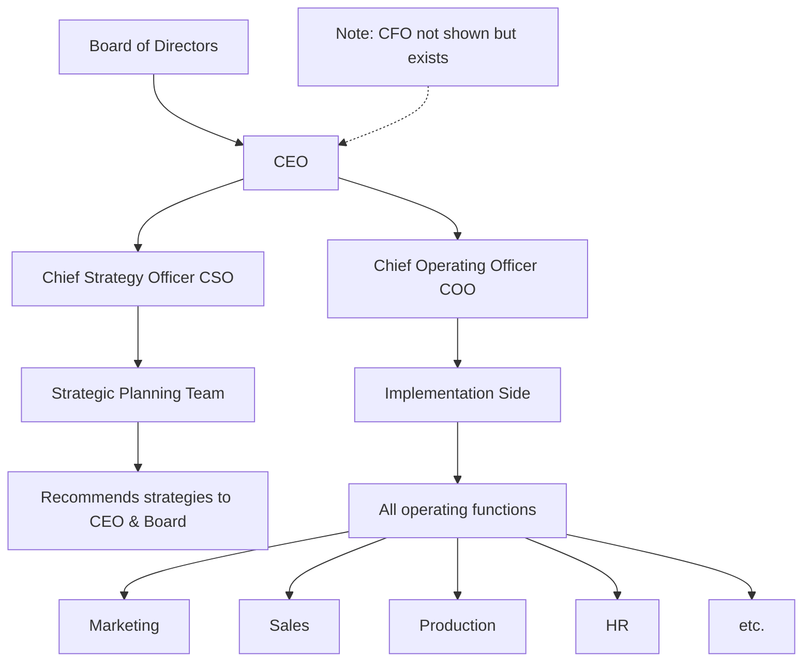

### Key Points:

- **CSO (Chief Strategy Officer):** Relatively new role (last ~30 years)
- Historically strategy was CEO/Board function
- As companies grew, need to separate strategy from operations
- **Tension exists:** Operating side gets daily pushback, wants different direction than strategy side
- **Historical note:** McKinsey pioneered strategic consulting before in-house CSO roles existed

### Interview Tip:

If interviewing for strategy roles (McKinsey, Boston Consulting, etc.):

- **They WILL ask about Porter's Five Forces**
- Know this framework inside and out
- "I guarantee you, somebody in the interview chain will ask you about this"

---

## 10. Strategy Applies to ALL Businesses

### Key Principle: Every business needs strategy

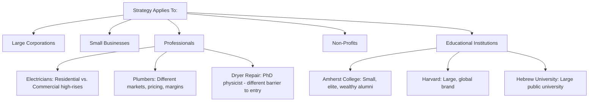

### Examples from Discussion:

**1. Electricians:**

- Strategy choice: Residential homes vs. large construction/high-rises
- Different:
  - Barriers to entry
  - Pricing
  - Margins
  - Tactics

**2. Construction Subcontractors:**

- Example: Companies that ONLY do foundations
- Requires: Highly skilled workers, engineers, architects
- They leave after foundation, rest built by others
- Clear strategy: Specialize in one high-skill area

**3. PhD Physicist → Dryer Repair:**

- English major → Law school → Carpenter's apprentice → Lawyer
- Physics PhD → Couldn't find job → Started repairing dryers
- "How hard could it be? The physics are easy"
- Now: Can't find enough work, makes "really good living"
- **His barrier to entry:** Very low (due to education)
- **Average person's barrier:** High
- **His advantage:** Much better than average repair person

**4. Universities:**

- **Amherst College:**
  - Small private (600/class)
  - Most haven't heard of it
  - Per capita: One of wealthiest alumni in world
  - Top-ranked education
  - Founded 1800s
  - No endowment problems
  
- **Williams College:** Similar strategy to Amherst
  
- **Hebrew University, Oxford, Texas:** Large public universities
  - Every major offered
  - Different strategy entirely
  - Different focus areas over time

**5. Charities:**

- Professor started US charity
- Has stated strategy
- Knows long-term goals
- Defined tactics
- Every organization should have strategy and someone in charge of it

---

## 11. Value Chain Analysis

### Definition

Breaks down a firm's activities to identify where value is created and where efficiencies or competitive advantage can be enhanced

### Primary Activities:

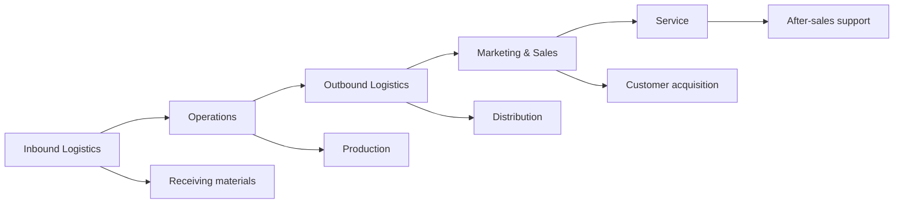

### Support Activities:

- Firm Infrastructure
- Human Resources Management
- Technology Development
- Procurement

### Application:

- Improve operational efficiencies
- Strengthen customer service
- Leverage technology for competitive advantage

**Example: Amazon**

- World-class logistics
- Data-driven operations
- Customer service excellence
- Optimizes entire value chain for market position

---

## 12. Shared Value Concept

### Purpose

Challenges view that social responsibility and business success are separate; argues companies can generate economic value by addressing societal challenges

### How It Works:

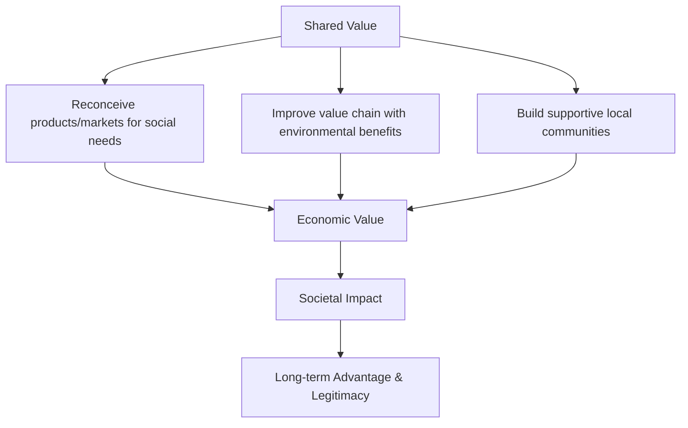

### Example: Unilever

- Invests in sustainable agriculture
- Improves farmer incomes
- Secures reliable, quality supply for food products
- Creates both business and social value

**Key Takeaway:** Shared Value integrates corporate success with social impact, creating long-term advantages

---

## 13. Important Practical Insights

### Industry Differences Matter

- Profitability potential varies enormously by industry
- Finance: Still high potential income
- Architecture: 
  - As employee: Not most profitable
  - As owner/developer: Can be enormously wealthy
  - Example: Israeli neighbor built Road 6, architect + construction company = "incredibly wealthy"

### Competition & Margins

**Question posed:** Industry A (many competitors) vs Industry B (few competitors) - which has higher margins?

**Answer:** Industry B (fewer competitors)

**Why?** 

- More competition → price pressure
- Fewer competitors → higher pricing power
- **Exception noted:** Sometimes fewer competitors = lower demand (example: Burundi - poorest country, few competitors not because of high margins but because market too small)

### Strategy is Thinking

- "It really is a thinking class"
- CSO should sit in office with no music, no earphones, just thinking
- About current strategy
- How outside factors affect strategy
- Continuous evaluation

### Practical Advice for Students:

1. **Read business news regularly**
   - Helps with repetition and thinking
   - Professor's interview technique: Ask about business news that day
   - Smart candidates had no clue about current business events
   - "Really helpful" for strategy understanding

2. **Practice identifying strategies:**
   - Go to supermarket: Identify different strategies
   - Look at any business: What's their strategy?
   - Think about tactics they use
   - Make it a mental exercise

3. **Think about examples:**
   - Cost leadership: Walmart, Ryanair
   - Differentiation: Apple, Starbucks, Singapore Airlines
   - Cost focus: Aldi, small regional businesses
   - Differentiation focus: Patek Philippe, Wachtell Lipton law firm

---

## 14. Key Questions to Consider

### Strategic Questions:

1. What is the company's long-term objective?
2. What are the tactics to achieve it?
3. How does industry structure affect the company?
4. What are the barriers to entry in this industry?
5. Who has bargaining power (suppliers vs. buyers)?
6. What are the competitive forces at play?

### For Analysts:

"If you're an analyst, the first thing you should think about is:

- What is the company's strategy?
- What are their tactics to get there?
- BEFORE diving into balance sheet/income statements
- If they have crappy strategy or aren't sticking to strategy, pick holes in implementation"

### Discussion Questions (from slides):

- Can strategy overcome industry structure?
- Are low margins inevitable in tough industries?
- What strategic moves work in tough industries?
- Can firms influence industry structure, or must they adapt?
- Are there examples where a company overcame tough industry structure?

---

## 15. Key Takeaways & Terminology

### Essential Terms to Know:

- **Economies of Scale**
- **Barriers to Entry** (High vs. Low)
- **Cost Leadership** vs. **Differentiation**
- **Five Forces Framework**
- **Value Chain**
- **Shared Value**
- **Industry Structure**
- **Competitive Rivalry**
- **Bargaining Power**

### Core Principles:

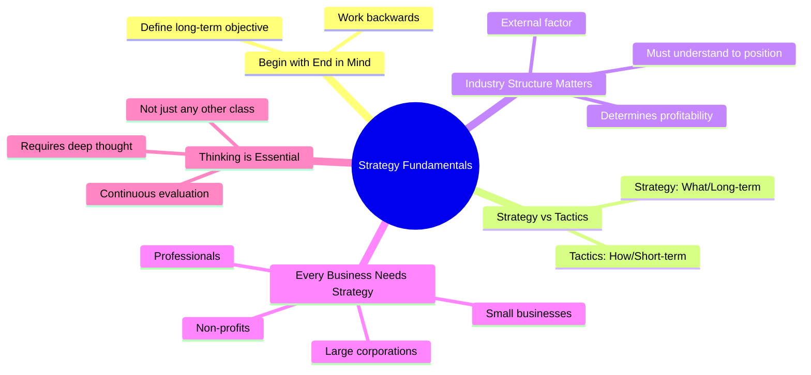

### Professor's Final Advice:

- "Really should start to think" about strategy
- "If you really want to understand strategy... you really have to think through"
- Read the postings (they're short, considering your busy lives)
- Think about different industries constantly
- Practice identifying strategies and tactics everywhere
- This applies to your future career, whether implementing strategy or creating it

---

## Reading & Preparation

- Posted materials are concise
- Focus on understanding concepts, not memorizing
- Think about real-world applications
- Email professor with questions

**Next Session:** Continue with Five Forces detailed analysis

