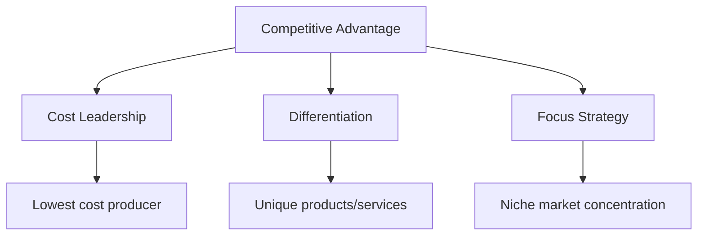
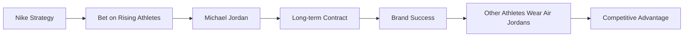
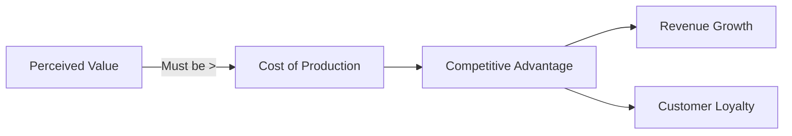
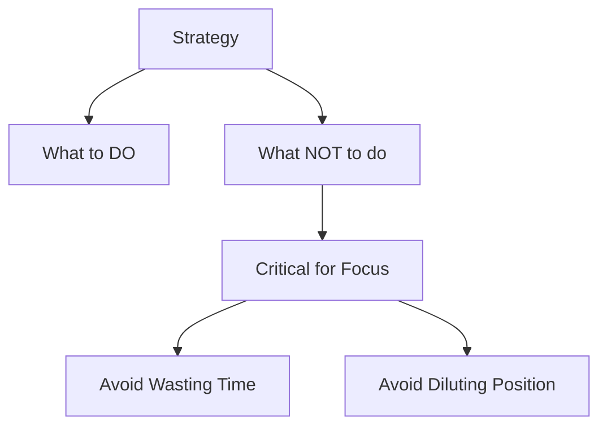
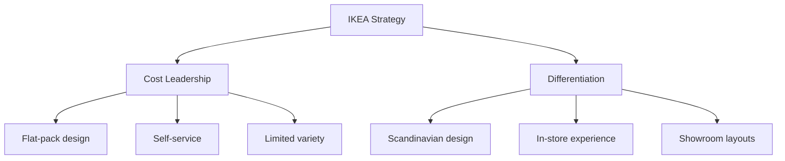
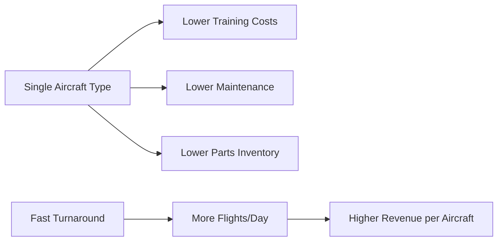
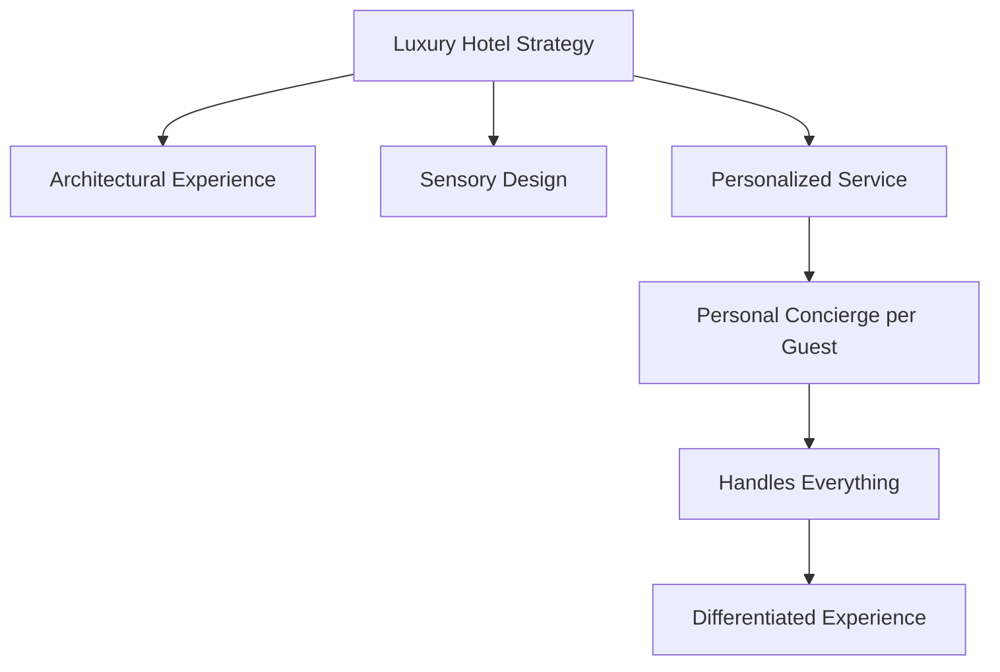
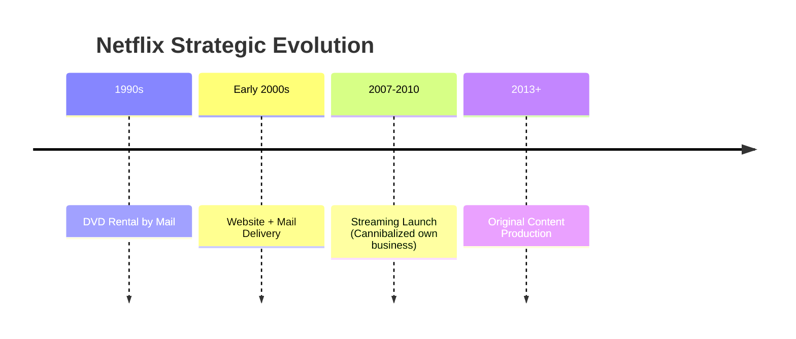

# Business Strategy - Session 3: Competitive Advantage and Strategic Positioning

## 📋 Overview

**Key Questions:**

- How do we compete?

- Where do we compete?

---

## 🎯 Competitive Advantage: Definition

**Competitive Advantage** = A firm's ability to deliver superior value to customers or operate more efficiently than rivals



---

## 💡 Three Core Strategic Approaches

### 1. Cost Leadership

**Essence:** Being the industry's lowest-cost producer while maintaining acceptable quality

**Examples:**

| Company | Strategy | Key Elements |
|----------|-----------|-------------------|
| **Walmart** | EDLP (Everyday Low Prices) | - Enormous buying power<br />- Logistics optimization<br />- Economies of scale |
| **Ryanair** | Ultra-low-cost airline | - No-frills service<br />- Secondary airports<br />- Paid add-ons |
| **Foxconn** | Manufacturing at scale | - Economies of scale<br />- Labor specialization<br />- China/Vietnam production |

**Walmart Case Study:**

- Sam Walton started with one store in rural Arkansas

- He was the only major buyer in small towns → could pressure suppliers

- Low-cost strategy from the very beginning

- As he expanded (2, 3 stores) - buying power increased

- Built stores in rural areas, becoming the dominant buyer in each location

---

### 2. Differentiation

**Essence:** Offering unique products/services that justify premium pricing

**Examples:**

| Company | Uniqueness | Result |
|----------|--------------|-----------|
| **Apple** | Design + ecosystem + UX | Premium pricing, loyalty |
| **Tesla** | Technology + sustainability + direct sales | Control over customer experience |
| **Nike** | Innovation + storytelling + athlete endorsements | Early contracts with rising stars |



**Nike & Michael Jordan Case:**

- Jordan started with Adidas (short-term contract out of college)

- Nike made a big bet on him early in his career

- Result: huge part of Nike's success tied to Jordan

- Other athletes wear his shoes → validates the strategy

- Stock price correlation with Jordan's career almost lockstep

---

### 3. Focus Strategy

**Essence:** Targeting a narrow niche with either cost leadership or differentiation

**Examples:**

| Company | Niche | Approach |
|----------|------|--------|
| **Rolls-Royce** | Luxury automobiles | - Limited production<br />- Absolute perfection<br />- Unique details (wood grain) |
| **Patagonia** | Environmentally conscious consumers | - Clothing repair programs<br />- Take-back program<br />- Environmental activism |

**Rolls-Royce Distinctive Feature:**

- Wood grain on dashboard is unique to each car

- They keep a duplicate grain at manufacturing plant

- If damaged - free replacement with identical grain

- Name has been synonymous with luxury for 8-9 decades

---

## 📊 Strategic Positioning Framework

```mermaid
quadrantChart
    title Strategic Positioning Map
    x-axis Low Cost --> High Cost
    y-axis Broad Market --> Narrow Market
    quadrant-1 Differentiation (Broad)
    quadrant-2 Cost Leadership (Broad)
    quadrant-3 Cost Focus
    quadrant-4 Differentiation Focus
    
    Walmart: [0.2, 0.8]
    Apple: [0.85, 0.75]
    Ryanair: [0.15, 0.85]
    Rolex: [0.9, 0.2]
    Patagonia: [0.7, 0.3]
```

---

## 🎓 Key Concept: Begin with the End in Mind

**Real-World Example: Solar Fund Strategy Session**

A financial advisory company wanted to start a fund to buy existing solar power plants and roll them up for investor returns.

**Strategic Questions Framework:**

1. **Where?** - What market to focus on?

2. **Where exactly?** - Developed vs. developing countries?

3. **How?** - What's unique about us?

4. **What NOT to do?** - Where will we NOT compete?

5. **Scale?** - Large or small projects?

6. **Resources & Timeline?** - What resources and duration?

7. **Competitors?** - Have competitors been studied?

8. **Market Entry?** - How easy for us and rivals?

9. **Risks?** - What are we considering?

**Key Insight:** Even brilliant people with great ideas need to be pulled down from the clouds by asking fundamental strategic questions

---

## 💰 Value Creation Formula



### Value Creation Examples:

| Company | Cost | Perceived Value | Why? |
|----------|------|-----------------|---------|
| **Starbucks** | ~$0.50 | $6 | "Third place", Wi-Fi, comfort, brand |
| **Apple iPhone** | ~$500 | $1200+ | Design, ecosystem, status |
| **Rolex** | ~$2000 | $10,000+ | Craftsmanship, scarcity, status |

**Starbucks Value Proposition:**

- $6 latte ≠ just coffee

- You're paying "rent" for space

- Can sit for 2 hours between meetings

- Wi-Fi, bathroom access, comfort

- Know what to expect (consistency across locations)

**Apple & Foxconn:**

- Without Foxconn's cost leadership, Apple couldn't sell at current prices

- Manufacturing efficiency creates economies of scale

- Enables Apple's premium but accessible pricing strategy

---

## ⚖️ Trade-Offs: Critical Strategic Choice

> **"There are no solutions, only trade-offs"** - fundamental principle of strategy

**Trade-offs Mean:**

- Actively choosing what to do

- Actively continuing to do it

- **Actively saying "NO" to other opportunities**



**Real Example: Geographic Focus**

- Company initially worked in South America, Asia, and Africa

- Too much spread for company size and resources

- Decision: focus ONLY on Africa

- Rationale: Close to Israel office, easier travel

- Must constantly say "no" to other opportunities

- Helps avoid wasting time "chasing every dollar down every alley"

**Without Trade-offs:**

- Companies dilute their positioning

- Increase operational complexity

- Erode profitability

---

## 🔍 Selective Differentiation

**Concept:** Differentiate in specific, targeted areas while controlling costs in others

### Examples:

| Company | Differentiation | Cost Control |
|----------|----------------|-------------------|
| **IKEA** | Scandinavian design + store experience | Flat-pack, self-assembly, limited SKUs |
| **Singapore Airlines** | In-flight service + cabin comfort | Standardized long-haul fleet, efficient hub |
| **Zara** | Speed + fashion freshness | Mid-range materials, minimal advertising |
| **Xiaomi** | High-spec smartphones + clean software | Online-first sales, limited retail |
| **Decathlon** | Own-brand technical products + testing areas | Warehouse-style stores, supply chain control |

---

## 📦 Case Study: IKEA



### Key Features:

**Cost Leadership Elements:**

- Flat-pack → reduced transport/storage costs

- Self-assembly → saves assembly costs

- Limited assortment (best-sellers only)

- Self-service showroom

**Differentiation Elements:**

- Stylish Scandinavian design

- Unique store experience (layouts, café)

- Room setups and inspiration

**Strategic Insight:**

- Perfect customer: newlyweds, new jobs, good income but no savings

- Nice-looking furniture at accessible prices

- Fun to assemble (when you don't have kids)

- **Adaptive strategy:** Furniture in NJ store (serving NYC) was smaller than in Westchester store (serving houses)

- Tailored to apartment sizes = part of strategic positioning

**Trade-offs:**

- No standard delivery and assembly service

- Limited product variety

- Result: Global scalability and low prices

---

## ✈️ Case Study: Southwest Airlines

### Step 1: Primary Strategy - Cost Leadership

**Operational Efficiency:**

- Single aircraft type (Boeing 737) → reduced maintenance

- Point-to-point routes → avoid expensive hub-and-spoke

- Fast turnaround times → maximize aircraft utilization

- Minimalistic onboard services → lower operating expenses



### Step 2: Value Creation

**Customer Value:**

- Low fares = accessibility for price-sensitive travelers

- Friendly staff = brand loyalty

- On-time performance = reliability

**Operational Value:**

- Short-haul routes

- Maximum time in the air

- Fewer delays

### Step 3: Trade-Offs (What They DON'T Do)

❌ No long-haul international flights  

❌ No premium cabin  

❌ No high-end in-flight services  

❌ No assigned seats  

❌ No in-flight meals  

❌ Often secondary airports  

### Step 4: Sustainable Advantage

✅ One of few consistently profitable U.S. airlines  

✅ Strong brand association with affordability and fun  

✅ Operational model difficult for full-service airlines to imitate  

✅ Loyal customer base in price-sensitive segments  

**Selective Differentiation Elements:**

- Friendly, humorous customer service (brand personality)

- Free checked bags (contrasts with competitors)

- Emphasis on reliability

**Strategic Clarity:**

Southwest avoids complex loyalty programs, heavy business-class competition, and major alliances that complicate operations.

---

## 🏨 Examples of Strategy in Services

### Luxury Hotels: Shangri-La Singapore

**Strategic Elements:**

- Architectural experience (part of strategy)

- Waterfalls, trees, curated sounds and smells

- Every customer has a personal concierge

- "Don't call anyone else but me" - for everything

- Concierge handles: room questions, bags, tours, cabs, everything



**Strategic Objective:** Create a completely different experience that justifies premium pricing

### Airport Hotels: Tokyo Innovation

**Business Model:**

- Hotels AFTER security, near gates

- ~$150 for 4 hours

- Privacy, shower, nap, or work space

- Rapid turnover after checkout

- 3-4 guests per 24-hour cycle = ~$600/day revenue vs. $150

**Strategic Genius:**

- Charging luxury prices for non-luxury item

- High turnover model

- Serves price-insensitive business travelers with delays

- Better alternative than airport lounges

---

## 🚗 Additional Strategic Examples

### Toyota - Reliability Strategy

**Strategic Focus:** Long product life and reliability

- Cars last 10-20 years without problems

- Target: People who want reliability, not status

- Example: Suburban doctor, 20-minute commute, same car for 15+ years

- "No-brainer" if you want a car for 10+ years

- Manufacturing strategy centered on durability

### Tesla - Unique Distribution Model

**Key Differentiator:**

- No independent dealerships

- Only Tesla stores (like Apple stores)

- Direct sales to customers

- Control over customer experience

- Different from EVERY other automaker

### Patagonia - Values-Based Focus

**Strategic Elements:**

- Target: Environmentally conscious consumers

- Clothing repair programs

- Take-back and refurbish program

- Environmental activism

- Focus on nature, hiking, camping lifestyle

**Market Expansion:**

- Started with outdoor enthusiasts

- Expanded to people who want "the look"

- Many customers in NYC don't actually camp

- Classic example of focused strategy expanding naturally

---

## 💼 Strategy in Professional Services

### Pricing Strategy for Services

**Fundamental Questions:**

1. **Who are your customers?**

   - Individuals vs. Institutions

   - Apple & Microsoft vs. doctors vs. stay-at-home parents

2. **Who are your competitors?**

   - What are they charging?

3. **What does the industry look like?**

   - High-margin vs. low-margin consulting?

4. **What is your internal expertise?**

   - What makes you unique?

**You can't forget the basics that we always start with - even in services**

### Example: Law Professor Career Strategy

**Strategic Choice:**

- Could be partners in law firms ($$$)

- Choose: professorship + side practice

- "Of counsel" for law firms

- Clients = law firms (no client acquisition needed)

- Less money, but more freedom and work-life balance

### Example: McKinsey → Independent Consultant Path

```mermaid
graph LR
    A[McKinsey Track] --> B[100 hours/week]
    B --> C[Travel 3 days/week]
    C --> D[After 4 years: Lifestyle change desired]
    D --> E[Independent Consulting]
    
    E --> F[Choose Market Segment]
    F --> G[Example: Biotech Startups]
    G --> H[Seed to Series A]
    
    H --> I[Know Your Market]
    I --> J[Set Pricing Strategy]
```



**Strategic Process:**

1. Segment choice (e.g., biotech startups from seed to Series A)

2. Know your market pricing

3. Understand your competitive positioning

4. Set pricing strategy accordingly

---

## 🎯 Strategy Beyond Business

### Universities: Williams College & Amherst Example

**Strategic Model:**

- Very small (1,500-1,700 per class)

- Elite, highly selective

- Founded in early 1800s

**Competitive Advantage:**

- Mid-career earnings likely higher than Harvard/Yale graduates

- Alumni network tighter than Ivy League schools

- **Strategy:** Lifelong family membership

**How It Works:**

- Training from day one: "You're part of the family for life"

- If Williams alum can help, they WILL pick up the phone

- You get access to people you'd never reach otherwise

- Very high percentage of alumni giving

- Strong endowments relative to size

### Fraternity/Sorority Strategy

**What They're Selling:**

- College experience

- Alumni network

- **Guarantee:** Someone will always take your call

**Real Example:**

- Calling CEO of Smith Barney as fraternity brother

- Secretary expected to be at lunch, CEO answered

- Immediate meeting next day at 11am

- Strategy: Network access regardless of position in hierarchy

**Strategic Value:**

- Join organization where everyone takes your call

- Someone will at least listen to you

- Creates lifetime professional network

---

## 📈 Netflix: Master of Strategic Transformation



**Strategic Brilliance:**

**Phase 1: Mail Delivery Revolution**

- Alternative to Blockbuster stores

- Deliver to customer vs. customer coming to store

- Genius at the time: convenience

**Phase 2: Streaming (The Bold Move)**

- Nobody knew what streaming was

- Kept mail business AND launched streaming

- Willingly cannibalized own business

- Very short period: could order VHS, CD, AND streaming

- Way ahead of everyone else

- Delivery business went to zero as streaming grew

**Phase 3: Content Production**

- Started ~10 years ago

- Now earn more from production than other business

- Huge hits boosting quarterly earnings

**Why Genius:**

- Saw technological changes coming

- Weren't afraid to cannibalize existing business

- Maintained both models during transition

- First-mover advantage

- Competitors disappeared ("in dustbin of history along with their investors")

**Classic Case Study:** Company that transformed strategy multiple times successfully, always ahead of market changes

---

## 🔄 Understanding Market Segmentation

### Supermarket Comparison: Strategy in Retail

**Dallas Supermarket (Broad Strategy):**

- Texas-sized (like an airport)

- Offers everything: fruit from Israel, French cheeses, etc.

- Wide variety strategy

- Serves broad market

**Zabar's NYC (Focus Strategy):**

- Specialty shopping experience

- Focus: luxury, high-price items

- Specialty: fish, caviar, lox (smoked salmon)

- Large for Manhattan but focused selection

- Always packed (any time of day/night)

- Makes enormous money from narrow focus

**Zabar's Founder Interviews:**

- Constantly articulated the strategy

- "This is what we're looking for"

- "This is my customer"

- "This is what we do"

- "No, I don't do that. That's not what we do"

- "We don't compete that way"

- Clear about NOT looking for "average Joe"

- Strategy communicated so consistently it became conversational

---

## 🌏 Geographic and Cultural Strategy

### Comparison: Singapore Airlines vs. Southwest

| Element | Singapore Airlines | Southwest Airlines |
|---------|-------------------|-------------------|
| **Strategy** | Premium experience | Low-cost efficiency |
| **Investment** | Cabin comfort, service | Operational efficiency |
| **Target** | Elite travelers | Price-sensitive travelers |
| **Experience** | Best airline globally (25 years) | Fun, friendly, basic |

**Singapore Airlines:**

- Not Southwest Airlines

- Elite experience by design

- Heavy investment in planes, cabin design

- Extremely good service

- Very distinctive design

- Among best airlines globally for 25 years

- Competition now from Gulf airlines (Dubai hub advantage)

---

## 🔑 Key Takeaways & Strategic Principles

### Strategic Questions Checklist

When discussing any new initiative, ask:

1. ✅ **Where will we compete?** (Geography, market segment)

2. ✅ **How will we compete?** (What's unique about us?)

3. ✅ **What NOT to do?** (Trade-offs)

4. ✅ **Who are our customers?**

5. ✅ **Who are our competitors?**

6. ✅ **What resources do we have?**

7. ✅ **What is the scale?** (Big or small projects)

8. ✅ **What is the timeline/duration?**

9. ✅ **What are the risks?**

10. ✅ **How easy is market entry?** (For us and competitors)

### The Simplest Questions

> "The problem is always the simplest question that trips you up. Prepare for the simplest questions."

**Why This Matters:**

- In meetings with bosses, clients, investors

- Simple questions reveal strategic clarity (or lack thereof)

- Shows whether you truly understand your strategy

### Strategy is Universal

Strategy applies to:

- ✅ Corporations

- ✅ Universities

- ✅ Charities

- ✅ Professional sports teams (NFL is huge business)

- ✅ Fraternities/Sororities

- ✅ Individual career planning

- ✅ Personal life decisions

**Example: NFL as Business**

- Study showed: out of top 100 most-watched TV programs in U.S.

- 75 were football games

- In country of 330 million people

- Massive business with clear strategy

- "Who's on my team?" = strategic question

---

## 💡 Fundamental Strategic Principles

### 1. Trade-Offs Create Defensible Advantages

Without trade-offs:

- Diluted positioning

- Increased complexity

- Eroded profitability

With clear trade-offs:

- Strategic clarity

- Easier to say "no"

- Don't waste time chasing every opportunity

- Focus on what you're supposed to do

### 2. Value Creation Formula

Must deliver:

```
Perceived Value > Cost of Production
```

Even for seemingly simple products:

- Starbucks: Selling space and experience, not just coffee

- Rolex: Selling status and craftsmanship, not just timekeeping

- Apple: Selling ecosystem and design, not just hardware

### 3. Operational Effectiveness ≠ Strategy

**Operational Effectiveness:**

- Performing similar activities better than rivals

- Important but not sufficient

**Strategy:**

- Performing different activities than rivals

- Or performing similar activities in different ways

- Creating unique value

### 4. Begin with the End in Mind

**Define Long-Term Goals Before Planning Actions**

Examples:

- Tesla: Sustainable transportation goal drives all decisions

- IKEA: Affordable, stylish furniture for mass market

- Southwest: Low-cost, reliable, point-to-point travel

### 5. Competitive Advantage Sustainability

**How to Sustain Advantage:**

- Choose activities difficult to imitate

- Create configuration of activities that reinforce each other

- Make trade-offs that competitors can't easily copy

- Build barriers through network effects, scale, or expertise

**Southwest Example:**

- Full-service airlines can't easily copy model

- Would require abandoning premium services

- Would conflict with existing hub-and-spoke systems

- Configuration makes imitation very costly

---

## 🎯 Strategic Positioning Summary

| Strategy Type | Goal | Example | Key to Success |
|--------------|------|---------|----------------|
| **Cost Leadership** | Lowest cost in industry | Walmart, Ryanair | Scale, efficiency, supply chain |
| **Differentiation** | Unique value justifying premium | Apple, Rolex | Innovation, brand, quality |
| **Cost Focus** | Low cost in niche | Aldi | Limited SKUs, private labels |
| **Differentiation Focus** | Unique value in niche | Patagonia | Values alignment, community |

### Integration Possibilities

Some companies successfully integrate strategies:

- **IKEA:** Cost leadership + design differentiation

- **Southwest:** Cost leadership + service differentiation (friendliness, reliability)

- **Zara:** Fast fashion differentiation + cost control

**Key:** Integration works when activities reinforce each other, not when they conflict

---

## 📊 How Strategy Shows Up in Daily Decisions

### Every Decision Relates to Strategy

**Product Decisions:**

- What features to include/exclude?

- What quality level?

- What price point?

**Customer Decisions:**

- Which segments to serve?

- Which segments to avoid?

- How to communicate value?

**Operational Decisions:**

- Make vs. buy?

- Which capabilities to build internally?

- Where to locate operations?

**Investment Decisions:**

- What to invest in?

- What NOT to invest in?

- Resource allocation priorities?

---

## 💭 Critical Thinking Questions

1. **Can a company successfully pursue both cost leadership AND differentiation?**

   - When does it work? (IKEA, Southwest)

   - When does it fail?

2. **When should a company change its strategy?**

   - Netflix example: external technology changes

   - What triggers strategic transformation?

3. **How do trade-offs create defensible competitive advantages?**

   - Why can't competitors easily copy?

   - What makes positioning sustainable?

4. **Why is saying "NO" so important in strategy?**

   - Focus benefits

   - Resource allocation

   - Avoiding complexity

5. **What happens when companies try to be "everything to everyone"?**

   - Diluted positioning

   - Operational complexity

   - Profit erosion

---

## 🎬 Final Insights

### Strategic Thinking is About:

- 🔍 **Seeing Patterns** - Recognize strategic elements everywhere

- 🎯 **Making Conscious Choices** - Deliberate decision-making

- ⚖️ **Accepting Trade-Offs** - Understanding you can't do everything

- 🚫 **Actively Saying NO** - Maintaining focus

- 📊 **Understanding Your Market** - Know who you serve

- 💡 **Creating Unique Value** - Differentiate or lead on cost

### Looking at Things Differently

> "If the only thing I accomplish is getting you to look at things differently, then I was successful."

**Apply Strategic Thinking To:**

- Business models you encounter

- Companies you read about

- Career decisions you make

- Organizations you join

- Problems you solve

**Remember:** 

- There are no perfect solutions, only trade-offs

- The better you understand strategy fundamentals

- The quicker you can analyze situations

- The better decisions you'll make

---

## 📚 Key Terminology Review

**Competitive Advantage:** Ability to deliver superior value or operate more efficiently than rivals

**Cost Leadership:** Being the lowest-cost producer while maintaining acceptable quality

**Differentiation:** Offering unique products/services justifying premium prices

**Focus Strategy:** Targeting narrow niche with cost or differentiation approach

**Trade-Offs:** Conscious choices about what to do and what NOT to do

**Value Creation:** Delivering perceived value greater than cost of production

**Strategic Positioning:** How a firm competes in a sustainable, hard-to-imitate way

**Operational Effectiveness:** Performing similar activities better than rivals (necessary but insufficient)

**Selective Differentiation:** Differentiating in specific areas while controlling costs in others

**Perceived Value:** Customer's subjective assessment of worth (can exceed actual cost significantly)

---

**End of Session 3 Notes**

