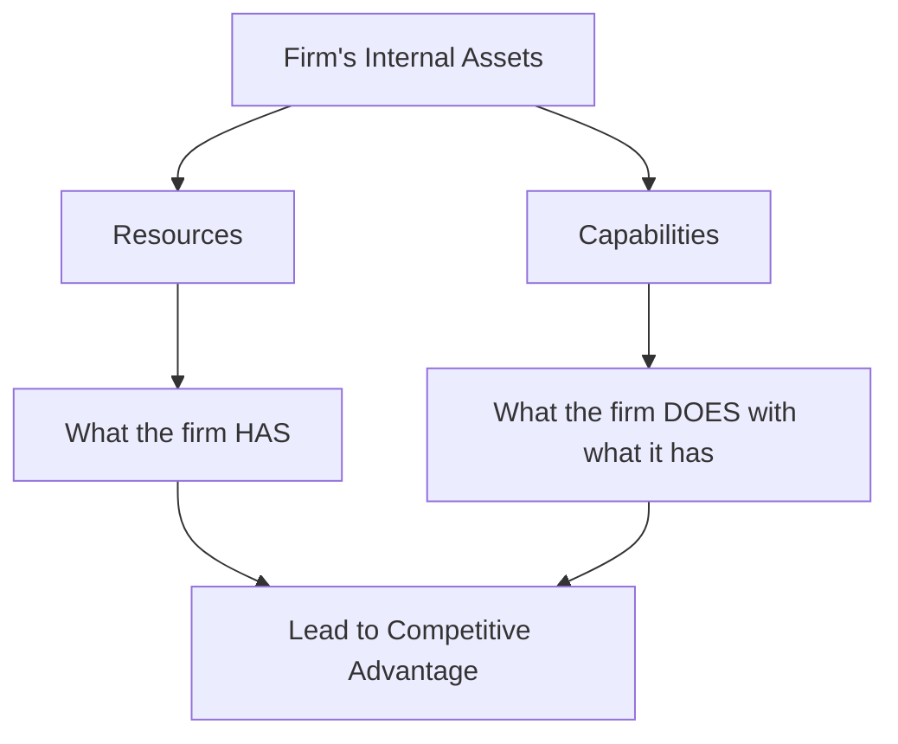
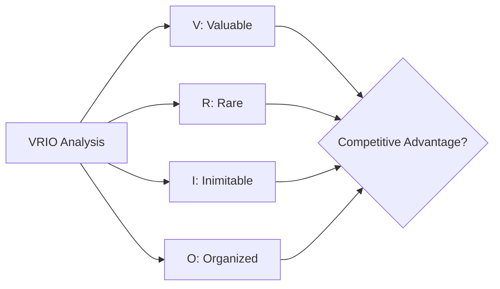
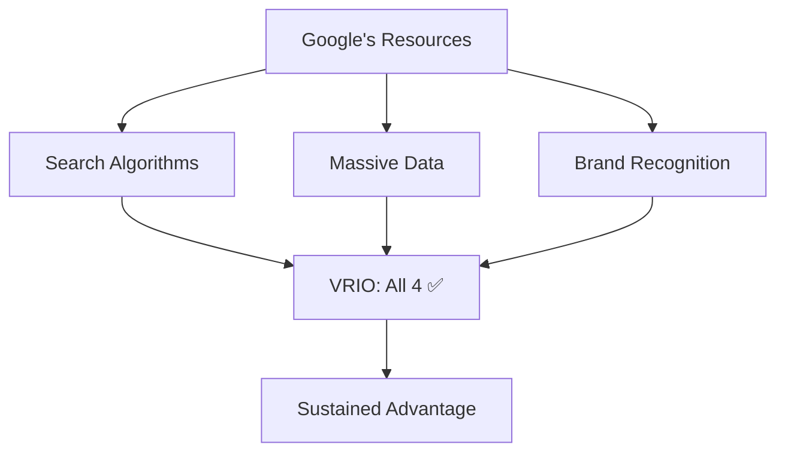
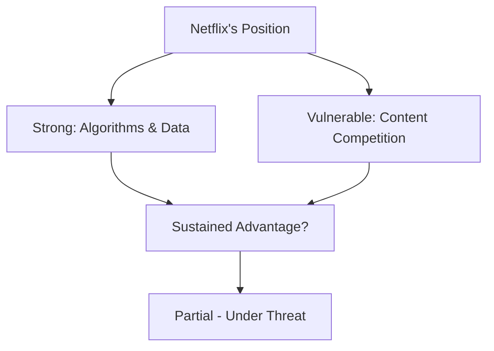

# Session 4: Internal Analysis and Resource-Based View (RBV)

## Table of Contents

1. Resource-Based View (RBV)

2. VRIO Framework

3. Case Study: Google

4. Case Study: Netflix

---

## 1. Resource-Based View (RBV)

### Definition

**RBV** = A strategic approach to assessing a firm's **resources** and **capabilities** to achieve competitive advantage.

### Key Components

#### Resources vs. Capabilities

| Concept | Definition | Examples |
|---------|------------|----------|
| **Resources** | What the firm has | Amazon's logistics systems Netflix's recommendation algorithm |
| **Capabilities** | What the firm does with what it has | Google's search optimization Apple's hardware-software integration |

---

### 1.1 Resources: Core Competencies

**Core Competencies** are:

- Unique combinations of knowledge, skills, and processes

- Difficult to replicate

- Emerge from collective learning, routines, and proprietary know-how

- Integrated into organizational processes

- Deliver value to customers

- Provide access to multiple markets

#### Example: Apple

- Design & innovation culture

- Seamless integration of hardware, software, and design

- Precision manufacturing & continuous improvements

---

### 1.2 Capabilities

**Capabilities** are:

- Mechanisms by which resources are deployed and leveraged

- The organizational ability to deploy resources effectively

- Often routines, processes, or systems that enhance performance

- Answer the question: *"Can the firm effectively combine and utilize its resources to achieve goals?"*

#### Types of Capabilities

| Type | Description | Examples |
|------|-------------|----------|
| **Technological** | Innovation processes | R&D processes |
| **Operational** | Efficiency systems | Logistics, production systems |
| **Human** | People management | Knowledge management |
| **Marketing** | Brand development | Brand-building expertise |

---

### Key Insight

> **Not all resources lead to advantage** — only those that are valuable, rare, and difficult to imitate.  

> Capabilities transform resources into effective competitive action.

---

## 2. VRIO Framework

### What is VRIO?

A strategic tool to analyze a firm's internal resources and capabilities to determine if they provide **sustained competitive advantage**.

### VRIO Components

| Letter | Stands For | Key Question | Implication |
|--------|-----------|--------------|-------------|
| **V** | **Valuable** | Does it help exploit opportunities or neutralize threats? | Yes = Potential advantage |
| **R** | **Rare** | Is it controlled by few or no competitors? | Yes = Temporary advantage |
| **I** | **Inimitable** | Is it difficult or costly to imitate? | Yes = More sustainable advantage |
| **O** | **Organized** | Is the firm structured to capture the value? | Yes = **Sustained competitive advantage** |

---

### Why VRIO Matters

**VRIO helps firms:**

- Identify unique assets worth protecting and enhancing

- Avoid over-investment in easily replicable resources

- Focus strategy on building hard-to-copy capabilities

**Practical Application:**

- Distinguish which internal strengths lead to lasting advantage

- Focus managers on building, protecting, and leveraging key resources

---

## 3. Case Study: Google

### Data Dominance & Algorithmic Power

#### Resources

- Proprietary search algorithms

- Massive datasets (user behavior, search queries)

- Global brand recognition

- AI research capabilities

#### Capabilities

- Continuous algorithm improvement

- Scalable infrastructure to handle global search traffic

- Monetization of search through Google Ads platform

---

### VRIO Analysis: Google

| VRIO Dimension | Assessment | Explanation |
|----------------|------------|-------------|
| **Valuable** | ✅ Yes | Drives user engagement and advertiser demand |
| **Rare** | ✅ Yes | Few firms possess equivalent global search capabilities |
| **Inimitable** | ✅ Yes | Scale, data volume, brand trust hard to replicate |
| **Organized** | ✅ Yes | Business model fully aligned with leveraging these resources |

**Result:** ✅ **Sustained Competitive Advantage** — Google's search dominance has persisted for decades

---

### Discussion Questions: Google

1. Can competitors realistically challenge Google's core capabilities?

2. How does Google prevent commoditization of its search services?

3. What risks exist in over-reliance on one dominant resource?

---

## 4. Case Study: Netflix

### Data-Driven Content & Global Streaming Reach

#### Resources

- Proprietary recommendation algorithms (Cinematch, advanced AI)

- Global subscriber base (~230+ million)

- Original content library

- Robust brand in entertainment streaming

#### Capabilities

- Personalization of viewing experience

- Agile content acquisition & production based on user preferences

- Rapid international market expansion

---

### VRIO Analysis: Netflix

| VRIO Dimension | Assessment | Explanation |
|----------------|------------|-------------|
| **Valuable** | ✅ Yes | Personalized recommendations increase engagement |
| **Rare** | ✅ Yes | Early mover advantage in streaming personalization |
| **Inimitable** | ⚠️ Partial | Data scale and historical viewing patterns tough to replicate |
| **Organized** | ✅ Yes | Tech, content, and market teams integrated to execute strategy |

**Result:** ⚠️ **Partial Sustained Advantage** — While algorithms are defensible, rivals like Disney+ and Amazon Prime are closing gaps in content scale and brand

---

### Discussion Questions: Netflix

1. Are Netflix algorithms enough to maintain long-term differentiation?

2. How important is exclusive content compared to technological capability?

3. What are the strategic trade-offs in global expansion versus local adaptation?

---

## Summary: RBV vs. Traditional Analysis

| Approach | Focus | Key Question |
|----------|-------|--------------|
| **Traditional** | External environment | What opportunities exist in the market? |
| **RBV** | Internal resources | What unique strengths can we leverage? |

### Key Takeaway

**Competitive advantage comes from:**

- Resources that are Valuable, Rare, Inimitable, and the firm is Organized to exploit them

- Capabilities that transform resources into effective action

- Strategic focus on building hard-to-copy assets

---

## Exam Preparation Checklist

- [ ] Can you define RBV and explain its importance?

- [ ] Can you distinguish between resources and capabilities?

- [ ] Can you apply the VRIO framework to any company?

- [ ] Can you analyze whether a resource provides sustained competitive advantage?

- [ ] Can you compare Google's vs. Netflix's strategic positions using VRIO?

