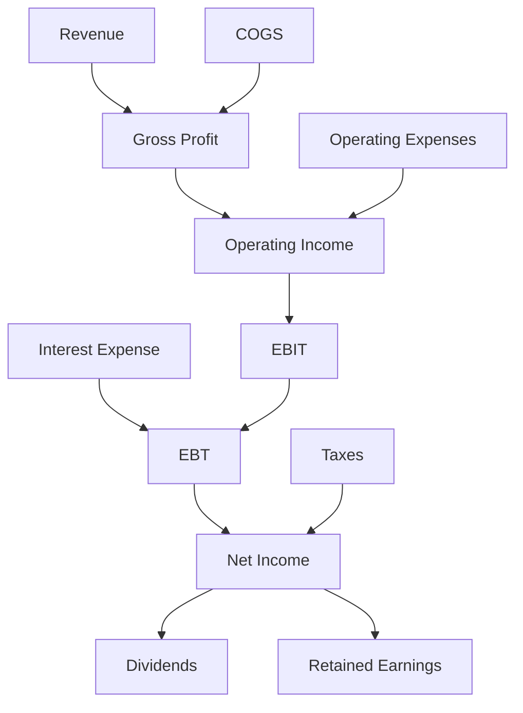
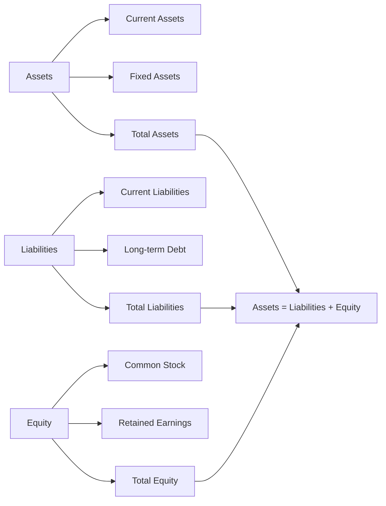
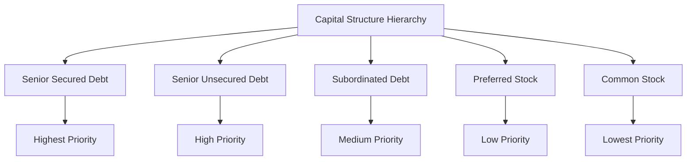

# Corporate Finance

## Table of Contents
1. [Introduction to Corporate Finance](#introduction-to-corporate-finance)
2. [Financial Statements](#financial-statements)
3. [Capital Structure](#capital-structure)
4. [Corporate Roles and Responsibilities](#corporate-roles-and-responsibilities)
5. [Dividend Policies](#dividend-policies)
6. [Risk Management](#risk-management)
7. [Investment Decisions](#investment-decisions)
8. [Key Formulas and Calculations](#key-formulas-and-calculations)
9. [Case Studies](#case-studies)
10. [Exam Questions Reference](#exam-questions-reference)
11. [Key Takeaways](#key-takeaways)

---

## Introduction to Corporate Finance

Corporate finance is the area of finance that deals with how corporations address funding sources, capital structuring, and investment decisions. It focuses on maximizing shareholder value through long-term and short-term financial planning and implementing various strategies.

### The 5 Basic Functions of Corporate Finance

1. **Capital Budgeting**: Deciding which projects to invest in
2. **Capital Structure**: Determining the optimal mix of debt and equity
3. **Working Capital Management**: Managing short-term assets and liabilities
4. **Dividend Policy**: Deciding how much to pay shareholders
5. **Risk Management**: Identifying and mitigating financial risks

### Core Principles

- **Value Maximization**: The primary goal is to maximize shareholder wealth
- **Risk-Return Tradeoff**: Higher returns typically come with higher risk
- **Time Value of Money**: Money today is worth more than money tomorrow
- **Market Efficiency**: Markets reflect all available information

---

## Financial Statements

### Income Statement

The Income Statement shows a company's revenues, expenses, and profits over a specific period.

#### Key Components

#### Example Income Statement
| Item | Amount |
|------|--------|
| Revenue | $25M |
| COGS | $9M |
| **Gross Profit** | **$16M** |
| Operating Expenses | $5M |
| **Operating Income** | **$11M** |
| Interest Expense | $500K |
| **EBT** | **$10.5M** |
| Taxes (30%) | $3.15M |
| **Net Income** | **$7.35M** |
| Dividends | $3M |
| **Retained Earnings** | **$4.35M** |

#### Key Calculations

**Gross Profit = Revenue - COGS**
- $25M - $9M = $16M

**Operating Income = Gross Profit - Operating Expenses**
- $16M - $5M = $11M

**Net Income = Operating Income - Interest - Taxes**
- $11M - $500K - $3.15M = $7.35M

**Earnings Per Share (EPS) = Net Income / Shares Outstanding**
- $7.35M / 50,000 = $147

**P/E Ratio = Stock Price / EPS**
- $100 / $147 = 0.68

### Balance Sheet

The Balance Sheet shows a company's assets, liabilities, and equity at a specific point in time.

#### Key Components

#### Example Balance Sheet
| Assets | Amount | Liabilities & Equity | Amount |
|--------|--------|---------------------|--------|
| Current Assets | $2M | Current Liabilities | $1M |
| Fixed Assets | $3.5M | Long-term Debt | $1.2M |
| **Total Assets** | **$5.5M** | **Total Liabilities** | **$2.2M** |
| | | Common Stock | $1M |
| | | Retained Earnings | $2.3M |
| | | **Total Equity** | **$3.3M** |

#### Key Ratios

**Current Ratio = Current Assets / Current Liabilities**
- $2M / $1M = 2.0

**Debt-to-Equity Ratio = Total Debt / Total Equity**
- $1.2M / $3.3M = 0.36

---

## Capital Structure

Capital structure refers to the mix of debt and equity used to finance a company's operations and growth.

### Types of Financing

#### 1. Debt Financing
- **Secured Debt**: Backed by collateral
- **Unsecured Debt**: Not backed by collateral
- **Convertible Bonds**: Can be converted to equity
- **Senior Debt**: Higher priority in bankruptcy

#### 2. Equity Financing
- **Common Stock**: Voting rights, residual claims
- **Preferred Stock**: Fixed dividends, priority over common stock
- **Convertible Preferred**: Can be converted to common stock

### Capital Structure Hierarchy

### Optimal Capital Structure

The optimal capital structure balances:
- **Tax Benefits**: Interest payments are tax-deductible
- **Financial Distress Costs**: High debt increases bankruptcy risk
- **Agency Costs**: Conflicts between managers and shareholders

---

## Corporate Roles and Responsibilities

### Chief Financial Officer (CFO)
- **Strategic Planning**: Long-term financial strategy
- **Capital Allocation**: Investment decisions
- **Risk Management**: Financial risk oversight
- **Investor Relations**: Communication with shareholders

### Controller
- **Financial Reporting**: Prepare financial statements
- **Internal Controls**: Ensure accuracy and compliance
- **Cost Management**: Monitor and control expenses
- **Audit Coordination**: Work with external auditors

### Treasurer
- **Cash Management**: Optimize cash flow
- **Banking Relations**: Manage banking relationships
- **Investment Management**: Short-term investments
- **Risk Management**: Hedging strategies

### Board of Directors
- **Governance**: Oversee management decisions
- **Strategy Approval**: Approve major strategic initiatives
- **Executive Compensation**: Set executive pay
- **Risk Oversight**: Monitor enterprise risks

---

## Dividend Policies

### Types of Dividends

#### 1. Cash Dividends
- **Regular Dividends**: Consistent payments
- **Special Dividends**: One-time payments
- **Stock Dividends**: Additional shares

#### 2. Stock Dividends
- **Stock Split**: Increase number of shares
- **Stock Repurchase**: Buy back shares

### Dividend Policies

#### 1. Stable Dividend Policy
- Consistent dividend payments
- Predictable for investors
- May not reflect current earnings

#### 2. Residual Dividend Policy
- Pay dividends only after funding all positive NPV projects
- Dividends vary with investment opportunities
- Maximizes shareholder value

#### 3. Other Policies
- **Constant Payout Ratio**: Fixed percentage of earnings
- **Low Regular Plus Extra**: Base dividend plus variable component
- **No Dividend Policy**: Reinvest all earnings

### Retained Earnings

**Formula: Retained Earnings = Beginning Retained Earnings + Net Income - Dividends**

**Example:**
- Beginning Retained Earnings: $50,000
- Net Income: $30,000
- Dividends: $10,000
- **Ending Retained Earnings: $70,000**

---

## Risk Management

### Types of Risk

#### 1. Systematic Risk (Market Risk)
- **Definition**: Risk that affects the entire market
- **Examples**: Economic recession, interest rate changes
- **Characteristics**: Cannot be diversified away
- **Measurement**: Beta coefficient

#### 2. Unsystematic Risk (Company-Specific Risk)
- **Definition**: Risk specific to individual companies
- **Examples**: Management changes, product failures
- **Characteristics**: Can be diversified away
- **Measurement**: Standard deviation of returns

### Risk Management Strategies

#### 1. Diversification
- **Portfolio Diversification**: Spread investments across different assets
- **Geographic Diversification**: Invest in different countries
- **Industry Diversification**: Invest in different sectors

#### 2. Hedging
- **Currency Hedging**: Protect against exchange rate fluctuations
- **Interest Rate Hedging**: Protect against rate changes
- **Commodity Hedging**: Protect against price fluctuations

---

## Investment Decisions

### Capital Budgeting

#### Net Present Value (NPV)
**NPV = Σ(CFt / (1+r)^t) - Initial Investment**

#### Internal Rate of Return (IRR)
**IRR = Rate where NPV = 0**

#### Payback Period
**Payback Period = Initial Investment / Annual Cash Flow**

### Investment Criteria

1. **NPV > 0**: Accept the project
2. **IRR > Cost of Capital**: Accept the project
3. **Payback Period < Target**: Accept the project

---

## Key Formulas and Calculations

### Financial Ratios

| Ratio | Formula | Purpose |
|-------|---------|---------|
| **Current Ratio** | Current Assets / Current Liabilities | Liquidity |
| **Quick Ratio** | (Current Assets - Inventory) / Current Liabilities | Liquidity |
| **Debt-to-Equity** | Total Debt / Total Equity | Leverage |
| **ROE** | Net Income / Shareholders' Equity | Profitability |
| **ROA** | Net Income / Total Assets | Profitability |
| **EPS** | Net Income / Shares Outstanding | Per Share |
| **P/E Ratio** | Stock Price / EPS | Valuation |

### Time Value of Money

**Present Value = Future Value / (1 + r)^t**
**Future Value = Present Value × (1 + r)^t**

**Example:**
- $100 today at 10% interest
- **Future Value in 1 year: $110**
- **Present Value of $110 in 1 year: $100**

---

## Case Studies

### Case 1: Apple Raising $1B

**Scenario**: Apple needs to raise $1B for expansion.

**Analysis**:
- **Debt**: Lower cost, tax benefits, no dilution
- **Equity**: Higher cost, dilution, but no repayment obligation
- **Preferred Stock**: Hybrid approach, fixed dividends

**Recommendation**: **Debt** - Apple has strong cash flow and low debt levels.

### Case 2: Software Company Pre-IPO

**Scenario**: Paris-based software company needs $20M before IPO.

**Analysis**:
- **Venture Capital**: High growth potential, expertise
- **Private Equity**: Operational improvements, scale
- **Debt**: Limited due to high risk profile

**Recommendation**: **Venture Capital** - Provides capital and expertise for growth.

### Case 3: Audi Capital Structure

**Scenario**: Audi needs €5B, current D/E ratio is 0.30.

**Analysis**:
- **Current Structure**: Conservative, low risk
- **Target D/E**: 0.50-0.60 for optimal tax benefits
- **Recommendation**: **Mixed approach** - 60% debt, 40% equity

---

## Exam Questions Reference

For comprehensive exam preparation, refer to the complete set of Corporate Finance exam questions:

**[📋 Corporate Finance Exam Questions](https://docs.google.com/document/d/1AUcXGV7UPjN7SxPZpDa9rkBTO0sN55Ti2IazBBcT9Mw/edit?usp=sharing)**

This document contains:
- **Financial Statement Analysis** questions with sample data
- **Capital Structure** decision scenarios
- **Corporate Roles** and responsibility questions
- **Dividend Policy** case studies
- **Risk Management** applications
- **Investment Decisions** with real company examples
- **Extra Credit** questions for advanced topics

### Key Topics Covered in Exam:
- ✅ 5 Basic Functions of Corporate Finance
- ✅ Income Statement calculations (Gross Profit, Operating Income, Net Income)
- ✅ Balance Sheet analysis and ratios
- ✅ Capital structure hierarchy and financing options
- ✅ Corporate roles (CFO, Controller, Treasurer, Board)
- ✅ Dividend policies and retained earnings
- ✅ Risk types (systematic vs. unsystematic)
- ✅ Investment decision criteria
- ✅ Financial ratios and formulas
- ✅ Case studies (Apple, Audi, Software companies)

---

## Key Takeaways

### 1. Financial Management Principles
- **Value Maximization**: Primary goal is shareholder wealth
- **Risk-Return Tradeoff**: Higher returns require higher risk
- **Time Value of Money**: Money today is worth more than tomorrow
- **Diversification**: Reduces unsystematic risk

### 2. Capital Structure Decisions
- **Optimal Mix**: Balance tax benefits with financial distress costs
- **Flexibility**: Maintain financial flexibility for opportunities
- **Market Conditions**: Consider current market conditions
- **Company Characteristics**: Match structure to business model

### 3. Dividend Policy
- **Signal Value**: Dividends signal company strength
- **Tax Considerations**: Consider tax implications for shareholders
- **Investment Opportunities**: Balance dividends with growth needs
- **Consistency**: Maintain consistent policy when possible

### 4. Risk Management
- **Identify Risks**: Understand all types of risk
- **Quantify Risks**: Measure risk exposure
- **Mitigate Risks**: Implement appropriate strategies
- **Monitor Risks**: Continuously assess risk levels

### 5. Investment Decisions
- **NPV Rule**: Accept projects with positive NPV
- **Opportunity Cost**: Consider alternative investments
- **Risk Assessment**: Evaluate project-specific risks
- **Strategic Fit**: Align with company strategy

---

## Conclusion

Corporate finance is essential for making informed financial decisions that maximize shareholder value. Understanding financial statements, capital structure, risk management, and investment decisions enables managers to make strategic choices that drive company success.

The key is to balance risk and return while considering the time value of money and market conditions. By applying these principles, companies can optimize their financial performance and create sustainable value for shareholders.

Remember: **Corporate finance is about making decisions today that will create value tomorrow.**
