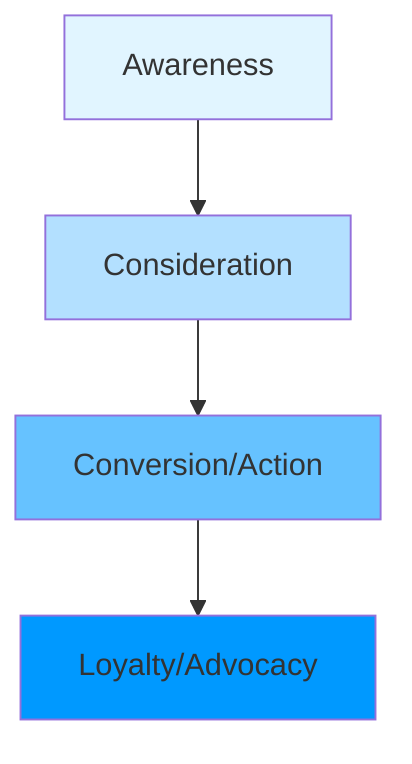
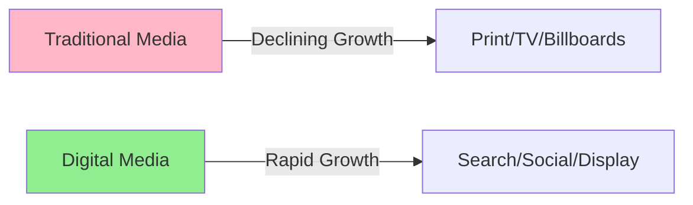
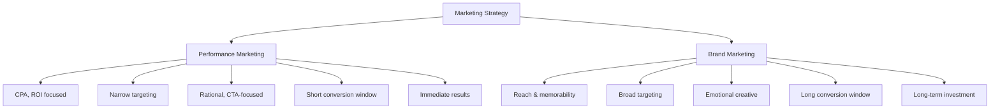
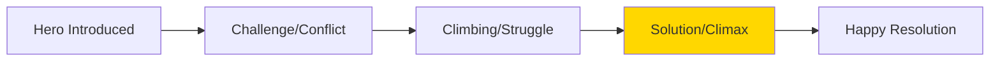
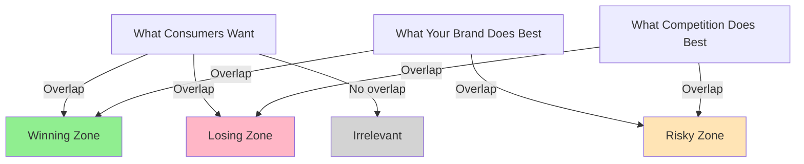
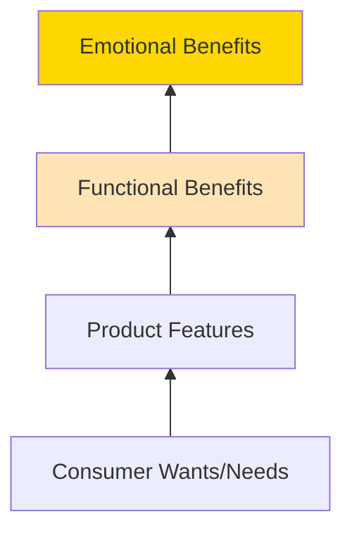

# Introduction to Digital Marketing and Branding

## What is Marketing?

**Definition**: The process of communicating the value of a product or service to customers, for the purpose of selling that product or service.

**Key Components**:
- Choosing target markets through market analysis and segmentation
- Understanding consumer behavior
- Providing superior customer value

### The Basic Marketing Funnel



**Why it's a funnel**: Not everyone who becomes aware of your product will convert - people drop off at each stage.

---

## Digital Marketing Fundamentals

**Definition**: Marketing of products or services using digital technologies, which leave a footprint behind in the form of data.

### Why Digital Marketing Matters

**Global Statistics**:
- 8+ billion world population
- Most of the world is connected to the internet
- 64% of global population on social media
- Even 65+ demographic spends ~4 hours/day online

**Advertising Spend Trends**:
- Digital advertising is growing significantly faster than traditional media
- US market approaching $1 trillion in digital advertising
- Digital has already surpassed traditional media spending



### The Digital Revolution Timeline

1. **Banner Ads** - First digital advertising
2. **Mobile Revolution** - Smartphones changed everything
   - More personal targeting
   - GPS location tracking
   - Smaller screens (new challenges)
   - Always-on connectivity
3. **Privacy Challenges** - Regulations and user concerns
4. **AI Revolution** - Current transformation
   - Content generation
   - Predictive analytics
   - AI agents replacing teams
   - "Vibe marketing"

**Warning**: AI can hallucinate - always check its work!

---

## Marketing Strategy Frameworks

### 1. Performance Marketing vs. Brand Marketing



| Aspect | Performance Marketing | Brand Marketing |
|--------|----------------------|-----------------|
| **KPIs** | CPA, ROI | Reach, memorability metrics |
| **Targeting** | Narrow | Broad |
| **Creative** | Rational, CTA-focused | Emotional |
| **Measurement** | Short conversion window | Long conversion window |
| **Outlook** | Immediate results | Long-term investment |

**Key Insight**: In a perfect world, campaigns have both branding AND performance layers.

### 2. B2B vs. B2C Marketing

| Aspect | B2C | B2B |
|--------|-----|-----|
| **Targeting** | Broad | Narrow |
| **Sales Cycle** | Short | Typically long (weeks/months/years) |
| **Buyer** | Consumer | Multiple decision-makers (Finance, Legal, IT, HR, C-level) |
| **Pricing** | Consumer-focused | Can be multiple figures |
| **Strategy** | Pricing & emotional | Rational, problem-solving, content-focused |
| **KPIs** | ROAS (Return on Ad Spend) | Leads |

**B2B Complexity**: Multiple buyers mean multiple marketing activities targeting different stakeholders with different concerns:
- Finance cares about ROI
- HR cares about employee satisfaction
- IT cares about security and stability
- Legal cares about compliance

### 3. D2C (Direct to Consumer)

**Definition**: When manufacturers bypass middlemen to sell directly to consumers.

**Examples**:
- Apple Store (instead of Best Buy)
- Nike Store (direct retail)
- Tnuva during COVID (dairy company selling direct instead of through supermarkets)

---

## Understanding Profitability in Marketing

**Business Formula**: Buy Low → Sell High = Margin

**Marketing Formula**: 
```
Customer Acquisition Cost (CAC) < Customer Lifetime Value (LTV) = Profitable Marketing
```

**Example - Insurance Industry**:
- Acquisition cost: ₪1,000
- Lifetime value (multiple renewals): ₪10,000
- Margin: ₪9,000 profit per customer

---

## Brand Building

### What is a Brand?

A brand is more than just a logo or product name. It represents:
- A distinctive mark
- A stamp of quality
- Something you can trust
- Perceived value
- A loyalty driver
- A driver of profitability

### The Power of Branding

**Pricing Example**:
- Would you pay $80,000 for a Subaru? (Few hands)
- Would you pay $80,000 for a Maserati? (More hands)

The difference? **Brand perception**.

**Context Matters**:
- Mercedes with tinted windows at midnight in an industrial zone
  - Without context: Could be anyone
  - With Uber context: Just a ride
  - Branding changes perception

### Brand Battles

**Historical**: Coke vs. Pepsi

**Current**: 
- Apple vs. Samsung
- ChatGPT vs. Gemini

**Samsung's Key KPI in Israel**: PTO (Proud To Own)
- Not just sales
- Measured through ongoing research
- Focus on Gen Z through content marketing
- Goal: Make people proud to put their Samsung phone on the table

**Jordan Brand Case Study**:
- Michael Jordan retired over 20 years ago
- Brand awareness in US: ~100% (9.5/10 people recognize the logo)
- 25% actively use Jordan brand
- 20% are loyal customers (only buy Jordan)
- Shows power of brand longevity

---

## The Samsung VR Commercial Analysis

**Creative Approach**:
- Featured an ostrich (can't fly, outcast)
- Ostrich puts on VR glasses
- Experiences flying in virtual reality
- Emotional music (Elton John's "Rocket Man")

**Key Observations**:
1. **No product features discussed** - Not a single specification mentioned
2. **Pure emotional appeal** - Inspiring, empowering
3. **Story arc** - Hero (ostrich) with challenge (can't fly) finds solution (VR)
4. **Generated feeling** - Made viewers feel inspired, possibly gave goosebumps
5. **Awareness stage** - This is top-of-funnel marketing

**Campaign Structure**:
- Week 1-2: Full 60-second emotional ad (TV)
- Following weeks: 30-second and 15-second versions
- Later stages: Feature-focused ads (consideration)
- Final stage: Discount/promotion ads (conversion)

### Traditional Story Arc in Advertising



**Disney Movie Formula**: Same structure
- Misunderstood hero
- Faces challenges
- Falls down, gets back up
- Reaches solution
- Happy ending

**Why it works**: Generates **compassion** → Creates **emotion** → Drives **memorability**

---

## Target Audience Definition

### Traditional vs. Conceptual Target Audience

**Sociodemographic Audience** (Traditional - Inadequate):
- Age
- Gender
- Income
- Marital status
- Location

**Problem**: Two people with identical demographics can be completely different.

**Example**: King Charles vs. Ozzy Osbourne
- Both divorced
- Both have 2 children
- Both born same era
- Both successful in their field
- Both wealthy
- Both like dogs
- Both spend winters in Alps

**But**: Completely different motivations and behaviors!

### Conceptual Target Audience (Better Approach)

**Definition**: Defined by their most important characteristic or motivation **in relation to your brand's category**.

### Sir Ernest Shackleton's Ad (Historical Example)

**Ad Text**:
> "Men wanted for hazardous journey. Small wages, bitter cold, long months of complete darkness, constant danger, safe return doubtful. Honor and recognition in case of success. Contact Ernest Shackleton"

**What This Does**:
- Clearly defines who it's NOT for
- Narrowing target audience deliberately
- Evokes emotion in the right people (adventurers)
- Creates self-selection

**Key Principle**: "When you're entering a space with lots of noise, you need to disrupt the conversation. You need to find that secret sauce. Average is for losers. Be exceptional or quit." - Seth Godin

---

## Building a Conceptual Target Audience: Wix Case Study

### The Process

**Step 1: Identify Attributes**

Who are your ideal customers?
- Small business owners
- Extremely busy (juggling multiple roles)
- Used to doing things on their own
- Control freaks
- Budget-conscious

**Step 2: Define Needs** (in context of your product)

What do they need?
- A website that'll do the job
- Professional looking
- Quick to start
- Affordable
- Easy to manage themselves

**Step 3: Understand Fears** (in context of your product)

What are they afraid of?
- Won't look professional enough
- Cheap vs. Quality dilemma
- Speed vs. Quality trade-off
- DIY or hire professional?
- Similar offerings - who to trust?
- Stability concerns

**Step 4: Journey Insights**

How do they make decisions?
- Need proof it works
- Trust similar business owners (testimonials)
- Look for reviews from like-minded people

### The Result: Wix's Conceptual Target Audience

**Final Definition** (2-3 sentences):

> "Small business owners who are contemplating whether to build their company website on their own, but fear it won't look professional enough. They need proof from like-minded owners."

### Why This Matters

**Consistency Across Teams**:
- Marketing agency
- Content writers
- Web designers
- Social media team
- All need to speak to the same audience

**The conceptual target audience is the guiding light** that ensures consistency.

### Wix Landing Page Evolution

**Before** (Feature-focused):
- "Create a website that means business"
- "Build on a powerful platform with complete design flexibility"
- CTA: "Get Started"

**After** (Emotion-focused, based on conceptual audience):
- "Create a website you're proud of"
- "Discover the platform that gives you the freedom to create, design, manage and develop your web presence exactly the way you want"
- Includes testimonials from small business owners

**The Difference**: Taps into emotion (pride) rather than just features.

---

## Communicating Value: The Winning Zone



**Zones Explained**:
- **Winning Zone**: Clear difference that matters to consumers
- **Losing Zone**: Competitor meets consumer needs better than you
- **Risky Zone**: You equally meet consumer needs - win through price, speed, technology, or emotional connection
- **Dumb Zone**: Competitive battle where consumers don't care (Coke vs. Pepsi territory)

**Goal**: Always create and occupy your winning zone through:
- Unique features
- Better service
- Different positioning
- R&D innovation

---

## The Consumer Benefits Ladder



### The Ladder Explained

1. **Bottom: Consumer Wants/Needs**
   - Foundation - understand what people want
   - Build product around these needs

2. **Product Features**
   - The "what" of your product
   - Technical specifications

3. **Functional Benefits** (Rational)
   - "What do I get?"
   - **Used in**: Consideration stage
   - Examples: "20 megapixels," "3 lenses," "fast processing"

4. **Emotional Benefits** (Top - Most Important)
   - "How does it make me feel?"
   - **Used in**: Awareness stage
   - Creates memorable ads
   - Better ROI on advertising spend

### Quote from Charles Revson (Revlon Founder)

> "In the factory we make cosmetics, but in the store we sell hope."

---

## Plus500 Example: Moving Up the Benefits Ladder

**Starting Point** (Feature-focused):
- "Trade Bitcoin"
- "You can buy or short"
- "Trade with leverage"
- "CFD service"

**Better Feature** (Add important detail):
- "Trade Bitcoin **fast**"
- Why better: Speed matters in trading

**Rational Benefit** (What's in it for me):
- "Trade Bitcoin before the opportunity is gone"
- Appeals to FOMO (Fear of Missing Out)

**Emotional Benefit** (How does it make me feel):
- "Trade Bitcoin so you won't hate yourself for missing out"

**Polished Marketing** (Actual ad that ran):
- "Daddy, why didn't you buy Bitcoin years ago?"
- Strikes deep emotional chord
- Makes people imagine future regret
- Highly memorable

**Instructor's Personal Story**: 
13 years ago, an engineer on a business trip in Kenya spent an hour explaining Bitcoin. The instructor didn't listen. Regrets it now. This ad would have worked on him.

---

## Key Terminology

| Term | Definition |
|------|------------|
| **KPI** | Key Performance Indicator - metrics to measure success |
| **CTA** | Call To Action - button/link prompting user action (e.g., "Buy Now," "Get Started") |
| **CPA** | Cost Per Action - how much you pay for each desired action |
| **ROI** | Return On Investment - revenue gained vs. money spent |
| **ROAS** | Return On Ad Spend - specific to advertising campaigns |
| **Creative** | The ad itself - what users see (banner, video, etc.) |
| **PTO** | Proud To Own - brand metric used by Samsung |
| **CAC** | Customer Acquisition Cost |
| **LTV** | Lifetime Value - total value customer brings over their lifetime |
| **B2B** | Business to Business |
| **B2C** | Business to Consumer |
| **D2C** | Direct to Consumer |

---

## Important Course Principles

### On AI Usage

**The Calculator Analogy**:
- You CAN use AI for everything in this class
- But you shouldn't start with it
- Like math: Learn fundamentals before using calculator
- Understanding fundamentals makes you smarter
- Some things you can use AI for in final project, some you shouldn't

**AI Tools Resources**:
- futuretools.io
- theresanaiforthat.com
- Directories of AI tools across all fields

### On Copyright (Search Tool Usage)

**Critical Rules**:
- Never reproduce copyrighted material
- Never quote exact text from search results
- Never reproduce song lyrics in any form
- Summaries must be much shorter than original
- Must be substantially different from source

---

## Key Takeaways

1. **Digital marketing is constantly evolving** - Content is updated every semester

2. **It's both art and science** - Numbers + understanding human behavior

3. **Emotion drives memorability** - Ads that generate emotional response have better ROI

4. **Target audience must be conceptual, not just demographic** - Focus on motivations, not just age/gender/income

5. **Move up the benefits ladder** - Don't stop at features; communicate emotional benefits

6. **Consistency is crucial** - Conceptual target audience guides all teams

7. **Start with fundamentals** - Learn the basics before relying on AI tools

8. **Everything connects to the funnel** - Different tactics for Awareness, Consideration, and Conversion stages

---

## Practical Exercise

### Assignment Instructions

**Format**: Groups of 3-4 students

**Task**: Choose one brand and define their conceptual target audience

### Steps:

**Part 1: Features & Benefits**
- List product features
- Translate each feature into:
  - Rational benefit (explain fully, not just 2 words)
  - Emotional benefit (explain fully)

**Part 2: Market Context**
- Identify direct competitors
- Identify indirect competitors
- How do consumers define your category?
- How does the company define their market?

**Part 3: The Chart**
- Attributes
- Needs
- Motivations
- Conflicts
- Fears
- Journey insights

**Part 4: Final Definition**
- Write 2-3 sentence conceptual target audience definition
- Must touch on all aspects from the chart
- Focus on most important characteristics

**Note**: This will be one section of your final project, so it's good practice!

