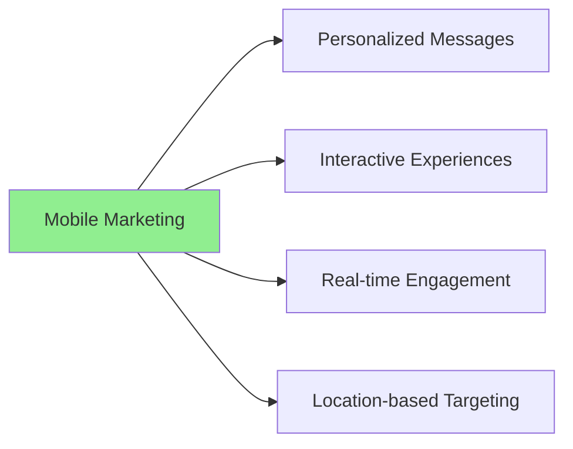
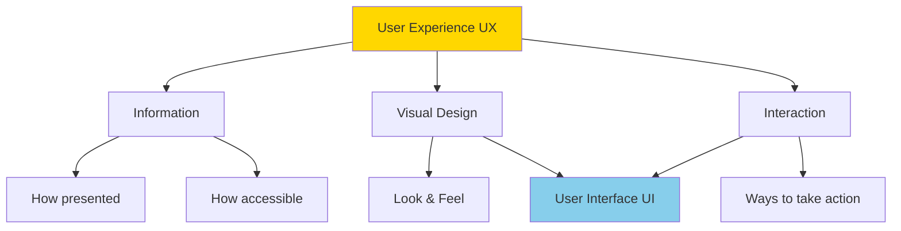
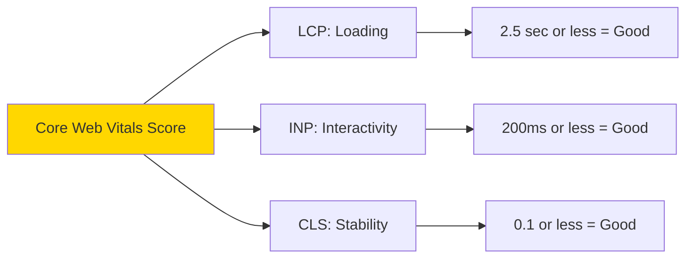
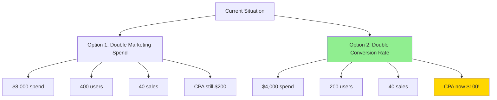
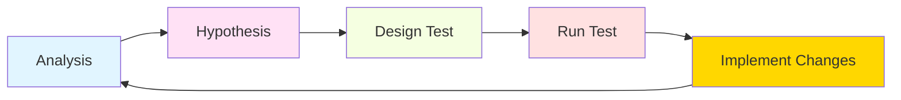
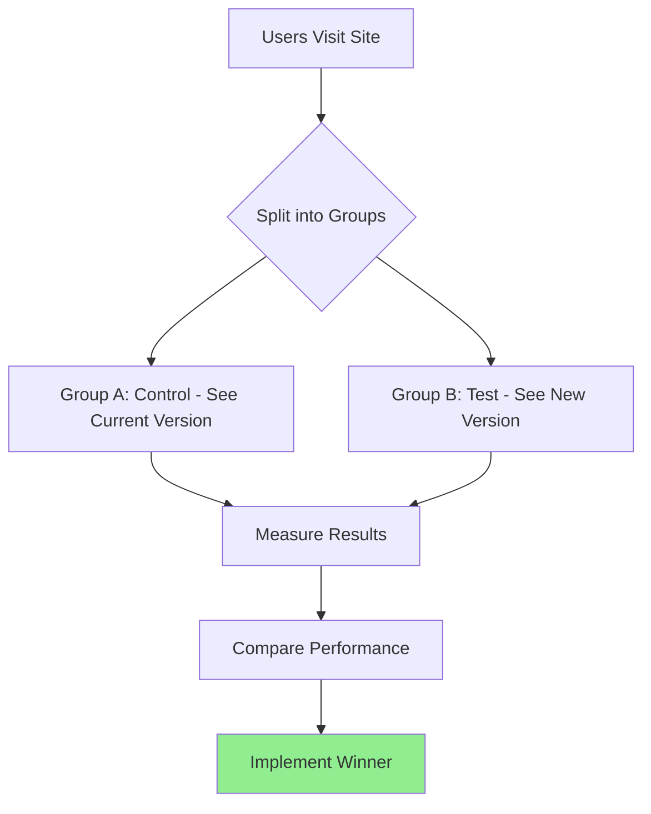
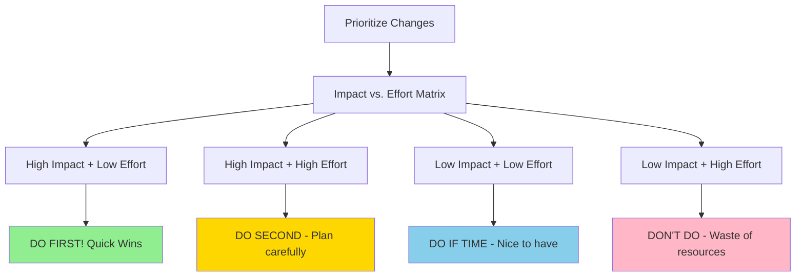

# User Experience & Landing Pages

## Mobile-First Strategy

### Why Mobile First?

**Statistics & Reality:**
- Most research done on mobile
- Critical for reaching target audience at key customer journey points
- Cost-effective way to reach customers with high commercial intent

**Mobile Advantages:**



**Design Approach**: Always design for mobile FIRST, then adapt to desktop
- Get mobile sketches approved first
- Then move to desktop design
- Not the other way around

---

## Digital Assets: Types & Differences

### Types of Digital Assets

**Owned & Operated by You:**
- Website
- Landing page
- Online shop
- App

**Partially Owned (Platform Controls):**
- Facebook page
- YouTube channel
- Social media profiles

**Key Difference**: On your own assets (WordPress website), you control everything. On platform assets (Facebook), the platform dictates design rules.

---

## Website vs. Landing Page

### Core Differences

| Aspect | Website | Landing Page |
|--------|---------|--------------|
| **Purpose** | Exploration | Specific action (conversion) |
| **Content** | Multiple pages, comprehensive | Single focus, one message |
| **Navigation** | Full menu, multiple paths | Minimal/no navigation |
| **Goal** | Inform, showcase brand | Convert (one specific action) |
| **Design** | Brand guidelines, consistent | More design freedom |
| **Updates** | Difficult, many stakeholders | Easy to change quickly |
| **Measurement** | Complex, many metrics | Simple, focused metrics |
| **Audience** | Broad | Targeted, specific |
| **Created For** | General company presence | Specific marketing campaign |

### Landing Page: The Name Origin

**"Landing" because**: It's the first page users "land on" after clicking marketing message
- Email campaign → Landing page
- Social media ad → Landing page
- Newsletter link → Landing page
- Google ad → Landing page

**Example**: Newsletter about Africa tour → Specific tour landing page (not homepage, not general Africa page)

### Landing Page Benefits

1. **Highly Focused**: Single message, single goal
2. **Targeted**: Can create different pages for different audiences (men, women, families, locations)
3. **Easy to Measure**: Fewer places to get lost, clear metrics
4. **Easy to Change**: Just one page, no complex approval processes
5. **Design Freedom**: Can break from strict brand guidelines if needed
6. **Increases Conversion**: Everything geared toward one action

---

## User Experience (UX) Fundamentals

### What is UX?

**Definition**: How users behave in your digital asset
- What do they think when they arrive?
- How do they feel?

**Impact**:
- Good UX → Positive feeling → Affects bottom line positively
- Bad UX → Frustration → Users don't return → Lost revenue

**Bad Examples Still Exist**: Yale School of Arts website (still outdated as of 2 years ago)

### UX Key Pillars



**User Interface (UI)**: The visual design + interaction = what you see and touch

**User Experience (UX)**: The entire field including UI, information architecture, accessibility

---

## Basic UX: The Four Guiding Principles

### 1. Know Your Audience

**What to Know:**

**Demographics:**
- Age
- Gender
- Location
- Income

**Psychographics:**
- Needs
- Habits
- Hobbies
- Fears
- Dreams
- Aspirations

**Why It Matters**:
- Helps focus marketing message
- Informs microcopy decisions
- Affects visual design choices
- Increases conversion rates

**Example**: Landing page for Gen Z ≠ Landing page for Baby Boomers
- Different design aesthetics
- Different button sizes
- Different imagery
- Different language

---

### 2. Loading Time

#### The Problem: TMI (Too Much Information)

**Attention Span Crisis:**
- Average attention span: **Less than a goldfish**
- People have way too much information today
- Decreasing attention spans

**The TikTok Effect:**
- Young people binge-watching short-form content
- Harder to participate in activities without instant gratification
- Fast cuts, quick content
- Not comfortable waiting anymore

**First Impressions Matter**: First time user visits = First date
- Need to make good impression immediately
- No second chance

**What Users Think**: "What's in it for me?" (constantly asking this question)

**The Wheel of Death**: Loading spinners = bad user experience, kills conversion

---

#### Page Load Time Impact

**Average Load Times (Current Reality):**
- Desktop: 2.5 seconds
- Mobile: **8.6 seconds** (very bad!)

**Impact on Organic Rankings:**

| Load Time | Organic Traffic Potential |
|-----------|--------------------------|
| 1 second | 100% |
| 2 seconds | ~95% |
| 3 seconds | ~85% |
| 5 seconds | ~60% |
| 10 seconds | ~30% |

**Impact on Conversion Rate**: Follows similar decline - slower = fewer conversions

**Note**: These aren't absolute values - relative to fastest loading sites

---

#### Core Web Vitals: Google's Standard

**Why Google Sets Standard**: Biggest referrer of organic traffic → websites obsessed with Google ranking

**Three Tests (Core Web Vitals):**



---

##### 1. LCP - Largest Contentful Paint

**What It Measures**: How long until main content loads

**Restaurant Analogy**: How fast did the main course arrive?

**Example - CNN Article Page:**
- Page has: Header, large image, article text
- Main content = The large hero image
- LCP measures: Time until that image appears
- Everything else (footer, sidebar) doesn't matter for this test

**Why It Matters**: Users came for specific content - show it quickly or they leave

**Good Score**: 2.5 seconds or less

---

##### 2. INP - Interaction to Next Paint

**What It Measures**: Website responsiveness to user interactions

**Examples:**
- User clicks button → How long until something happens?
- User presses key → How long until keyboard input registers?
- User clicks menu → How long until menu opens?

**Bad Experience**: Click button, have to wait, see loading spinner

**Good Experience**: Click button, immediate response

**Why It Matters**: Users expect instant feedback - delays cause frustration

**Good Score**: 200 milliseconds or less

---

##### 3. CLS - Cumulative Layout Shift

**What It Measures**: Page stability during loading

**Bad Experience:**
- Scrolling down page
- Elements suddenly shift
- Click on something → page shifts → click wrong thing
- Headache from unstable scrolling

**Good Experience:**
- Smooth scrolling
- Nothing moves unexpectedly
- Stable page layout

**Why It Matters**: Unstable pages frustrate users, cause mistakes

**Good Score**: 0.1 or less

---

#### Testing Core Web Vitals

**Two Tools (Both from Google):**

1. **Lighthouse** (Developer-focused)
   - Built into Chrome browser
   - More technical
   - Detailed breakdown for developers

2. **Web.dev** (Marketing-friendly)
   - Web-based tool
   - Less technical
   - Good for non-developers

**How to Use Lighthouse:**
1. Right-click on webpage
2. Select "Inspect"
3. Find "Lighthouse" tab (top right area)
4. Choose device (mobile/desktop)
5. Choose tests (Performance, Accessibility, Best Practices, SEO)
6. Run analysis

**Important Testing Conditions:**
- Should be done in incognito/private mode
- No Chrome extensions running
- Clear cookies
- Clean environment for accurate results

**Test Results:**
- Score out of 100
- Red/Orange/Green indicators
- Specific recommendations for fixes
- Shows where most points were lost

---

#### Improving Load Time

**Who Handles This:**
- Primarily: Developers
- Sometimes: Marketing team identifies issues
- Tools show what to fix

**Common Fixes:**
- Image optimization (compress before upload)
- Remove unnecessary code
- Reduce plugins (especially WordPress)
- Use CDN (Content Delivery Network)
- Minimize JavaScript

**Platform Differences:**

**Wix:**
- Handles optimization automatically
- Built-in tools for performance
- Less control, but easier

**WordPress:**
- More control
- More responsibility
- Plugins add weight → affects performance
- Lighter templates = better performance

**Priority**: Fix "low-hanging fruit" first - easy fixes with big impact

---

### 3. Design for Scanning (Not Reading)

#### The Reality

**Statistics**: 
- **79% of people don't read - they skim**
- Main thing people DO read: **Headlines**
- Must focus on value propositions

**Design Approach**: Landing pages built with components/blocks for era of scanning

---

#### Landing Page Components

**Essential Elements:**

1. **Headline** (Always included)
   - Most read element
   - Must be compelling
   - Clear value proposition

2. **Sub-headline** (Always included)
   - Supports headline
   - Additional clarity

3. **Hero Image** (Always included)
   - Large, engaging visual
   - Above the fold
   - Attention-grabbing

4. **Lead Form** (If collecting leads)
   - Prominent placement
   - Short and simple
   - Clear what you're collecting

5. **Call to Action Button** (Always included)
   - Clear, visible
   - Action-oriented language
   - Contrasting color

6. **Copy/Text** (Concise)
   - Main features/benefits
   - Not full specifications
   - Scannable format

7. **Testimonials** (Optional but recommended)
   - Social proof
   - Real reviews
   - Builds trust

8. **FAQ Section** (Optional)
   - Addresses concerns
   - Reduces support questions

9. **Secondary CTA** (For long pages)
   - Bottom of page
   - Same as primary CTA
   - Consistent messaging

10. **Footer** (Optional)
    - Links to website
    - Social media
    - Can be fully gated (no footer) or semi-gated

**Note**: Don't need all components - choose what's relevant for your goal

---

#### Above the Fold

**Definition**: Information visible before first scroll

**Origin**: Newspapers folded at newsstand - headline always visible above fold

**Digital Equivalent**: 
- **Mobile**: Very small screen area
- **Desktop**: Larger area
- Information before user scrolls

**Critical Importance**: 
- First impression
- Must provide enough stimulation to scroll
- Convince user page is worth exploring

**What Should Be Above the Fold:**
- Hero image
- Headline
- Sub-headline
- Primary CTA
- Initial value proposition

**Bad Example**: Only hero image and headline above fold - not enough information to engage

**Good Example**: Image + headline + clear offering + CTA visible immediately

---

#### Design Techniques for Scanning

**1. Encapsulation**
- Put important information in "capsules" (boxes/containers)
- Use color contrast
- Makes content impossible to miss

**Example - Maccabi Health**: Lead form in colored capsule with same color as CTA button

**2. False Ending (Mobile)**
- Show partial thumbnail of next section
- User knows to scroll (not design mistake)
- Prevents users from thinking page ended

**Example - Bezeq Electricity**: Desktop shows 3 offerings side by side; mobile shows one with edge of next visible

**3. Visual Hierarchy**
- Larger = more important
- Bold = emphasis
- Color = attention
- White space = breathing room

---

### 4. Clear Call to Action (CTA)

#### What is a CTA?

**Definition**: Prompt encouraging users to take specific action

**Forms:**
- Button (most common)
- Link
- Banner
- Pop-up
- Image with link

**Purpose:**
- Get something from users
- Drive specific action
- Create engagement
- Generate conversions

---

#### CTA Best Practices

**1. Choose ONE Primary Action**
- Highlight your main desired conversion
- Can have secondary option (like Monday.com)
- But make primary action obvious

**2. Give It Button Appearance**
- Should look clickable
- Clear visual affordance
- Not just text link

**3. Use Microcopy**
- Small text above/below button
- Increases conversion rates
- Addresses concerns

**Examples of Effective Microcopy:**
- "No credit card required"
- "Free forever, no credit card"
- "Cancel anytime"
- "100% money-back guarantee"

**4. Button Placement**
- Primary CTA above the fold
- Secondary CTA at bottom (if long page)
- Mobile: Can use floating/sticky CTA (controversial - can be annoying)

**5. Action-Oriented Language**
- NOT generic: "Click here," "Submit," "Send"
- YES specific: "Get Started," "Download Free Guide," "Save My Spot"
- Use audience language

**Example from Trip Company**: 
- Generic: "Submit"
- Better: "Take Me to Africa" (for Africa trip lead form)

**6. Test Button Colors**
- Red = urgency (Western societies)
- But always test - may not work for your audience
- Contrast is most important

---

#### Interactive CTAs

**Engagement Tools Increase Conversion:**

**Example - Wise (FinTech)**:
- Interactive currency calculator
- User plays with numbers
- More engaged
- Higher conversion

**Other Interactive Elements:**
- Calculators
- Quizzes
- Product configurators
- Preview tools
- Live demos

---

## Conversion: Definitions & Metrics

### What is a Conversion?

**Definition**: ANY desired action you want users to take on your digital asset

**Types of Conversions:**

**Major Conversions:**
- Sale/Purchase
- Lead (contact information)
- Registration (webinar, event)
- Subscription (newsletter, service)
- Account creation

**Micro Conversions:**
- "Continue reading" click
- "View product" click
- Page scroll depth
- Video play
- Document download
- Add to cart

**Important**: Conversion is defined by YOU - not always a sale

---

### Conversion Rate

**Formula**: 

```
Conversion Rate = (Number of Conversions / Number of Visitors) × 100%
```

**Example:**
- 200 visitors to landing page
- 20 purchases
- Conversion rate = 10%

---

### Cost Per Action (CPA)

**Formula**:

```
CPA = Total Marketing Spend / Number of Conversions
```

**Example:**
- Spent $4,000 on marketing
- Generated 20 sales
- CPA = $200 per sale

**Importance**: Key benchmark for profitability
- Know how much each conversion costs
- Compare to customer lifetime value
- Determine if marketing is profitable

---

## Conversion Rate Optimization (CRO)

### The Power of CRO: Example

**Scenario**: Boss wants you to double sales



**Current Situation:**
- $4,000 marketing spend
- $20 cost per user
- 200 users
- 10% conversion rate
- 20 sales
- CPA = $200

**Option 1 - Double Marketing Budget:**
- $8,000 marketing spend
- 400 users
- 10% conversion rate (same)
- 40 sales
- CPA = $200 (unchanged)

**Option 2 - Double Conversion Rate:**
- $4,000 marketing spend (same!)
- 200 users (same!)
- 20% conversion rate (improved!)
- 40 sales
- **CPA = $100** (half the cost!)

**Key Insight**: Get more with same resources by optimizing conversion rate

---

### What is CRO?

**Definition**: Increasing conversion rate of existing users - not bringing new traffic

**Methods:**
- Improve text and microcopy
- Improve user experience
- Identify and remove barriers

**Important**: It's a PROFESSION - large marketing teams have dedicated CRO specialists or entire teams

---

### The CRO Cycle (Never-Ending)



**Why Never-Ending**: Always room for improvement - continuous optimization

---

### CRO Benefits

**1. Decreased Acquisition Costs**
- Get same results with less spend
- More efficient marketing

**2. Increased Sales & Profitability**
- Same traffic = more conversions
- Better ROI

**3. Deeper Customer Understanding**
- Process forces you to know audience better
- Identify barriers
- Understand motivations

**4. Competitive Advantage**
- Small business can beat slow-moving giant
- Fast testing and iteration
- Better user experience

**5. No Need to Reinvent the Wheel**
- Small micro improvements
- Incremental changes
- Build on existing foundation

**6. Can Reinvest Profits**
- Use increased profits for marketing expansion
- Growth cycle

---

### Step 1: Analysis

#### Define What You're Measuring

**Key Performance Indicators (KPIs):**
- Number of purchases
- Lead form completions
- Newsletter signups
- Micro conversions (secondary actions)
- Button clicks
- Video views

**Set Timeline:**
- What date range to analyze?
- Remove outliers (system outages, unusual events)
- Account for seasonality
- Consider external factors (wars, holidays, etc.)

---

#### Analysis Tools

**1. Google Analytics**
- Comprehensive data
- User behavior tracking
- Conversion tracking
- Demo account available for practice

**2. Heat Maps**
- Shows most popular page areas
- Visual representation
- Click density
- Attention areas

**3. Scroll Maps**
- Percentage of users reaching different page depths
- Identify where users stop scrolling
- Find content that's never seen

**4. Click Maps**
- What users click on
- What users DON'T click on
- Identify confusion points
- Find ignored elements

**5. Session Recordings**
- Record real user sessions
- Watch how users navigate
- Identify friction points
- See actual behavior

**6. User Labs**
- Bring real users matching personas
- Observe them using your site
- Moderator guides tasks
- Company watches live
- Eye-opening experience

**User Lab Story**: Company sees user completely miss special offer → realize they have problem → fix it

---

### Step 2: Hypothesis

**Based on Analysis, Create Hypotheses:**

**Example Hypotheses:**
- "Users aren't clicking CTA because it's too far down page"
- "Form is too long - reducing fields will increase completions"
- "Hero image doesn't resonate with audience"
- "Checkout process has too many steps"

**What to Test:**
- Text changes
- CTA modifications
- Design updates
- Process simplification
- Image replacements
- Button colors
- Form length
- Page layout

---

### Step 3: Design the Test (A/B Testing)

#### How A/B Testing Works

**Process:**



**Split Options:**
- Can be 50-50 split
- Can be 90-10 (safer - only 10% see test)
- Can be any split you choose

**Software Exists**: Dedicated CRO platforms allow testing on live site without developer involvement

---

#### A/B Testing Principles

**1. Test One Element at a Time**
- Only change one variable
- Otherwise can't determine what worked
- Clear causation

**2. Let Test Run Long Enough**
- Need statistical significance
- Usually 1-4 weeks depending on traffic

**3. Consider Traffic Volume**
- More traffic = faster results
- Low traffic = longer test period

**4. Use Proper Software**
- Google Optimize (free, but discontinued)
- Optimizely
- VWO
- Unbounce
- Many others

---

### Step 4: Popular A/B Test Ideas

#### 1. Hero Images

**Why Test**: 
- Central, attention-grabbing
- Located at top (above fold)
- Conveys brand language
- Major impact on conversion

**Types of Hero Images:**
- **Benefits-focused**: Shows product benefit
- **Emotion-focused**: Evokes feeling
- **Founder-focused**: Human connection
- **Action shots**: Product in use
- **Before/After**: Transformation

**Image Best Practices - DO:**
- ✅ Make it large and sharp
- ✅ Use high resolution
- ✅ Make it relevant to audience
- ✅ Show real people (if using people)
- ✅ Consider diversity/inclusivity

**Image Best Practices - DON'T:**
- ❌ Use stock photos (people recognize them)
- ❌ Use obvious AI-generated images
- ❌ Overload with text
- ❌ Use low quality/pixelated images
- ❌ Show wrong target audience

**Example**: Women's product with male in hero image → immediate disconnect

**Impact**: Small hero image change can create significant conversion lift

---

#### 2. Forms Optimization

**Problem**: Forms are painful - every field is a barrier

**Solutions:**

**A. Split the Process**
- Multi-step forms
- One screen at a time
- Progress indicator
- Feels less overwhelming

**B. Real-Time Validation**
- Check fields as user types
- Immediate feedback
- Don't wait until end

**Bad Experience**:
- Complete 4-step form
- Click submit
- "Email field incorrect"
- Must go back
- Frustration → abandonment

**Good Experience**:
- Type email
- Immediate validation: "Email format correct ✓"
- Or: "Please enter valid email ✗"
- Fix immediately
- Smooth process

**C. Adapt Touchpad (Mobile)**
- Email field → Show email keyboard
- Phone number → Show numeric keypad
- Date → Show calendar picker
- Not adapting = annoying user experience

---

#### 3. Headlines & Microcopy

**Test Different:**
- Main headline text
- Sub-headline variations
- Button text ("Submit" → "Get My Free Guide")
- Microcopy near CTA
- Benefits copy
- Feature descriptions

**Example - Benefits Section Test:**
- Functional benefits focus
- Emotional benefits focus
- Social benefits focus
- Mix of different benefit types

---

#### 4. Reviews & Testimonials

**If None Exist:**
- Add them! Huge conversion boost
- Social proof is powerful
- Builds trust

**If They Exist:**
- Polish them
- Make them feel real (not generic)
- Add photos
- Include full names
- Add context (location, business, situation)
- Link to sources (TripAdvisor, Google Reviews)

**What to Include:**
- Review aggregation scores
- TripAdvisor rating
- Google review score
- Industry certifications
- Awards/recognition

---

#### 5. CTA Button Colors

**Research Findings:**
- **Red**: Urgency in Western societies
- But: Always test for your audience
- Cultural differences matter
- Brand colors may override

**Most Important**: **Contrast**
- Button must stand out
- Don't blend into page
- Color less important than visibility

**Test Variations:**
- Different colors
- Different sizes
- Different positions
- Different text

---

#### 6. Creating Sense of Urgency

**Three Authentic Ways:**

**A. Limited Supply**
- "Only 3 tickets left at this price"
- "2 seats remaining"
- Must be TRUE

**B. Limited Time**
- "Discounted tickets until July 1"
- "Early bird pricing ends Friday"
- Clear deadline

**C. Limited Event**
- "Father's Day is approaching"
- "Black Friday sale"
- "Seasonal offer"

**About Booking.com Style Urgency:**
- "3 people looking at this hotel right now"
- "Last booked 5 minutes ago"
- Questionable authenticity
- Can work but risks trust if discovered as fake

**Key Principle**: Urgency is powerful motivator IF DONE WELL
- Must be authentic
- Must be verifiable
- Don't be sneaky
- Builds trust, not destroys it

**Impact**: Can provide **+10% conversion rate** boost when done authentically

---

#### 7. Multiple Payment Options

**Why Test**: Payment barriers kill conversions

**Options to Offer:**
- Credit cards (Visa, Mastercard, Amex)
- PayPal
- Apple Pay
- Google Pay
- Buy Now, Pay Later (Klarna, Afterpay)
- Bank transfer
- Digital wallets
- Cryptocurrency (depending on audience)

**More Options = Higher Conversion Rate**

**Considerations:**
- Transaction fees for each method
- Integration complexity
- Regional preferences
- Target audience payment habits

---

### Step 5: Learning & Improvements

#### Implementation Strategy

**After Testing:**
- Have conclusions from tests
- Need to implement changes
- Requires prioritization

**Who's Involved:**
- Marketing team (identifies needs)
- IT/Developers (implements changes)
- Webmaster (manages site)
- Design team (creates assets)

---

#### Prioritization Framework

**Focus on "Low-Hanging Fruit":**



**Priority 1 - Immediate Action (Critical Barriers):**
- Payment system not working (PayPal integration broken)
- Form submission failing
- CTA button not clickable
- Site completely broken on mobile
- Security issues

**Priority 2 - High Impact, Easy Fixes:**
- Button color change
- Headline text update
- Microcopy additions
- Image swap
- Form field reduction

**Priority 3 - High Impact, Complex Fixes:**
- Complete checkout process redesign
- Major layout changes
- New feature development
- Platform migration

**Priority 4 - Low Priority:**
- Minor text changes with minimal impact
- Cosmetic updates
- Nice-to-have features

---

#### Implementation Considerations

**Developer Workload:**
- Don't interrupt critical work for minor changes
- Batch small changes together
- Schedule major changes appropriately
- Emergency fixes = immediate
- Design improvements = can wait for sprint

**Testing After Implementation:**
- Verify changes work correctly
- Check on multiple devices
- Test on different browsers
- Monitor conversion rate impact
- Continue measuring

**Continuous Cycle:**
- Implementation → Monitoring → Analysis → New Hypothesis → New Test
- Never truly "done"
- Always room for improvement

---

## Key Terminology Reference

| Term | Definition | Example |
|------|------------|---------|
| **Above the Fold** | Content visible before scrolling | Headline, hero image, primary CTA |
| **Hero Image** | Large, central attention-grabbing image at top of page | Product photo, lifestyle image, founder photo |
| **CTA** | Call to Action - prompt for specific user action | "Get Started," "Download Now," "Buy Today" |
| **Microcopy** | Small text supporting main message or CTA | "No credit card required," "Free forever" |
| **Conversion** | Any desired action on digital asset | Sale, lead, signup, download, click |
| **Conversion Rate** | Percentage of visitors who convert | 20 sales / 200 visitors = 10% |
| **CPA** | Cost Per Action - cost to acquire one conversion | $4,000 spend / 20 sales = $200 CPA |
| **CRO** | Conversion Rate Optimization | Process of improving conversion rate |
| **A/B Test** | Comparing two versions to see which performs better | Control vs. Test version |
| **LCP** | Largest Contentful Paint - main content load time | How fast hero image loads |
| **INP** | Interaction to Next Paint - responsiveness | Click to response time |
| **CLS** | Cumulative Layout Shift - page stability | Elements shifting during load |
| **Core Web Vitals** | Google's page experience metrics | LCP + INP + CLS combined |
| **Heat Map** | Visual showing popular areas on page | Red = most activity, blue = least |
| **Landing Page** | Single-focus page for specific campaign | Product launch page, lead gen page |

---

## Tools & Resources

### Testing & Analysis Tools

**Core Web Vitals Testing:**
- **Lighthouse** (Built into Chrome - Developer focused)
  - Right-click → Inspect → Lighthouse tab
- **Web.dev** (Google's web-based tool - Marketing friendly)
  - https://web.dev

**Analytics & Behavior:**
- **Google Analytics** (Demo account available)
- **Heat Map Tools** (various vendors)
- **Scroll Map Tools**
- **Click Map Tools**
- **Session Recording Software**

**A/B Testing Platforms:**
- Google Optimize (discontinued but mentioned)
- Optimizely
- VWO (Visual Website Optimizer)
- Unbounce
- Others (various vendors)

**Landing Page Builders:**
- Wix
- WordPress
- Unbounce
- Leadpages
- Others

---

## Real-World Examples

### Partner (Telco Company)

**Landing Page for Fiber Internet:**
- Header (risky - can navigate away)
- Headline + Sub-headline
- Special offer: "Join online"
- Lead form above fold
- Encourages scrolling for more info

### Monday.com

**Desktop Landing Page:**
- Multiple team options
- Primary CTA: "Get Started"
- Secondary CTA: "Contact Sales"
- Smart microcopy: "No credit card needed"
- Clear priority (primary CTA more prominent)

### Bezeq (Telco Electricity)

**Mobile Design Excellence:**
- Desktop: 3 offerings side-by-side
- Mobile: Stacked with "false ending"
- Edge of next section visible
- Clear visual cue to scroll
- Excellent mobile-first thinking

### Maccabi Health (Israeli HMO)

**Encapsulation Strategy:**
- Lead form in colored capsule
- Same color as CTA button
- Impossible to miss
- High contrast
- Effective use of visual hierarchy

---

## Practical Tips Summary

### For Building Landing Pages

**Design:**
1. Start with mobile design first
2. Put most important info above the fold
3. Use encapsulation for key elements
4. Create false endings on mobile
5. Use high-quality, relevant hero images
6. Ensure fast load times (< 2.5 sec ideal)

**Content:**
7. Write for scanners, not readers
8. Use clear, compelling headlines
9. Add strategic microcopy
10. Keep forms short (max 3 steps)
11. Include social proof (testimonials, reviews)
12. Create authentic urgency when possible

**Conversion:**
13. Have ONE clear primary CTA
14. Make CTA look like button
15. Use action-oriented, specific language
16. Test button colors and placement
17. Offer multiple payment options
18. Validate forms in real-time

### For Running CRO

**Process:**
1. Define KPIs before starting
2. Analyze behavior with proper tools
3. Create clear hypotheses
4. Test ONE element at a time
5. Use proper A/B testing software
6. Let tests run long enough
7. Prioritize low-hanging fruit
8. Implement winners quickly
9. Continue the cycle

---

## Common Mistakes to Avoid

### Landing Page Mistakes

❌ **Don't:**
- Use generic CTAs ("Click here," "Submit")
- Make forms too long
- Use stock photos or obvious AI images
- Put all important info below the fold
- Have slow loading times
- Use confusing navigation
- Overload with text
- Forget mobile optimization
- Neglect real-time form validation
- Create fake urgency

✅ **Do:**
- Use specific, action-oriented CTAs
- Keep forms minimal (3 fields max)
- Use authentic, high-quality images
- Put key info above the fold
- Optimize for fast loading
- Minimize navigation (single focus)
- Write scannable content
- Design mobile-first
- Validate forms as users type
- Create authentic urgency only

---

### CRO Mistakes

❌ **Don't:**
- Test multiple elements simultaneously
- Make decisions without data
- Stop testing after one success
- Ignore statistical significance
- Skip hypothesis stage
- Implement changes without testing
- Forget about mobile users
- Test in dirty environment
- Overlook user lab insights
- Prioritize complex changes over quick wins

✅ **Do:**
- Test one element at a time
- Base decisions on data
- Continue testing cycle
- Wait for significant results
- Create clear hypotheses
- Test before implementing
- Test mobile separately
- Use clean testing environment
- Act on user feedback
- Fix low-hanging fruit first

---

## Key Takeaways

1. **Mobile First is Non-Negotiable**
   - Most users on mobile
   - Design mobile first, then desktop
   - Test on mobile separately

2. **Speed Matters Tremendously**
   - 2.5 seconds or less load time ideal
   - Affects ranking and conversion
   - Core Web Vitals = crucial

3. **People Scan, Not Read**
   - Design for scanning
   - Use visual hierarchy
   - Encapsulation is powerful

4. **CTA is Critical**
   - Clear, specific, action-oriented
   - Use microcopy strategically
   - Test everything about it

5. **CRO is Continuous**
   - Never truly "done"
   - Always room for improvement
   - Small changes = big impact

6. **Test Before Implementing**
   - Don't guess - test
   - Data over opinions
   - One element at a time

7. **Prioritize Intelligently**
   - Low-hanging fruit first
   - Critical barriers immediately
   - Complex changes planned carefully

8. **Authenticity Builds Trust**
   - Real urgency works
   - Fake urgency destroys trust
   - Real testimonials resonate

