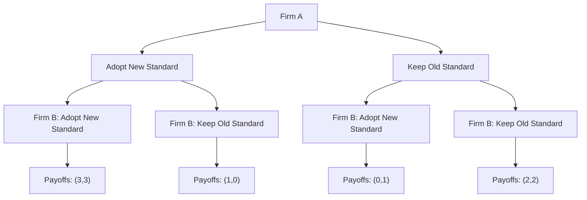
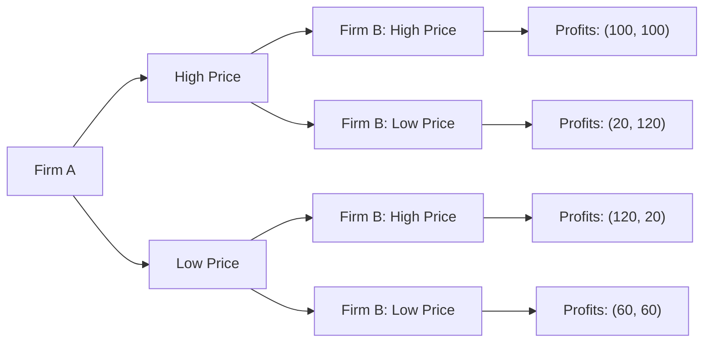
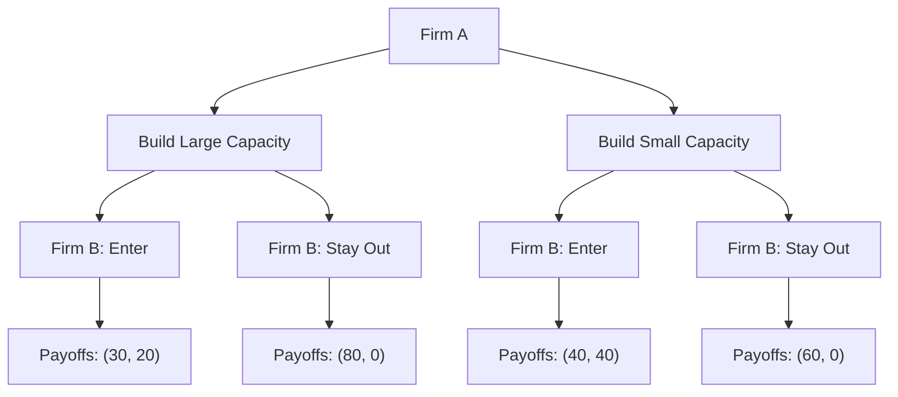
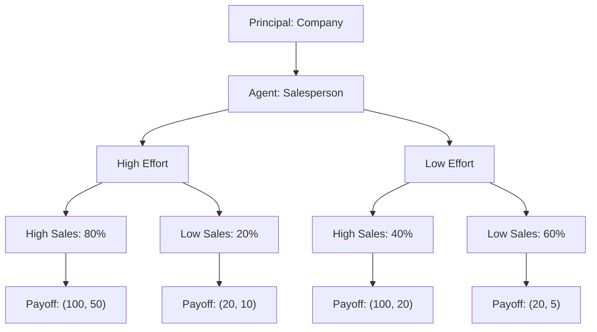

# Game Theory: Strategic Decision Making

## Table of Contents
1. [Introduction to Game Theory](#introduction-to-game-theory)
2. [Basic Concepts](#basic-concepts)
3. [Nash Equilibrium](#nash-equilibrium)
4. [Prisoner's Dilemma](#prisoners-dilemma)
5. [Sequential Games](#sequential-games)
6. [Commitment Strategies](#commitment-strategies)
7. [Mixed Strategies](#mixed-strategies)
8. [Business Applications](#business-applications)
9. [Key Takeaways](#key-takeaways)

---

## Introduction to Game Theory

Game theory is a mathematical framework for analyzing strategic interactions between rational decision-makers. It provides tools to understand how individuals, firms, and organizations make decisions when their outcomes depend on the choices of others.

### Why Game Theory Matters in Business

- **Strategic Planning**: Understanding competitor behavior and market dynamics
- **Negotiation**: Optimizing outcomes in multi-party negotiations
- **Pricing Strategy**: Setting prices in competitive markets
- **Auction Design**: Creating effective bidding mechanisms
- **Contract Design**: Structuring agreements to align incentives

---

## Basic Concepts

### Players
Rational decision-makers who choose strategies to maximize their payoffs.

### Strategies
Complete plans of action that specify what a player will do in every possible situation.

### Payoffs
The utility or value that players receive from different outcomes.

### Information
What players know about the game, other players, and their strategies.

### Game Forms
- **Simultaneous Games**: Players choose strategies at the same time
- **Sequential Games**: Players move in a specific order
- **Perfect Information**: All players know all previous moves
- **Imperfect Information**: Some information is hidden

---

## Nash Equilibrium

A Nash Equilibrium is a set of strategies where no player can improve their payoff by unilaterally changing their strategy, given what the other players are doing.

### Key Properties
- **Stability**: No player has an incentive to deviate
- **Mutual Best Response**: Each player's strategy is optimal given others' strategies
- **Self-Enforcing**: No external enforcement needed

### Example: Coordination Game

Consider two firms deciding whether to adopt a new technology standard:



**Payoff Matrix:**
|                | Firm B: Adopt | Firm B: Keep |
|----------------|---------------|--------------|
| **Firm A: Adopt** | (3, 3)        | (1, 0)       |
| **Firm A: Keep**  | (0, 1)        | (2, 2)       |

**Nash Equilibria:**
- (Adopt, Adopt): Both firms adopt the new standard
- (Keep, Keep): Both firms keep the old standard

---

## Prisoner's Dilemma

The Prisoner's Dilemma illustrates how individual rationality can lead to collectively suboptimal outcomes.

### Classic Setup
Two suspects are arrested and interrogated separately. They can either:
- **Cooperate**: Stay silent (help each other)
- **Defect**: Confess (betray the other)

### Payoff Matrix
|                | Suspect B: Cooperate | Suspect B: Defect |
|----------------|---------------------|-------------------|
| **Suspect A: Cooperate** | (-1, -1)            | (-10, 0)          |
| **Suspect A: Defect**    | (0, -10)            | (-5, -5)          |

### Key Insights
- **Dominant Strategy**: Defect is optimal regardless of the other's choice
- **Nash Equilibrium**: (Defect, Defect) with payoffs (-5, -5)
- **Pareto Optimal**: (Cooperate, Cooperate) with payoffs (-1, -1)
- **Dilemma**: Individual rationality leads to worse collective outcome

### Business Applications

#### Price Competition


**Payoff Matrix (Profits in millions):**
|                | Firm B: High Price | Firm B: Low Price |
|----------------|-------------------|-------------------|
| **Firm A: High Price** | (100, 100)        | (20, 120)         |
| **Firm A: Low Price**  | (120, 20)         | (60, 60)          |

**Analysis:**
- **Nash Equilibrium**: (Low Price, Low Price)
- **Collusive Outcome**: (High Price, High Price)
- **Individual Incentive**: Each firm wants to undercut the other

---

## Sequential Games

In sequential games, players move in a specific order, and later players can observe earlier moves.

### Game Tree Representation
```mermaid
graph TD
    A[Player 1] --> B[Enter Market]
    A --> C[Stay Out]
    B --> D[Player 2: Accommodate]
    B --> E[Player 2: Fight]
    C --> F[Payoffs: (0, 100)]
    D --> G[Payoffs: (50, 50)]
    E --> H[Payoffs: (-10, 20)]
```

### Backward Induction
1. **Step 1**: Analyze Player 2's decision at each node
2. **Step 2**: Determine Player 2's optimal response
3. **Step 3**: Work backward to Player 1's decision
4. **Step 4**: Find the subgame perfect equilibrium

### Example: Market Entry Game

**Scenario**: A new firm considers entering a market dominated by an incumbent.

**Payoff Matrix:**
|                | Incumbent: Accommodate | Incumbent: Fight |
|----------------|----------------------|------------------|
| **Entrant: Enter** | (50, 50)             | (-10, 20)        |
| **Entrant: Stay Out** | (0, 100)            | (0, 100)         |

**Analysis:**
- If Entrant enters, Incumbent prefers to accommodate (50 > 20)
- Knowing this, Entrant should enter (50 > 0)
- **Subgame Perfect Equilibrium**: (Enter, Accommodate)

---

## Commitment Strategies

Commitment involves taking actions that limit future options to influence other players' behavior.

### Types of Commitments

#### 1. Credible Commitments
- **Sunk Costs**: Investments that cannot be recovered
- **Contracts**: Binding agreements with penalties
- **Reputation**: Long-term relationships and trust

#### 2. Commitment Devices
- **Capacity Investment**: Building excess capacity to signal commitment
- **Price Guarantees**: Promising to match competitors' prices
- **Exclusive Contracts**: Locking in suppliers or customers

### Example: Capacity Commitment



**Analysis:**
- Large capacity signals commitment to fight entry
- Firm B is deterred from entering when Firm A builds large capacity
- **Equilibrium**: (Large Capacity, Stay Out)

---

## Mixed Strategies

When pure strategies don't yield a Nash equilibrium, players may randomize their choices.

### Definition
A mixed strategy is a probability distribution over pure strategies.

### Example: Matching Pennies

|                | Player B: Heads | Player B: Tails |
|----------------|----------------|-----------------|
| **Player A: Heads** | (1, -1)        | (-1, 1)         |
| **Player A: Tails** | (-1, 1)        | (1, -1)         |

**Mixed Strategy Equilibrium:**
- Each player chooses Heads with probability 0.5
- Expected payoff for each player: 0

### Business Application: Random Auditing

**Scenario**: Tax authority must decide how often to audit taxpayers.

**Payoff Matrix:**
|                | Taxpayer: Honest | Taxpayer: Cheat |
|----------------|------------------|-----------------|
| **Authority: Audit** | (-10, -5)       | (20, -15)       |
| **Authority: Don't Audit** | (0, 0)         | (-30, 10)       |

**Mixed Strategy Solution:**
- Authority audits with probability p = 0.4
- Taxpayer cheats with probability q = 0.25
- **Equilibrium**: Randomization makes each strategy equally attractive

---

## Business Applications

### 1. Pricing Strategy

#### Bertrand Competition
- Firms compete on price
- **Nash Equilibrium**: Price equals marginal cost
- **Insight**: Even with few competitors, prices may be competitive

#### Cournot Competition
- Firms compete on quantity
- **Nash Equilibrium**: Each firm produces less than monopoly quantity
- **Insight**: Market power depends on number of competitors

### 2. Auction Design

#### Types of Auctions
- **English Auction**: Ascending bids, open outcry
- **Dutch Auction**: Descending bids, first to bid wins
- **First-Price Sealed Bid**: Highest bid wins, pays own bid
- **Second-Price Sealed Bid**: Highest bid wins, pays second-highest bid

#### Revenue Equivalence Theorem
Under certain conditions, all auction formats yield the same expected revenue.

### 3. Contract Theory

#### Principal-Agent Problems
- **Moral Hazard**: Hidden actions after contract signing
- **Adverse Selection**: Hidden information before contract signing
- **Solution**: Incentive-compatible contracts

#### Example: Sales Commission


**Optimal Contract:**
- Base salary: $10
- Commission: $40 per sale
- **Result**: Agent chooses high effort (expected utility: 50 > 20)

---

## Key Takeaways

### 1. Strategic Thinking
- Always consider how others will respond to your actions
- Think multiple steps ahead
- Anticipate and influence others' behavior

### 2. Commitment Power
- Credible commitments can change the game
- Sunk costs and reputation matter
- Sometimes limiting options improves outcomes

### 3. Information Matters
- What you know affects your strategy
- What others know affects their strategy
- Information asymmetry creates opportunities

### 4. Cooperation vs. Competition
- Individual rationality ≠ collective rationality
- Repeated interactions enable cooperation
- Reputation and trust are valuable assets

### 5. Practical Applications
- **Negotiation**: Understand the other party's alternatives
- **Pricing**: Consider competitive responses
- **Investment**: Think about strategic implications
- **Contracts**: Design incentive-compatible agreements

---

## Conclusion

Game theory provides a powerful framework for understanding strategic interactions in business. By analyzing the incentives and constraints of all players, managers can make better decisions and achieve more favorable outcomes. The key is to think strategically, consider multiple scenarios, and understand that your success often depends on how others respond to your actions.

Remember: In strategic situations, the best strategy depends on what others are doing. Game theory helps you anticipate their moves and choose your response accordingly.
