# Middle East Economics

## 🇮🇱 Israel 1948–1989: Economic History

### Overview
Israel's economic development from 1948-1989 represents one of the most remarkable transformations in modern economic history, evolving from a socialist-oriented economy to a high-tech powerhouse.

### Key Economic Periods

## 📈 Economic Growth Analysis

### GDP Growth by Period
- **1950-1972**: 5.67% annual growth (7th highest globally)
- **1973-1989**: Much slower growth due to wars and inflation
- **1990-2000**: Recovery with Russian immigration boom

### GDP per Capita vs. US Comparison
- **1950**: $4,490 PPP
- **1975**: Peak ratio to US GDP (62.3%)
- **2018**: $32,955 PPP (633% increase from 1950)

## 🏭 Industrial Development Phases

### 1. Mandate Period (1922-1947)
- **Growth Rate**: 4.9% annually
- **Key Industries**: Orange industry, WWII manufacturing
- **Foundation**: Strong economic base before statehood

### 2. Socialist Phase (1948-1972)

**Key Characteristics:**
- Government and Histadrut controlled major sectors
- Nationalized key firms from Mandate period
- Created state companies (e.g., El Al Airlines)
- Strong labor union influence

### 3. Transition Period (1973-1989)
- **Challenges**: Wars, inflation, economic stagnation
- **Failed Liberalization**: Likud's 1977 reforms stalled
- **Banking Crisis**: 1983 collapse led to bank nationalization

```mermaid
graph TD
    A[Transition Period 1973-1989] --> B[Yom Kippur War 1973]
    A --> C[Inflation Crisis 1979-1985]
    A --> D[Banking Crisis 1983]
    A --> E[Failed Liberalization 1977]
    
    B --> F[Economic Shock]
    B --> G[Defense Spending ↑]
    
    C --> H[7 Years >100% Inflation]
    C --> I[Peak 440% in 1984]
    C --> J[Stabilization Plan 1985]
    
    D --> K[Bank Shares Crash]
    D --> L[Government Nationalization]
    
    E --> M[Likud Reforms Stalled]
    E --> N[Political Resistance]
    
    style A fill:#E6F3FF
    style B fill:#FFE6E6
    style C fill:#FFE6E6
    style D fill:#F0E6FF
    style E fill:#E6FFE6
```

### 4. Capitalist Phase (1990-2025)
- **Russian Immigration**: 800,000 people (1990-1996) = 14% population increase
- **Privatization Wave**: Major state companies sold to private sector
- **Histadrut Decline**: Lost 76% of members by 1997

## 💧 Water Innovation Revolution

### National Water Infrastructure

### Key Water Achievements
1. **National Water Carrier (1953-1964)**: Redistributed water from north to south
2. **Drip Irrigation**: Simcha Blass innovation → Netafim (1965) → $1.5B sale (2017)
3. **Desalination**: 5 plants built since 2008, 2 more planned
4. **Wastewater Recycling**: 85% rate (world's highest)

### Environmental Impact
- **Dead Sea Shrinkage**: National Water Carrier reduced Jordan River flow
- **Water Security**: Israel no longer depends on rain for water supply

## 🏭 Industrial Development & Failures

### Successful Industries
- **Chemicals**: Dead Sea potash extraction (continues from Mandate period)
- **Diamonds**: Still 4.5% of exports (down from dominance in 1948)
- **Defense**: Merkava tank (1979), 10th largest arms exporter globally

### Failed Ventures
- **Autocars**: First Israeli car company (Sussita, Sabra sports car) - closed 1981
- **Better Place**: Electric car battery-swapping system - $850M loss, bankruptcy 2013

### High-Tech Beginnings
- **Elron (1962)** → **Elbit (1966)** → **Elscint** (medical tech, sold to GE & Philips)
- **Intel R&D Center (1974)**: Dov Frohman convinced Intel to build in Haifa
- **8088 Chip**: Developed for IBM PC

## 💊 Pharmaceutical Success: Teva

## 🛡️ Defense Industry Development

### Key Milestones
- **Six-Day War (1967)**: French arms embargo boosted local defense industry
- **Yom Kippur War (1973)**: Massive defense spending (50-66% of GDP)
- **Lavi Fighter Jet (1987)**: Cancelled under US pressure → 6,000 engineers joined civilian tech

### Modern Defense Exports
- **10th Largest Arms Exporter** globally
- **Abraham Accords & Ukraine War**: Increased exports
- **Cyber Technologies**: Strategic advantage from Unit 8200 veterans

## 📱 High-Tech Sector Evolution

### Unit 8200 Impact
- **Technical Training**: Advanced skills from military service
- **Startup Founders**: 1,000+ companies founded by Unit 8200 veterans
- **Cybersecurity Leadership**: Global advantage in cyber technologies

### Major Success Stories

### Key Companies
- **Check Point**: Firewall pioneer, $24B market cap, 6,000 employees
- **Palo Alto Networks**: Founded by Nir Zuk (Unit 8200), global cybersecurity leader
- **Cyera**: Data security in clouds, $6B valuation (2025)

### Controversial Technologies
- **NSO Group**: Pegasus spyware, criticized for authoritarian regime use
- **Israeli Police**: Alleged domestic use of surveillance technology

## 🏦 Banking & Financial Sector

### Banking Crisis (1983)
- **Stock Market Collapse**: Major banks' shares crashed
- **Government Intervention**: Nationalized 4 major banks
- **Reforms**: Brodet Commission (1995) forced banks to sell non-bank assets

### Modern Banking
- **Bachar Reform (2006)**: Banks sold mutual/provident funds
- **One Zero Bank (2022)**: First new bank in 43 years
- **Full Privatization**: Bank Leumi fully privatized (2018)

## 🌍 Regional Economic Relations

### West Bank & Gaza Economy

### Economic Integration Features
- **Currency Union**: Shekel used as primary currency
- **Customs Union**: No tariffs between Israel and PA, 3% Israeli commission
- **Labor Market**: 140,000 Palestinians worked in Israel pre-war
- **Trade Dependency**: 85% of PA exports go to Israel

### Development Disparities
- **West Bank**: Higher development, better infrastructure
- **Gaza**: Limited development, high unemployment (44%)
- **Population**: ~5 million combined in WB & Gaza

## 📊 Key Economic Indicators

### Historical Performance
- **1922-1972**: 6.41% average annual growth (higher than Japan, Sweden)
- **Inflation Crisis**: 7 consecutive years >100% (1979-1985), peak 440% (1984)
- **Current Status**: High-tech driven economy, 19th in UN HDI rankings

### Modern Challenges
- **Housing Costs**: 2011 protests over cost of living (led to limited reforms)
- **Income Inequality**: High-tech sector creates wealth disparities
- **Inflation**: 2023 spike to 5.3%, controlled through monetary policy (still much less than 1980s rates)
- **Current Agriculture**: Only 1.2% of GDP (2023), but agritech sector thriving
- **Major High-Tech Hub**: Tel Aviv is the primary location for Israeli high-tech

## 🔄 Economic Reforms & Liberalization

### 1990s Transformation
- **Privatization Wave**: Paz (1988), Israel Chemicals (1992), Bezeq (2005)
- **Histadrut Decline**: Health services separated (1994), lost economic power
- **Market Liberalization**: Cellphone reform (2012), Open Skies agreement

### Infrastructure Development
- **Transportation**: Kvish 6 highway (2002), electric trains (2018+), light rail
- **Ports**: Bayport Haifa (2021), operated by China (led to lower prices on imported appliances)
- **Energy**: Natural gas discoveries (Tamar 2013, Leviathan 2019)
- **Telecommunications**: Cellphone market reform (2012) broke up cartel, saved money for consumers
- **Aviation**: Open Skies agreement (2012) with EU increased tourism and trade

## 📚 Exam Key Points

### Critical Periods
1. **1950-1972**: Highest economic growth (5.67% annually)
2. **1949-1952**: Austerity period due to mass immigration
3. **1967**: Six-Day War economic boom vs. 1973 Yom Kippur War stagnation
4. **1979-1985**: Seven years of >100% inflation
5. **1990-1996**: Russian immigration transformation

### Key Success Factors
- **Water Innovation**: Drip irrigation, desalination, wastewater recycling
- **Military Technology**: Defense industry → civilian high-tech transition
- **Unit 8200**: Technical training → startup ecosystem
- **Immigration**: Skilled workforce from multiple waves

### Economic Comparisons
- **vs. US GDP**: Peak ratio 62.3% (1975), then declined
- **vs. Regional**: Higher HDI than Jordan, Lebanon; lower than developed nations
- **Growth Ranking**: 7th globally (1950-1972), then slowed

