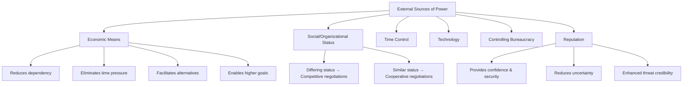
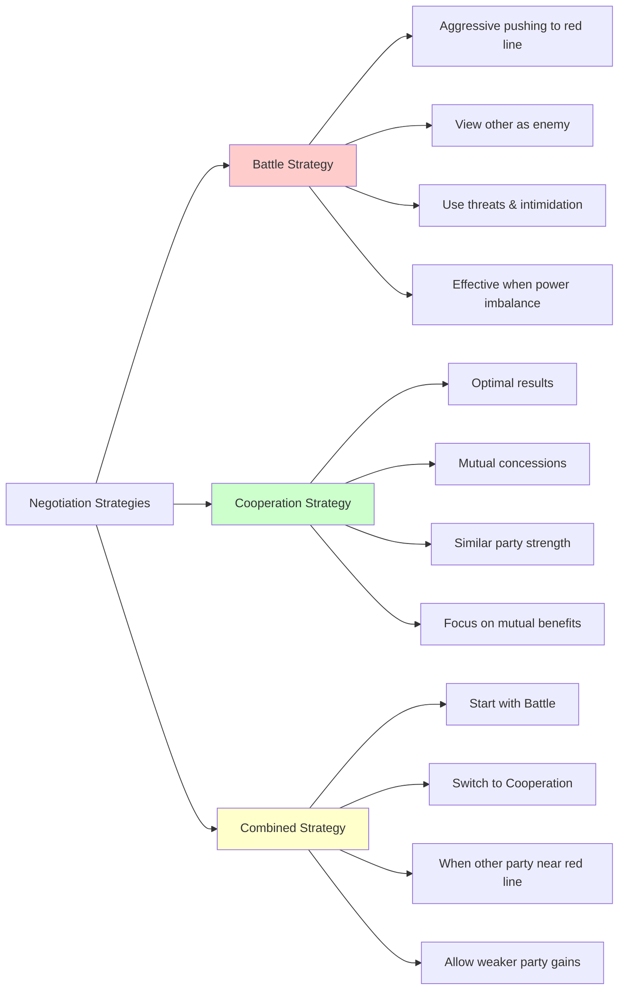
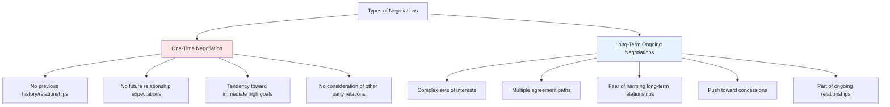

# Cross-Cultural Negotiations: Comprehensive Study Guide

## Table of Contents
1. [Sources of Power in Negotiations](#sources-of-power-in-negotiations)
2. [Negotiation Strategies](#negotiation-strategies)
3. [Negotiation Tactics](#negotiation-tactics)
4. [Stages of the Negotiation Process](#stages-of-the-negotiation-process)
5. [Communication and Information](#communication-and-information)
6. [Emotions and Moods in Negotiations](#emotions-and-moods-in-negotiations)
7. [Cross-Cultural Negotiations: Focus on China](#cross-cultural-negotiations-focus-on-china)
8. [Individualistic vs. Collectivistic Negotiation Behavior](#individualistic-vs-collectivistic-negotiation-behavior)
9. [Exam Preparation Guide](#exam-preparation-guide)

---

## Sources of Power in Negotiations

Power is the ability to control people, situations, and negotiation outcomes. This capability depends on:
- **Willingness** to use power
- **Knowledge** of relevant power sources
- **Ability** to utilize these power sources

**Critical Distinction**: Real control over power sources vs. subjective perception of control by either party.

### External Sources of Power

#### 1. Economic Means
- Reduces dependency on the other party
- Eliminates time pressure
- Facilitates alternative options to negotiations
- Enables achieving higher goals

#### 2. Social/Organizational/Political Status
- Using status to impose solutions
- Different status levels typically lead to competitive negotiations with multiple attempts to impose solutions
- Similar status levels among negotiation managers push toward cooperative negotiations

#### 3. Time Control
- Controlling the timing and pace of negotiations
- Setting deadlines and schedules

#### 4. Technology
- Can provide new solutions and alternatives

#### 5. Controlling Bureaucracy
- When a negotiating party controls bureaucratic systems
- When alternatives to negotiations mean getting entangled in bureaucracy for the other party

#### 6. Reputation
- High reputation provides confidence and security to the other party
- Reduces uncertainty for the other party
- When a party is known for following through on threats, the effect is more pronounced

### Internal Sources of Power

#### 1. Alternatives to Negotiations
- Parties with more alternatives show less dependency
- Negotiations become less critical, leading to better outcomes

#### 2. Coalition
- Binding multiple partners as an integrated negotiating party
- Increases resources, allows better risk distribution, provides mutual support
- Enables achieving higher goals and managing riskier moves
- **Risk**: Internal disagreements can lead to "divide and conquer" tactics by the other party

#### 3. Investment & Commitment
- **"Addiction Phenomenon"**: The more resources (money, time, effort) invested, the more willing a party becomes to make concessions
- **Relationship Commitments**: Commitments to relationships or outcomes weaken the committed party

#### 4. Information
- Knowledge about prices for other buyers, production scales, sales volumes, cost prices, customer complaints
- Critical in supplier-buyer negotiations

### Personal Sources of Power

#### 1. Weakness
- Weak negotiators have nothing to lose, making it difficult to change their position
- Weakness generates public/media sympathy that can be utilized
- Example: Party A doesn't know that Party B's chief negotiator lacks sufficient organizational strength

#### 2. Expertise
- Expert opinion can convince or block the other party's arguments
- **Strategic Warning**: Bringing in world experts only makes sense if the probability of the other party bringing counter-experts is low

#### 3. Charisma
- Easy identification and admiration leads to willingness to imitate and broad support
- Example: Bringing someone famous who doesn't need to be an expert but needs to be someone the other party can rely on

### Sources of Power in Socialization

#### 1. The Power of the Written Word
- The party formulating the agreement draft has substantial advantage
- The draft dictates the continuation of negotiations

#### 2. Precedent
- Past commercial negotiation terms can serve as precedent
- "Why should we accept less than others?"

#### 3. Justice
- Belief in fairness and just demands becomes a power source
- Encourages parties to harden their positions
- Exists between states but not between companies

---

## Negotiation Strategies

### Battle Strategy
**Characteristics:**
- "I'm on one side, you're on the other"
- Aggressive pushing to the red line
- Likely when one party is significantly stronger than the other
- Negotiations are harsh and aggressive
- The other party is viewed as an enemy or opponent

**Tactics:**
- Threats, intimidation, breaking contact
- Effective when there's no balance of power
- Risk: Can escalate conflict if the other party responds harshly

### Cooperation Strategy
**Characteristics:**
- Optimal results when both parties implement this approach
- Neither party attempts to push the other to red lines
- Parties of similar size and position
- Focus on mutual concessions in exchange for achievements in other dimensions

**Tactics:**
- Mutual consultations, concessions, promises
- Results are optimal
- Risk: Requires some disclosure, including revealing weaknesses

### Combined Strategy
**Characteristics:**
- Parties use both battle and cooperation strategies at different stages
- Stronger party starts aggressively (battle strategy)
- When the weaker party is pushed close to red lines, switches to cooperation
- Allows the weaker party to achieve some gains

**Critical Warning**: Avoid starting with cooperation and switching to battle at advanced stages, as this likely causes antagonism and may make the other party feel "offended" and leave.

---

## Negotiation Tactics

### Tough Tactics

#### 1. Threat
- Expression of willingness to damage the other party in the future
- Specifies conditions under which damage will occur
- Effectiveness depends on ability to damage and degree of credibility

#### 2. Intimidation
- Performing disturbing/annoying actions that cause immediate pain
- Damage is felt immediately with no doubt about credibility
- Example: Strike occurring during negotiations
- Usually causes harsher reaction than threats

#### 3. Assault
**Three methods:**
- Presenting positions aggressively
- Attacking the other party's positions
- Attacking the other party personally

#### 4. Ultimatum - "Take it or Leave it"
- Problem: No way to back down ("climbing a tall tree without a ladder")
- May anger the other party and cause resistance
- Perceived as illegitimate or discriminatory

#### 5. Stopping Communication/Contact
- Exiting the negotiation table, silence, temporary continuation, or consultation breaks
- Heavy tactic that creates pressure
- **Counter-tactic**: Other party can apologize for unclear communication, suggest social break, or request private one-on-one conversation

### Time-Related Tactics

#### 1. Temporary Negotiation Stoppage
- Limited time stoppage with established deadlines
- Creates pressure, allows adaptation to initially unacceptable ideas
- Pushes other party toward deadline when conflict cost becomes too expensive

#### 2. Setting Deadlines
- **Natural Deadline**: Contract expiration, agreement expiration
- **Artificial Deadline**: Determined independently as pressure means

#### 3. Setting Daily Schedule
- Determines which issues will be discussed and time allocation
- Creates time pressure for specific issues

### Authority-Related Tactics

#### Limited Authority
- Prevents pressure on negotiation managers
- Allows patience, consultation before important decisions
- Slows process until final decision
- Related to Addiction Phenomenon

### Persuasion Tactics
- Convincing the other party about factual situation
- Appealing to reason/logic or emotions
- Presenting facts and documents
- Convincing that agreeing serves their interests
- Convincing that their demands are useless
- **Persuasion through investment**: Other party considers they've invested too much to justify withdrawal

### Soft Tactics

#### 1. Concessions
**Approach #1:**
- Start with higher demands
- Make minimal concessions
- Set concession limits as high as possible
- Don't give up

**Approach #2:**
- One party ready to make concessions only if the other party also makes concessions
- Higher willingness when:
  - Knowing the other party and empathy
  - Perceiving the other party as very strong
  - When both parties exert pressure
  - When managers believe agreement results are beneficial

**Cultural Note**: In Far Eastern and Muslim cultures, concessions may be interpreted as "weakness." Start with high demands and make slow, small concessions.

#### 2. Active Listening and Promises
- **Active Listening**: Satisfies the other party's need to be heard and understood
- Creates cooperative atmosphere
- Gives the other party feeling of being understood
- **Promises**: Expression of willingness to compensate the other party for "acceptable" behavior

---

## Stages of the Negotiation Process

### Stage #1: Preparations
**Key Elements:**
- Data collection
- Determining initial negotiation goals, including "compromise limits"
- Schedule of priorities
- Determining negotiation location
- Time schedule, cultural characteristics, understanding influencing forces, market conditions

**Confidentiality**: Each party should not share preparations with the other party before negotiations begin.

### Stage #2: Presenting and Rationalizing Initial Goals
**Key Elements:**
- Each party presents goals with appropriate explanations
- Rationalization strengthens positions and persuades the other party
- Tests extent to which positions may be accepted

**Important Considerations:**
- Start with "social chatter" to create comfortable atmosphere
- Build personal chemistry and mutual trust
- Don't reveal all background details or power sources immediately
- Be ready to "spice up" with additional details if needed

### Stage #3: Bargaining Stage
- Each party applies various tactics to motivate the other party
- Evaluates value of different alternative solutions

### Stage #4: Conclusion Stage
**Key Elements:**
- Combining final proposals and agreements
- Evaluating agreement by:
  - Cost-benefit ratio
  - Whether agreement is best result for both parties
  - Agreement durability

### Types of Negotiations

#### One-Time Negotiation
- No previous history/relationships between parties
- No expectations that results will affect future relationships

#### Long-Term Ongoing Negotiations
- Both parties have complex sets of interests
- Multiple ways to reach agreement
- Fear of harming long-term relationships pushes toward concessions

---

## Communication and Information

### The Difference Between Interests and Goals
- **Negotiations focus on goals**
- **Interests are motivation and driving force**
- Parties rarely fully achieve initial goals but can realize their interests
- **Solution achieved when interests are satisfied, not necessarily when goals are reached**

### The Nature of Conflict
- Conflict of interests arising from competition for limited resources
- **Conflict exists when parties perceive situation as conflict of interests**
- **Subjective observation in parties' minds is important, not necessarily objective situation**

### Information Gathering and Processing

#### Main Goals:
- Recognizing opportunities and foreseen risks
- Identifying parties' strengths and weaknesses
- Minimizing uncertainty
- **Result**: Maximizing ability to make correct decisions

#### Data Categories:
1. **Objective data**
2. **Data on the other side**
3. **Data on our side**

#### Sources of Data:
- **Questioning**: Self-questioning, questioning other party, other negotiators, experts
- **Written Information**: Official publications, stock exchange reports, annual/quarterly reports, audit reports, articles, interviews
- **Previous Negotiations**: Information about possible lawsuits, negotiation methods, agreement types
- **Tests and Checks**: Identifying other party's advantages and disadvantages
- **Intelligence Information**

#### Difficulties in Data Collection:
- **Contradictory Information**: Ignored when contradicting adopted concepts
- **Complexity**: Harder to remember = more likely to be rejected
- **Too Much Information**: "Can't see the forest for the trees"
- **Prior Information**: Can harm negotiation efforts and suppress demand levels

---

## Emotions and Moods in Negotiations

### Advantages and Disadvantages

#### Positive Mood:
- Mobilizes party to remember positive situations
- Provides "credit points" to the other party
- Increases willingness to be persuaded
- More cooperation and mutual satisfaction

#### Negative Mood:
- Records "negative points" against the other party
- More defensive approach
- Deeper, more systematic data processing
- Less trust and attention to other party's interests

### Influence Mechanisms

#### 1. "Contamination" Assumption
- Emotions of one party generate similar emotions in the other party

#### 2. "Signals" Assumption
- Through demonstrating feelings, negotiators understand the other party's intentions

#### 3. "Incentive" Assumption
- Emotions serve as incentives to continue relationships or terminate negotiations

### Practical Applications

#### Positive Emotions:
- **On Negotiators**: More ready to be persuaded, process data less systematically, more cooperative
- **On Relationships**: Positive signals interpreted as satisfaction, reducing worry about stalemate

#### Negative Emotions:
- **On Negotiators**: Less optimistic, more defensive, reject more proposals, process data more systematically
- **On Relationships**: Dominant effect is rejecting proposals that could bring mutual economic benefit

#### Tactical Manipulation:
- **Manipulative use of positive emotions** is more acceptable than negative emotions
- **Pragmatic Level**: Emotions signal need to change behavior patterns
- **Symbolic Level**: Expression of negative feelings may symbolize absence of power balance

---

## Cross-Cultural Negotiations: Focus on China

### Key Preparation Elements

#### 1. Translator
- **Recommendation**: Bring your own translator
- **Risk**: Chinese hosts may provide translator who filters and reviews what's said
- Use simple English, no slang or loose translations
- Short sentences and professional translator

#### 2. Material Preparation
- Prepare written printed materials for Chinese side before meeting
- Chinese communicate well through writing/reading
- **Recommendation**: Translate materials to Chinese with high-quality translation
- **Print in black and white only** to avoid hidden meanings/undertones

### Decision-Making Process

#### Consolidating Decisions
- Most Chinese (except those raised in the West) rely on personal experience and subjective feelings
- **Important**: Invest in building personal connections and relationships

#### Group Decisions
- Decisions made by highest-ranking leader but require consensus of negotiation team members
- Group decision-making is common in China
- Even quiet team members have contributing voice

### Cultural Protocols

#### Business Cards
- Position clearly written in both English and Chinese
- **Critical**: Don't put Chinese business card in back pocket without reviewing it

#### Positions and Seniority
- Formal positions and responsibility definitions are very important
- Coordinate and agree on positions and/or seniority levels
- Throughout multi-participant meetings, only the most senior people will speak

#### Time Management
- **Extending Time**: Chinese tend to extend negotiations beyond schedules for strategic advantage
- **Patience**: Chinese are champions at spreading time and insisting on unimportant details
- **Frequent Visits**: May require many trips to China with significant expenses

#### Signed Contracts
- **Important**: Mutual contract signing doesn't mean negotiations are finished
- Chinese view contract signing as beginning of relationship
- **After personal connection established**: Chinese will honor and fulfill agreements completely
- **Personal chemistry and mutual trust** often more important than the contract itself

### Communication Guidelines

#### Conducting Conversations
- **Knowledge of Chinese Culture**: Understanding language, culture, and history builds trust
- **Negative Answers**: Being direct doesn't mean being polite
- Better to say "I'll think about it" or "we'll see" instead of "NO!"
- **Losing Face**: Chinese will modify facts or answers to avoid offending the other party

#### Preferred Small Talk Topics:
- Nature in China
- Climate and geography in China
- World tours, especially in China
- Positive experiences during your stay in China
- Chinese art

#### Topics to Avoid:
- Political issues: Taiwan, Tibet, freedom of speech and information

### Strategic Considerations

#### Key Principles:
- Talk around issues instead of solving them directly
- Never show anger, always be polite
- Use soft, gentle way of speaking
- **Use the other party's strength** (like martial arts) instead of exploiting weakness
- **Provide "Exit Doors"** for the Chinese party
- Know when and where to exit the negotiation process

#### Progress Management:
- Effectively conduct progress in time
- Chinese side interested in your schedule and limitations
- Share when you must leave and if company management pressures you

---

## Individualistic vs. Collectivistic Negotiation Behavior

```mermaid
graph TD
    A[Cultural Dimensions] --> B[Power Differences]
    A --> C[Uncertainty Situations]
    A --> D[Individualism vs. Collectivism]
    
    B --> B1[Low Power Distance - Western]
    B --> B2[High Power Distance - China]
    
    B1 --> B1a[Independence & equality valued]
    B1 --> B1b[More internal unity]
    B1 --> B1c[One person dictates, others follow]
    
    B2 --> B2a[Significant dependence on superiors]
    B2 --> B2b[Emphasis on coercion & power]
    B2 --> B2c[More pronounced internal unity]
    
    C --> C1[Low Uncertainty Avoidance]
    C --> C2[High Uncertainty Avoidance - China]
    
    C2 --> C2a[Fear of surprises & concessions]
    C2 --> C2b[Seek sympathetic foreign member]
    C2 --> C2c[Build personal relationships]
    C2 --> C2d[Friendship = obligation to help]
    
    D --> D1[Individualistic Society]
    D --> D2[Collectivistic Society]
    
    D2 --> D2a[High loyalty to group expected]
    D2 --> D2b[Loyalty > efficiency/achievements]
    D2 --> D2c[Personal goals sacrificed for group]
    D2 --> D2d[Honor = status in group's eyes]
    
    style B1 fill:#ccffcc
    style B2 fill:#ffcccc
    style C2 fill:#ffcccc
    style D2 fill:#ffcccc
```

### Three Key Dimensions

#### 1. Power Differences
**Low Power Distance (Western):**
- Independence, equality, and cooperation valued
- More internal unity within negotiating group
- One person dictates actions, others follow and obey

**High Power Distance (China):**
- Significant dependence on will of superiors in hierarchy
- Emphasis on coercion and power use
- More pronounced internal unity within negotiating group

#### 2. Uncertainty Situations
**High Uncertainty Avoidance (China):**
- Fear of surprises that may lead to concessions perceived as defeat
- **Key Feature**: Seeking sympathetic member in foreign group to build personal relationships
- Use feelings of goodwill, obligation, guilt, or dependency
- **Friendship = obligation to help friend**
- Through personal relationship control, gain more information and predict reactions

#### 3. Individualism vs. Collectivism

**Collectivistic Society Characteristics:**
- High loyalty to group or society expected
- **Loyalty more important than efficiency or achievements**
- Personal goals sacrificed for group goals
- Individual defined by group belonging, not personality
- **Honor expresses individual status in group's eyes**
- Honor has enormous significance in negotiation process

### Negotiation Behavior Differences

#### Goal Setting and Concessions
**Collectivistic Negotiators:**
- Don't rush to voice negotiation goals to other party
- First seek to know other party and understand positions
- Declare high, disproportionate goals and behave rigidly
- **Retreat from initial goals occurs slowly, heavily, and painfully**
- When other party doesn't accept high position, ask for counteroffer (usually higher)
- Negotiations continue from higher price as new starting point

#### Relationship and Agreement Treatment
**Collectivistic Characteristics:**
- **Important**: Relationships that will develop after agreement signing
- Focus not only on conflict resolution but developing derivative relationships
- **Written agreements signed at public ceremonies** may embarrass collectivistic negotiators
- Prefer informal agreements or agreements with interpretable principles
- **Agreement is beginning of relationship**
- Prefer "adaptable" agreements subject to future changes

#### Communication Behavior
**Collectivistic Style:**
- **How message is communicated more important than oral message itself**
- Prefer to bypass questions, avoid precision, circumvent problems
- Avoid direct confrontation with other party
- **Don't bargain on issues related to personal or group honor**
- High social status individuals typically don't bargain, even at high cost
- **Reason**: Bargaining doesn't correspond to their high honor

#### Concept of Time
**Collectivistic Society:**
- Time accuracy, schedules, and efficiency don't matter
- **Most important**: Social system and relationships between parties
- When long-term relationships important, immediate short-term achievement less important than establishing mutual trust
- **Reasons for extending negotiations:**
  - Need to show "good/conscientious" and rigid position representation
  - Need to receive and assimilate information as perfectly as possible
  - Fear of fast process leading to shameful mistakes
  - Desire to establish personal relationships
  - Absence of time pressure feeling
  - Tactical process dragging (intentional, expressing dissatisfaction)

---

## Exam Preparation Guide

### Interactive Practice Tools

#### 🎯 Quizlet Flashcards & Practice
**Practice with interactive flashcards and matching games:**

  <a href="https://quizlet.com/1066928505/ccn-flash-cards/?i=4k3gmq&x=1jqt" target="_blank" style="display: inline-block; padding: 12px 24px; background-color: #007bff; color: white; text-decoration: none; border-radius: 8px; font-weight: bold; margin: 10px;">
    📚 Open Quizlet Flashcards
  </a>

**Interactive Matching Game:**
<iframe src="https://quizlet.com/1066928505/match/embed?i=4k3gmq&x=1jj1" height="500" width="100%" style="border:0; border-radius: 8px; box-shadow: 0 4px 8px rgba(0,0,0,0.1); margin: 20px 0;"></iframe>

*Use these tools to test your knowledge of key concepts, power sources, strategies, and cultural differences.*

---

### Exam Format
- **20 questions**
- **1.5 hours**
- **Only 3 possible answers per question**

### Question Distribution
- **17-18 questions**: Not difficult
- **2-3 questions**: More sharp, requiring deeper knowledge

### Key Study Areas

#### 1. Sources of Power
- External vs. Internal vs. Personal sources
- Power sources involved with socialization
- **Focus**: Understanding different categories and their applications

#### 2. Negotiation Tactics vs. Strategies
- **Critical**: Correlation between tactics and strategies
- **Remember**: If hard strategy → no soft tactics
- **Key Distinction**: Battle vs. Cooperation vs. Combined strategies

#### 3. Communication and Messaging
- **Verbal vs. Non-verbal messaging**
- **Critical**: Non-verbal is stronger than verbal when there's conflict
- **Subtext understanding**: Decoding hidden messages behind feedback
- **Cultural differences in interpretation**

#### 4. Emotions and Moods
- Impact of positive vs. negative emotions
- Influence mechanisms (contamination, signals, incentive)
- Tactical manipulation of emotions

#### 5. Time-Related Tactics
- **Key Distinction**: 
  - **Using time tactic**: Pause negotiations and indicate return time
  - **Tough tactic**: Pause without setting return time

#### 6. Cross-Cultural Behavior
- **Individualistic vs. Collectivistic** negotiation behavior differences
- **Focus on China**: Specific cultural protocols and communication styles
- **Four key dimensions** of cultural differences

#### 7. Data Collection and Analysis
- **Critical**: Understanding true vs. fake data in current era
- **Process**: Before and during negotiations
- **Ability to analyze and take actions** based on data

### Exam Tips

#### Reading Questions Carefully
- **Pay attention to**: ONLY, ENTIRELY, RARELY
- **Be simple** in approach
- **Reading the answer is the key**

#### Common Question Patterns
- Sources of power identification
- Strategy-tactic correlations
- Communication interpretation
- Cultural behavior differences
- Emotional impact analysis

#### Strategic Approach
- Focus on **understanding rather than memorization**
- **Connect concepts** across different sections
- **Practice identifying** key differences between approaches
- **Be prepared for** scenario-based questions requiring application of concepts

---

---

## Additional Study Resources

### 🎮 Interactive Learning Tools

#### Quizlet Study Set
**Complete flashcards and practice tests for Cross-Cultural Negotiations:**

  <a href="https://quizlet.com/1066928505/ccn-flash-cards/?i=4k3gmq&x=1jqt" target="_blank" style="display: inline-block; padding: 12px 24px; background: linear-gradient(135deg, #667eea 0%, #764ba2 100%); color: white; text-decoration: none; border-radius: 12px; font-weight: bold; margin: 10px; box-shadow: 0 4px 15px rgba(102, 126, 234, 0.3);">
    🚀 Start Quizlet Practice
  </a>

**Features:**
- 📝 **Flashcards**: Review key terms and concepts
- 🎯 **Learn Mode**: Adaptive learning algorithm
- ⚡ **Test Mode**: Practice with different question types
- 🏃 **Match Game**: Speed-based concept matching
- 📊 **Progress Tracking**: Monitor your improvement

#### Quick Reference Links
- [Power Sources Overview](#sources-of-power-in-negotiations)
- [Negotiation Strategies](#negotiation-strategies)
- [China Cultural Protocols](#cross-cultural-negotiations-focus-on-china)
- [Exam Tips](#exam-preparation-guide)

---

## Additional Visual Elements

### Illustration Placeholders

**[ILLUSTRATION PLACEHOLDER 1: Power Sources Framework]**
*Visual diagram showing the relationship between external, internal, and personal power sources, with examples of how they interact in real negotiations.*

**[ILLUSTRATION PLACEHOLDER 2: Negotiation Process Flow]**
*Step-by-step visual representation of the four negotiation stages, showing key activities and decision points at each stage.*

**[ILLUSTRATION PLACEHOLDER 3: Cultural Communication Styles]**
*Comparison chart showing verbal vs. non-verbal communication patterns in Western vs. Eastern negotiation contexts.*

**[ILLUSTRATION PLACEHOLDER 4: Emotional Impact Matrix]**
*Visual matrix showing how positive and negative emotions affect negotiators themselves vs. their relationships with other parties.*

**[ILLUSTRATION PLACEHOLDER 5: China Negotiation Protocol Timeline]**
*Timeline showing the typical progression of Chinese negotiations, from initial contact through contract signing and implementation.*

---

*This comprehensive guide covers all major aspects of cross-cultural negotiations, with particular emphasis on the China-focused content and cultural behavioral differences that are likely to appear on your examination.*
