# Principles of Finance

## Table of Contents
1. [Course Overview](#course-overview)
2. [Lecture 1: Introduction to Finance](#lecture-1-introduction-to-finance)
   - [What is Finance?](#what-is-finance)
   - [Real vs Financial Assets](#real-vs-financial-assets)
   - [Corporate Decisions](#corporate-decisions)
   - [Time Value of Money](#time-value-of-money)
   - [NPV and Decision Making](#npv-and-decision-making)
   - [MBA Investment Example](#mba-investment-example)
3. [Lecture 2: Finance Under Certainty vs Uncertainty](#lecture-2-finance-under-certainty-vs-uncertainty)
   - [Types of Finance - Q&A Review](#types-of-finance---qa-review)
   - [Finance Under Certainty](#finance-under-certainty)
   - [Finance Under Uncertainty](#finance-under-uncertainty)
   - [Finance Under Ambiguity](#finance-under-ambiguity)
   - [Financial System Players](#financial-system-players)
   - [Commercial vs Investment Banks](#commercial-vs-investment-banks)
   - [Primary vs Secondary Markets](#primary-vs-secondary-markets)
   - [Five Tasks of Financial Manager](#five-tasks-of-financial-manager)
   - [Goal of Financial Manager](#goal-of-financial-manager)
4. [Lecture 3: Financial Manager Tasks and Business Organization](#lecture-3-financial-manager-tasks-and-business-organization)
   - [Administrative Notes](#administrative-notes)
   - [Five Tasks of Financial Manager](#five-tasks-of-financial-manager-1)
   - [Types of Financial Assets](#types-of-financial-assets)
   - [Three Types of Financial Decisions](#three-types-of-financial-decisions)
   - [Forms of Business Organization](#forms-of-business-organization)
   - [Limited Liability Example](#limited-liability-example)
   - [Goal of Financial Management](#goal-of-financial-management)
   - [Agency Problem](#agency-problem)
   - [ESG (Environmental, Social, Governance)](#esg-environmental-social-governance)
   - [Ethical Considerations](#ethical-considerations)
   - [Key Takeaways](#key-takeaways)
   - [Review Questions](#review-questions)
5. [Lecture 4: Financial Assets and Capital Structure](#lecture-4-financial-assets-and-capital-structure)
   - [Quiz Review and Financial Assets](#quiz-review-and-financial-assets)
   - [Agency Problem Mechanisms](#agency-problem-mechanisms)
   - [Primary vs Secondary Markets](#primary-vs-secondary-markets-1)
   - [Capital Structure Example](#capital-structure-example)
   - [Payoff Functions and Risk Analysis](#payoff-functions-and-risk-analysis)
   - [Key Takeaways](#key-takeaways-1)
6. [Lecture 5: Contingent Claim Approach](#lecture-5-contingent-claim-approach)
   - [Introduction to Merton's Model](#introduction-to-mertons-model)
   - [Model Setup and Assumptions](#model-setup-and-assumptions)
   - [Payoff Functions for Different Securities](#payoff-functions-for-different-securities)
   - [Senior Debt Payoff Analysis](#senior-debt-payoff-analysis)
   - [Equity Payoff Analysis](#equity-payoff-analysis)
   - [Junior Debt Payoff Analysis](#junior-debt-payoff-analysis)
   - [Three-State Analysis Framework](#three-state-analysis-framework)
   - [Key Takeaways](#key-takeaways-2)
7. [Lecture 6: Replication and Bankruptcy Analysis](#lecture-6-replication-and-bankruptcy-analysis)
   - [Replication Approach](#replication-approach)
   - [Asset Value Dynamics](#asset-value-dynamics)
   - [Risk-Free vs Risky Debt](#risk-free-vs-risky-debt)
   - [Put Options and Credit Risk](#put-options-and-credit-risk)
   - [Absolute Priority Rule (APR)](#absolute-priority-rule-apr)
   - [Deviations from APR](#deviations-from-apr)
   - [Bankruptcy Procedures](#bankruptcy-procedures)
   - [Key Takeaways](#key-takeaways-3)
8. [Lecture 7: Time Value of Money](#lecture-7-time-value-of-money)
   - [Introduction to Time Value of Money](#introduction-to-time-value-of-money)
   - [Why Money Has Time Value](#why-money-has-time-value)
   - [Components of Required Return](#components-of-required-return)
   - [Simple vs Compound Interest](#simple-vs-compound-interest)
   - [Present Value and Future Value](#present-value-and-future-value)
   - [Annuities](#annuities)
   - [Practical Examples](#practical-examples)
   - [Key Takeaways](#key-takeaways-4)
9. [Lecture 8: Advanced Cash Flow Valuation](#lecture-8-advanced-cash-flow-valuation)
   - [Introduction to Advanced Cash Flows](#introduction-to-advanced-cash-flows)
   - [Future Value of Annuities](#future-value-of-annuities)
   - [Growing Annuities](#growing-annuities)
   - [Perpetuities](#perpetuities)
   - [Growing Perpetuities](#growing-perpetuities)
   - [Stock Valuation Models](#stock-valuation-models)
   - [Practical Examples](#practical-examples-1)
   - [Key Takeaways](#key-takeaways-5)

---

## Course Overview

**Professor**: Alon Raviv (Head of Program)  
**Focus**: Financial decision making and capital markets


### Textbooks
- **Main**: Corporate Finance by Westford Field and Duffield
- **Secondary**: Investment by Woody Ken and Marcus (10th edition)
- Both available in library

---

## Lecture 1: Introduction to Finance

### What is Finance?

Finance is about **business activity patterns** - every business acquires and discloses assets.

### Core Question
**What do we study in finance?**

**Decision making** regarding:
- How to finance ourselves
- Which investments to make

### Types of Finance

#### Personal Finance
- Life goal management
- Risk management
- Budgeting and cash flow
- Credit management
- Insurance and retirement planning

#### Corporate Finance (95% of course)
- Investment decisions
- Financing decisions
- Capital structure
- Dividend policy

#### Public Finance
- Government financial decisions

### Real vs Financial Assets

### Real Assets
**Definition**: Assets that produce other assets or income

**Examples**:
- Manufacturing equipment
- Real estate
- Land
- Machinery
- Buildings

**Key**: Can be used to create products and generate income

**Simple Example**: A pizza oven in a restaurant - it directly produces pizzas (goods) that generate income

### Financial Assets
**Definition**: Claims on real assets or other financial assets

**Examples**:
- Bonds and stocks
- Cash (claim against central bank)
- Certificates of ownership

**Key**: Represent ownership/claims, don't directly produce goods

**Simple Example**: A stock certificate of Apple - it doesn't produce iPhones directly, but gives you ownership claim to Apple's real assets (factories, equipment, etc.)

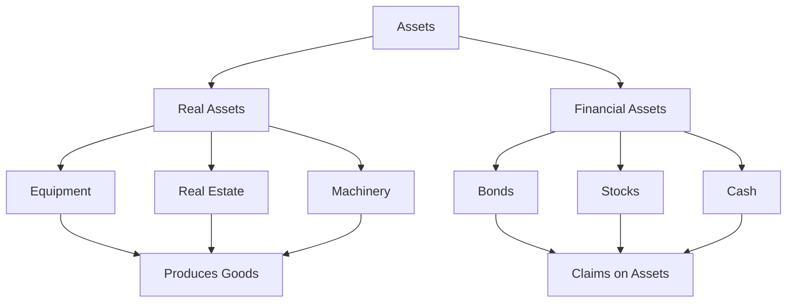

### Corporate Decisions

Every corporation has **two main decision types**:

### 1. Investment Decisions
**Question**: What should we do with our money?

**Examples**:
- Invest $100B in S&P 500 index
- Build new facilities
- Acquire companies

**Goal**: Maximize return given risk

**Simple Example**: Apple deciding whether to build a new iPhone factory in China or invest the money in R&D

### 2. Financing Decisions
**Question**: Where does the money come from?

**Options**:
- **Debt**: Borrowing (bonds, loans)
- **Equity**: Selling ownership (stocks)

**Goal**: Minimize financing cost

**Simple Example**: Tesla needs $1B for new factory - should they borrow from banks (debt) or sell more Tesla stock (equity)?

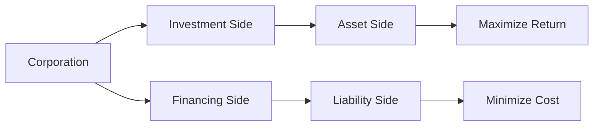

### Time Value of Money

### Core Principle
**$100 today ≠ $100 in one year**

Even with:
- No inflation
- No credit risk
- Perfect certainty

### Why?
1. **Opportunity Cost**: Money can be invested today
2. **Consumption Preference**: People prefer current consumption
3. **Real Interest Rate**: Compensation for deferring consumption

### Example
- Invest $100 at 10% for 1 year
- Year 1: $100 × 1.10 = $110
- Year 2: $110 × 1.10 = $121 (not $120!)

**Compound Interest**: Interest on interest

**Simple Analogy**: Like a snowball rolling down a hill - it gets bigger as it rolls because it picks up more snow (interest) on top of the snow it already has

### NPV and Decision Making

### Net Present Value Formula
**NPV = Present Value of Future Cash Flows - Initial Investment**

### Present Value Formula
**PV = Future Value / (1 + r)^t**

Where:
- **r** = Discount rate (required return)
- **t** = Time period

### Decision Rules
- **NPV > 0**: Accept project
- **NPV < 0**: Reject project
- **NPV = 0**: Indifferent

**Simple Example**: If you can invest $100 and get $110 back (NPV = +$10), you should do it. If you only get $90 back (NPV = -$10), don't do it.

### Mutually Exclusive Projects
**Rule**: Choose project with **highest NPV**

**Examples**:
- Bridge vs Tunnel
- University A vs University B
- War vs Peace

**Simple Example**: You can only attend one university. Choose the one that gives you the highest NPV (best return on your investment in education).

### MBA Investment Example

### Scenario
Vasily considering MBA degree investment

### Investment Analysis

#### Initial Costs (Time 0)
- **Transportation**: 50 shekels × 60 trips = 3,000 shekels
- **Tuition**: 30,000 shekels
- **Opportunity Cost**: 12 hours/week × 52 weeks × 100 shekels/hour = 62,400 shekels
- **Total**: 97,000 shekels

#### Future Benefits
- **Current Salary**: 150,000 shekels/year
- **Salary Increase**: 10% for 10 years, then 2%
- **Additional Income**: 15,000 shekels/year

#### NPV Calculation
**Assumptions**:
- 10-year horizon
- Discount rate: 10%
- Present Value of Benefits: 92,000 shekels
- **NPV**: 92,000 - 97,000 = **-5,000 shekels**

**Decision**: Reject MBA

#### Sensitivity Analysis
**If discount rate = 3%**:
- Present Value increases
- NPV becomes positive
- **Decision**: Accept MBA

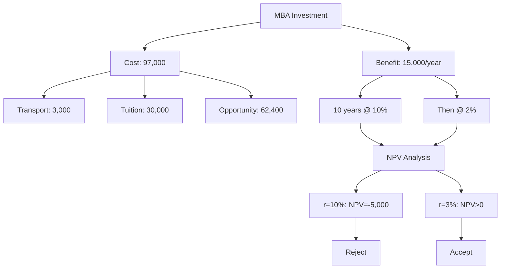


---

## Lecture 2: Finance Under Certainty vs Uncertainty

### Types of Finance - Q&A Review

#### Personal Finance Examples
- **Fixed vs Adjustable Rate Mortgage**: Personal decision about home financing
- **401K Contribution**: Personal retirement planning decision  
- **Student Loan Choice**: Government vs private bank loans for tuition

#### Corporate Finance Examples
- **Machine Purchase vs Lease**: Corporate investment decision
- **Dividend vs Reinvestment**: Corporate payout policy decision
- **LLC vs Sole Proprietorship**: Business structure choice

#### Public Finance Examples
- **Municipal Bonds vs Property Taxes**: City financing for infrastructure
- **Tax Rate Increases**: Government budget management
- **Public-Private Partnerships**: Joint infrastructure projects

### Finance Under Certainty

**Definition**: All future cash flows are known with 100% certainty

**Example**: House investment
- **Initial Investment**: $100,000
- **Annual Rent**: $5,000 for 10 years
- **Sale Price**: $105,000 after 10 years
- **Required Return**: 3%

**Decision**: Compare project return vs alternative investment

**Simple Analogy**: Like a government bond - you know exactly how much you'll get back and when. No surprises, no uncertainty.

### Finance Under Uncertainty

**Definition**: Future outcomes have known probabilities

**Example**: Apple stock analysis
- **Current Price**: $100
- **Possible Outcomes**:
  - High state (10% probability): $160 (+60% return)
  - Medium states: Various returns
  - Low state: Lower returns

**Holding Period Return Formula**:
```
HPR = (P₁ - P₀) / P₀
```

**Simple Analogy**: Like weather forecasting - you know there's a 30% chance of rain, 50% chance of clouds, 20% chance of sun. You don't know exactly what will happen, but you know the probabilities.

### Finance Under Ambiguity

**Definition**: Cannot estimate probabilities or outcomes

**Examples**:
- New payment app in country with unclear regulations
- Private company acquisition with no audited statements
- New token offering with no historical data

**Analyst's Task**: Move from ambiguity to uncertainty by gathering data

**Simple Analogy**: Like trying to predict the weather on a planet you've never been to - you have no idea what the climate is like, what the seasons are, or even if it has weather at all. You need to gather data first.

### Financial System Players

#### Capital Suppliers
- **Households**: Net suppliers (savings, investments)
- **Exceptions**: When borrowing (mortgages, auto loans)

#### Capital Demanders
- **Corporations**: Net demanders (investment, operations)
- **Governments**: Can be borrowers or lenders
  - **US**: Net borrower (deficit)
  - **China**: Net lender (surplus)
  - **Norway**: Net lender (oil reserves)

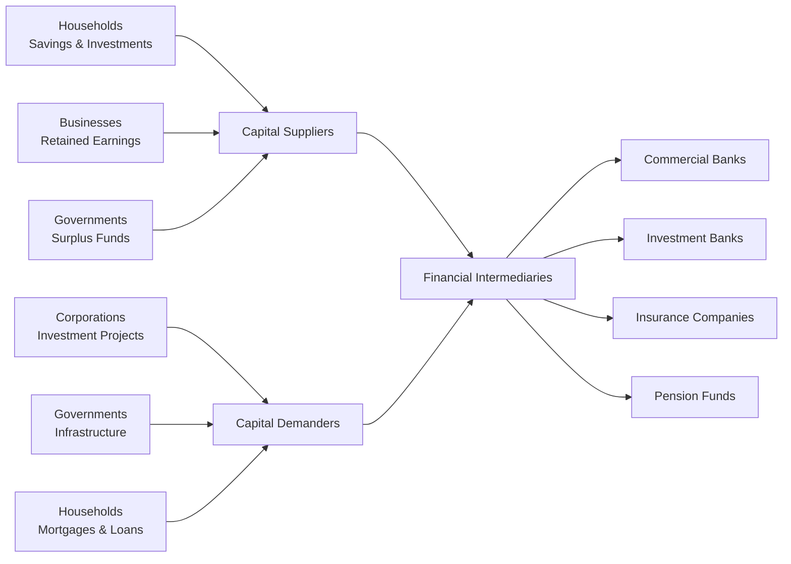

#### Financial Intermediaries

**Brokers vs Dealers**:
- **Broker**: Connects buyers/sellers, earns commission
- **Dealer**: Owns inventory, takes risk, earns spread

**Simple Analogy**: 
- **Broker** = Real estate agent (doesn't own houses, just helps you buy/sell)
- **Dealer** = Car dealership (owns cars, takes risk if they can't sell them)

**Types of Intermediaries**:
- **Pension Funds**: Manage retirement savings
- **Mutual Funds**: Pool investor money
- **Insurance Companies**: Premium investments
- **Banks**: Commercial vs Investment

### Commercial vs Investment Banks

#### Commercial Banks
- **Assets**: Loans, government bonds
- **Liabilities**: Deposits
- **Activity**: Deposit-taking and lending

#### Investment Banks
- **Primary Market**: Underwriting new securities
- **Secondary Market**: Market making, trading
- **Services**: M&A, advisory, research

### Primary vs Secondary Markets

#### Primary Market
- **IPO Process**: Company → Investment Bank → Investors
- **Book Building**: Collecting investor indications
- **Underwriting Risk**: Bank takes inventory risk

**Simple Example**: When Tesla first went public, they sold new shares to investors through investment banks (primary market)

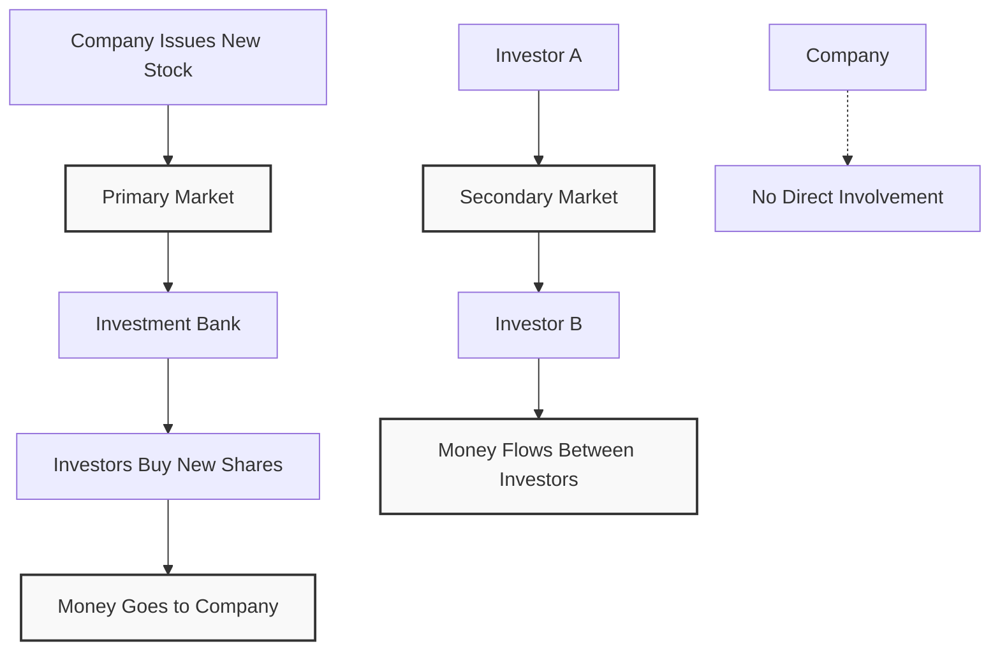

#### Secondary Market
- **Exchange Trading**: Centralized, automated
- **OTC Trading**: Direct between parties
- **Market Makers**: Provide liquidity with bid-ask spreads

**Simple Example**: When you buy Tesla stock today on Robinhood, you're buying from another investor, not from Tesla (secondary market)

### Five Tasks of Financial Manager

1. **Raise Cash**: Sell financial assets (debt/equity)
2. **Invest Cash**: Buy real assets (equipment, facilities)
3. **Generate Cash**: Operations create profits
4. **Manage Cash**: Reinvest or distribute
5. **Risk Management**: Balance growth vs stability

### Goal of Financial Manager

**Primary Objective**: Maximize shareholder value

**Why Shareholders?**
- **Residual Claimants**: Last to be paid
- **Risk Takers**: Bear most uncertainty
- **Value Maximization**: Benefits all stakeholders

**Payment Hierarchy**:
1. **Government**: Taxes (mandatory)
2. **Debt Holders**: Interest and principal (contractual)
3. **Shareholders**: Dividends (discretionary)

**Simple Analogy**: Like a restaurant - first you pay taxes to the government, then you pay your suppliers (debt holders), and only if there's money left do you pay yourself (shareholders get dividends)

---

## Key Concepts

### Finance Fundamentals
- **Finance** = Investment + Financing decisions
- **Real assets** produce goods/services
- **Financial assets** represent claims
- **Time value of money** is fundamental

### Decision Framework
- **NPV Rule**: Accept positive NPV projects
- **Mutually Exclusive**: Choose highest NPV
- **Discount Rate**: Reflects opportunity cost
- **Sensitivity Analysis**: Test scenarios

### Market Structure
- **Primary Market**: New securities issuance
- **Secondary Market**: Trading existing securities
- **Intermediaries**: Connect suppliers and demanders
- **Market Makers**: Provide liquidity

### Practical Applications
- **Personal**: Life goal planning
- **Corporate**: Value maximization
- **Investment**: Risk-return analysis
- **Markets**: Efficient allocation

---

## Lecture 3: Financial Manager Tasks and Business Organization

### Administrative Notes
- **Session Duration**: 1 hour (back-to-back with Professor Mugerman)
- **Quiz 1**: Split into two parts
  - Part 1: Due September 1st (10-11 days)
  - Part 2: Due after Monday's class (additional 10 days)
- **Each Quiz**: Maximum 30 minutes
- **Participation**: Active participation encouraged for points

### Five Tasks of Financial Manager

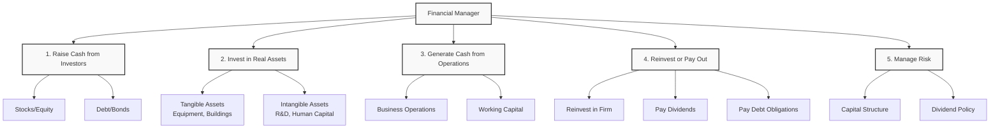

#### 1. Raise Cash from Investors
- **Method**: Selling financial assets
- **Types**: Stocks (equity) or loans (debt/bonds)
- **Stock Terms**: Equity, shares, residual claims
- **Why "Residual"**: Shareholders are last in payment line

#### 2. Invest in Real Assets
- **Tangible**: Equipment, buildings, infrastructure
- **Intangible**: R&D, human capital, intellectual property
- **Example - Google**: Main investments in R&D and cloud infrastructure
- **Decision**: How to allocate money between different assets

#### 3. Generate Cash from Operations
- **Source**: Business activities create cash flow
- **Management**: Working capital decisions
- **Example**: Google generates cash from advertising operations

#### 4. Reinvest or Pay Out
- **Options**:
  - Reinvest in the firm (growth opportunities)
  - Pay dividends to stockholders (discretionary)
  - Pay debt obligations (mandatory)
- **Decision Framework**: Compare internal vs. external investment returns

#### 5. Manage Risk
- **Capital Structure**: Debt vs. equity mix
- **Dividend Policy**: Affects firm's risk profile
- **Example**: High dividend payout may reduce growth opportunities

### Types of Financial Assets

#### Stocks (Equity)
- **Common Stock**: Voting rights, residual claims
- **Preferred Stock**: Senior to common, usually no voting rights
- **Dual Class Structure**: Different voting rights (e.g., Meta)
  - Class A: 1 vote per share
  - Class B: 10 votes per share (held by Zuckerberg)
- **Payment**: Discretionary dividends

#### Bonds (Debt)
- **Seniority**: Higher priority than equity
- **Payment**: Mandatory principal and interest
- **Recovery**: In bankruptcy, debt holders paid first
- **Risk**: Lower risk than equity

### Three Types of Financial Decisions

#### 1. Capital Budgeting
- **Question**: What long-term investment projects should we take?
- **Focus**: Investment decisions (activities 2 & 3)

#### 2. Capital Structure
- **Question**: How should we pay for assets? Debt or equity?
- **Focus**: Financing decisions (activities 1, 4 & 5)

#### 3. Working Capital Management
- **Question**: How do we manage day-to-day finances?
- **Focus**: Short-term vs. long-term finance

### Forms of Business Organization

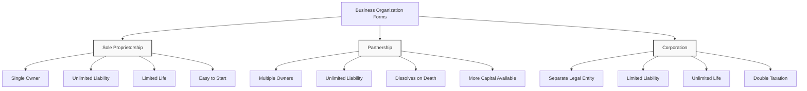

#### 1. Sole Proprietorship
- **Characteristics**: Single owner, easy to start
- **Advantages**: 
  - Less regulated
  - Keep all profits
  - Taxed once (personal income)
- **Disadvantages**:
  - Limited to owner's life
  - Limited capital (personal wealth only)
  - **Unlimited liability**: Personal assets at risk
  - Difficult to sell ownership

#### 2. Partnership
- **Characteristics**: Two or more owners
- **Advantages**: More capital available, relatively easy to start
- **Disadvantages**:
  - **Unlimited liability**: All partners personally liable
  - Dissolves when partner dies or leaves
  - Difficult to transfer ownership
- **Example**: Law firms, dental practices

#### 3. Corporation
- **Characteristics**: Separate legal entity
- **Advantages**:
  - **Limited liability**: Personal assets protected
  - **Unlimited life**: Continues beyond founders
  - Easy to raise capital (IPO, stock issuance)
  - Easy to transfer ownership (stock trading)
- **Disadvantages**:
  - **Double taxation**: Corporate tax + personal tax on dividends
  - Separation of ownership and management
  - More regulation

### Limited Liability Example
**Scenario**: Company invests $100M in S&P 500, financed by $80M debt
- **If S&P 500 drops 50%**: Assets worth $50M, owe $80M
- **Corporation**: Debt holders get $50M, cannot sue shareholders personally
- **Partnership**: Debt holders can sue partners personally for remaining $30M

### Goal of Financial Management
**Primary Goal**: Maximize current value of company's stock
- **Not**: Maximize profit, minimize cost, or maximize market share
- **Rationale**: Stock price reflects all future cash flows
- **Example**: Investing in R&D may reduce current profit but increase future value

### Agency Problem
**Definition**: Conflict between shareholders (principals) and managers (agents)

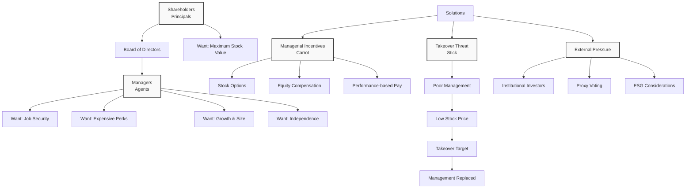

#### Manager Incentives vs. Shareholder Goals
- **Managers may want**:
  - Expensive perks (corporate jets, luxury)
  - Job security (avoid risky projects)
  - Growth and size (more employees, bigger company)
  - Independence from shareholder control
- **Shareholders want**: Maximum stock value

#### Solutions to Agency Problem
1. **Managerial Incentives** (Carrot):
   - Stock options
   - Equity compensation
   - Performance-based pay

2. **Takeover Threat** (Stick):
   - Poor management → low stock price
   - Company becomes takeover target
   - New owners replace management

3. **External Pressure**:
   - Institutional investors (pension funds)
   - Proxy voting
   - ESG considerations

### ESG (Environmental, Social, Governance)
**Definition**: Framework for evaluating company's impact beyond financial metrics

#### Components
- **Environmental**: Climate impact, sustainability
- **Social**: Employee treatment, community impact
- **Governance**: Corporate ethics, transparency

#### Examples
- **Environmental**: Carbon footprint, renewable energy
- **Social**: Diversity, fair labor practices
- **Governance**: Executive compensation, board independence

### Ethical Considerations
**Question**: Is maximizing shareholder value always ethical?

#### Examples
- **Tobacco companies**: Legal but harmful products
- **Microsoft**: Anti-competitive practices
- **Google**: Delayed AI development to protect search business

#### Balance
- **Traditional view**: Maximize shareholder value
- **Modern view**: Consider all stakeholders
- **ESG integration**: Value creation with responsibility

### Key Takeaways
1. **Financial manager's role**: Bridge between investors and operations
2. **Decision framework**: Investment, financing, and working capital
3. **Business forms**: Trade-offs between liability, taxation, and flexibility
4. **Agency problem**: Align manager and shareholder interests
5. **Modern finance**: Balance profit with social responsibility

### Review Questions
1. **Three types of financial decisions**: Capital budgeting, capital structure, working capital
2. **Three business forms**: Corporation, partnership, sole proprietorship
3. **Goal of financial management**: Maximize current stock value
4. **Agency problem**: Conflict between managers and shareholders
5. **Primary vs. secondary markets**: Issuer vs. investor trading

---

## Lecture 4: Financial Assets and Capital Structure

### Quiz Review and Financial Assets

#### Financial Assets vs Real Assets
**Key Question**: What are examples of financial assets?

**Financial Assets** (represent claims on real assets):
- Government bonds
- Corporate bonds  
- Stock index funds
- Stock options
- Corporate debt

**Real Assets** (produce goods/services):
- Land
- Real estate
- Equipment
- Buildings

**Simple Rule**: If it produces something directly, it's a real asset. If it represents ownership or a claim, it's a financial asset.

#### Investment Banks vs Commercial Banks

**Investment Banks**:
- Help companies raise capital by selling securities
- Underwrite new stock/bond offerings
- Provide M&A advisory services
- Don't take deposits

**Commercial Banks**:
- Handle deposits and loans
- Take deposits from customers
- Make loans to individuals and businesses
- Regulated differently than investment banks

**Credit Unions**:
- Non-profit organizations
- Members-only (employees of specific companies, residents of specific areas)
- Use member deposits to lend only to other members
- Any "profit" distributed back to members

### Agency Problem Mechanisms

**Question**: What mechanisms mitigate agency problems between shareholders and managers?

#### Effective Mechanisms:
1. **Stock Options**: Align manager compensation with stock performance
2. **Management Replacement**: Board can fire underperforming managers
3. **Security Analyst Monitoring**: External analysts monitor company performance
4. **Takeover Threats**: Poor performance makes company acquisition target

#### Ineffective Mechanisms:
- **Nepotism**: Hiring family members doesn't solve agency problems
- **Anti-takeover Provisions**: Protect management, not shareholders

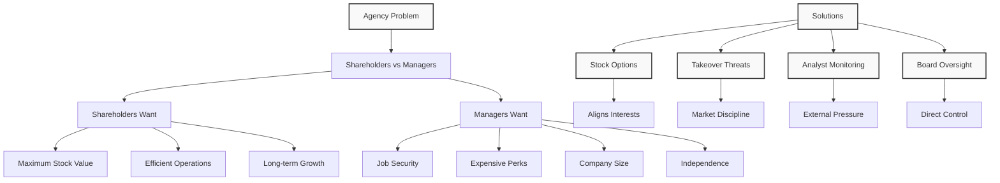

### Primary vs Secondary Markets

#### Primary Market
- **Definition**: Trading of newly issued securities
- **Process**: Company → Investment Bank → Investors
- **Money Flow**: Money goes to the issuing company
- **Example**: IPO (Initial Public Offering)

#### Secondary Market  
- **Definition**: Trading of previously issued securities
- **Process**: Investor A → Market → Investor B
- **Money Flow**: Money flows between investors
- **Example**: Buying Tesla stock on Robinhood

**Key Insight**: In secondary markets, the company doesn't receive any money from the transaction.

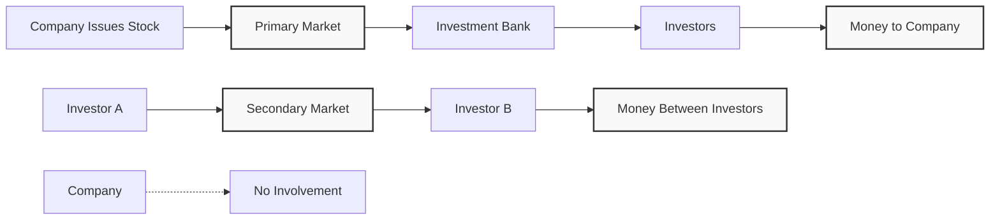

### Capital Structure Example

#### Business Setup
**Scenario**: Partnership to invest in S&P 500 index
- **Initial Capital**: $20 million (equity)
- **Debt Financing**: $80 million
- **Total Investment**: $100 million in S&P 500
- **Time Horizon**: 1 year

#### Capital Structure Details

**Senior Debt**:
- **Face Value**: $40 million
- **Coupon Rate**: 8%
- **Coupon Payment**: $3.2 million
- **Total Payment**: $43.2 million (face value + coupon)
- **Priority**: First to be paid

**Junior/Subordinated Debt**:
- **Face Value**: $40 million  
- **Coupon Rate**: 20%
- **Coupon Payment**: $8 million
- **Total Payment**: $48 million (face value + coupon)
- **Priority**: Second to be paid

**Equity**:
- **Initial Investment**: $20 million
- **Priority**: Last to be paid (residual claimant)

#### Payment Waterfall Analogy

Think of payments like a waterfall with buckets:

1. **Senior Debt Bucket**: 43.2 liters capacity
2. **Junior Debt Bucket**: 48 liters capacity  
3. **Equity Bucket**: Unlimited capacity (gets remaining water)

**Payment Order**:
1. Fill senior debt bucket completely
2. Fill junior debt bucket completely
3. Remaining water goes to equity holders

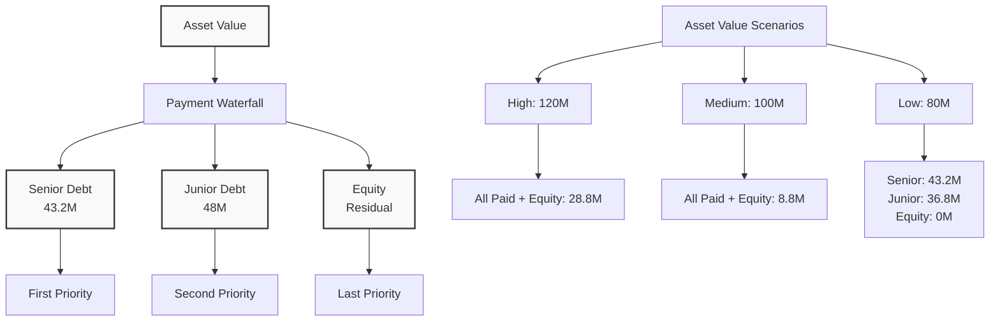

### Payoff Functions and Risk Analysis

#### Scenario Analysis

**Scenario 1: S&P 500 +20% (Assets = $120M)**
- **Senior Debt**: Receives $43.2M (8% return)
- **Junior Debt**: Receives $48M (20% return)
- **Equity**: Receives $28.8M (44% return)

**Scenario 2: S&P 500 0% (Assets = $100M)**
- **Senior Debt**: Receives $43.2M (8% return)
- **Junior Debt**: Receives $48M (20% return)
- **Equity**: Receives $8.8M (-56% return)

**Scenario 3: S&P 500 -20% (Assets = $80M)**
- **Senior Debt**: Receives $43.2M (8% return)
- **Junior Debt**: Receives $36.8M (-8% return)
- **Equity**: Receives $0M (-100% return)

#### Key Insights

**Leverage Effect**:
- **Equity return** is more sensitive to asset value changes
- **Debt returns** are capped by coupon rates
- **Equity has unlimited upside** but limited downside (to zero)

**Risk-Return Trade-off**:
- **Senior Debt**: Lowest risk, lowest return
- **Junior Debt**: Medium risk, medium return
- **Equity**: Highest risk, highest potential return

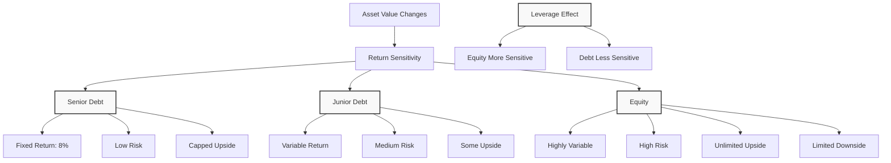

#### Payoff Functions (Mathematical)

**Senior Debt Payoff**:
```
Payoff = min(Asset Value, 43.2)
```

**Junior Debt Payoff**:
```
Payoff = min(max(Asset Value - 43.2, 0), 48)
```

**Equity Payoff**:
```
Payoff = max(Asset Value - 91.2, 0)
```

#### Default and Bankruptcy

**When Assets < Total Debt ($91.2M)**:
- **Equity value = 0** (limited liability)
- **Debt holders** become new owners
- **Absolute Priority Rule**: Senior debt paid first, then junior debt
- **Stockholders** lose everything but don't owe additional money

**Key Concept**: Limited liability protects shareholders from personal losses beyond their initial investment.

### Key Takeaways

1. **Financial vs Real Assets**: Financial assets represent claims; real assets produce goods/services

2. **Agency Problem Solutions**: Stock options, takeover threats, analyst monitoring, and board oversight

3. **Market Types**: Primary markets fund companies; secondary markets trade existing securities

4. **Capital Structure**: Different securities have different risk-return profiles and payment priorities

5. **Leverage Effect**: Equity is more sensitive to asset value changes than debt

6. **Limited Liability**: Shareholders' losses are limited to their initial investment

7. **Payment Priority**: Senior debt → Junior debt → Equity (residual claimant)

8. **Risk-Return Trade-off**: Higher priority = lower risk = lower return potential

---

## Lecture 5: Contingent Claim Approach

### Introduction to Merton's Model

**Background**: Developed by Robert Merton (Nobel Prize winner) in 1974

**Purpose**: The contingent claim approach shows not just the payoff of different securities, but also how to price them using options (call and put options).

**Focus for Today**: We will focus on **payoff functions** and **replication equations** that express the value of securities at future time, not current pricing.

**Connection to Previous Session**: Builds directly on the simple corporation example from Lecture 4 with S&P 500 investment financed by three securities.

### Model Setup and Assumptions

#### Basic Setup
- **Single Asset**: Company invests in one asset with current market value V₀
- **Our Example**: V₀ = $100 million (S&P 500 investment)
- **Maturity**: T = 1 year
- **Asset Value at Maturity**: V_T (stochastic variable)

#### Key Assumptions
1. **No Taxes**: No tax implications
2. **No Transaction Costs**: No bid-ask spreads
3. **No Early Default**: Default can only occur at maturity
4. **Risk-Free Rate**: Continuous compounding (not crucial for our calculations)
5. **Asset Dynamics**: Asset value changes according to drift and volatility

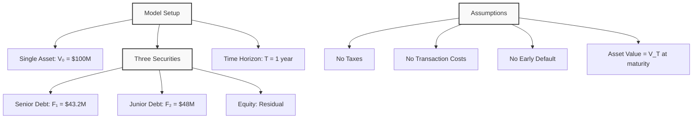

### Payoff Functions for Different Securities

#### Senior Debt Payoff (F₁)
- **Face Value**: $40 million
- **Coupon Payment**: $3.2 million
- **Total Promised Payment**: F₁ = $43.2 million

#### Junior Debt Payoff (F₂)
- **Face Value**: $40 million
- **Coupon Payment**: $8 million
- **Total Promised Payment**: F₂ = $48 million

#### Total Debt Obligation
- **Total Owed**: F₁ + F₂ = $91.2 million
- **Payment Waterfall**: Senior first, then junior, then equity (residual)

### Senior Debt Payoff Analysis

#### Payoff Function
**Senior Debt Payoff = min(V_T, F₁)**

Where:
- V_T = Asset value at maturity
- F₁ = $43.2 million (promised payment)

#### Two Scenarios
1. **V_T < F₁**: Senior debt receives V_T (partial payment)
2. **V_T ≥ F₁**: Senior debt receives F₁ (full payment)

#### Alternative Expression
**Senior Debt Payoff = V_T - max(V_T - F₁, 0)**

This shows that senior debt is equivalent to:
- **Risk-free bond** paying F₁
- **Minus a put option** on V with strike price F₁

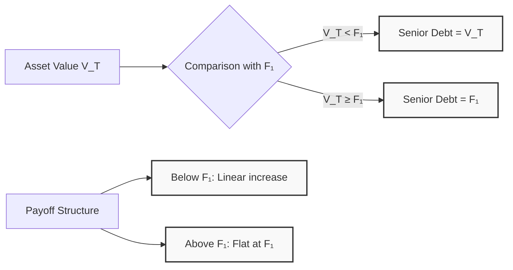

### Equity Payoff Analysis

#### Payoff Function
**Equity Payoff = max(V_T - (F₁ + F₂), 0)**

Where:
- F₁ + F₂ = $91.2 million (total debt obligation)

#### Interpretation
- **Below $91.2M**: Equity receives $0 (limited liability)
- **Above $91.2M**: Equity receives residual (V_T - $91.2M)

#### Key Characteristics
- **Unlimited upside potential**
- **Limited downside** (cannot go below zero)
- **Call option-like payoff** on the firm's assets

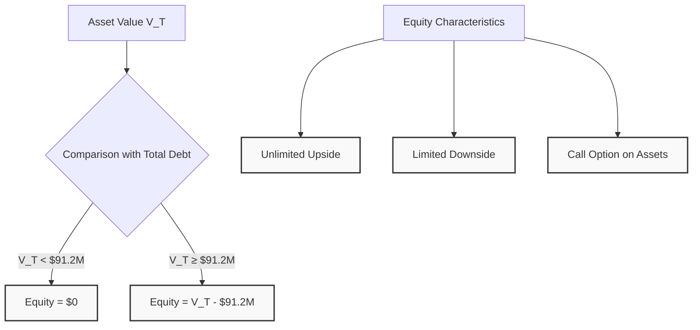

### Junior Debt Payoff Analysis

#### Direct Calculation Method
**Junior Debt = V_T - Senior Debt - Equity**

This uses the accounting identity: **Assets = Liabilities**

#### Complex Payoff Function
**Junior Debt = min(F₂, max(V_T - F₁, 0))**

Where:
- F₂ = $48 million (promised payment)
- F₁ = $43.2 million (senior debt payment)

#### Three Segments
1. **V_T < F₁**: Junior debt = $0
2. **F₁ ≤ V_T < F₁ + F₂**: Junior debt = V_T - F₁ (linear increase)
3. **V_T ≥ F₁ + F₂**: Junior debt = F₂ (capped at promised amount)

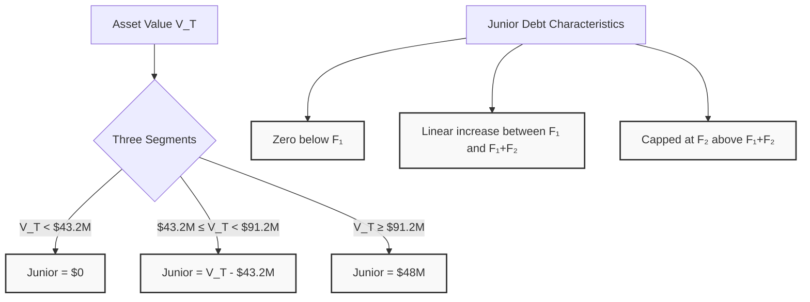

### Three-State Analysis Framework

#### State 1: V_T < F₁ (Below $43.2M)
**Example**: V_T = $30M
- **Senior Debt**: Receives $30M (all available assets)
- **Junior Debt**: Receives $0
- **Equity**: Receives $0

#### State 2: F₁ ≤ V_T < F₁ + F₂ (Between $43.2M and $91.2M)
**Example**: V_T = $70M
- **Senior Debt**: Receives $43.2M (full promised payment)
- **Junior Debt**: Receives $26.8M (V_T - F₁ = $70M - $43.2M)
- **Equity**: Receives $0

#### State 3: V_T ≥ F₁ + F₂ (Above $91.2M)
**Example**: V_T = $1000M
- **Senior Debt**: Receives $43.2M (full promised payment)
- **Junior Debt**: Receives $48M (full promised payment)
- **Equity**: Receives $908.8M (V_T - F₁ - F₂ = $1000M - $91.2M)

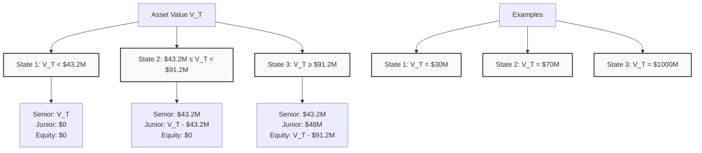

### Key Takeaways

1. **Merton's Model**: Nobel Prize-winning framework for analyzing corporate securities as contingent claims

2. **Payoff Functions**: Each security has a mathematical payoff function based on asset value at maturity

3. **Senior Debt**: min(V_T, F₁) - receives promised payment or all available assets, whichever is less

4. **Equity**: max(V_T - (F₁ + F₂), 0) - call option on firm's assets with strike price equal to total debt

5. **Junior Debt**: Can be calculated directly using accounting identity or complex payoff function

6. **Three-State Framework**: Systematic way to analyze payoffs across different asset value scenarios

7. **Limited Liability**: Equity holders cannot lose more than their initial investment

8. **Payment Priority**: Senior debt → Junior debt → Equity (residual claimant)

9. **Risk-Return Trade-off**: Higher priority securities have lower risk and lower return potential

10. **Mathematical Approach**: Provides precise framework for understanding security payoffs and relationships

---

## Lecture 6: Replication and Bankruptcy Analysis

### Replication Approach

**Merton's Key Insight**: The contingent claim approach shows not just payoffs, but how to **price** securities by replicating them with traded assets.

**Law of One Price**: If two securities have identical payoffs, they must have identical prices.

**Replication Strategy**: Express corporate securities in terms of:
- **Risk-free bonds** (fixed payments)
- **Options** (call and put options)
- **Other traded securities**

**Practical Application**: Since we don't know how to price corporate bonds directly, we find other securities with the same payoff and use their prices.

### Asset Value Dynamics

#### Geometric Brownian Motion
**Model**: Asset values follow a stochastic process with two components:

1. **Drift (μ)**: Constant upward trend
2. **Volatility (σ)**: Random fluctuations

**Mathematical Representation**:
```
dV = μV dt + σV dW
```

Where:
- **V** = Asset value
- **μ** = Expected return (drift)
- **σ** = Volatility
- **dW** = Random shock (Brownian motion)

#### Visual Representation
- **X-axis**: Time
- **Y-axis**: Asset value
- **Starting Point**: V₀ (initial value)
- **Multiple Paths**: Various possible future values
- **Default Threshold**: F₁ + F₂ = $91.2M

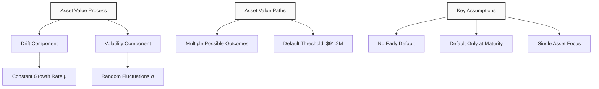

### Risk-Free vs Risky Debt

#### Risk-Free Debt
**Characteristics**:
- **Government bonds** denominated in local currency
- **Fixed payment** regardless of economic conditions
- **No credit risk** (government can print money)
- **Example**: US Treasury bills

**Payoff**: Always receives promised amount (e.g., $43.2M)

#### Risky Corporate Debt
**Characteristics**:
- **Corporate bonds** with credit risk
- **Payment depends** on firm's asset value
- **Default risk** when assets < liabilities
- **Example**: Our S&P 500 investment firm

**Payoff**: min(V_T, F₁) - receives promised amount or all available assets

#### Key Difference
**Risk-free debt**: Always pays $43.2M
**Risky debt**: Pays $43.2M only if V_T ≥ $43.2M, otherwise pays V_T

### Put Options and Credit Risk

#### Mathematical Relationship
**Risky Bond = Risk-Free Bond - Put Option**

**Senior Debt Payoff**:
```
min(V_T, F₁) = F₁ - max(F₁ - V_T, 0)
```

Where:
- **F₁** = Risk-free bond paying $43.2M
- **max(F₁ - V_T, 0)** = Put option on firm's assets

#### Interpretation
- **Risk-free bond**: Always pays $43.2M
- **Put option**: Pays (F₁ - V_T) when V_T < F₁, zero otherwise
- **Net result**: Risky bond receives F₁ when V_T ≥ F₁, V_T when V_T < F₁

#### Market Trading
- **Put options** are traded on CBOE (Chicago Board Options Exchange)
- **Credit default swaps** are similar instruments
- **Pricing**: Risky bonds are cheaper than risk-free bonds

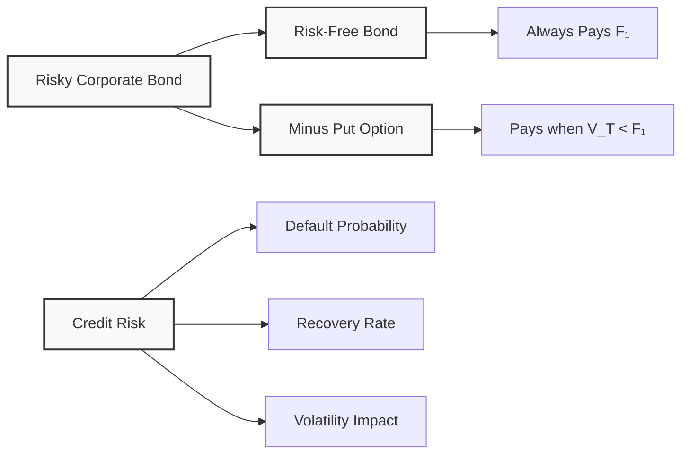

### Absolute Priority Rule (APR)

#### Definition
**Absolute Priority Rule**: In bankruptcy, claims are paid in strict order of seniority.

#### Payment Order
1. **Senior Debt**: First priority
2. **Junior Debt**: Second priority  
3. **Equity**: Residual claimant (last)

#### Example: Single Debt Case
**Scenario**: Firm with $100M debt, $70M assets
- **According to APR**: Debt holders get $70M, equity gets $0
- **Result**: Debt holders become new owners, equity holders are wiped out

#### Key Principle
**Assets = Liabilities**: The accounting identity must always hold.

### Deviations from APR

#### When Deviations Occur
**Real-world situations** where APR is violated:

1. **Intangible Assets**: High value in human capital, technology, relationships
2. **Bargaining Power**: Equity holders can threaten to leave
3. **Bankruptcy Costs**: Additional costs if firm is liquidated
4. **Going Concern Value**: Firm worth more as ongoing business

#### Example: Tech Company
**Scenario**: Firm owes $100M, has $70M assets, but founders control key technology

**Threat**: If equity holders leave, firm value drops to $30M
**Bargaining**: Equity holders demand $10M to stay
**Result**: Debt holders agree to reorganization to preserve value

#### Factors Affecting Deviations
- **Asset Tangibility**: More tangible assets → closer to APR
- **Human Capital**: More intangible assets → larger deviations
- **Industry Type**: Airlines (tangible) vs Tech (intangible)

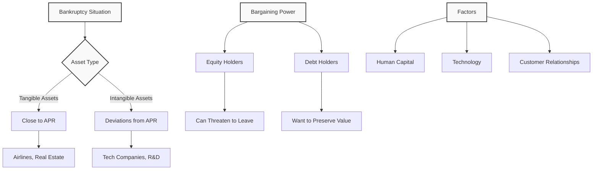

### Bankruptcy Procedures

#### US Bankruptcy Code
**Two Main Procedures**:

1. **Chapter 11**: Reorganization
   - Firm continues operating
   - 90-180 days to negotiate
   - Debt and equity holders bargain
   - Judge can extend negotiation period

2. **Chapter 7**: Liquidation
   - Firm ceases to exist
   - Assets sold off
   - Proceeds distributed according to APR
   - Judge can "cram down" if no agreement

#### Decision Process

**Step 1**: Enter bankruptcy (Chapter 11)
**Step 2**: Negotiate reorganization plan
**Step 3**: If agreement reached → Reorganization
**Step 4**: If no agreement → Chapter 7 liquidation

```mermaid
flowchart LR
    A[Step 1<br/>Enter Chapter 11] --> B[Step 2<br/>Negotiate Plan]
    B --> C{Step 3<br/>Agreement?}
    C -->|Yes| D[Step 4a<br/>Reorganization]
    C -->|No| E[Step 4b<br/>Chapter 7 Liquidation]
    
    style A fill:#f9f9f9,stroke:#333,stroke-width:2px
    style B fill:#f9f9f9,stroke:#333,stroke-width:2px
    style C fill:#f9f9f9,stroke:#333,stroke-width:2px
    style D fill:#f9f9f9,stroke:#333,stroke-width:2px
    style E fill:#f9f9f9,stroke:#333,stroke-width:2px
```

#### Key Players
- **Debt Holders**: Want maximum recovery
- **Equity Holders**: Want to preserve some value
- **Judge**: Can force decisions if no agreement
- **Employees**: Affected by outcome

#### Time Value of Money
**Deferred Payments**: Sometimes equivalent to reduced payments
- **Example**: $70M now vs $70M in 15 years
- **Present Value**: Deferred payment worth less today
- **Bargaining Tool**: Debt holders may accept deferred payments

### Key Takeaways

1. **Replication Approach**: Corporate securities can be replicated using traded assets (bonds, options)

2. **Law of One Price**: Identical payoffs imply identical prices

3. **Asset Dynamics**: Asset values follow stochastic processes with drift and volatility

4. **Risk-Free vs Risky**: Government bonds are risk-free; corporate bonds have credit risk

5. **Put Options**: Credit risk can be modeled as put options on firm's assets

6. **Absolute Priority Rule**: Theoretical payment order in bankruptcy

7. **APR Deviations**: Real-world deviations occur due to bargaining power and intangible assets

8. **Bankruptcy Procedures**: Chapter 11 (reorganization) vs Chapter 7 (liquidation)

9. **Bargaining Power**: Equity holders' power increases with intangible assets

10. **Time Value**: Deferred payments can be equivalent to reduced payments

11. **Industry Differences**: Tangible asset firms closer to APR than intangible asset firms

12. **Practical Applications**: Understanding these concepts helps analyze real-world bankruptcy situations

---

## Lecture 7: Time Value of Money

### Introduction to Time Value of Money

**Core Principle**: Money today is worth more than the same amount of money in the future.

**Why This Matters**: In finance, we need to compare cash flows that happen at different times. We cannot simply add $100 today + $100 next year = $200. We must account for the time value of money.

**Simple Example**: 
- Would you rather have $100 today or $100 in one year?
- Most people choose $100 today because they can invest it and have more than $100 in one year.

### Why Money Has Time Value

#### 1. Opportunity Cost
**Definition**: The cost of giving up the next best alternative.

**Example**: If you have $100 today, you can:
- Buy something now
- Invest it and earn interest
- Save it for future use

**Simple Analogy**: Like choosing between eating a cookie now or saving it for later. The cookie now has more value because you can enjoy it immediately.

#### 2. Consumption Preference
**Definition**: People prefer to consume goods and services now rather than later.

**Example**: A child asking for gum:
- "Give me one gum now, and I'll give you two gums tomorrow"
- This shows natural preference for current consumption

**Real Rate of Return**: The compensation for delaying consumption, even without inflation or risk.

#### 3. Inflation Risk
**Definition**: The risk that prices will increase over time, reducing purchasing power.

**Example**: 
- Today: $100 can buy 100 apples at $1 each
- Next year: $100 can only buy 50 apples at $2 each
- Inflation rate: 100%

**Simple Analogy**: Like a shrinking shopping cart - the same amount of money buys fewer items over time.

```mermaid
graph TD
    A[Time Value of Money] --> B[Opportunity Cost]
    A --> C[Consumption Preference]
    A --> D[Inflation Risk]
    
    B --> B1[Can Invest Today]
    B --> B2[Earn Interest]
    B --> B3[Future Value > Present Value]
    
    C --> C1[Prefer Now vs Later]
    C --> C2[Real Rate of Return]
    C --> C3[Compensation for Waiting]
    
    D --> D1[Prices Increase]
    D --> D2[Purchasing Power Decreases]
    D --> D3[Need Higher Returns]
    
    style A fill:#f9f9f9,stroke:#333,stroke-width:2px
    style B fill:#f9f9f9,stroke:#333,stroke-width:2px
    style C fill:#f9f9f9,stroke:#333,stroke-width:2px
    style D fill:#f9f9f9,stroke:#333,stroke-width:2px
```

### Components of Required Return

**Required Return = Real Rate + Expected Inflation + Risk Premium**

#### 1. Real Rate of Return
**Definition**: Compensation for delaying consumption, without inflation or risk.

**Characteristics**:
- Usually stable over time
- Varies by country and time period
- Determined by people's risk preferences

**Example**: 2-3% real rate is common in developed countries.

#### 2. Expected Inflation
**Definition**: The expected increase in prices over the investment period.

**Types of Inflation**:
- **Supply-side inflation**: When production decreases (e.g., bad weather reduces apple harvest)
- **Demand-side inflation**: When money supply increases (e.g., government prints more money)

**Example**: If expected inflation is 3%, you need 3% higher return to maintain purchasing power.

#### 3. Risk Premium
**Definition**: Additional return required for taking on risk.

**Types of Risk**:
- **Credit risk**: Risk of default (corporate bonds vs government bonds)
- **Inflation risk premium**: Uncertainty about future inflation
- **Market risk**: General market fluctuations

**Example**: Corporate bonds pay higher interest than government bonds because of credit risk.

```mermaid
graph LR
    A[Required Return] --> B[Real Rate: 2%]
    A --> C[Expected Inflation: 3%]
    A --> D[Risk Premium: 2%]
    
    B --> E[Time Value of Money]
    C --> F[Purchasing Power Protection]
    D --> G[Compensation for Risk]
    
    H[Total Required Return] --> I[7%]
    
    style A fill:#f9f9f9,stroke:#333,stroke-width:2px
    style H fill:#f9f9f9,stroke:#333,stroke-width:2px
```

### Simple vs Compound Interest

#### Simple Interest
**Definition**: Interest calculated only on the principal amount.

**Formula**: Interest = Principal × Rate × Time

**Example**: $100 at 10% simple interest for 2 years
- Year 1: $100 × 10% = $10 interest
- Year 2: $100 × 10% = $10 interest
- Total: $100 + $20 = $120

#### Compound Interest
**Definition**: Interest calculated on principal plus previously earned interest.

**Formula**: Future Value = Principal × (1 + Rate)^Time

**Example**: $100 at 10% compound interest for 2 years
- Year 1: $100 × 1.10 = $110
- Year 2: $110 × 1.10 = $121
- Total: $121

**Key Difference**: Compound interest earns "interest on interest"

```mermaid
graph TD
    A[Interest Types] --> B[Simple Interest]
    A --> C[Compound Interest]
    
    B --> B1[Interest on Principal Only]
    B --> B2[Linear Growth]
    B --> B3[Example: $100 → $120]
    
    C --> C1[Interest on Principal + Interest]
    C --> C2[Exponential Growth]
    C --> C3[Example: $100 → $121]
    
    D[Time Effect] --> E[Simple: Constant Growth]
    D --> F[Compound: Accelerating Growth]
    
    style A fill:#f9f9f9,stroke:#333,stroke-width:2px
    style D fill:#f9f9f9,stroke:#333,stroke-width:2px
```

### Present Value and Future Value

#### Future Value (FV)
**Definition**: The value of money at a future date.

**Formula**: FV = PV × (1 + r)^t

Where:
- **PV** = Present Value (money today)
- **r** = Interest rate (required return)
- **t** = Time period

**Example**: $100 today at 10% for 2 years
- FV = $100 × (1.10)² = $100 × 1.21 = $121

#### Present Value (PV)
**Definition**: The value today of money to be received in the future.

**Formula**: PV = FV / (1 + r)^t

**Example**: $121 in 2 years at 10% discount rate
- PV = $121 / (1.10)² = $121 / 1.21 = $100

**Key Insight**: Discounting is the reverse of compounding.

#### Practical Example: Office Lease Decision

**Scenario**: Infosoft company needs office space
- **Option 1**: Pay $500,000 in 10 years
- **Option 2**: Pay some amount today
- **Required return**: 10%

**Question**: What amount today makes you indifferent between the two options?

**Solution**:
- PV = $500,000 / (1.10)¹⁰
- PV = $500,000 / 2.594
- PV = $192,772

**Decision Rule**: 
- If asked to pay less than $192,772 today → Choose today's payment
- If asked to pay more than $192,772 today → Choose future payment

```mermaid
graph LR
    A[Present Value] --> B[Future Value]
    B --> C[Compounding]
    C --> D[Interest on Interest]
    
    E[Future Value] --> F[Present Value]
    F --> G[Discounting]
    G --> H[Time Value Adjustment]
    
    I[Example] --> J[$100 Today]
    J --> K[10% for 2 years]
    K --> L[$121 Future]
    
    M[Reverse] --> N[$121 Future]
    N --> O[10% discount]
    O --> P[$100 Present]
    
    style A fill:#f9f9f9,stroke:#333,stroke-width:2px
    style E fill:#f9f9f9,stroke:#333,stroke-width:2px
    style I fill:#f9f9f9,stroke:#333,stroke-width:2px
    style M fill:transparent,stroke:#333,stroke-width:2px
```

### Annuities

#### Definition
**Annuity**: A series of equal payments made at regular intervals.

**Examples**:
- Monthly rent payments
- Annual insurance premiums
- Retirement account withdrawals
- Loan payments

#### Types of Annuities

**1. Ordinary Annuity**: Payments made at the end of each period
**2. Annuity Due**: Payments made at the beginning of each period

#### Present Value of Annuity Formula

**PV of Annuity = Payment × [(1 - (1 + r)^(-n)) / r]**

Where:
- **Payment** = Regular payment amount
- **r** = Interest rate per period
- **n** = Number of periods

#### Practical Example: Copier Purchase Decision

**Scenario**: Infosoft needs a copier
- **Option 1**: Pay $10,000 cash today
- **Option 2**: Pay $3,000 per year for 5 years
- **Required return**: 12%

**Question**: Which option is cheaper?

**Solution - Option 2 (Annuity)**:
- Payment = $3,000
- r = 12% = 0.12
- n = 5 years

**Step 1**: Calculate (1 + r)^(-n)
- (1.12)^(-5) = 0.567

**Step 2**: Calculate 1 - (1 + r)^(-n)
- 1 - 0.567 = 0.433

**Step 3**: Divide by r
- 0.433 / 0.12 = 3.605

**Step 4**: Multiply by payment
- $3,000 × 3.605 = $10,815

**Decision**: Choose Option 1 ($10,000) because it's cheaper than Option 2 ($10,815).

```mermaid
graph TD
    A[Copier Purchase Decision] --> B[Option 1: $10,000 Today]
    A --> C[Option 2: $3,000 × 5 years]
    
    B --> D[Present Value: $10,000]
    
    C --> E[Year 1: $3,000]
    C --> F[Year 2: $3,000]
    C --> G[Year 3: $3,000]
    C --> H[Year 4: $3,000]
    C --> I[Year 5: $3,000]
    
    E --> J[Discount to Present]
    F --> J
    G --> J
    H --> J
    I --> J
    
    J --> K[Present Value: $10,815]
    
    L[Decision] --> M[Choose Option 1]
    M --> N[Save $815]
    
    style A fill:#f9f9f9,stroke:#333,stroke-width:2px
    style L fill:#f9f9f9,stroke:#333,stroke-width:2px
```

### Practical Examples

#### Example 1: Retirement Planning

**Scenario**: 25-year-old planning for retirement
- **Current investment**: $100
- **Time horizon**: 40 years
- **Investment options**:
  - Stocks: 12.4% average return
  - Government bonds: 5.3% average return
  - Cash/T-bills: 3.8% average return

**Future Value Calculations**:
- **Stocks**: $100 × (1.124)⁴⁰ = $10,000+
- **Bonds**: $100 × (1.053)⁴⁰ = $750
- **Cash**: $100 × (1.038)⁴⁰ = $400

**Key Insight**: The power of compound interest over long periods is enormous.

#### Example 2: Loan vs Lease Decision

**Scenario**: Business equipment financing
- **Equipment cost**: $50,000
- **Option 1**: Bank loan at 8% for 5 years
- **Option 2**: Lease at $12,000 per year for 5 years

**Analysis**:
- **Loan**: Calculate monthly payments using annuity formula
- **Lease**: Calculate present value of lease payments
- **Decision**: Choose option with lower present value

#### Example 3: Investment Comparison

**Scenario**: Comparing two investment opportunities
- **Investment A**: $1,000 today, $1,500 in 3 years
- **Investment B**: $1,000 today, $200 per year for 8 years
- **Required return**: 10%

**Analysis**:
- **Investment A**: PV = $1,500 / (1.10)³ = $1,127
- **Investment B**: PV = $200 × annuity factor = $1,067
- **Decision**: Choose Investment A (higher present value)

```mermaid
graph TD
    A[Investment Decisions] --> B[Retirement Planning]
    A --> C[Loan vs Lease]
    A --> D[Investment Comparison]
    
    B --> E[Long-term Compound Interest]
    B --> F[Risk vs Return Trade-off]
    B --> G[Time Horizon Matters]
    
    C --> H[Present Value Analysis]
    C --> I[Cash Flow Timing]
    C --> J[Interest Rate Impact]
    
    D --> K[Multiple Cash Flows]
    D --> L[Annuity vs Lump Sum]
    D --> M[Required Return]
    
    style A fill:#f9f9f9,stroke:#333,stroke-width:2px
    style B fill:#f9f9f9,stroke:#333,stroke-width:2px
    style C fill:#f9f9f9,stroke:#333,stroke-width:2px
    style D fill:#f9f9f9,stroke:#333,stroke-width:2px
```

### Key Takeaways

1. **Time Value of Money**: Money today is worth more than the same amount in the future.

2. **Three Components of Required Return**:
   - Real rate (compensation for waiting)
   - Expected inflation (purchasing power protection)
   - Risk premium (compensation for uncertainty)

3. **Compound Interest**: Interest on interest creates exponential growth over time.

4. **Present Value**: The value today of future cash flows, calculated by discounting.

5. **Future Value**: The value in the future of money invested today, calculated by compounding.

6. **Annuities**: Regular payments that can be valued using present value formulas.

7. **Decision Making**: Always compare alternatives using present value analysis.

8. **Practical Applications**: Time value of money is used in retirement planning, loan decisions, and investment analysis.

9. **Key Formulas**:
   - Future Value: FV = PV × (1 + r)^t
   - Present Value: PV = FV / (1 + r)^t
   - Annuity PV: PV = Payment × [(1 - (1 + r)^(-n)) / r]

10. **Real-World Impact**: Understanding time value of money helps make better financial decisions in both personal and business contexts.

---

## Lecture 8: Advanced Cash Flow Valuation

### Introduction to Advanced Cash Flows

**Building on Previous Knowledge**: We learned about simple cash flows and annuities in Lecture 7. Now we explore more complex cash flow patterns used in real-world finance.

**Five Types of Cash Flows**:
1. **Simple Cash Flow**: Single payment at one point in time
2. **Annuity**: Constant payments over a fixed period
3. **Growing Annuity**: Payments that grow at a constant rate
4. **Perpetuity**: Constant payments forever
5. **Growing Perpetuity**: Payments that grow forever

**Key Insight**: By combining these basic cash flow types, we can value almost any financial security or investment project.

**Simple Analogy**: Like building blocks - with these five basic types, we can construct complex financial structures.

### Future Value of Annuities

#### Definition
**Future Value of Annuity**: The value at the end of the period of all regular payments plus accumulated interest.

**Key Difference from Present Value**: 
- **Present Value**: What are the payments worth today?
- **Future Value**: What will the payments be worth at the end?

#### Example: Savings Account
**Scenario**: You deposit $2,000 at the end of each year for 3 years
- **Interest Rate**: 8%
- **Question**: How much will you have at the end of 3 years?

**Step-by-Step Calculation**:
- **Year 1**: $2,000 deposited, earns interest for 2 years
- **Year 2**: $2,000 deposited, earns interest for 1 year  
- **Year 3**: $2,000 deposited, no interest earned

**Calculation**:
- Year 1: $2,000 × (1.08)² = $2,332.80
- Year 2: $2,000 × (1.08)¹ = $2,160.00
- Year 3: $2,000 × (1.08)⁰ = $2,000.00
- **Total**: $6,492.80

#### Future Value Formula
**FV of Annuity = Payment × [((1 + r)^n - 1) / r]**

Where:
- **Payment** = Regular payment amount
- **r** = Interest rate per period
- **n** = Number of periods

**Using the Formula**:
- FV = $2,000 × [((1.08)³ - 1) / 0.08]
- FV = $2,000 × [(1.2597 - 1) / 0.08]
- FV = $2,000 × [0.2597 / 0.08]
- FV = $2,000 × 3.246
- FV = $6,492

```mermaid
graph TD
    A[Future Value of Annuity] --> B[Year 1: $2,000]
    A --> C[Year 2: $2,000]
    A --> D[Year 3: $2,000]
    
    B --> E[Earns interest for 2 years]
    C --> F[Earns interest for 1 year]
    D --> G[No interest earned]
    
    E --> H[$2,000 × 1.08² = $2,332.80]
    F --> I[$2,000 × 1.08¹ = $2,160.00]
    G --> J[$2,000 × 1.08⁰ = $2,000.00]
    
    H --> K[Total: $6,492.80]
    I --> K
    J --> K
    
    style A fill:#f9f9f9,stroke:#333,stroke-width:2px
    style K fill:#f9f9f9,stroke:#333,stroke-width:2px
```

### Growing Annuities

#### Definition
**Growing Annuity**: A series of payments that increase at a constant rate over a fixed period.

**Real-World Examples**:
- Salary increases over time
- Rent escalations
- Dividend growth
- Revenue growth projections

#### Formula
**PV of Growing Annuity = Payment × [(1 - ((1 + g)/(1 + r))^n) / (r - g)]**

Where:
- **Payment** = First payment amount
- **g** = Growth rate
- **r** = Discount rate
- **n** = Number of periods

**Important**: r must be greater than g for the formula to work.

#### Practical Example: Gold Mine Valuation

**Scenario**: You own a gold mine for 20 years
- **Annual Production**: 5,000 ounces
- **Current Gold Price**: $300 per ounce
- **Price Growth**: 3% per year
- **Required Return**: 10%

**Step 1: Calculate Initial Cash Flow**
- Year 0: 5,000 × $300 = $1,500,000

**Step 2: Calculate Future Cash Flows**
- Year 1: $1,500,000 × 1.03 = $1,545,000
- Year 2: $1,545,000 × 1.03 = $1,591,350
- And so on...

**Step 3: Calculate Present Value**
Using the growing annuity formula:
- PV = $1,545,000 × [(1 - ((1.03)/(1.10))^20) / (0.10 - 0.03)]
- PV = $1,545,000 × [(1 - 0.9367^20) / 0.07]
- PV = $1,545,000 × [(1 - 0.4564) / 0.07]
- PV = $1,545,000 × [0.5436 / 0.07]
- PV = $1,545,000 × 7.766
- PV = $12,000,000

**Decision**: This is the fair price of the mine. Paying more would result in negative NPV.

```mermaid
graph TD
    A[Gold Mine Valuation] --> B[Initial Cash Flow: $1.5M]
    A --> C[Growth Rate: 3% per year]
    A --> D[Time Period: 20 years]
    A --> E[Required Return: 10%]
    
    B --> F[Year 1: $1.545M]
    F --> G[Year 2: $1.591M]
    G --> H[Year 3: $1.639M]
    H --> I[...continues for 20 years]
    
    J[Present Value Calculation] --> K[Growing Annuity Formula]
    K --> L[Fair Price: $12M]
    
    M[Decision Rule] --> N[Pay < $12M: Positive NPV]
    M --> O[Pay = $12M: Zero NPV]
    M --> P[Pay > $12M: Negative NPV]
    
    style A fill:#f9f9f9,stroke:#333,stroke-width:2px
    style L fill:#f9f9f9,stroke:#333,stroke-width:2px
    style M fill:transparent,stroke:#333,stroke-width:2px
```

### Perpetuities

#### Definition
**Perpetuity**: A series of constant payments that continue forever.

**Historical Context**: Used since the 17th-18th centuries by governments to finance wars and projects.

**Modern Examples**:
- British Consol bonds (perpetual government bonds)
- Preferred stock with fixed dividends
- Some types of annuities

#### Formula
**PV of Perpetuity = Payment / r**

Where:
- **Payment** = Constant payment amount
- **r** = Required rate of return

**Key Insight**: The formula is surprisingly simple - just divide the payment by the interest rate.

#### Example: British Consol Bond
**Scenario**: British government bond paying £60 forever
- **Required Return**: 9%
- **Question**: What is the bond worth today?

**Calculation**:
- PV = £60 / 0.09
- PV = £666.67

**Verification**: If we calculate 200 years of payments, we get approximately the same result, proving that payments beyond 50-100 years contribute almost nothing to present value.

```mermaid
graph TD
    A[Perpetuity] --> B[Constant Payment Forever]
    A --> C[Simple Formula: Payment / r]
    
    D[Example: British Consol] --> E[Payment: £60 per year]
    D --> F[Required Return: 9%]
    D --> G[Present Value: £666.67]
    
    H[Time Value Effect] --> I[Years 1-50: Most Value]
    H --> J[Years 51-100: Some Value]
    H --> K[Years 100+: Almost Zero]
    
    L[Real-World Use] --> M[Government Bonds]
    L --> N[Preferred Stock]
    L --> O[Valuation Models]
    
    style A fill:#f9f9f9,stroke:#333,stroke-width:2px
    style D fill:#f9f9f9,stroke:#333,stroke-width:2px
    style H fill:#f9f9f9,stroke:#333,stroke-width:2px
    style L fill:#f9f9f9,stroke:#333,stroke-width:2px
```

### Growing Perpetuities

#### Definition
**Growing Perpetuity**: A series of payments that grow at a constant rate forever.

**Why Important**: This is the foundation of stock valuation models.

#### Formula
**PV of Growing Perpetuity = Payment / (r - g)**

Where:
- **Payment** = First payment amount
- **r** = Required rate of return
- **g** = Growth rate

**Important**: r must be greater than g for the formula to work.

#### Example: Growing Dividend Stock
**Scenario**: Stock with growing dividends
- **Current Dividend**: $60
- **Growth Rate**: 3%
- **Required Return**: 9%

**Calculation**:
- PV = $60 / (0.09 - 0.03)
- PV = $60 / 0.06
- PV = $1,000

**Comparison with Constant Perpetuity**:
- Constant perpetuity: $60 / 0.09 = $666.67
- Growing perpetuity: $60 / 0.06 = $1,000
- **Difference**: $333.33 (50% higher value due to growth)

### Stock Valuation Models

#### Dividend Discount Model (DDM)
**Basic Idea**: A stock's value equals the present value of all future dividends.

**Why Dividends Matter**:
- **Dividend Payments**: Direct cash returns to shareholders
- **Capital Gains**: Stock price appreciation based on expected future dividends
- **Key Insight**: Everything comes back to dividends eventually

#### Constant Growth Model (Gordon Growth Model)
**Formula**: **Stock Price = D₁ / (r - g)**

Where:
- **D₁** = Next year's expected dividend
- **r** = Required rate of return
- **g** = Constant growth rate

#### Practical Example: Southwest Airlines (1992)
**Data**:
- **Last Dividend Paid**: $2.73
- **Historical Growth Rate**: 6%
- **Required Return**: 12.23%

**Step 1: Calculate Next Year's Dividend**
- D₁ = $2.73 × 1.06 = $2.89

**Step 2: Apply Gordon Growth Model**
- Stock Price = $2.89 / (0.1223 - 0.06)
- Stock Price = $2.89 / 0.0623
- Stock Price = $46.45

**Result**: According to the model, Southwest Airlines should trade at $46.45 per share.

#### Common Mistakes to Avoid
1. **Using Current Dividend Instead of Next Year's**: Always use D₁, not D₀
2. **Growth Rate Assumptions**: Be realistic about long-term growth rates
3. **Required Return**: Must be greater than growth rate
4. **Dividend Timing**: Understand when dividends are paid

```mermaid
graph TD
    A[Stock Valuation] --> B[Dividend Discount Model]
    A --> C[Gordon Growth Model]
    
    B --> D[Present Value of All Future Dividends]
    C --> E[Stock Price = D₁ / (r - g)]
    
    F[Key Components] --> G[D₁: Next Year's Dividend]
    F --> H[r: Required Return]
    F --> I[g: Growth Rate]
    
    J[Example: Southwest Airlines] --> K[Last Dividend: $2.73]
    J --> L[Growth Rate: 6%]
    J --> M[Required Return: 12.23%]
    J --> N[Calculated Price: $46.45]
    
    O[Common Mistakes] --> P[Using D₀ instead of D₁]
    O --> Q[Unrealistic Growth Rates]
    O --> R[r ≤ g (Invalid)]
    
    style A fill:#f9f9f9,stroke:#333,stroke-width:2px
    style F fill:#f9f9f9,stroke:#333,stroke-width:2px
    style J fill:#f9f9f9,stroke:#333,stroke-width:2px
    style O fill:transparent,stroke:#333,stroke-width:2px
```

### Practical Examples

#### Example 1: Retirement Planning with Growing Annuities
**Scenario**: 30-year-old planning retirement
- **Annual Savings**: $5,000 (grows 3% per year)
- **Time Horizon**: 35 years
- **Expected Return**: 8%

**Analysis**: Calculate future value of growing annuity to determine retirement fund size.

#### Example 2: Real Estate Investment
**Scenario**: Apartment building with growing rent
- **Current Annual Rent**: $100,000
- **Rent Growth**: 2% per year
- **Required Return**: 10%
- **Holding Period**: 20 years

**Analysis**: Use growing annuity formula to value the rental income stream.

#### Example 3: Company Valuation
**Scenario**: Tech startup with growing revenues
- **Current Revenue**: $1 million
- **Growth Rate**: 15% per year
- **Required Return**: 20%
- **Question**: What is the company worth?

**Analysis**: Apply growing perpetuity model (assuming company continues forever).

#### Example 4: Bond vs Stock Comparison
**Scenario**: Choosing between government bond and dividend stock
- **Bond**: Pays $100 forever (perpetuity)
- **Stock**: Pays $100 growing 2% forever (growing perpetuity)
- **Required Return**: 8%

**Analysis**:
- **Bond Value**: $100 / 0.08 = $1,250
- **Stock Value**: $100 / (0.08 - 0.02) = $1,667
- **Decision**: Stock is more valuable due to growth

```mermaid
graph TD
    A[Practical Applications] --> B[Retirement Planning]
    A --> C[Real Estate Investment]
    A --> D[Company Valuation]
    A --> E[Investment Comparison]
    
    B --> F[Growing Savings]
    B --> G[Long-term Horizon]
    B --> H[Compound Growth]
    
    C --> I[Growing Rent Income]
    C --> J[Property Appreciation]
    C --> K[Cash Flow Analysis]
    
    D --> L[Revenue Projections]
    D --> M[Growth Assumptions]
    D --> N[Risk Assessment]
    
    E --> O[Bond vs Stock]
    E --> P[Risk vs Return]
    E --> Q[Time Horizon]
    
    style A fill:#f9f9f9,stroke:#333,stroke-width:2px
    style B fill:#f9f9f9,stroke:#333,stroke-width:2px
    style C fill:#f9f9f9,stroke:#333,stroke-width:2px
    style D fill:#f9f9f9,stroke:#333,stroke-width:2px
    style E fill:#f9f9f9,stroke:#333,stroke-width:2px
```

### Key Takeaways

1. **Five Cash Flow Types**: Simple, annuity, growing annuity, perpetuity, growing perpetuity

2. **Future Value of Annuities**: Value at the end of the period, calculated using compounding

3. **Growing Annuities**: Payments that increase at a constant rate over time

4. **Perpetuities**: Constant payments forever, valued using simple formula (Payment / r)

5. **Growing Perpetuities**: Growing payments forever, foundation of stock valuation

6. **Stock Valuation**: Gordon Growth Model uses growing perpetuity concept

7. **Key Formulas**:
   - Future Value of Annuity: FV = Payment × [((1 + r)^n - 1) / r]
   - Growing Annuity PV: PV = Payment × [(1 - ((1 + g)/(1 + r))^n) / (r - g)]
   - Perpetuity PV: PV = Payment / r
   - Growing Perpetuity PV: PV = Payment / (r - g)
   - Stock Price: Price = D₁ / (r - g)

8. **Important Rules**:
   - r must be greater than g for growing formulas
   - Use D₁ (next year's dividend) for stock valuation
   - Present value of distant payments approaches zero

9. **Practical Applications**: Retirement planning, real estate, company valuation, investment analysis

10. **Real-World Limitations**: Models assume constant growth and required returns, which may not hold in practice

---

## Quiz: Test Your Knowledge

Test your understanding of the principles of finance with this interactive quiz:

[Take the Quizlet Quiz](https://quizlet.com/1084874108/test/embed?i=4k3gmq&x=1jj1)

*Click the link above to open the quiz in a new window and test your knowledge of finance principles.*

---
