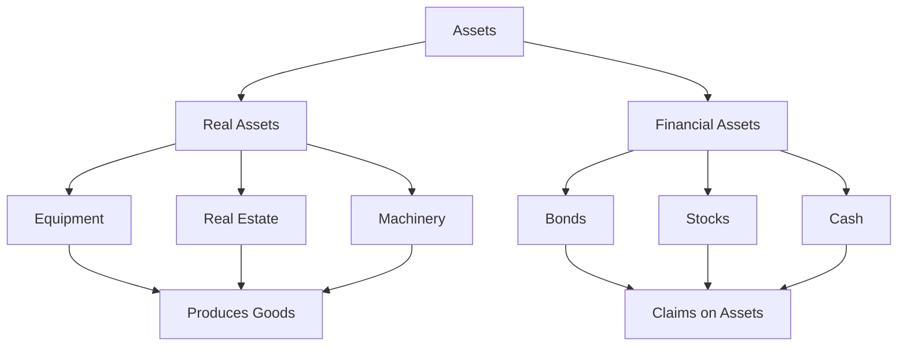
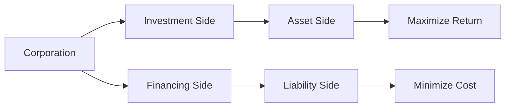
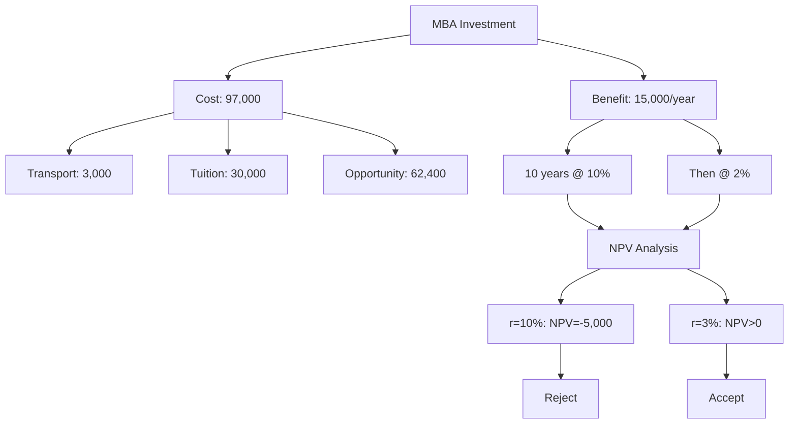

# Lecture 1: Introduction to Finance

## What is Finance?

Finance is about **business activity patterns** - every business acquires and discloses assets.

### Core Question
**What do we study in finance?**

**Decision making** regarding:
- How to finance ourselves
- Which investments to make

## Types of Finance

### Personal Finance
- Life goal management
- Risk management
- Budgeting and cash flow
- Credit management
- Insurance and retirement planning

### Corporate Finance (95% of course)
- Investment decisions
- Financing decisions
- Capital structure
- Dividend policy

### Public Finance
- Government financial decisions

---

## Real vs Financial Assets

### Real Assets
**Definition**: Assets that produce other assets or income

**Examples**:
- Manufacturing equipment
- Real estate
- Land
- Machinery
- Buildings

**Key**: Can be used to create products and generate income

**Simple Example**: A pizza oven in a restaurant - it directly produces pizzas (goods) that generate income

### Financial Assets
**Definition**: Claims on real assets or other financial assets

**Examples**:
- Bonds and stocks
- Cash (claim against central bank)
- Certificates of ownership

**Key**: Represent ownership/claims, don't directly produce goods

**Simple Example**: A stock certificate of Apple - it doesn't produce iPhones directly, but gives you ownership claim to Apple's real assets (factories, equipment, etc.)



---

## Corporate Decisions

Every corporation has **two main decision types**:

### 1. Investment Decisions
**Question**: What should we do with our money?

**Examples**:
- Invest \$100B in S&P 500 index
- Build new facilities
- Acquire companies

**Goal**: Maximize return given risk

**Simple Example**: Apple deciding whether to build a new iPhone factory in China or invest the money in R&D

### 2. Financing Decisions
**Question**: Where does the money come from?

**Options**:
- **Debt**: Borrowing (bonds, loans)
- **Equity**: Selling ownership (stocks)

**Goal**: Minimize financing cost

**Simple Example**: Tesla needs \$1B for new factory - should they borrow from banks (debt) or sell more Tesla stock (equity)?



---

## Time Value of Money

### Core Principle
**\$100 today ≠ \$100 in one year**

Even with:
- No inflation
- No credit risk
- Perfect certainty

### Why?
1. **Opportunity Cost**: Money can be invested today
2. **Consumption Preference**: People prefer current consumption
3. **Real Interest Rate**: Compensation for deferring consumption

### Example
- Invest \$100 at 10% for 1 year
- Year 1: $100 \times 1.10 = 110$
- Year 2: $110 \times 1.10 = 121$ (not \$120!)

**Compound Interest**: Interest on interest

**Simple Analogy**: Like a snowball rolling down a hill - it gets bigger as it rolls because it picks up more snow (interest) on top of the snow it already has

---

## NPV and Decision Making

### Net Present Value

```math
\text{NPV} = \text{Present Value of Future Cash Flows} - \text{Initial Investment}
```

### Present Value

```math
\text{PV} = \frac{\text{Future Value}}{(1 + r)^t}
```

Where:
- **r** = Discount rate (required return)
- **t** = Time period

### Decision Rules
- **NPV > 0**: Accept project
- **NPV < 0**: Reject project
- **NPV = 0**: Indifferent

**Simple Example**: If you can invest \$100 and get \$110 back (NPV = +\$10), you should do it. If you only get \$90 back (NPV = -\$10), don't do it.

### Mutually Exclusive Projects
**Rule**: Choose project with **highest NPV**

**Examples**:
- Bridge vs Tunnel
- University A vs University B
- War vs Peace

**Simple Example**: You can only attend one university. Choose the one that gives you the highest NPV (best return on your investment in education).

---

## MBA Investment Example

### Scenario
Vasily considering MBA degree investment

### Investment Analysis

#### Initial Costs (Time 0)
- **Transportation**: $50 \times 60 = 3,000$ shekels
- **Tuition**: $30,000$ shekels
- **Opportunity Cost**: $12 \times 52 \times 100 = 62,400$ shekels
- **Total**: $97,000$ shekels

#### Future Benefits
- **Current Salary**: 150,000 shekels/year
- **Salary Increase**: 10% for 10 years, then 2%
- **Additional Income**: 15,000 shekels/year

#### NPV Calculation
**Assumptions**:
- 10-year horizon
- Discount rate: 10%
- Present Value of Benefits: 92,000 shekels
- **NPV**: $92,000 - 97,000 = -5,000$ shekels

**Decision**: Reject MBA

#### Sensitivity Analysis
**If discount rate = 3%**:
- Present Value increases
- NPV becomes positive
- **Decision**: Accept MBA



---

## Key Concepts

### Finance Fundamentals
- **Finance** = Investment + Financing decisions
- **Real assets** produce goods/services
- **Financial assets** represent claims
- **Time value of money** is fundamental

### Decision Framework
- **NPV Rule**: Accept positive NPV projects
- **Mutually Exclusive**: Choose highest NPV
- **Discount Rate**: Reflects opportunity cost
- **Sensitivity Analysis**: Test scenarios

### Market Structure
- **Primary Market**: New securities issuance
- **Secondary Market**: Trading existing securities
- **Intermediaries**: Connect suppliers and demanders
- **Market Makers**: Provide liquidity

### Practical Applications
- **Personal**: Life goal planning
- **Corporate**: Value maximization
- **Investment**: Risk-return analysis
- **Markets**: Efficient allocation

---


