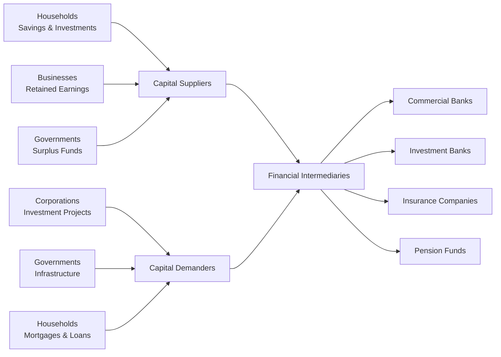
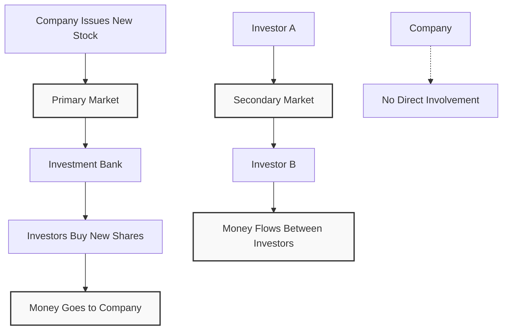

# Lecture 2: Finance Under Certainty vs Uncertainty

## Types of Finance - Q&A Review

### Personal Finance Examples
- **Fixed vs Adjustable Rate Mortgage**: Personal decision about home financing
- **401K Contribution**: Personal retirement planning decision  
- **Student Loan Choice**: Government vs private bank loans for tuition

### Corporate Finance Examples
- **Machine Purchase vs Lease**: Corporate investment decision
- **Dividend vs Reinvestment**: Corporate payout policy decision
- **LLC vs Sole Proprietorship**: Business structure choice

### Public Finance Examples
- **Municipal Bonds vs Property Taxes**: City financing for infrastructure
- **Tax Rate Increases**: Government budget management
- **Public-Private Partnerships**: Joint infrastructure projects

---

## Finance Under Certainty

**Definition**: All future cash flows are known with 100% certainty

**Example**: House investment
- **Initial Investment**: \$100,000
- **Annual Rent**: \$5,000 for 10 years
- **Sale Price**: \$105,000 after 10 years
- **Required Return**: 3%

**Decision**: Compare project return vs alternative investment

**Simple Analogy**: Like a government bond - you know exactly how much you'll get back and when. No surprises, no uncertainty.

---

## Finance Under Uncertainty

**Definition**: Future outcomes have known probabilities

**Example**: Apple stock analysis
- **Current Price**: \$100
- **Possible Outcomes**:
  - High state (10% probability): \$160 (+60% return)
  - Medium states: Various returns
  - Low state: Lower returns

**Holding Period Return:**
```math
\text{HPR} = \frac{P_1 - P_0}{P_0}
```

**Simple Analogy**: Like weather forecasting - you know there's a 30% chance of rain, 50% chance of clouds, 20% chance of sun. You don't know exactly what will happen, but you know the probabilities.

---

## Finance Under Ambiguity

**Definition**: Cannot estimate probabilities or outcomes

**Examples**:
- New payment app in country with unclear regulations
- Private company acquisition with no audited statements
- New token offering with no historical data

**Analyst's Task**: Move from ambiguity to uncertainty by gathering data

**Simple Analogy**: Like trying to predict the weather on a planet you've never been to - you have no idea what the climate is like, what the seasons are, or even if it has weather at all. You need to gather data first.

---

## Financial System Players

### Capital Suppliers
- **Households**: Net suppliers (savings, investments)
- **Exceptions**: When borrowing (mortgages, auto loans)

### Capital Demanders
- **Corporations**: Net demanders (investment, operations)
- **Governments**: Can be borrowers or lenders
  - **US**: Net borrower (deficit)
  - **China**: Net lender (surplus)
  - **Norway**: Net lender (oil reserves)



### Financial Intermediaries

**Brokers vs Dealers**:
- **Broker**: Connects buyers/sellers, earns commission
- **Dealer**: Owns inventory, takes risk, earns spread

**Simple Analogy**: 
- **Broker** = Real estate agent (doesn't own houses, just helps you buy/sell)
- **Dealer** = Car dealership (owns cars, takes risk if they can't sell them)

**Types of Intermediaries**:
- **Pension Funds**: Manage retirement savings
- **Mutual Funds**: Pool investor money
- **Insurance Companies**: Premium investments
- **Banks**: Commercial vs Investment

---

## Commercial vs Investment Banks

### Commercial Banks
- **Assets**: Loans, government bonds
- **Liabilities**: Deposits
- **Activity**: Deposit-taking and lending

### Investment Banks
- **Primary Market**: Underwriting new securities
- **Secondary Market**: Market making, trading
- **Services**: M&A, advisory, research

---

## Primary vs Secondary Markets

### Primary Market
- **IPO Process**: Company → Investment Bank → Investors
- **Book Building**: Collecting investor indications
- **Underwriting Risk**: Bank takes inventory risk

**Simple Example**: When Tesla first went public, they sold new shares to investors through investment banks (primary market)



### Secondary Market
- **Exchange Trading**: Centralized, automated
- **OTC Trading**: Direct between parties
- **Market Makers**: Provide liquidity with bid-ask spreads

**Simple Example**: When you buy Tesla stock today on Robinhood, you're buying from another investor, not from Tesla (secondary market)

---

## Five Tasks of Financial Manager

1. **Raise Cash**: Sell financial assets (debt/equity)
2. **Invest Cash**: Buy real assets (equipment, facilities)
3. **Generate Cash**: Operations create profits
4. **Manage Cash**: Reinvest or distribute
5. **Risk Management**: Balance growth vs stability

---

## Goal of Financial Manager

**Primary Objective**: Maximize shareholder value

**Why Shareholders?**
- **Residual Claimants**: Last to be paid
- **Risk Takers**: Bear most uncertainty
- **Value Maximization**: Benefits all stakeholders

**Payment Hierarchy**:
1. **Government**: Taxes (mandatory)
2. **Debt Holders**: Interest and principal (contractual)
3. **Shareholders**: Dividends (discretionary)

**Simple Analogy**: Like a restaurant - first you pay taxes to the government, then you pay your suppliers (debt holders), and only if there's money left do you pay yourself (shareholders get dividends)

---


