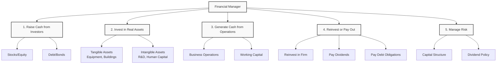
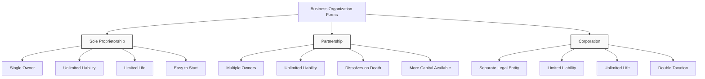
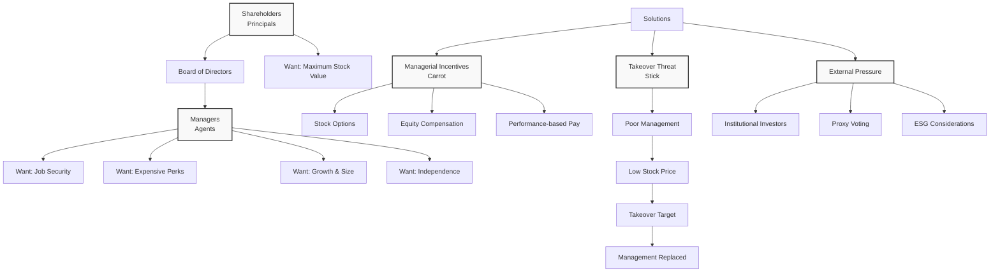

# Lecture 3: Financial Manager Tasks and Business Organization

### Administrative Notes
- **Session Duration**: 1 hour (back-to-back with Professor Mugerman)
- **Quiz 1**: Split into two parts
  - Part 1: Due September 1st (10-11 days)
  - Part 2: Due after Monday's class (additional 10 days)
- **Each Quiz**: Maximum 30 minutes
- **Participation**: Active participation encouraged for points

### Five Tasks of Financial Manager

#### 1. Raise Cash from Investors
- **Method**: Selling financial assets
- **Types**: Stocks (equity) or loans (debt/bonds)
- **Stock Terms**: Equity, shares, residual claims
- **Why "Residual"**: Shareholders are last in payment line

#### 2. Invest in Real Assets
- **Tangible**: Equipment, buildings, infrastructure
- **Intangible**: R&D, human capital, intellectual property
- **Example - Google**: Main investments in R&D and cloud infrastructure
- **Decision**: How to allocate money between different assets

#### 3. Generate Cash from Operations
- **Source**: Business activities create cash flow
- **Management**: Working capital decisions
- **Example**: Google generates cash from advertising operations

#### 4. Reinvest or Pay Out
- **Options**:
  - Reinvest in the firm (growth opportunities)
  - Pay dividends to stockholders (discretionary)
  - Pay debt obligations (mandatory)
- **Decision Framework**: Compare internal vs. external investment returns

#### 5. Manage Risk
- **Capital Structure**: Debt vs. equity mix
- **Dividend Policy**: Affects firm's risk profile
- **Example**: High dividend payout may reduce growth opportunities

### Types of Financial Assets

#### Stocks (Equity)
- **Common Stock**: Voting rights, residual claims
- **Preferred Stock**: Senior to common, usually no voting rights
- **Dual Class Structure**: Different voting rights (e.g., Meta)
  - Class A: 1 vote per share
  - Class B: 10 votes per share (held by Zuckerberg)
- **Payment**: Discretionary dividends

#### Bonds (Debt)
- **Seniority**: Higher priority than equity
- **Payment**: Mandatory principal and interest
- **Recovery**: In bankruptcy, debt holders paid first
- **Risk**: Lower risk than equity

### Three Types of Financial Decisions

#### 1. Capital Budgeting
- **Question**: What long-term investment projects should we take?
- **Focus**: Investment decisions (activities 2 & 3)

#### 2. Capital Structure
- **Question**: How should we pay for assets? Debt or equity?
- **Focus**: Financing decisions (activities 1, 4 & 5)

#### 3. Working Capital Management
- **Question**: How do we manage day-to-day finances?
- **Focus**: Short-term vs. long-term finance

### Forms of Business Organization

#### 1. Sole Proprietorship
- **Characteristics**: Single owner, easy to start
- **Advantages**: 
  - Less regulated
  - Keep all profits
  - Taxed once (personal income)
- **Disadvantages**:
  - Limited to owner's life
  - Limited capital (personal wealth only)
  - **Unlimited liability**: Personal assets at risk
  - Difficult to sell ownership

#### 2. Partnership
- **Characteristics**: Two or more owners
- **Advantages**: More capital available, relatively easy to start
- **Disadvantages**:
  - **Unlimited liability**: All partners personally liable
  - Dissolves when partner dies or leaves
  - Difficult to transfer ownership
- **Example**: Law firms, dental practices

#### 3. Corporation
- **Characteristics**: Separate legal entity
- **Advantages**:
  - **Limited liability**: Personal assets protected
  - **Unlimited life**: Continues beyond founders
  - Easy to raise capital (IPO, stock issuance)
  - Easy to transfer ownership (stock trading)
- **Disadvantages**:
  - **Double taxation**: Corporate tax + personal tax on dividends
  - Separation of ownership and management
  - More regulation

### Limited Liability Example
**Scenario**: Company invests \$100M in S&P 500, financed by \$80M debt
- **If S&P 500 drops 50%**: Assets worth \$50M, owe \$80M
- **Corporation**: Debt holders get \$50M, cannot sue shareholders personally
- **Partnership**: Debt holders can sue partners personally for remaining \$30M

### Goal of Financial Management
**Primary Goal**: Maximize current value of company's stock
- **Not**: Maximize profit, minimize cost, or maximize market share
- **Rationale**: Stock price reflects all future cash flows
- **Example**: Investing in R&D may reduce current profit but increase future value

### Agency Problem
**Definition**: Conflict between shareholders (principals) and managers (agents)

#### Manager Incentives vs. Shareholder Goals
- **Managers may want**:
  - Expensive perks (corporate jets, luxury)
  - Job security (avoid risky projects)
  - Growth and size (more employees, bigger company)
  - Independence from shareholder control
- **Shareholders want**: Maximum stock value

#### Solutions to Agency Problem
1. **Managerial Incentives** (Carrot):
   - Stock options
   - Equity compensation
   - Performance-based pay

2. **Takeover Threat** (Stick):
   - Poor management → low stock price
   - Company becomes takeover target
   - New owners replace management

3. **External Pressure**:
   - Institutional investors (pension funds)
   - Proxy voting
   - ESG considerations

### ESG (Environmental, Social, Governance)
**Definition**: Framework for evaluating company's impact beyond financial metrics

#### Components
- **Environmental**: Climate impact, sustainability
- **Social**: Employee treatment, community impact
- **Governance**: Corporate ethics, transparency

#### Examples
- **Environmental**: Carbon footprint, renewable energy
- **Social**: Diversity, fair labor practices
- **Governance**: Executive compensation, board independence

### Ethical Considerations
**Question**: Is maximizing shareholder value always ethical?

#### Examples
- **Tobacco companies**: Legal but harmful products
- **Microsoft**: Anti-competitive practices
- **Google**: Delayed AI development to protect search business

#### Balance
- **Traditional view**: Maximize shareholder value
- **Modern view**: Consider all stakeholders
- **ESG integration**: Value creation with responsibility

### Key Takeaways
1. **Financial manager's role**: Bridge between investors and operations
2. **Decision framework**: Investment, financing, and working capital
3. **Business forms**: Trade-offs between liability, taxation, and flexibility
4. **Agency problem**: Align manager and shareholder interests
5. **Modern finance**: Balance profit with social responsibility

### Review Questions
1. **Three types of financial decisions**: Capital budgeting, capital structure, working capital
2. **Three business forms**: Corporation, partnership, sole proprietorship
3. **Goal of financial management**: Maximize current stock value
4. **Agency problem**: Conflict between managers and shareholders
5. **Primary vs. secondary markets**: Issuer vs. investor trading

---

---

