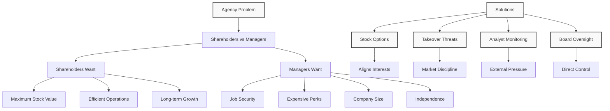
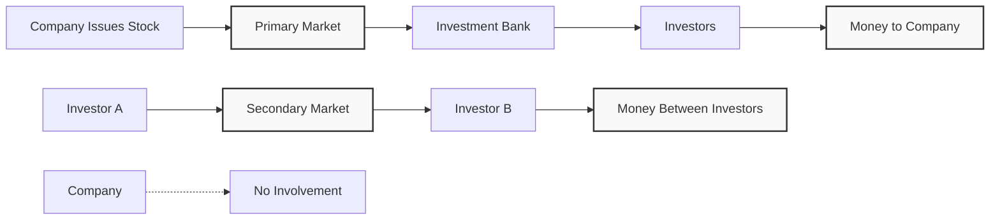
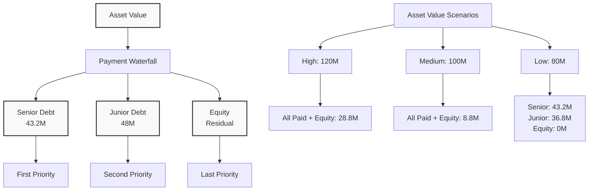
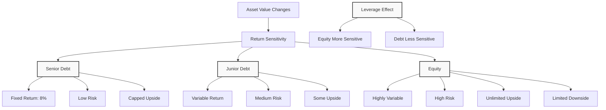

# Lecture 4: Financial Assets and Capital Structure

### Quiz Review and Financial Assets

#### Financial Assets vs Real Assets
**Key Question**: What are examples of financial assets?

**Financial Assets** (represent claims on real assets):
- Government bonds
- Corporate bonds  
- Stock index funds
- Stock options
- Corporate debt

**Real Assets** (produce goods/services):
- Land
- Real estate
- Equipment
- Buildings

**Simple Rule**: If it produces something directly, it's a real asset. If it represents ownership or a claim, it's a financial asset.

#### Investment Banks vs Commercial Banks

**Investment Banks**:
- Help companies raise capital by selling securities
- Underwrite new stock/bond offerings
- Provide M&A advisory services
- Don't take deposits

**Commercial Banks**:
- Handle deposits and loans
- Take deposits from customers
- Make loans to individuals and businesses
- Regulated differently than investment banks

**Credit Unions**:
- Non-profit organizations
- Members-only (employees of specific companies, residents of specific areas)
- Use member deposits to lend only to other members
- Any "profit" distributed back to members

### Agency Problem Mechanisms

**Question**: What mechanisms mitigate agency problems between shareholders and managers?

#### Effective Mechanisms:
1. **Stock Options**: Align manager compensation with stock performance
2. **Management Replacement**: Board can fire underperforming managers
3. **Security Analyst Monitoring**: External analysts monitor company performance
4. **Takeover Threats**: Poor performance makes company acquisition target

#### Ineffective Mechanisms:
- **Nepotism**: Hiring family members doesn't solve agency problems
- **Anti-takeover Provisions**: Protect management, not shareholders



### Primary vs Secondary Markets

#### Primary Market
- **Definition**: Trading of newly issued securities
- **Process**: Company → Investment Bank → Investors
- **Money Flow**: Money goes to the issuing company
- **Example**: IPO (Initial Public Offering)

#### Secondary Market  
- **Definition**: Trading of previously issued securities
- **Process**: Investor A → Market → Investor B
- **Money Flow**: Money flows between investors
- **Example**: Buying Tesla stock on Robinhood

**Key Insight**: In secondary markets, the company doesn't receive any money from the transaction.



### Capital Structure Example

#### Business Setup
**Scenario**: Partnership to invest in S&P 500 index
- **Initial Capital**: \$20 million (equity)
- **Debt Financing**: \$80 million
- **Total Investment**: \$100 million in S&P 500
- **Time Horizon**: 1 year

#### Capital Structure Details

**Senior Debt**:
- **Face Value**: \$40 million
- **Coupon Rate**: 8%
- **Coupon Payment**: \$3.2 million
- **Total Payment**: \$43.2 million (face value + coupon)
- **Priority**: First to be paid

**Junior/Subordinated Debt**:
- **Face Value**: \$40 million  
- **Coupon Rate**: 20%
- **Coupon Payment**: \$8 million
- **Total Payment**: \$48 million (face value + coupon)
- **Priority**: Second to be paid

**Equity**:
- **Initial Investment**: \$20 million
- **Priority**: Last to be paid (residual claimant)

#### Payment Waterfall Analogy

Think of payments like a waterfall with buckets:

1. **Senior Debt Bucket**: 43.2 liters capacity
2. **Junior Debt Bucket**: 48 liters capacity  
3. **Equity Bucket**: Unlimited capacity (gets remaining water)

**Payment Order**:
1. Fill senior debt bucket completely
2. Fill junior debt bucket completely
3. Remaining water goes to equity holders



### Payoff Functions and Risk Analysis

#### Scenario Analysis

**Scenario 1: S&P 500 +20% (Assets = \$120M)**
- **Senior Debt**: Receives \$43.2M (8% return)
- **Junior Debt**: Receives \$48M (20% return)
- **Equity**: Receives \$28.8M (44% return)

**Scenario 2: S&P 500 0% (Assets = \$100M)**
- **Senior Debt**: Receives \$43.2M (8% return)
- **Junior Debt**: Receives \$48M (20% return)
- **Equity**: Receives \$8.8M (-56% return)

**Scenario 3: S&P 500 -20% (Assets = \$80M)**
- **Senior Debt**: Receives \$43.2M (8% return)
- **Junior Debt**: Receives \$36.8M (-8% return)
- **Equity**: Receives \$0M (-100% return)

#### Key Insights

**Leverage Effect**:
- **Equity return** is more sensitive to asset value changes
- **Debt returns** are capped by coupon rates
- **Equity has unlimited upside** but limited downside (to zero)

**Risk-Return Trade-off**:
- **Senior Debt**: Lowest risk, lowest return
- **Junior Debt**: Medium risk, medium return
- **Equity**: Highest risk, highest potential return



#### Payoff Functions (Mathematical)

**Senior Debt Payoff**:
```math
\text{Payoff} = \min(\text{Asset Value}, 43.2)
```

**Junior Debt Payoff**:
```math
\text{Payoff} = \min(\max(\text{Asset Value} - 43.2, 0), 48)
```

**Equity Payoff**:
```math
\text{Payoff} = \max(\text{Asset Value} - 91.2, 0)
```

#### Default and Bankruptcy

**When Assets < Total Debt (\$91.2M)**:
- **Equity value = 0** (limited liability)
- **Debt holders** become new owners
- **Absolute Priority Rule**: Senior debt paid first, then junior debt
- **Stockholders** lose everything but don't owe additional money

**Key Concept**: Limited liability protects shareholders from personal losses beyond their initial investment.

### Key Takeaways

1. **Financial vs Real Assets**: Financial assets represent claims; real assets produce goods/services

2. **Agency Problem Solutions**: Stock options, takeover threats, analyst monitoring, and board oversight

3. **Market Types**: Primary markets fund companies; secondary markets trade existing securities

4. **Capital Structure**: Different securities have different risk-return profiles and payment priorities

5. **Leverage Effect**: Equity is more sensitive to asset value changes than debt

6. **Limited Liability**: Shareholders' losses are limited to their initial investment

7. **Payment Priority**: Senior debt → Junior debt → Equity (residual claimant)

8. **Risk-Return Trade-off**: Higher priority = lower risk = lower return potential

---

---

