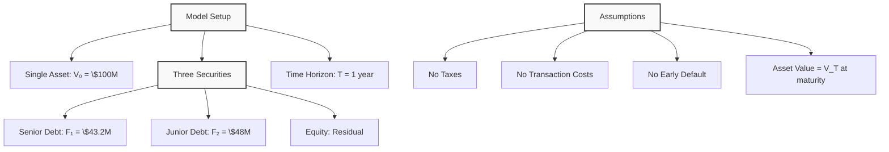
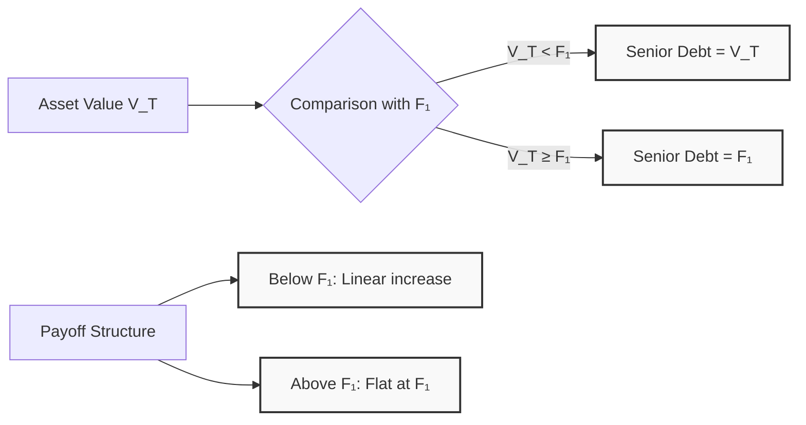
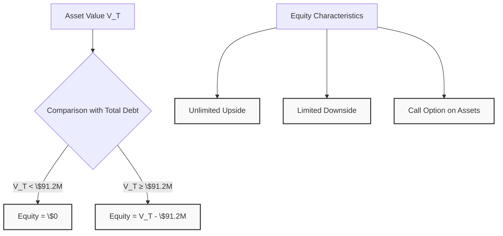
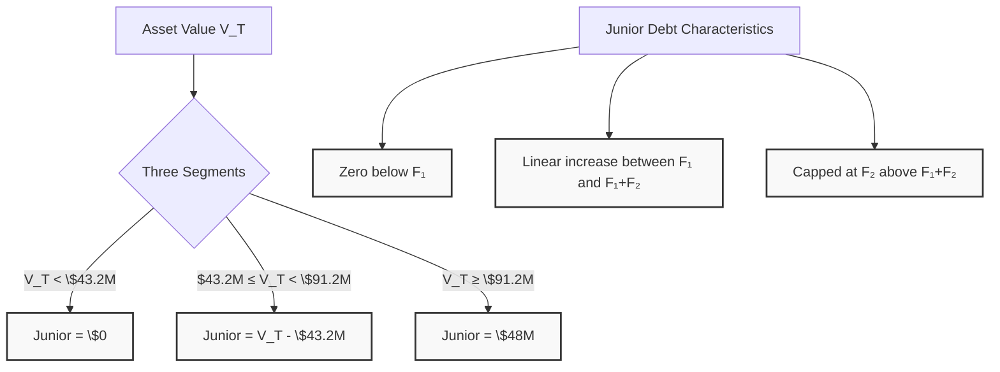
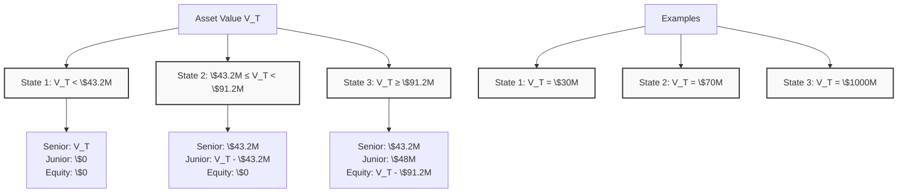

# Lecture 5: Contingent Claim Approach

### Introduction to Merton's Model

**Background**: Developed by Robert Merton (Nobel Prize winner) in 1974

**Purpose**: The contingent claim approach shows not just the payoff of different securities, but also how to price them using options (call and put options).

**Focus for Today**: We will focus on **payoff functions** and **replication equations** that express the value of securities at future time, not current pricing.

**Connection to Previous Session**: Builds directly on the simple corporation example from Lecture 4 with S&P 500 investment financed by three securities.

### Model Setup and Assumptions

#### Basic Setup
- **Single Asset**: Company invests in one asset with current market value V₀
- **Our Example**: V₀ = \$100 million (S&P 500 investment)
- **Maturity**: T = 1 year
- **Asset Value at Maturity**: V_T (stochastic variable)

#### Key Assumptions
1. **No Taxes**: No tax implications
2. **No Transaction Costs**: No bid-ask spreads
3. **No Early Default**: Default can only occur at maturity
4. **Risk-Free Rate**: Continuous compounding (not crucial for our calculations)
5. **Asset Dynamics**: Asset value changes according to drift and volatility



### Payoff Functions for Different Securities

#### Senior Debt Payoff (F₁)
- **Face Value**: \$40 million
- **Coupon Payment**: \$3.2 million
- **Total Promised Payment**: F₁ = \$43.2 million

#### Junior Debt Payoff (F₂)
- **Face Value**: \$40 million
- **Coupon Payment**: \$8 million
- **Total Promised Payment**: F₂ = \$48 million

#### Total Debt Obligation
- **Total Owed**: F₁ + F₂ = \$91.2 million
- **Payment Waterfall**: Senior first, then junior, then equity (residual)

### Senior Debt Payoff Analysis

#### Payoff Function
```math
\text{Senior Debt Payoff} = \min(V_T, F_1)
```

Where:
- V_T = Asset value at maturity
- F₁ = \$43.2 million (promised payment)

#### Two Scenarios
1. **V_T < F₁**: Senior debt receives V_T (partial payment)
2. **V_T ≥ F₁**: Senior debt receives F₁ (full payment)

#### Alternative Expression
```math
\text{Senior Debt Payoff} = V_T - \max(V_T - F_1, 0)
```

This shows that senior debt is equivalent to:
- **Risk-free bond** paying F₁
- **Minus a put option** on V with strike price F₁



### Equity Payoff Analysis

#### Payoff Function
```math
\text{Equity Payoff} = \max(V_T - (F_1 + F_2), 0)
```

Where:
- F₁ + F₂ = \$91.2 million (total debt obligation)

#### Interpretation
- **Below \$91.2M**: Equity receives \$0 (limited liability)
- **Above \$91.2M**: Equity receives residual (V_T - \$91.2M)

#### Key Characteristics
- **Unlimited upside potential**
- **Limited downside** (cannot go below zero)
- **Call option-like payoff** on the firm's assets



### Junior Debt Payoff Analysis

#### Direct Calculation Method
```math
\text{Junior Debt} = V_T - \text{Senior Debt} - \text{Equity}
```

This uses the accounting identity: **Assets = Liabilities**

#### Complex Payoff Function
```math
\text{Junior Debt} = \min(F_2, \max(V_T - F_1, 0))
```

Where:
- F₂ = \$48 million (promised payment)
- F₁ = \$43.2 million (senior debt payment)

#### Three Segments
1. **V_T < F₁**: Junior debt = \$0
2. **F₁ ≤ V_T < F₁ + F₂**: Junior debt = V_T - F₁ (linear increase)
3. **V_T ≥ F₁ + F₂**: Junior debt = F₂ (capped at promised amount)



### Three-State Analysis Framework

#### State 1: V_T < F₁ (Below \$43.2M)
**Example**: V_T = \$30M
- **Senior Debt**: Receives \$30M (all available assets)
- **Junior Debt**: Receives \$0
- **Equity**: Receives \$0

#### State 2: F₁ ≤ V_T < F₁ + F₂ (Between \$43.2M and \$91.2M)
**Example**: V_T = \$70M
- **Senior Debt**: Receives \$43.2M (full promised payment)
- **Junior Debt**: Receives \$26.8M (V_T - F₁ = \$70M - \$43.2M)
- **Equity**: Receives \$0

#### State 3: V_T ≥ F₁ + F₂ (Above \$91.2M)
**Example**: V_T = \$1000M
- **Senior Debt**: Receives \$43.2M (full promised payment)
- **Junior Debt**: Receives \$48M (full promised payment)
- **Equity**: Receives \$908.8M (V_T - F₁ - F₂ = \$1000M - \$91.2M)



### Key Takeaways

1. **Merton's Model**: Nobel Prize-winning framework for analyzing corporate securities as contingent claims

2. **Payoff Functions**: Each security has a mathematical payoff function based on asset value at maturity

3. **Senior Debt**: min(V_T, F₁) - receives promised payment or all available assets, whichever is less

4. **Equity**: max(V_T - (F₁ + F₂), 0) - call option on firm's assets with strike price equal to total debt

5. **Junior Debt**: Can be calculated directly using accounting identity or complex payoff function

6. **Three-State Framework**: Systematic way to analyze payoffs across different asset value scenarios

7. **Limited Liability**: Equity holders cannot lose more than their initial investment

8. **Payment Priority**: Senior debt → Junior debt → Equity (residual claimant)

9. **Risk-Return Trade-off**: Higher priority securities have lower risk and lower return potential

10. **Mathematical Approach**: Provides precise framework for understanding security payoffs and relationships

---

---

