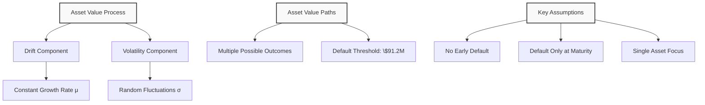
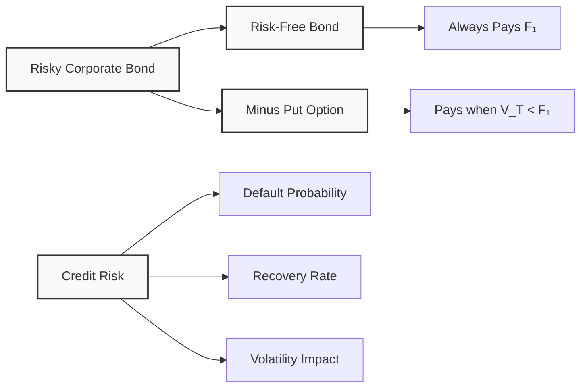
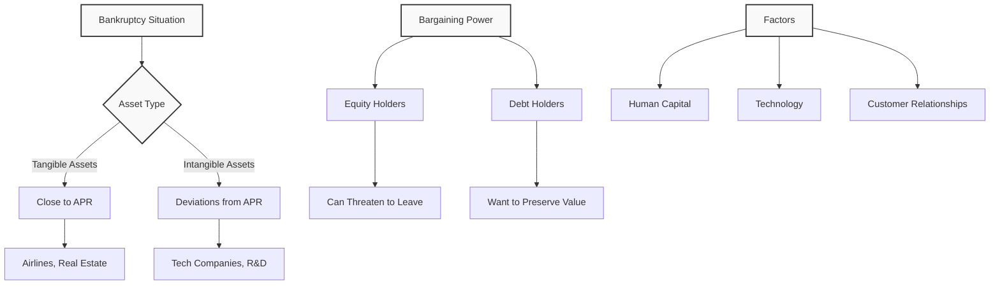
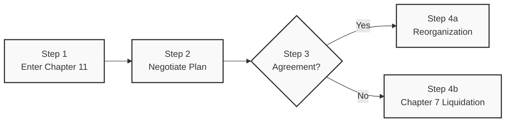

# Lecture 6: Replication and Bankruptcy Analysis

### Replication Approach

**Merton's Key Insight**: The contingent claim approach shows not just payoffs, but how to **price** securities by replicating them with traded assets.

**Law of One Price**: If two securities have identical payoffs, they must have identical prices.

**Replication Strategy**: Express corporate securities in terms of:
- **Risk-free bonds** (fixed payments)
- **Options** (call and put options)
- **Other traded securities**

**Practical Application**: Since we don't know how to price corporate bonds directly, we find other securities with the same payoff and use their prices.

### Asset Value Dynamics

#### Geometric Brownian Motion
**Model**: Asset values follow a stochastic process with two components:

1. **Drift (μ)**: Constant upward trend
2. **Volatility (σ)**: Random fluctuations

**Mathematical Representation**:
```math
dV = \mu V \, dt + \sigma V \, dW
```

Where:
- **V** = Asset value
- **μ** = Expected return (drift)
- **σ** = Volatility
- **dW** = Random shock (Brownian motion)

#### Visual Representation
- **X-axis**: Time
- **Y-axis**: Asset value
- **Starting Point**: V₀ (initial value)
- **Multiple Paths**: Various possible future values
- **Default Threshold**: F₁ + F₂ = \$91.2M



### Risk-Free vs Risky Debt

#### Risk-Free Debt
**Characteristics**:
- **Government bonds** denominated in local currency
- **Fixed payment** regardless of economic conditions
- **No credit risk** (government can print money)
- **Example**: US Treasury bills

**Payoff**: Always receives promised amount (e.g., \$43.2M)

#### Risky Corporate Debt
**Characteristics**:
- **Corporate bonds** with credit risk
- **Payment depends** on firm's asset value
- **Default risk** when assets < liabilities
- **Example**: Our S&P 500 investment firm

**Payoff**: min(V_T, F₁) - receives promised amount or all available assets

#### Key Difference
**Risk-free debt**: Always pays \$43.2M
**Risky debt**: Pays \$43.2M only if V_T ≥ \$43.2M, otherwise pays V_T

### Put Options and Credit Risk

#### Mathematical Relationship
**Risky Bond = Risk-Free Bond - Put Option**

**Senior Debt Payoff**:
```math
\min(V_T, F_1) = F_1 - \max(F_1 - V_T, 0)
```

Where:
- **F₁** = Risk-free bond paying \$43.2M
- **max(F₁ - V_T, 0)** = Put option on firm's assets

#### Interpretation
- **Risk-free bond**: Always pays \$43.2M
- **Put option**: Pays (F₁ - V_T) when V_T < F₁, zero otherwise
- **Net result**: Risky bond receives F₁ when V_T ≥ F₁, V_T when V_T < F₁

#### Market Trading
- **Put options** are traded on CBOE (Chicago Board Options Exchange)
- **Credit default swaps** are similar instruments
- **Pricing**: Risky bonds are cheaper than risk-free bonds



### Absolute Priority Rule (APR)

#### Definition
**Absolute Priority Rule**: In bankruptcy, claims are paid in strict order of seniority.

#### Payment Order
1. **Senior Debt**: First priority
2. **Junior Debt**: Second priority  
3. **Equity**: Residual claimant (last)

#### Example: Single Debt Case
**Scenario**: Firm with \$100M debt, \$70M assets
- **According to APR**: Debt holders get \$70M, equity gets \$0
- **Result**: Debt holders become new owners, equity holders are wiped out

#### Key Principle
**Assets = Liabilities**: The accounting identity must always hold.

### Deviations from APR

#### When Deviations Occur
**Real-world situations** where APR is violated:

1. **Intangible Assets**: High value in human capital, technology, relationships
2. **Bargaining Power**: Equity holders can threaten to leave
3. **Bankruptcy Costs**: Additional costs if firm is liquidated
4. **Going Concern Value**: Firm worth more as ongoing business

#### Example: Tech Company
**Scenario**: Firm owes \$100M, has \$70M assets, but founders control key technology

**Threat**: If equity holders leave, firm value drops to \$30M
**Bargaining**: Equity holders demand \$10M to stay
**Result**: Debt holders agree to reorganization to preserve value

#### Factors Affecting Deviations
- **Asset Tangibility**: More tangible assets → closer to APR
- **Human Capital**: More intangible assets → larger deviations
- **Industry Type**: Airlines (tangible) vs Tech (intangible)



### Bankruptcy Procedures

#### US Bankruptcy Code
**Two Main Procedures**:

1. **Chapter 11**: Reorganization
   - Firm continues operating
   - 90-180 days to negotiate
   - Debt and equity holders bargain
   - Judge can extend negotiation period

2. **Chapter 7**: Liquidation
   - Firm ceases to exist
   - Assets sold off
   - Proceeds distributed according to APR
   - Judge can "cram down" if no agreement

#### Decision Process

**Step 1**: Enter bankruptcy (Chapter 11)
**Step 2**: Negotiate reorganization plan
**Step 3**: If agreement reached → Reorganization
**Step 4**: If no agreement → Chapter 7 liquidation



#### Key Players
- **Debt Holders**: Want maximum recovery
- **Equity Holders**: Want to preserve some value
- **Judge**: Can force decisions if no agreement
- **Employees**: Affected by outcome

#### Time Value of Money
**Deferred Payments**: Sometimes equivalent to reduced payments
- **Example**: \$70M now vs \$70M in 15 years
- **Present Value**: Deferred payment worth less today
- **Bargaining Tool**: Debt holders may accept deferred payments

### Key Takeaways

1. **Replication Approach**: Corporate securities can be replicated using traded assets (bonds, options)

2. **Law of One Price**: Identical payoffs imply identical prices

3. **Asset Dynamics**: Asset values follow stochastic processes with drift and volatility

4. **Risk-Free vs Risky**: Government bonds are risk-free; corporate bonds have credit risk

5. **Put Options**: Credit risk can be modeled as put options on firm's assets

6. **Absolute Priority Rule**: Theoretical payment order in bankruptcy

7. **APR Deviations**: Real-world deviations occur due to bargaining power and intangible assets

8. **Bankruptcy Procedures**: Chapter 11 (reorganization) vs Chapter 7 (liquidation)

9. **Bargaining Power**: Equity holders' power increases with intangible assets

10. **Time Value**: Deferred payments can be equivalent to reduced payments

11. **Industry Differences**: Tangible asset firms closer to APR than intangible asset firms

12. **Practical Applications**: Understanding these concepts helps analyze real-world bankruptcy situations

---

---

