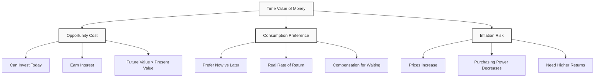
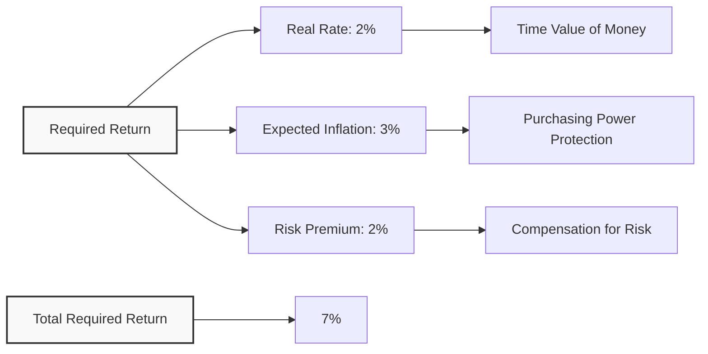
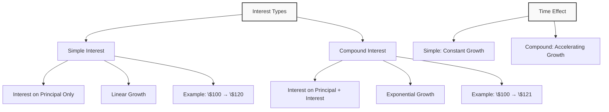
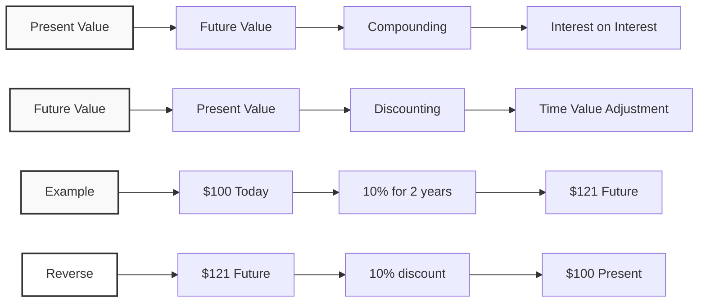
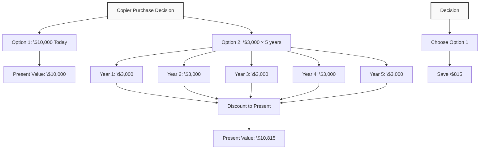
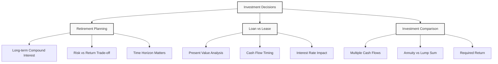

# Lecture 7: Time Value of Money

### Introduction to Time Value of Money

**Core Principle**: Money today is worth more than the same amount of money in the future.

**Why This Matters**: In finance, we need to compare cash flows that happen at different times. We cannot simply add \$100 today + \$100 next year = \$200. We must account for the time value of money.

**Simple Example**: 
- Would you rather have \$100 today or \$100 in one year?
- Most people choose \$100 today because they can invest it and have more than \$100 in one year.

### Why Money Has Time Value

#### 1. Opportunity Cost
**Definition**: The cost of giving up the next best alternative.

**Example**: If you have \$100 today, you can:
- Buy something now
- Invest it and earn interest
- Save it for future use

**Simple Analogy**: Like choosing between eating a cookie now or saving it for later. The cookie now has more value because you can enjoy it immediately.

#### 2. Consumption Preference
**Definition**: People prefer to consume goods and services now rather than later.

**Example**: A child asking for gum:
- "Give me one gum now, and I'll give you two gums tomorrow"
- This shows natural preference for current consumption

**Real Rate of Return**: The compensation for delaying consumption, even without inflation or risk.

#### 3. Inflation Risk
**Definition**: The risk that prices will increase over time, reducing purchasing power.

**Example**: 
- Today: \$100 can buy 100 apples at \$1 each
- Next year: \$100 can only buy 50 apples at \$2 each
- Inflation rate: 100%

**Simple Analogy**: Like a shrinking shopping cart - the same amount of money buys fewer items over time.



### Components of Required Return

```math
\text{Required Return} = \text{Real Rate} + \text{Expected Inflation} + \text{Risk Premium}
```

#### 1. Real Rate of Return
**Definition**: Compensation for delaying consumption, without inflation or risk.

**Characteristics**:
- Usually stable over time
- Varies by country and time period
- Determined by people's risk preferences

**Example**: 2-3% real rate is common in developed countries.

#### 2. Expected Inflation
**Definition**: The expected increase in prices over the investment period.

**Types of Inflation**:
- **Supply-side inflation**: When production decreases (e.g., bad weather reduces apple harvest)
- **Demand-side inflation**: When money supply increases (e.g., government prints more money)

**Example**: If expected inflation is 3%, you need 3% higher return to maintain purchasing power.

#### 3. Risk Premium
**Definition**: Additional return required for taking on risk.

**Types of Risk**:
- **Credit risk**: Risk of default (corporate bonds vs government bonds)
- **Inflation risk premium**: Uncertainty about future inflation
- **Market risk**: General market fluctuations

**Example**: Corporate bonds pay higher interest than government bonds because of credit risk.



### Simple vs Compound Interest

#### Simple Interest
**Definition**: Interest calculated only on the principal amount.

```math
\text{Interest} = \text{Principal} \times \text{Rate} \times \text{Time}
```

**Example**: \$100 at 10% simple interest for 2 years
- Year 1: $100 \times 10\% = 10$ interest
- Year 2: $100 \times 10\% = 10$ interest
- Total: $100 + 20 = 120$

#### Compound Interest
**Definition**: Interest calculated on principal plus previously earned interest.

```math
\text{Future Value} = \text{Principal} \times (1 + \text{Rate})^{\text{Time}}
```

**Example**: \$100 at 10% compound interest for 2 years
- Year 1: $100 \times 1.10 = 110$
- Year 2: $110 \times 1.10 = 121$
- Total: $121$

**Key Difference**: Compound interest earns "interest on interest"



### Present Value and Future Value

#### Future Value (FV)
**Definition**: The value of money at a future date.

```math
\text{FV} = \text{PV} \times (1 + r)^t
```

Where:
- **PV** = Present Value (money today)
- **r** = Interest rate (required return)
- **t** = Time period

**Example**: \$100 today at 10% for 2 years
- $\text{FV} = 100 \times (1.10)^2 = 100 \times 1.21 = 121$

#### Present Value (PV)
**Definition**: The value today of money to be received in the future.

```math
\text{PV} = \frac{\text{FV}}{(1 + r)^t}
```

**Example**: \$121 in 2 years at 10% discount rate
- $\text{PV} = \frac{121}{(1.10)^2} = \frac{121}{1.21} = 100$

**Key Insight**: Discounting is the reverse of compounding.

#### Practical Example: Office Lease Decision

**Scenario**: Infosoft company needs office space
- **Option 1**: Pay \$500,000 in 10 years
- **Option 2**: Pay some amount today
- **Required return**: 10%

**Question**: What amount today makes you indifferent between the two options?

**Solution**:
- $\text{PV} = \frac{500,000}{(1.10)^{10}}$
- $\text{PV} = \frac{500,000}{2.594}$
- $\text{PV} = 192,772$

**Decision Rule**: 
- If asked to pay less than \$192,772 today → Choose today's payment
- If asked to pay more than \$192,772 today → Choose future payment



### Annuities

#### Definition
**Annuity**: A series of equal payments made at regular intervals.

**Examples**:
- Monthly rent payments
- Annual insurance premiums
- Retirement account withdrawals
- Loan payments

#### Types of Annuities

**1. Ordinary Annuity**: Payments made at the end of each period
**2. Annuity Due**: Payments made at the beginning of each period

#### Present Value of Annuity

```math
\text{PV of Annuity} = \text{Payment} \times \frac{1 - (1 + r)^{-n}}{r}
```

Where:
- **Payment** = Regular payment amount
- **r** = Interest rate per period
- **n** = Number of periods

#### Practical Example: Copier Purchase Decision

**Scenario**: Infosoft needs a copier
- **Option 1**: Pay \$10,000 cash today
- **Option 2**: Pay \$3,000 per year for 5 years
- **Required return**: 12%

**Question**: Which option is cheaper?

**Solution - Option 2 (Annuity)**:
- Payment = \$3,000
- $r = 12\% = 0.12$
- $n = 5$ years

**Step 1**: Calculate $(1 + r)^{-n}$
- $(1.12)^{-5} = 0.567$

**Step 2**: Calculate $1 - (1 + r)^{-n}$
- $1 - 0.567 = 0.433$

**Step 3**: Divide by $r$
- $\frac{0.433}{0.12} = 3.605$

**Step 4**: Multiply by payment
- $3,000 \times 3.605 = 10,815$

**Decision**: Choose Option 1 (\$10,000) because it's cheaper than Option 2 (\$10,815).



### Practical Examples

#### Example 1: Retirement Planning

**Scenario**: 25-year-old planning for retirement
- **Current investment**: \$100
- **Time horizon**: 40 years
- **Investment options**:
  - Stocks: 12.4% average return
  - Government bonds: 5.3% average return
  - Cash/T-bills: 3.8% average return

**Future Value Calculations**:
- **Stocks**: $100 \times (1.124)^{40} = 10{,}000+$
- **Bonds**: $100 \times (1.053)^{40} = 750$
- **Cash**: $100 \times (1.038)^{40} = 400$

**Key Insight**: The power of compound interest over long periods is enormous.

#### Example 2: Loan vs Lease Decision

**Scenario**: Business equipment financing
- **Equipment cost**: \$50,000
- **Option 1**: Bank loan at 8% for 5 years
- **Option 2**: Lease at \$12,000 per year for 5 years

**Analysis**:
- **Loan**: Calculate monthly payments using annuity formula
- **Lease**: Calculate present value of lease payments
- **Decision**: Choose option with lower present value

#### Example 3: Investment Comparison

**Scenario**: Comparing two investment opportunities
- **Investment A**: \$1,000 today, \$1,500 in 3 years
- **Investment B**: \$1,000 today, \$200 per year for 8 years
- **Required return**: 10%

**Analysis**:
- **Investment A**: $\text{PV} = \frac{1,500}{(1.10)^3} = 1,127$
- **Investment B**: $\text{PV} = 200 \times \text{annuity factor} = 1,067$
- **Decision**: Choose Investment A (higher present value)



### Key Takeaways

1. **Time Value of Money**: Money today is worth more than the same amount in the future.

2. **Three Components of Required Return**:
   - Real rate (compensation for waiting)
   - Expected inflation (purchasing power protection)
   - Risk premium (compensation for uncertainty)

3. **Compound Interest**: Interest on interest creates exponential growth over time.

4. **Present Value**: The value today of future cash flows, calculated by discounting.

5. **Future Value**: The value in the future of money invested today, calculated by compounding.

6. **Annuities**: Regular payments that can be valued using present value formulas.

7. **Decision Making**: Always compare alternatives using present value analysis.

8. **Practical Applications**: Time value of money is used in retirement planning, loan decisions, and investment analysis.

9. **Key Formulas**:
   - Future Value: $\text{FV} = \text{PV} \times (1 + r)^t$
   - Present Value: $\text{PV} = \frac{\text{FV}}{(1 + r)^t}$
   - Annuity PV: $\text{PV} = \text{Payment} \times \frac{1 - (1 + r)^{-n}}{r}$

10. **Real-World Impact**: Understanding time value of money helps make better financial decisions in both personal and business contexts.

---

---

