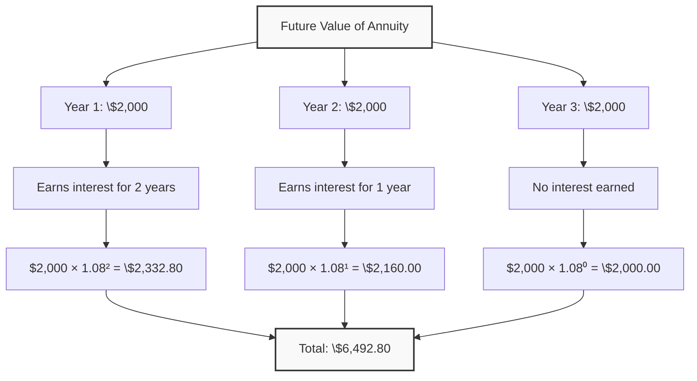
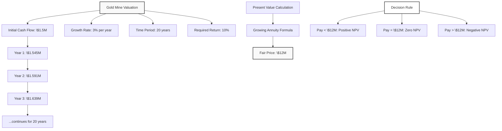
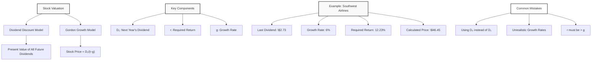
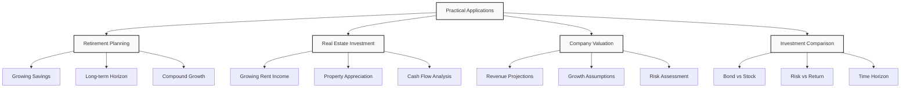

# Lecture 8: Advanced Cash Flow Valuation

### Introduction to Advanced Cash Flows

**Building on Previous Knowledge**: We learned about simple cash flows and annuities in Lecture 7. Now we explore more complex cash flow patterns used in real-world finance.

**Five Types of Cash Flows**:
1. **Simple Cash Flow**: Single payment at one point in time
2. **Annuity**: Constant payments over a fixed period
3. **Growing Annuity**: Payments that grow at a constant rate
4. **Perpetuity**: Constant payments forever
5. **Growing Perpetuity**: Payments that grow forever

**Key Insight**: By combining these basic cash flow types, we can value almost any financial security or investment project.

**Simple Analogy**: Like building blocks - with these five basic types, we can construct complex financial structures.

### Future Value of Annuities

#### Definition
**Future Value of Annuity**: The value at the end of the period of all regular payments plus accumulated interest.

**Key Difference from Present Value**: 
- **Present Value**: What are the payments worth today?
- **Future Value**: What will the payments be worth at the end?

#### Example: Savings Account
**Scenario**: You deposit \$2,000 at the end of each year for 3 years
- **Interest Rate**: 8%
- **Question**: How much will you have at the end of 3 years?

**Step-by-Step Calculation**:
- **Year 1**: \$2,000 deposited, earns interest for 2 years
- **Year 2**: \$2,000 deposited, earns interest for 1 year  
- **Year 3**: \$2,000 deposited, no interest earned

**Calculation**:
- Year 1: $2{,}000 \times (1.08)^2 = 2{,}332.80$
- Year 2: $2{,}000 \times (1.08)^1 = 2{,}160.00$
- Year 3: $2{,}000 \times (1.08)^0 = 2{,}000.00$
- **Total**: $6{,}492.80$

#### Future Value of Annuity

```math
\text{FV}_{\text{annuity}} = \text{Payment} \times \frac{(1 + r)^n - 1}{r}
```

Where:
- **Payment** = Regular payment amount
- **r** = Interest rate per period
- **n** = Number of periods

**Using the Formula**:
- $\text{FV} = 2,000 \times \frac{(1.08)^3 - 1}{0.08}$
- $\text{FV} = 2,000 \times \frac{1.2597 - 1}{0.08}$
- $\text{FV} = 2,000 \times \frac{0.2597}{0.08}$
- $\text{FV} = 2,000 \times 3.246$
- $\text{FV} = 6,492$



### Growing Annuities

#### Definition
**Growing Annuity**: A series of payments that increase at a constant rate over a fixed period.

**Real-World Examples**:
- Salary increases over time
- Rent escalations
- Dividend growth
- Revenue growth projections

#### Present Value of Growing Annuity

```math
\text{PV}_{\text{growing annuity}} = \text{Payment} \times \frac{1 - \left(\frac{1 + g}{1 + r}\right)^n}{r - g}
```

Where:
- **Payment** = First payment amount
- **g** = Growth rate
- **r** = Discount rate
- **n** = Number of periods

**Important**: r must be greater than g for the formula to work.

#### Practical Example: Gold Mine Valuation

**Scenario**: You own a gold mine for 20 years
- **Annual Production**: 5,000 ounces
- **Current Gold Price**: \$300 per ounce
- **Price Growth**: 3% per year
- **Required Return**: 10%

**Step 1: Calculate Initial Cash Flow**
- Year 0: $5{,}000 \times 300 = 1{,}500{,}000$

**Step 2: Calculate Future Cash Flows**
- Year 1: $1{,}500{,}000 \times 1.03 = 1{,}545{,}000$
- Year 2: $1{,}545{,}000 \times 1.03 = 1{,}591{,}350$
- And so on...

**Step 3: Calculate Present Value**
Using the growing annuity formula:
- $\text{PV} = 1,545,000 \times \frac{1 - \left(\frac{1.03}{1.10}\right)^{20}}{0.10 - 0.03}$
- $\text{PV} = 1,545,000 \times \frac{1 - 0.9367^{20}}{0.07}$
- $\text{PV} = 1,545,000 \times \frac{1 - 0.4564}{0.07}$
- $\text{PV} = 1,545,000 \times \frac{0.5436}{0.07}$
- $\text{PV} = 1,545,000 \times 7.766$
- $\text{PV} = 12,000,000$

**Decision**: This is the fair price of the mine. Paying more would result in negative NPV.



### Perpetuities

#### Definition
**Perpetuity**: A series of constant payments that continue forever.

**Historical Context**: Used since the 17th-18th centuries by governments to finance wars and projects.

**Modern Examples**:
- British Consol bonds (perpetual government bonds)
- Preferred stock with fixed dividends
- Some types of annuities

#### Present Value of Perpetuity

```math
\text{PV}_{\text{perpetuity}} = \frac{\text{Payment}}{r}
```

Where:
- **Payment** = Constant payment amount
- **r** = Required rate of return

**Key Insight**: The formula is surprisingly simple - just divide the payment by the interest rate.

#### Example: British Consol Bond
**Scenario**: British government bond paying £60 forever
- **Required Return**: 9%
- **Question**: What is the bond worth today?

**Calculation**:
- $\text{PV} = \frac{\pounds 60}{0.09}$
- $\text{PV} = \pounds 666.67$

**Verification**: If we calculate 200 years of payments, we get approximately the same result, proving that payments beyond 50-100 years contribute almost nothing to present value.

```mermaid
graph TD
    A[Perpetuity] --> B[Constant Payment Forever]
    A --> C[Simple Formula: Payment / r]
    
    D[Example: British Consol] --> E[Payment: £60 per year]
    D --> F[Required Return: 9%]
    D --> G[Present Value: £666.67]
    
    H[Time Value Effect] --> I[Years 1-50: Most Value]
    H --> J[Years 51-100: Some Value]
    H --> K[Years 100+: Almost Zero]
    
    L[Real-World Use] --> M[Government Bonds]
    L --> N[Preferred Stock]
    L --> O[Valuation Models]
    
    style A fill:#f9f9f9,stroke:#333,stroke-width:2px
    style D fill:#f9f9f9,stroke:#333,stroke-width:2px
    style H fill:#f9f9f9,stroke:#333,stroke-width:2px
    style L fill:#f9f9f9,stroke:#333,stroke-width:2px
```



### Growing Perpetuities

#### Definition
**Growing Perpetuity**: A series of payments that grow at a constant rate forever.

**Why Important**: This is the foundation of stock valuation models.

#### Present Value of Growing Perpetuity

```math
\text{PV}_{\text{growing perpetuity}} = \frac{\text{Payment}}{r - g}
```

Where:
- **Payment** = First payment amount
- **r** = Required rate of return
- **g** = Growth rate

**Important**: r must be greater than g for the formula to work.

#### Example: Growing Dividend Stock
**Scenario**: Stock with growing dividends
- **Current Dividend**: \$60
- **Growth Rate**: 3%
- **Required Return**: 9%

**Calculation**:
- $\text{PV} = \frac{60}{0.09 - 0.03}$
- $\text{PV} = \frac{60}{0.06}$
- $\text{PV} = 1,000$

**Comparison with Constant Perpetuity**:
- Constant perpetuity: $\frac{60}{0.09} = 666.67$
- Growing perpetuity: $\frac{60}{0.06} = 1{,}000$
- **Difference**: $333.33$ (50% higher value due to growth)

### Stock Valuation Models

#### Dividend Discount Model (DDM)
**Basic Idea**: A stock's value equals the present value of all future dividends.

**Why Dividends Matter**:
- **Dividend Payments**: Direct cash returns to shareholders
- **Capital Gains**: Stock price appreciation based on expected future dividends
- **Key Insight**: Everything comes back to dividends eventually

#### Constant Growth Model (Gordon Growth Model)
**Formula**: 

```math
\text{Stock Price} = \frac{D_1}{r - g}
```

Where:
- **D₁** = Next year's expected dividend
- **r** = Required rate of return
- **g** = Constant growth rate

#### Practical Example: Southwest Airlines (1992)
**Data**:
- **Last Dividend Paid**: \$2.73
- **Historical Growth Rate**: 6%
- **Required Return**: 12.23%

**Step 1: Calculate Next Year's Dividend**
- $D_1 = 2.73 \times 1.06 = 2.89$

**Step 2: Apply Gordon Growth Model**
- $\text{Stock Price} = \frac{2.89}{0.1223 - 0.06}$
- $\text{Stock Price} = \frac{2.89}{0.0623}$
- $\text{Stock Price} = 46.45$

**Result**: According to the model, Southwest Airlines should trade at \$46.45 per share.

#### Common Mistakes to Avoid
1. **Using Current Dividend Instead of Next Year's**: Always use D₁, not D₀
2. **Growth Rate Assumptions**: Be realistic about long-term growth rates
3. **Required Return**: Must be greater than growth rate
4. **Dividend Timing**: Understand when dividends are paid



### Practical Examples

#### Example 1: Retirement Planning with Growing Annuities
**Scenario**: 30-year-old planning retirement
- **Annual Savings**: \$5,000 (grows 3% per year)
- **Time Horizon**: 35 years
- **Expected Return**: 8%

**Analysis**: Calculate future value of growing annuity to determine retirement fund size.

#### Example 2: Real Estate Investment
**Scenario**: Apartment building with growing rent
- **Current Annual Rent**: \$100,000
- **Rent Growth**: 2% per year
- **Required Return**: 10%
- **Holding Period**: 20 years

**Analysis**: Use growing annuity formula to value the rental income stream.

#### Example 3: Company Valuation
**Scenario**: Tech startup with growing revenues
- **Current Revenue**: \$1 million
- **Growth Rate**: 15% per year
- **Required Return**: 20%
- **Question**: What is the company worth?

**Analysis**: Apply growing perpetuity model (assuming company continues forever).

#### Example 4: Bond vs Stock Comparison
**Scenario**: Choosing between government bond and dividend stock
- **Bond**: Pays \$100 forever (perpetuity)
- **Stock**: Pays \$100 growing 2% forever (growing perpetuity)
- **Required Return**: 8%

**Analysis**:
- **Bond Value**: $\frac{100}{0.08} = 1,250$
- **Stock Value**: $\frac{100}{0.08 - 0.02} = 1,667$
- **Decision**: Stock is more valuable due to growth



### Key Takeaways

1. **Five Cash Flow Types**: Simple, annuity, growing annuity, perpetuity, growing perpetuity

2. **Future Value of Annuities**: Value at the end of the period, calculated using compounding

3. **Growing Annuities**: Payments that increase at a constant rate over time

4. **Perpetuities**: Constant payments forever, valued using simple formula (Payment / r)

5. **Growing Perpetuities**: Growing payments forever, foundation of stock valuation

6. **Stock Valuation**: Gordon Growth Model uses growing perpetuity concept

7. **Key Formulas**:
   - **Future Value of Annuity**: $\text{FV} = \text{Payment} \times \frac{(1 + r)^n - 1}{r}$
   - **Growing Annuity PV**: $\text{PV} = \text{Payment} \times \frac{1 - \left(\frac{1 + g}{1 + r}\right)^n}{r - g}$
   - **Perpetuity PV**: $\text{PV} = \frac{\text{Payment}}{r}$
   - **Growing Perpetuity PV**: $\text{PV} = \frac{\text{Payment}}{r - g}$
   - **Stock Price**: $\text{Price} = \frac{D_1}{r - g}$

8. **Important Rules**:
   - r must be greater than g for growing formulas
   - Use D₁ (next year's dividend) for stock valuation
   - Present value of distant payments approaches zero

9. **Practical Applications**: Retirement planning, real estate, company valuation, investment analysis

10. **Real-World Limitations**: Models assume constant growth and required returns, which may not hold in practice

---

---

