# Introduction to Research Methods

## 📹 Video Overview

<iframe 
  src="https://www.youtube.com/embed/LQnlOo_269U" 
  title="Thinking with Numbers - YouTube video player" 
  width="560" 
  height="315" 
  frameborder="0" 
  allow="accelerometer; autoplay; clipboard-write; encrypted-media; gyroscope; picture-in-picture" 
  allowfullscreen>
</iframe>

## 🎯 Why Study Statistics?

**The Big Question:** Can you succeed without academic education?

**Why anecdotal evidence ("I know a guy who...") fails:**

1. **Small sample** - "My uncle dropped out and is rich" = 1 person vs. millions

2. **Selection bias** - You only hear success stories, not failures

3. **Confirmation bias** - You remember stories that confirm what you believe

4. **Inaccuracy** - Stories get exaggerated over time

💡 **Memory hack:** Think **SSCI** = Small Sample, Selection, Confirmation, Inaccuracy

---

## 📊 What is Statistics?

> **Simple definition:** Statistics = Using data to answer questions about large groups when you can't check everyone

**Three main uses:**

- **Collect** data

- **Describe** data (make it understandable)

- **Analyze** data (draw conclusions)

**Real-world example:** Netflix can't ask all 200M users what they want to watch, so they use data from what people actually watch to recommend shows.

---

## 🍞 The Bread Example - Critical Thinking

The slides show scary "facts" about bread:

- 98% of criminals eat bread

- Bread is "addictive"

- Life expectancy was shorter when everyone ate homemade bread

**What's wrong?** These are **correlations, not causations!**

💡 **Memory hack:** Just because two things happen together doesn't mean one causes the other. Ice cream sales and drowning both increase in summer, but ice cream doesn't cause drowning!

**Common statistical biases to watch for:**

- Unrepresentative sample

- Poor quality data

- Only people who care respond to surveys

- Sample too small

- Misleading graphs

- Who paid for the research? (conflict of interest)

---

## 🔬 The 6 Stages of Statistical Research

### When studying the ENTIRE population:

**Example:** "What's the average height of ALL students in our university?"

- Population = All students in the university

- If we can measure everyone → Use this process

---

### When studying a SAMPLE (most common):

```mermaid
flowchart TD
    A[1. Research Question Define Population] --> B[2. Research Design]
    B --> C[3. Data Collection FROM SAMPLE]
    C --> D[4. Organize Data Tables/Graphs]
    D --> E[5. Statistical Metrics]
    E --> F[5. Statistical Inference Sample → Population]
    F --> G[6. Conclusions]
    
    style C fill:#fff9c4
    style F fill:#ffccbc
    style G fill:#c8e6c9
```

**Why use a sample?**

- Can't ask ALL customers what they think

- Too expensive to test every product

- Takes too long to survey everyone

**Key terms:**

- **Random sample:** Everyone has equal chance of being picked (like lottery)

- **Representative sample:** Sample looks like the population (same age mix, gender mix, etc.)

💡 **Memory hack:** A sample is like tasting soup - you don't eat the whole pot to know if it needs salt!

---

## 📈 Statistical Inference

**What is it?** Making predictions about the WHOLE population based on your sample

**Two main methods:**

1. **Estimation** - "Based on our sample, we estimate the average salary is $50,000"

2. **Hypothesis Testing** - "We test if men and women have different average salaries"

**Example:** 

- Sample: Survey 1,000 voters

- Inference: "Candidate A will get 55% of ALL votes"

---

## 🏷️ Variables - The Heart of Research

**Variable = Something you measure that changes from person to person**

---

## 📋 Sorting Variables by Nature

### Main Division:

| Type | What it means | Examples | How to remember |
|------|---------------|----------|-----------------|
| **Qualitative** | Categories/names (can't do math) | Gender, eye color, city, yes/no | QUALITY = description |
| **Quantitative** | Numbers (can do math) | Height, salary, age, test score | QUANTITY = amount |

### Sub-division of Quantitative:

| Type | What it means | Examples | Test |
|------|---------------|----------|------|
| **Discrete** | Countable numbers (1, 2, 3...) | Kids in family, rooms in apartment | Can you have 2.5 of it? If NO → Discrete |
| **Continuous** | Can have decimals | Height (175.3 cm), weight (68.7 kg) | Can you have 2.5 of it? If YES → Continuous |

💡 **Memory hack:** 

- **Discrete** = can count on fingers → separate values (2 kids, 3 kids, never 2.7 kids)

- **Continuous** = flows like water → any value possible (can be 175.1 or 175.11 or 175.111 cm)

---

## 🎯 Sorting by Direction (Dependent vs Independent)

**Why this matters:** When studying relationships between variables

| Variable Type | Also called | Question to ask | Example |
|---------------|-------------|-----------------|---------|
| **Dependent** | Explained variable | "What am I trying to understand/predict?" | Monthly salary |
| **Independent** | Explaining variable | "What might affect/cause the dependent variable?" | Years of education, hours worked |

### Real Examples:

**Study 1:** "Does studying more hours increase test scores?"

- Dependent (effect): Test score

- Independent (cause): Study hours

**Study 2:** "Do students who submit exercises get higher scores?"

- Dependent: Test score

- Independent: Submitted all exercises (yes/no)

**Study 3:** "What affects monthly salary?"

- Dependent: Salary

- Independent variables: Education, experience, industry, city, gender

💡 **Memory hack:** 

- **Dependent** = DEPENDS on other things (like a baby depends on parents)

- **Independent** = INDEPENDENT, does its own thing

⚠️ **Important:** The same variable can be dependent in one study and independent in another!

---

## 🧩 Practice Exercise

Classify these variables:

| Variable | Qualitative | Discrete Quantitative | Continuous Quantitative |
|----------|-------------|----------------------|------------------------|
| Car driving speed | | | ✓ |
| Football player number | ✓ | | |
| IDF rank (private, corporal...) | ✓ | | |
| IDF rank (Private=1, Corporal=2) | | ✓ | |
| Amount of precipitation | | | ✓ |
| Country of birth | ✓ | | |
| Temperature | | | ✓ |
| Calendar year | | ✓ | |

**Tricky ones explained:**

1. **Football player number** - Even though it's a number, you can't do math with it. Player #10 isn't "twice" player #5. It's just a label → Qualitative

2. **IDF rank vs coded rank:**

   - Words (private, corporal) → Qualitative

   - Coded as numbers (1, 2, 3) → Discrete quantitative (now you CAN compare them mathematically)

3. **Calendar year** - Discrete because you can't have year 2023.5. It jumps from 2023 to 2024.

---

## 🎓 Key Takeaways

1. **Statistics helps us avoid being fooled by stories and small samples**

2. **Samples must be random AND representative**

3. **Critical thinking > just knowing formulas**

4. **Variables are qualitative (categories) or quantitative (numbers)**

5. **Quantitative splits into discrete (countable) and continuous (measurable)**

6. **Always ask: What's dependent (effect) and what's independent (cause)?**

---

## 📝 Quick Reference Chart

---

**Pro tip for exams:** When in doubt about variable type, ask yourself:

1. Is it a word/category? → Qualitative

2. Can I add/subtract/average it meaningfully? → Quantitative

3. Can it have decimals in reality? → Continuous, otherwise Discrete

