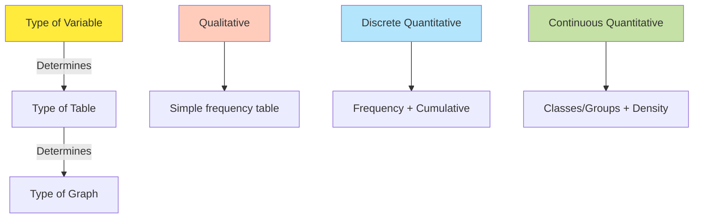
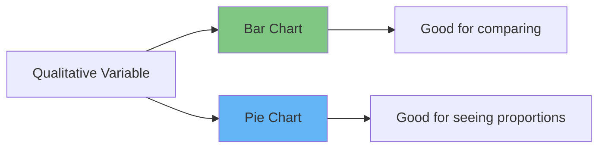
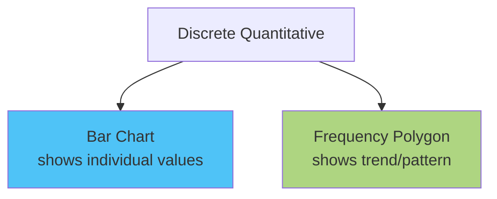
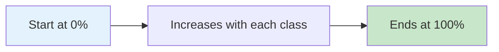
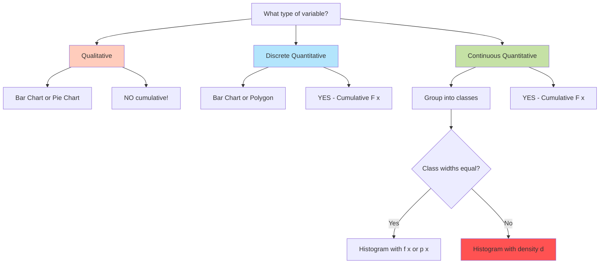
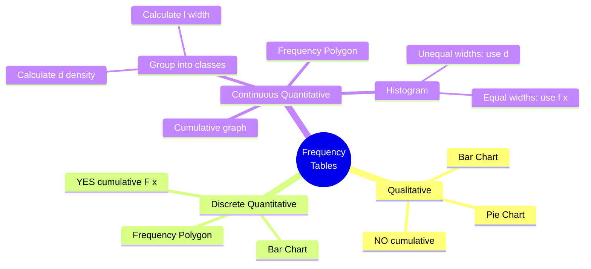

# Frequency Tables and Data Visualization

## 📹 Video Overview

<iframe 
  src="https://www.youtube.com/embed/SXl4KnrvMZM" 
  title="Chaos to Clarity - YouTube video player" 
  width="560" 
  height="315" 
  frameborder="0" 
  allow="accelerometer; autoplay; clipboard-write; encrypted-media; gyroscope; picture-in-picture" 
  allowfullscreen>
</iframe>

## 🎯 What We're Learning Today

**Main Topics:**

1. How to organize messy data into frequency tables

2. How to visualize data with graphs

3. Different methods for different variable types

---

## 🗂️ What is a Frequency Table?

**Imagine:** You have 50 test scores written randomly on paper. How do you make sense of it?

**Frequency Table = A way to organize data so you can actually understand it**

### Why Bother?

✓ Takes huge messy data → makes it clean and organized  

✓ Helps you see patterns ("Most students scored 80-90")  

✓ Foundation for all future statistical analysis  

✓ Helps choose the right statistical methods

💡 **Memory hack:** Think of it like organizing your closet - instead of clothes everywhere, you sort by type (shirts, pants, shoes) and count how many of each you have.

---

## 🔀 The Golden Rule



**Remember:** Different variables → Different tables → Different graphs!

---

## 📊 Method 1: Qualitative Variables

### Example: "Which social network would you keep?"

**Raw data:** 73 students answered: Instagram, Facebook, Instagram, Twitter, Instagram...

### The Frequency Table:

| Social Network (x) | f(x) - Frequency | p(x) - Relative Frequency |
|-------------------|------------------|---------------------------|
| Instagram | 43 | 59% |
| Facebook | 16 | 22% |
| Twitter | 4 | 5% |
| TikTok | 2 | 3% |
| LinkedIn | 1 | 1% |
| None | 7 | 10% |
| **Total** | **73** | **100%** |

### 📐 The Key Formula:

$$p(x) = \frac{f(x)}{n}$$

**Where:**

- **p(x)** = relative frequency (percentage)

- **f(x)** = absolute frequency (count)

- **n** = total number of observations

**Example calculation:**

- Instagram: p(x) = 43/73 = 0.589 = 59%

- Facebook: p(x) = 16/73 = 0.219 = 22%

💡 **Memory hack:** p(x) is just "what PORTION out of everyone" - that's why it's between 0% and 100%!

### 📈 Graphs for Qualitative Variables:

**Two options:**

1. **Bar Chart** - Each category gets its own bar

2. **Pie Chart** - Shows proportions of a whole



**When to use which?**

- **Bar chart:** When comparing categories (which is bigger?)

- **Pie chart:** When showing parts of a whole (Instagram = 59% of the pie)

⚠️ **Important:** For qualitative variables, **NO cumulative frequency!** (Can't say "up to Facebook" - what does that even mean?)

---

## 📊 Method 2: Discrete Quantitative Variables

### Example: "Number of people in 10 families"

**Raw data:** 2, 2, 6, 5, 3, 5, 5, 4, 3, 2

### Step 1: Count the frequencies

| People in Family (x) | f(x) - Frequency | p(x) - Relative Frequency | F(x) - Cumulative Frequency | F(x)/n - Relative Cumulative |
|---------------------|------------------|---------------------------|----------------------------|------------------------------|
| 2 | 3 | 30% | 3 | 30% |
| 3 | 2 | 20% | 5 | 50% |
| 4 | 1 | 10% | 6 | 60% |
| 5 | 3 | 30% | 9 | 90% |
| 6 | 1 | 10% | 10 | 100% |
| **Total** | **10** | **100%** | - | - |

### 🔑 New Concept: Cumulative Frequency F(x)

**What is F(x)?** = "How many observations are **up to and including** x?"

**Calculation:**

- F(2) = 3 (three families have 2 people)

- F(3) = 3 + 2 = 5 (five families have **up to** 3 people)

- F(4) = 3 + 2 + 1 = 6 (six families have **up to** 4 people)

- And so on...

💡 **Memory hack:** F(x) is like climbing stairs - each step you ADD the previous steps!

### Practice Questions:

**Q1: How many families have at most 3 people?**

- Answer: F(3) = 5 families

**Q2: How many families have at least 3 people?**

- Answer: Total - F(2) = 10 - 3 = 7 families

- (Or: everyone EXCEPT those with only 2)

### 📈 Graphs for Discrete Quantitative:

**Two main options:**

1. **Bar Chart** - Similar to qualitative, but order matters!

2. **Frequency Polygon** - Connect the tops of bars with lines



**Frequency Polygon shows:** The general trend in the data (is it increasing? decreasing? where's the peak?)

---

## 📊 Method 3: Continuous Quantitative Variables

### 🎯 Why Group into Classes?

**Problem:** You have 72 students' heights: 167.3 cm, 172.8 cm, 169.5 cm...

If you list every single height, your table would be HUGE and useless!

**Solution:** Group into classes (ranges)

💡 **Memory hack:** Like organizing books by "100-200 pages", "200-300 pages" instead of listing every exact page count.

---

### Example 1: Student Heights (Uniform Class Width)

| Height (x) | f(x) | Class Width (l) | Density (d) | p(x) | F(x) | F(x)/n |
|-----------|------|-----------------|-------------|------|------|---------|
| 150-155 | 2 | 5 | 0.4 | 2.8% | 2 | 2.8% |
| 155-160 | 3 | 5 | 0.6 | 4.2% | 5 | 6.9% |
| 160-165 | 9 | 5 | 1.8 | 12.5% | 14 | 19.4% |
| 165-170 | 7 | 5 | 1.4 | 9.7% | 21 | 29.2% |
| 170-175 | 13 | 5 | 2.6 | 18.1% | 34 | 47.2% |
| 175-180 | 16 | 5 | 3.2 | 22.2% | 50 | 69.4% |
| 180-185 | 13 | 5 | 2.6 | 18.1% | 63 | 87.5% |
| 185-190 | 6 | 5 | 1.2 | 8.3% | 69 | 95.8% |
| 190-195 | 3 | 5 | 0.6 | 4.2% | 72 | 100% |
| **Total** | **72** | - | - | **100%** | - | - |

### 📐 Key Formulas for Continuous Variables:

#### 1. Class Width (l):

$$l = l_1 - l_0$$

**Where:**

- **l₁** = upper limit of class

- **l₀** = lower limit of class

**Example:** Class 170-175

- l = 175 - 170 = 5 cm

💡 **Memory hack:** Class width = how WIDE is the range?

---

#### 2. Density (d):

$$d = \frac{f(x)}{l}$$

**What is density?** = Frequency per unit width

**Why do we need it?** Because when class widths are different, you can't compare frequencies directly!

**Example:** Class 170-175

- d = 13/5 = 2.6 students per cm

💡 **Memory hack:** Density = how PACKED/CROWDED is the class? Think of population density in cities!

---

#### 3. Percentage Density (d%):

$$d\% = \frac{p(x)}{l}$$

**Example:** Class 170-175

- d% = 18.1%/5 = 3.62% per cm

---

### 🎨 Histogram - The Main Graph for Continuous Variables

**CRITICAL RULE:** When class widths are DIFFERENT, you MUST use density (d) for the y-axis!

```mermaid
graph TD
    A[Class Widths] --> B{Are they equal?}
    B -->|Yes| C[Can use f(x) or p(x)<br/>for y-axis]
    B -->|No| D[MUST use density d<br/>for y-axis]
    
    style D fill:#ff5252
    style C fill:#66bb6a
```

**Why?** Look at this example:

### Example 2: Test Scores (UNEVEN Class Width)

| Scores (x) | f(x) | l | d | p(x) | d% |
|-----------|------|---|---|------|-----|
| 40-60 | 5 | 20 | 0.25 | 12.5% | 0.625% |
| 60-70 | 5 | 10 | 0.5 | 12.5% | 1.25% |
| 70-75 | 10 | 5 | 2 | 25% | 5% |
| 75-85 | 10 | 10 | 1 | 25% | 2.5% |
| 85-100 | 15 | 15 | 1 | 25% | 1.67% |
| **Total** | **40** | - | - | **100%** | - |

**What happens if we use f(x) instead of d?**

❌ **WRONG:** 85-100 would look like the tallest bar (15 students)

✓ **CORRECT:** 70-75 is actually the most DENSE (2 students per point)

**The area of each rectangle in the histogram = the frequency!**

---

### 📊 Histogram vs Frequency Polygon

| Feature | Histogram | Frequency Polygon |
|---------|-----------|-------------------|
| Shape | Rectangles (bars) | Connected line |
| Shows | Exact frequencies by class | Overall trend/pattern |
| Use when | Want to see distribution | Want to see shape of data |

**Frequency Polygon:** Connect the midpoints of the top of each histogram bar

💡 **Memory hack:** Polygon = the "skyline" of your histogram!

---

### 📈 Cumulative Frequency Graph

**What is it?** A line graph showing F(x) - how many observations are up to x

**Key feature:** Always goes UP (never down) and ends at 100%



**Use case:** "What percentage of students scored below 80?"

---

## 🎯 Quick Decision Tree



---

## 📝 Complete Example Walkthrough

**Problem:** Manhattan temperatures over 24 days in October

| Temperature (°C) | f(x) | l | d | p(x) | d% |
|-----------------|------|---|---|------|-----|
| 5-8 | 4 | 3 | 1.33 | 16.7% | 5.6% |
| 8-11 | 8 | 3 | 2.67 | 33.3% | 11.1% |
| 11-14 | 6 | 3 | 2 | 25% | 8.3% |
| 14-17 | 5 | 3 | 1.67 | 20.8% | 6.9% |
| 17-20 | 1 | 3 | 0.33 | 4.2% | 1.4% |
| **Total** | **24** | - | - | **100%** | - |

### Step-by-step solution:

**Step 1: Calculate class width**

- All classes: l = 3°C (uniform!)

**Step 2: Calculate p(x)**

- 5-8: p(x) = 4/24 = 16.7%

- 8-11: p(x) = 8/24 = 33.3%

- etc.

**Step 3: Calculate density**

- 5-8: d = 4/3 = 1.33

- 8-11: d = 8/3 = 2.67

- etc.

**Step 4: Calculate d%**

- 5-8: d% = 16.7%/3 = 5.6%

- 8-11: d% = 33.3%/3 = 11.1%

- etc.

**Step 5: Draw histogram**

- Since widths are equal, can use f(x) OR d for y-axis

- Highest bar: 8-11°C (8 days)

**Step 6: Draw frequency polygon**

- Connect midpoints: 6.5°C, 9.5°C, 12.5°C, 15.5°C, 18.5°C

---

## 🎓 Key Formulas Summary

| Formula | What it calculates | When to use |
|---------|-------------------|-------------|
| **p(x) = f(x)/n** | Relative frequency | Any variable type |
| **l = l₁ - l₀** | Class width | Continuous variables |
| **d = f(x)/l** | Density | Continuous with classes |
| **d% = p(x)/l** | Percentage density | Continuous with classes |
| **F(x) = Σf(x)** | Cumulative frequency | Quantitative variables only |

---

## 💡 Memory Hacks Summary

1. **Frequency table = organized closet** - everything sorted and counted

2. **p(x) = PORTION of the whole** - always 0-100%

3. **F(x) = climbing STAIRS** - keep adding as you go up

4. **Density = how PACKED/CROWDED** - like population density

5. **At most = ≤** (use F(x) directly)

6. **At least = ≥** (use Total - F(x-1))

7. **Different widths = MUST use density!** - Can't compare different-sized boxes

---

## ⚠️ Common Mistakes to Avoid

❌ Using cumulative frequency for qualitative variables  

❌ Forgetting to use density when class widths differ  

❌ Mixing up "at most" and "at least"  

❌ Drawing histogram with f(x) when widths are unequal  

❌ Forgetting that total p(x) must equal 100%  

---

## 🎯 Quick Reference Chart



---

## 🏆 Pro Exam Tips

1. **First question:** What type of variable? (This determines EVERYTHING)

2. **Check class widths:** Equal or not? (Affects histogram)

3. **Density is your friend:** When in doubt with continuous variables, calculate it

4. **Double-check totals:** f(x) should sum to n, p(x) should sum to 100%

5. **Cumulative = running total:** Keep adding!

6. **Area = frequency:** In histograms, the area of bars represents frequency

---

**Remember:** The type of variable is the boss - it tells you what table and graph to use!

