# Sigma Rules and Measures of Central Location

## 📹 Video Overview

<iframe 
  src="https://www.youtube.com/embed/6oO9ae5Mox4" 
  title="Finding the Typical Value - YouTube video player" 
  width="560" 
  height="315" 
  frameborder="0" 
  allow="accelerometer; autoplay; clipboard-write; encrypted-media; gyroscope; picture-in-picture" 
  allowfullscreen>
</iframe>

## 🎯 What We're Learning Today

**Main Topics:**

1. **Sigma Rules (∑)** - Math shortcuts for summations

2. **Measures of Central Location** - Finding the "middle" or "typical" value

   - Mode (most common)

   - Mean (average)

   - Median (middle value)

---

## Part 1: Sigma Rules (∑)

### 🔤 What is Sigma (∑)?

**Sigma (∑) = Mathematical shorthand for "add everything up"**

**Example:** Defective items in 10 shipments: 3, 4, 1, 5, 2, 3, 2, 6, 3, 1

Instead of writing: x₁ + x₂ + x₃ + x₄ + x₅ + x₆ + x₇ + x₈ + x₉ + x₁₀

We write: 

$$\sum_{i=1}^{n} x_i$$

💡 **Memory hack:** Think of ∑ as a "smart calculator" that knows to add everything from position 1 to n.

**Breaking down the notation:**

```
  n          ← Stop here (n = 10 in our example)
  ∑ x_i      ← Sum all x values
 i=1         ← Start here (first observation)
```

---

## 📐 The 5 Essential Sigma Rules

### Rule 1: Sum of a Constant

**Formula:**

$$\sum_{i=1}^{n} a = n \times a$$

**Plain English:** If you add the same number *n* times, just multiply!

**Example:** Data series: 3, 3, 3, 3, 3 (n = 5)

$$\sum_{i=1}^{5} 3 = 3 + 3 + 3 + 3 + 3 = 5 \times 3 = 15$$

💡 **Memory hack:** Adding 5 threes is just 5 × 3. Don't overthink it!

---

### Rule 2: Sum of a Constant × Variable

**Formula:**

$$\sum_{i=1}^{n} a \times x_i = a \times \sum_{i=1}^{n} x_i$$

**Plain English:** You can "pull out" the constant from the sum!

**Example:** Defective items: 3, 4, 1, 5, 2, 3, 2, 6, 3, 1

If each defective item costs 5 NIS (a = 5), what's the total damage?

$$\sum_{i=1}^{10} 5x_i = 5 \times \sum_{i=1}^{10} x_i = 5 \times (3+4+1+5+2+3+2+6+3+1) = 5 \times 30 = 150 \text{ NIS}$$

💡 **Memory hack:** The constant is like a "multiplier hat" - you can put it on at the end instead of on each item!

---

### Rule 3: Sum of Addition

**Formula:**

$$\sum_{i=1}^{n} (x_i + y_i) = \sum_{i=1}^{n} x_i + \sum_{i=1}^{n} y_i$$

**Plain English:** Sum of sums = sum of each separately!

**Example:**

| xᵢ | yᵢ | xᵢ + yᵢ |
|----|----|---------| 
| 1  | 3  | 4       |
| 2  | 4  | 6       |
| 3  | 6  | 9       |

$$\sum_{i=1}^{3} (x_i + y_i) = 4 + 6 + 9 = 19$$

**OR:**

$$\sum_{i=1}^{3} x_i + \sum_{i=1}^{3} y_i = (1+2+3) + (3+4+6) = 6 + 13 = 19$$

💡 **Memory hack:** Addition is "friendly" - you can split it up!

---

### Rule 4: Sum of Multiplication (TRICKY!)

**Formula:**

$$\sum_{i=1}^{n} (x_i \times y_i) \neq \sum_{i=1}^{n} x_i \times \sum_{i=1}^{n} y_i$$

**Plain English:** You CANNOT split multiplication! Must multiply first, then sum.

**Example:**

| xᵢ | yᵢ | xᵢ × yᵢ |
|----|----|---------| 
| 1  | 3  | 3       |
| 2  | 4  | 8       |
| 3  | 6  | 18      |

**CORRECT:**

$$\sum_{i=1}^{3} (x_i \times y_i) = 3 + 8 + 18 = 29$$

**WRONG:**

$$\sum_{i=1}^{3} x_i \times \sum_{i=1}^{3} y_i = 6 \times 13 = 78 \neq 29$$

⚠️ **CRITICAL:** Multiplication is NOT friendly! Don't split it!

💡 **Memory hack:** "Multiply INSIDE the sum, not outside!"

---

### Rule 5: Sum of Squares (ALSO TRICKY!)

**Formula:**

$$\sum_{i=1}^{n} x_i^2 \neq \left(\sum_{i=1}^{n} x_i\right)^2$$

**Plain English:** Square each value first, THEN sum. Not the other way around!

**Example:**

| xᵢ | xᵢ² |
|----|-----| 
| 1  | 1   |
| 2  | 4   |
| 3  | 9   |

**CORRECT:**

$$\sum_{i=1}^{3} x_i^2 = 1 + 4 + 9 = 14$$

**WRONG:**

$$\left(\sum_{i=1}^{3} x_i\right)^2 = (1+2+3)^2 = 6^2 = 36 \neq 14$$

⚠️ **CRITICAL:** Square INSIDE first, then add!

💡 **Memory hack:** "Square the individuals, not the team!"

---

## 📋 Sigma Rules Quick Reference

```mermaid
graph TD
    A[Sigma Rules] --> B[✓ CAN Split]
    A --> C[✗ CANNOT Split]
    
    B --> D[Constant: n×a]
    B --> E[Constant×Variable: a×Σx]
    B --> F[Addition: Σx + Σy]
    
    C --> G[Multiplication: Σ x×y]
    C --> H[Squares: Σx²]
    
    style B fill:#c8e6c9
    style C fill:#ffcdd2
```



---

## 🧮 Practice Problem: Complete Walkthrough

**Given:**

| xᵢ | yᵢ |
|----|----|
| 1  | 3  |
| 2  | 4  |
| 3  | 6  |

**Problem 1:** Calculate $\sum_{i=1}^{3} (2x_i + 3y_i)$

**Solution:**

$$\sum_{i=1}^{3} (2x_i + 3y_i) = \sum_{i=1}^{3} 2x_i + \sum_{i=1}^{3} 3y_i$$

$$= 2\sum_{i=1}^{3} x_i + 3\sum_{i=1}^{3} y_i$$

$$= 2(1+2+3) + 3(3+4+6)$$

$$= 2(6) + 3(13) = 12 + 39 = 51$$

---

**Problem 2:** Calculate $\sum_{i=1}^{3} (x_i + y_i)^2$

**Solution:**

First expand: $(x_i + y_i)^2 = x_i^2 + 2x_iy_i + y_i^2$

$$\sum_{i=1}^{3} (x_i + y_i)^2 = \sum_{i=1}^{3} x_i^2 + 2\sum_{i=1}^{3} x_iy_i + \sum_{i=1}^{3} y_i^2$$

Calculate each part:

- $\sum x_i^2 = 1^2 + 2^2 + 3^2 = 1 + 4 + 9 = 14$

- $\sum x_iy_i = (1×3) + (2×4) + (3×6) = 3 + 8 + 18 = 29$

- $\sum y_i^2 = 3^2 + 4^2 + 6^2 = 9 + 16 + 36 = 61$

**Final answer:**

$$14 + 2(29) + 61 = 14 + 58 + 61 = 133$$

---

## Part 2: Measures of Central Location

### 🎯 The Big Question

**What's a "typical" or "representative" value in the data?**

**Example claim:** "Economists earn more than teachers"

Does EVERY economist earn more than EVERY teacher? No!

So we need a way to describe the "center" of the data.

**Three main measures:**


---

## 📊 Measure 1: Mode (x̂)

**Definition:** The value (or category) that appears MOST frequently

**Notation:** x̂ (x-hat)

### For Qualitative Variables:

**Example:** Preferred social network

| Social Network | f(x) |
|----------------|------|
| Instagram      | 43   | ← **Mode!**
| Facebook       | 16   |
| Twitter        | 4    |
| TikTok         | 2    |
| LinkedIn       | 1    |
| None           | 7    |

**Mode = Instagram** (highest frequency)

💡 **Memory hack:** Mode = Most popular = Most Often Displayed Everywhere

---

### For Discrete Quantitative Variables:

**Example:** Number of people in family

| People (x) | f(x) |
|------------|------|
| 2          | 3    | ← Tied!
| 3          | 2    |
| 4          | 1    |
| 5          | 3    | ← Tied!
| 6          | 1    |

**Mode = 2 and 5** (both appear 3 times - bimodal!)

---

### For Continuous Quantitative Variables:

**Example:** Test scores

| Scores | f(x) | l | d |
|--------|------|---|---|
| 40-60  | 5    | 20| 0.25 |
| 60-70  | 5    | 10| 0.5  |
| 70-75  | 10   | 5 | **2** | ← Highest density!
| 75-85  | 10   | 10| 1    |
| 85-100 | 15   | 15| 1    |

**Mode = 72.5** (middle of class 70-75, which has highest density d = 2)

⚠️ **Important:** For continuous variables, use DENSITY (d), not frequency!

💡 **Memory hack:** The modal class is the "densest crowd"

---

### 🔍 Characteristics of Mode:

✓ **Not affected by extreme values**

✓ **Not affected by other frequencies** (only cares about the winner)

✗ Can have multiple modes (bimodal, multimodal)

✗ Might not represent the "center" well

---

## 📊 Measure 2: Mean (x̄)

**Definition:** The arithmetic average - sum all values and divide by count

**Notation:** x̄ (x-bar)

### Basic Formula:

$$\bar{x} = \frac{\sum_{i=1}^{n} x_i}{n} = \frac{x_1 + x_2 + ... + x_n}{n}$$

**Example:** Number of people in family: 2, 2, 6, 5, 3, 5, 5, 4, 3, 2

$$\bar{x} = \frac{2+2+6+5+3+5+5+4+3+2}{10} = \frac{37}{10} = 3.7$$

💡 **Memory hack:** Mean = What everyone would get if we distributed equally

---

### Mean from Frequency Table:

**Formula:**

$$\bar{x} = \frac{\sum_{i=1}^{k} x_i \times f_i}{\sum_{i=1}^{k} f_i} = \sum_{i=1}^{k} x_i \times p_i$$

**Why?** If 2 appears 3 times, instead of writing 2+2+2, write 2×3!

**Example:**

| x | f(x) | p(x) | x × f(x) | x × p(x) |
|---|------|------|----------|----------|
| 2 | 3    | 30%  | 6        | 0.6      |
| 3 | 2    | 20%  | 6        | 0.6      |
| 4 | 1    | 10%  | 4        | 0.4      |
| 5 | 3    | 30%  | 15       | 1.5      |
| 6 | 1    | 10%  | 6        | 0.6      |
| **Total** | **10** | **100%** | **37** | **3.7** |

**Using frequencies:**

$$\bar{x} = \frac{37}{10} = 3.7$$

**Using relative frequencies:**

$$\bar{x} = 0.6 + 0.6 + 0.4 + 1.5 + 0.6 = 3.7$$

💡 **Memory hack:** "Multiply before you divide" - weight each value by how often it appears!

---

### Mean for Continuous Variables:

**Use the MIDPOINT of each class!**

**Example:** Test scores

| Scores | f(x) | Midpoint (xᵢ) | xᵢ × f(x) |
|--------|------|---------------|-----------|
| 40-60  | 5    | 50            | 250       |
| 60-70  | 5    | 65            | 325       |
| 70-75  | 10   | 72.5          | 725       |
| 75-85  | 10   | 80            | 800       |
| 85-100 | 10   | 92.5          | 925       |
| **Total** | **40** | - | **3025** |

$$\bar{x} = \frac{3025}{40} = 75.625$$

**How to find midpoint:**

$$\text{Midpoint} = \frac{\text{Lower limit} + \text{Upper limit}}{2}$$

Example: For 40-60 → Midpoint = (40+60)/2 = 50

---

### 🔍 Characteristics of Mean:

✓ **Uses all data** - every value matters

✓ **Most common measure** - used everywhere

✗ **Affected by extreme values** (outliers can pull it way off!)

✗ **May not be an actual data value** (can't have 3.7 people!)

**Special Property:** Sum of deviations from mean = 0

$$\sum_{i=1}^{n} (x_i - \bar{x}) = 0$$

**Example:** Data: 2, 2, 6, 5, 3, 5, 5, 4, 3, 2  (x̄ = 3.7)

| xᵢ | xᵢ - x̄ |
|----|---------|
| 2  | -1.7    |
| 2  | -1.7    |
| 6  | +2.3    |
| 5  | +1.3    |
| 3  | -0.7    |
| 5  | +1.3    |
| 5  | +1.3    |
| 4  | +0.3    |
| 3  | -0.7    |
| 2  | -1.7    |

Sum = 0 ✓

💡 **Memory hack:** The mean is like a "balance point" - negatives and positives cancel out!

---

## 📊 Measure 3: Median (x̃)

**Definition:** The middle value when data is sorted - splits data 50-50

**Notation:** x̃ (x-tilde)

### How to Find Median:

**Step 1:** Sort data from smallest to largest

**Step 2:** Find the middle position


---

### If n is ODD:

**Formula:**

$$\tilde{x} = x_{\frac{n+1}{2}}$$

**Example:** Scores: 50, 60, 60, 70, 80 (n = 5)

Position of median = (5+1)/2 = 3rd value

**Median = 60**

---

### If n is EVEN:

**Formula:**

$$\tilde{x} = \frac{x_{\frac{n}{2}} + x_{\frac{n}{2}+1}}{2}$$

**Example:** Scores: 50, 60, 60, 70, 80, 90 (n = 6)

Positions: 6/2 = 3rd and 4th values

**Median = (60 + 70)/2 = 65**

💡 **Memory hack:** 

- **Odd:** One clear middle person

- **Even:** Two middle people, average them!

---

### Median from Frequency Table:

**Example:** Number of people in family (n = 20)

| x | f(x) | F(x) |
|---|------|------|
| 2 | 3    | 3    |
| 3 | 5    | 8    |
| 4 | 6    | 14   |
| 5 | 3    | 17   |
| 6 | 3    | 20   |

**Find:** Position n/2 = 20/2 = 10th value

Look at F(x):

- F(4) = 14 (14 observations up to x=4)

- F(3) = 8 (8 observations up to x=3)

The 10th value is in the x=4 category!

**Median = (x₁₀ + x₁₁)/2 = (4 + 4)/2 = 4**

---

### Median for Continuous Variables:

**Find the "median class"** - the class containing position n/2

**Example:** Test scores (n = 100)

| Scores | f(x) | F(x) |
|--------|------|------|
| 40-60  | 5    | 5    |
| 60-70  | 10   | 15   |
| 70-75  | 20   | 35   |
| 75-85  | 40   | 75   | ← Median class!
| 85-100 | 25   | 100  |

Position n/2 = 100/2 = 50th value

- F(70-75) = 35 (not enough)

- F(75-85) = 75 (includes position 50!)

**Median is in class 75-85**

💡 **Memory hack:** Keep adding F(x) until you pass n/2!

---

### 🔍 Characteristics of Median:

✓ **Not affected by extreme values** (only cares about position, not actual values!)

✓ **Always an actual possible value** (for discrete) or in a real class

✗ Doesn't use information from all values

**Powerful example:**

Salaries: 3000, 4000, 4700, 5000, 5500

**Median = 4700** (middle value)

Now change 5500 to 5,500,000!

**Median still = 4700** (position unchanged!)

**Mean would jump dramatically!**

💡 **Memory hack:** Median is the "bodyguard" - protects against extreme outliers!

---

## 🔄 Linear Transformations

**What if we add/multiply all values by a constant?**

**Rules:**

If $z_i = a + bx_i$ (where *a* and *b* are constants):

$$\bar{z} = a + b\bar{x}$$

$$\tilde{z} = a + b\tilde{x}$$

$$\hat{z} = a + b\hat{x}$$

**Example:** Test scores of 7 students: 91, 77, 65, 83, 88, 71, 98

$$\bar{x} = \frac{91+77+65+83+88+71+98}{7} = \frac{573}{7} = 81.86$$

**Teacher adds 2 points to everyone:**

**New mean:**

$$\bar{z} = 81.86 + 2 = 83.86$$

💡 **Memory hack:** "What you do to the data, you do to the measures!"

---

## 📈 Distribution Shapes & Central Measures

### Symmetric Bell-Shaped (Normal Distribution):

```
        📊
      📊📊📊
    📊📊📊📊📊
  📊📊📊📊📊📊📊
  
Mode = Median = Mean
```

**All three are equal!**

---

### Symmetric (Two Peaks):

```
  📊      📊
📊📊    📊📊
📊📊📊📊📊📊

Mode < Median = Mean
```

**Two modes, median and mean still equal**

---

### Uniform Distribution:

```
📊📊📊📊📊📊📊

No clear mode
Median = Mean
```

---

### Positive Skew (Right Tail):

```
📊📊📊
📊📊📊📊
📊📊📊📊📊📊  →

Mode < Median < Mean
```

**Mean pulled by high values!**

💡 **Memory hack:** "Mean follows the tail" - gets pulled toward outliers

**Example:** Salaries - few very high earners pull mean up

---

### Negative Skew (Left Tail):

```
        📊📊📊
      📊📊📊📊
← 📊📊📊📊📊📊

Mean < Median < Mode
```

**Mean pulled by low values!**

---

## 📋 Decision Guide: Which Measure to Use?

| Situation | Best Measure | Why |
|-----------|--------------|-----|
| **Symmetric data, no outliers** | Mean | Uses all info, most precise |
| **Skewed data** | Median | Not affected by extreme values |
| **Categorical data** | Mode | Only option! |
| **Need "most typical"** | Mode | Most common actual value |
| **Extreme outliers present** | Median | Robust against extremes |

---

## 🎯 Test Question Practice

**Question:** "University graduate salaries are positively skewed. Therefore, the percentage earning above average is greater than the percentage earning below average."

**True or False?**

**Answer:** FALSE!

**Explanation:**

- Positively skewed → tail on right (high salaries)

- Mean gets pulled UP by extreme high salaries

- Mean > Median

- Since median splits data 50-50:

  - 50% earn below median

  - 50% earn above median

- Since mean > median:

  - MORE than 50% earn below mean

  - LESS than 50% earn above mean

💡 **Memory hack:** In positive skew, the mean "chases" the few rich people, leaving most below average!

---

## 📊 Advanced Concepts

### Skewness

**Measures asymmetry of distribution:**

$$\text{Skewness} = 0 \rightarrow \text{Symmetric}$$

$$\text{Skewness} > 1 \rightarrow \text{Highly right-skewed}$$

$$\text{Skewness} < -1 \rightarrow \text{Highly left-skewed}$$

**Rule of thumb:**

- Between -0.5 and 0.5 → Approximately symmetric

- Between 0.5 and 1 (or -0.5 and -1) → Moderately skewed

- Beyond ±1 → Highly skewed

---

### Kurtosis

**Measures "peakedness" of distribution:**

- **Mesokurtic (Kurt = 3):** Normal distribution

- **Leptokurtic (Kurt > 3):** Tall and thin peak, heavy tails

- **Platykurtic (Kurt < 3):** Flat peak, light tails


---

## 🎓 Key Formulas Summary

| Measure | Formula | Use When |
|---------|---------|----------|
| **Mode** | Value with highest f(x) or d | Any variable type |
| **Mean (raw)** | $\bar{x} = \frac{\sum x_i}{n}$ | Individual data |
| **Mean (frequency)** | $\bar{x} = \frac{\sum x_i f_i}{\sum f_i}$ | Frequency table |
| **Mean (relative)** | $\bar{x} = \sum x_i p_i$ | Relative frequency |
| **Median (odd n)** | $\tilde{x} = x_{\frac{n+1}{2}}$ | Sorted odd data |
| **Median (even n)** | $\tilde{x} = \frac{x_{\frac{n}{2}} + x_{\frac{n}{2}+1}}{2}$ | Sorted even data |
| **Linear transform** | $\bar{z} = a + b\bar{x}$ | When transforming all data |

---

## 💡 Master Memory Hacks

1. **Sigma ∑** = Smart calculator that adds for you

2. **Mode** = Most Often Displayed Everywhere

3. **Mean** = Everyone gets equal share

4. **Median** = The middleman/bodyguard (protects from extremes)

5. **Multiplication & Squares** = Cannot split the sum!

6. **Mean follows the tail** in skewed distributions

7. **Midpoint** = Average of class limits

8. **F(x) = Climbing stairs** - keep adding

---

## 🎯 Quick Reference Mind Map

```mermaid
mindmap
  root((Central<br/>Location))
    Mode
      Most frequent
      Not affected by outliers
      Can have multiple
      Use density for continuous
    Mean
      Sum/n
      Uses all data
      Affected by outliers
      x×f for frequency table
    Median
      Middle value
      Sort first
      50-50 split
      Robust to outliers
    Distribution Shape
      Symmetric: Mode=Med=Mean
      Right skew: Mode<Med<Mean
      Left skew: Mean<Med<Mode
```



---

## ⚠️ Common Exam Mistakes

❌ Splitting multiplication/squares in sigma sums  

❌ Using frequency instead of density for continuous mode  

❌ Forgetting to sort data before finding median  

❌ Confusing "at least" with "at most"  

❌ Thinking positive skew means more above average  

❌ Using mean when there are extreme outliers  

---

## 🏆 Pro Exam Tips

1. **See ∑?** Check if you can pull constants out!

2. **Finding mode in continuous?** Look for highest DENSITY (d), not frequency!

3. **Extreme values present?** Use median, not mean

4. **Positive skew?** Mean > Median > Mode (remember: mean follows tail)

5. **Linear transformation?** Apply it to the measures directly

6. **Frequency table?** Use weighted formula (x × f)

**Remember:** The distribution shape tells you the relationship between mode, median, and mean!

