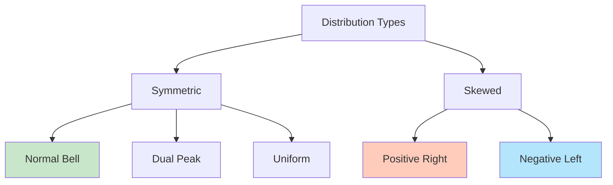
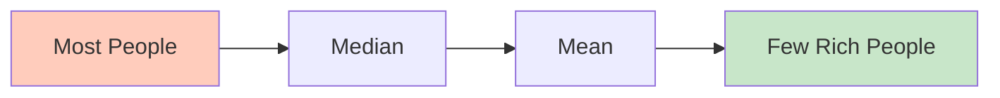
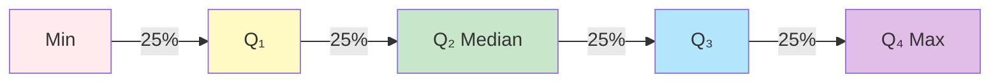
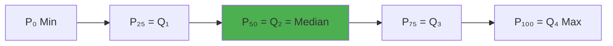
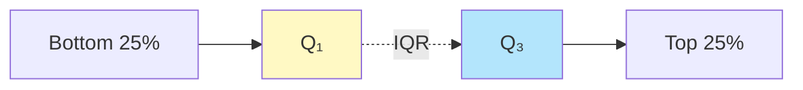
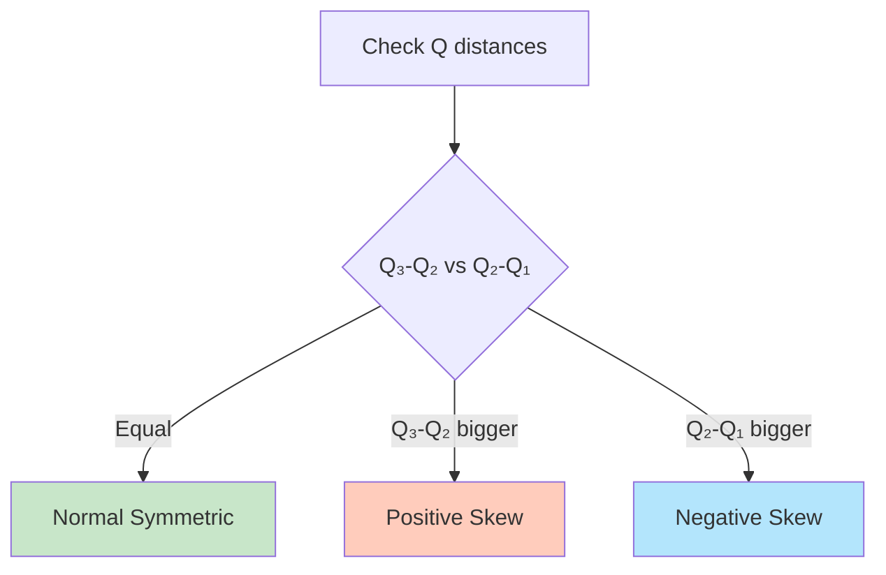
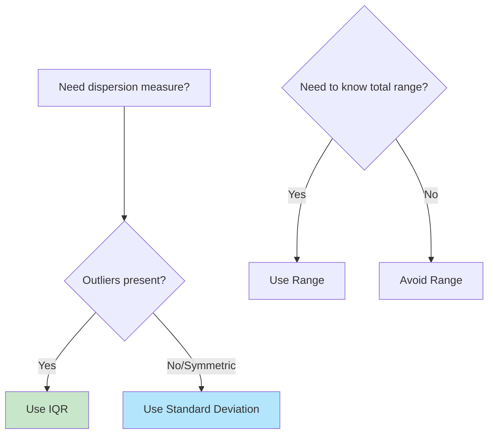
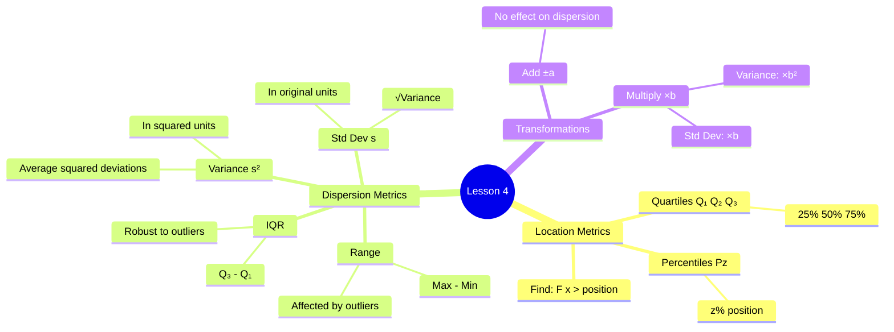

# Location and Dispersion Metrics

## 📹 Video Overview

<iframe 
  src="https://www.youtube.com/embed/wTtEomQe3EM" 
  title="Location and Dispersion Metrics - YouTube video player" 
  width="560" 
  height="315" 
  frameborder="0" 
  allow="accelerometer; autoplay; clipboard-write; encrypted-media; gyroscope; picture-in-picture" 
  allowfullscreen>
</iframe>

## 🎯 What We're Learning Today

**Main Topics:**

1. **Review:** Distribution shapes and central measures

2. **Location Metrics:** Quartiles, Deciles, Percentiles

3. **Dispersion Metrics:** How spread out is the data?

   - Range & Interquartile Range

   - Variance & Standard Deviation

---

## Part 1: Quick Review - Distribution Shapes

### The 5 Main Distribution Types:



### Quick Reference Table:

| Distribution Type | Relationship | Visual |
|------------------|--------------|---------|
| **Normal (Bell)** | Mode = Median = Mean | Perfect symmetry 🔔 |
| **Dual Peak** | Two Modes, Med = Mean | Two humps 🐫 |
| **Uniform** | No clear mode, Med = Mean | Flat line 📏 |
| **Positive Skew (Right)** | Mode < Median < Mean | Tail → right 📈 |
| **Negative Skew (Left)** | Mean < Median < Mode | Tail → left 📉 |

💡 **Memory hack:** "Mean follows the tail like a puppy!"

---

## 🧩 Classic Exam Question (Must Know!)

**Q:** "University graduate wages are positively skewed. Therefore, the percentage earning above average is greater than the percentage earning below average."

**TRUE or FALSE?**

**Answer:** **FALSE!**

**Why?**

1. **Positively skewed** = tail extends to the right (high earners)

2. **Mean gets pulled UP** by extreme high values

3. Mean > Median

4. **Median splits data 50-50:**

   - 50% below median

   - 50% above median

5. Since Mean > Median:

   - **MORE than 50% earn BELOW the mean**

   - **LESS than 50% earn ABOVE the mean**



💡 **Memory hack:** "In positive skew, most people are below average because the rich people pull the average up!"

---

## Part 2: Location Metrics

### 🎯 What Are Location Metrics?

**Question they answer:** "Where does a specific percentage of the data fall?"

Think of them as **dividing lines** in your data!

---

## 📊 Quartiles (Q₁, Q₂, Q₃, Q₄)

**Definition:** Values that divide data into 4 equal parts (25% each)



### The Four Quartiles:

| Quartile | Name | Meaning |
|----------|------|---------|
| **Q₁** | First/Lower Quartile | 25% of data ≤ Q₁ <br /> 75% of data ≥ Q₁ |
| **Q₂** | Second Quartile | **= MEDIAN!** <br /> 50% below, 50% above |
| **Q₃** | Third/Upper Quartile | 75% of data ≤ Q₃ <br /> 25% of data ≥ Q₃ |
| **Q₄** | Fourth Quartile | **= MAXIMUM value** <br /> 100% ≤ Q₄ |

💡 **Memory hack:** Q₁, Q₂, Q₃, Q₄ = 25%, 50%, 75%, 100%

---

## 🔢 Calculating Quartiles - Discrete Variable

### Example: Daily coffee consumption (200 patients)

| Cups (x) | f(x) | F(x) |
|----------|------|------|
| 0 | 10 | 10 |
| 1 | 16 | 26 |
| 2 | 12 | 38 |
| 3 | 27 | 65 |
| 4 | 55 | 120 |
| 5 | 48 | 168 |
| 6 | 15 | 183 |
| 7 | 17 | 200 |

### Step-by-Step Process:

**Step 1:** Calculate cumulative frequency F(x) ✓ (already done)

**Step 2:** Calculate the positions

For **Q₁** (First Quartile):

$$\frac{n}{4} = \frac{200}{4} = 50$$

For **Q₃** (Third Quartile):

$$\frac{3n}{4} = \frac{3 \times 200}{4} = 150$$

**Step 3:** Find where F(x) **first exceeds** these values

**For Q₁ = 50:**

- F(3) = 65 > 50 ✓ (first time!)

- F(2) = 38 < 50

- **Q₁ = 3 cups**

**For Q₃ = 150:**

- F(5) = 168 > 150 ✓ (first time!)

- F(4) = 120 < 150

- **Q₃ = 5 cups**

💡 **Memory hack:** "Keep climbing the F(x) stairs until you pass the target!"

---

## 🔢 Calculating Quartiles - Continuous Variable

### Example: Test scores (117 students)

| Scores (x) | f(x) | F(x) |
|------------|------|------|
| 40-60 | 5 | 5 |
| 60-70 | 31 | 36 |
| 70-75 | 25 | 61 |
| 75-85 | 42 | 103 |
| 85-100 | 14 | 117 |

**Calculate positions:**

- Q₁ position: n/4 = 117/4 = 29.25

- Q₃ position: 3n/4 = 3(117)/4 = 87.75

**Find the classes:**

**Q₁:** 

- F(60-70) = 36 > 29.25 ✓

- **Q₁ is in class 60-70**

**Q₃:**

- F(75-85) = 103 > 87.75 ✓

- **Q₃ is in class 75-85**

💡 **Memory hack:** For continuous, just identify the CLASS, not exact value (unless you interpolate).

---

## 📊 Deciles (P₁₀, P₂₀, ..., P₉₀)

**Definition:** Values that divide data into 10 equal parts (10% each)

**Key Deciles:**

| Decile | Symbol | Meaning |
|--------|--------|---------|
| **First Decile** | P₁₀ | 10% below, 90% above |
| **Second Decile** | P₂₀ | 20% below, 80% above |
| **Ninth Decile** | P₉₀ | 90% below, 10% above |

**Connection to Quartiles:**

- P₂₅ = Q₁

- P₅₀ = Q₂ = Median

- P₇₅ = Q₃



---

## 📊 Percentiles (Pz)

**Definition:** For any percentage z, Pz is the value where:

- z% of data is ≤ Pz

- (100-z)% of data is ≥ Pz

### 🔢 Calculating Percentiles - Discrete Variable

**Example:** Find P₆₅ (65th percentile) for coffee data

**Step 1:** F(x) already calculated ✓

**Step 2:** Calculate position

$$n \times \frac{z}{100} = 200 \times \frac{65}{100} = 200 \times 0.65 = 130$$

**Step 3:** Find where F(x) first exceeds 130

| Cups (x) | f(x) | F(x) |
|----------|------|------|
| 4 | 55 | 120 | ← 120 < 130
| 5 | 48 | **168** | ← **168 > 130** ✓

**P₆₅ = 5 cups**

💡 **Memory hack:** Formula is n × (z/100) or just n × z%

---

### 🔢 Calculating Percentiles - Continuous Variable

**Example:** Find P₃₅ (35th percentile) for test scores (n = 117)

**Step 1:** Calculate position

$$\frac{35}{100} \times 117 = 0.35 \times 117 = 40.95$$

**Step 2:** Find the class

| Scores (x) | f(x) | F(x) |
|------------|------|------|
| 40-60 | 5 | 5 | ← 5 < 40.95
| 60-70 | 31 | 36 | ← 36 < 40.95
| 70-75 | 25 | **61** | ← **61 > 40.95** ✓

**P₃₅ is in class 70-75**

---

## 📏 Part 3: Dispersion Metrics

### 🎯 What is Dispersion?

**Question:** How SPREAD OUT is the data?

**Two datasets, same mean = 9:**

- Dataset 1: 9, 9, 9, 9, 9 (no spread!)

- Dataset 2: 1, 4, 9, 12, 19 (lots of spread!)

💡 **Memory hack:** Dispersion = "How scattered is the data?"

---

## 📊 Measure 1: Range (R)

**Definition:** Difference between max and min

**Formula:**

$$R = x_{max} - x_{min}$$

**Example:** Coffee data

- xₘₐₓ = 7 cups

- xₘᵢₙ = 0 cups

- **R = 7 - 0 = 7 cups**

### 🔍 Characteristics:

✓ Very simple to calculate

✓ Easy to understand

✗ **Affected by extreme outliers** (one extreme value changes everything!)

✗ Ignores all middle values

💡 **Memory hack:** Range looks at the "edges" only, ignores the "middle"

---

## 📊 Measure 2: Interquartile Range (IQR or Q)

**Definition:** Distance between Q₃ and Q₁ (covers the middle 50% of data)

**Formula:**

$$IQR = Q = Q_3 - Q_1$$

**Example:** Coffee data

- Q₃ = 5 cups

- Q₁ = 3 cups

- **IQR = 5 - 3 = 2 cups**



### 🔍 Characteristics:

✓ **Not affected by extremes** (only looks at middle 50%)

✓ Better than range for skewed data

✗ Ignores outer 50% of data

💡 **Memory hack:** IQR = "The middle stretch" where most normal people are

---

## 🧩 Special Cases - Range vs IQR

### Case 1: Range = 0, what about IQR?

**Data:** 50, 70, 70, 70, 70, 70, 70, 70, 70, 90

- Range = 90 - 50 = 40

- Q₁ = 70, Q₃ = 70

- **IQR = 0** (even though range ≠ 0!)

**Why?** Most data is at 70, so middle 50% has no spread.

### Case 2: IQR = 0, what about Range?

**Can be 0 or greater!**

If all middle values are the same but extremes differ:

- IQR = 0

- Range > 0

💡 **Key insight:** IQR focuses on middle, Range looks at extremes!

---

## 📊 IQR and Distribution Shape

### Normal Distribution:

$$Q_3 - Q_2 = Q_2 - Q_1$$

(Symmetric - equal distances)

### Positive Skew:

$$Q_3 - Q_2 > Q_2 - Q_1$$

(Upper half more spread than lower half)

### Negative Skew:

$$Q_2 - Q_1 > Q_3 - Q_2$$

(Lower half more spread than upper half)



---

## 📊 Measure 3: Variance (s²)

**Definition:** Average of squared deviations from the mean

**Why squared?** So negative deviations don't cancel positive ones!

### 📐 Formula (Raw Data):

$$s^2 = \frac{\sum_{i=1}^{n} (x_i - \bar{x})^2}{n}$$

**Plain English:** 

1. Find mean (x̄)

2. For each value: (xᵢ - x̄)²

3. Sum all squared differences

4. Divide by n

💡 **Memory hack:** "Square the differences so negatives don't cancel!"

---

### Example 1: No Spread

**Data:** 9, 9, 9, 9, 9

**Step 1:** Mean

$$\bar{x} = \frac{9+9+9+9+9}{5} = 9$$

**Step 2:** Calculate (xᵢ - x̄)²

| xᵢ | xᵢ - x̄ | (xᵢ - x̄)² |
|----|---------|------------|
| 9  | 0       | 0          |
| 9  | 0       | 0          |
| 9  | 0       | 0          |
| 9  | 0       | 0          |
| 9  | 0       | 0          |
| **Sum** | | **0** |

**Step 3:** Variance

$$s^2 = \frac{0}{5} = 0$$

**Interpretation:** No spread = variance is 0!

---

### Example 2: With Spread

**Data:** 1, 4, 9, 12, 19

**Step 1:** Mean

$$\bar{x} = \frac{1+4+9+12+19}{5} = \frac{45}{5} = 9$$

**Step 2:** Calculate (xᵢ - x̄)²

| xᵢ | xᵢ - x̄ | (xᵢ - x̄)² |
|----|---------|------------|
| 1  | -8      | 64         |
| 4  | -5      | 25         |
| 9  | 0       | 0          |
| 12 | +3      | 9          |
| 19 | +10     | 100        |
| **Sum** | | **198** |

**Step 3:** Variance

$$s^2 = \frac{198}{5} = 39.6$$

**Interpretation:** Lots of spread = high variance!

---

### 📐 Formula (Frequency Table):

$$s^2 = \frac{\sum_{i=1}^{k} f_i(x_i - \bar{x})^2}{\sum_{i=1}^{k} f_i}$$

**Plain English:** Weight each squared difference by its frequency!

💡 **Memory hack:** "If a value appears 5 times, its deviation counts 5 times!"

---

## 📊 Measure 4: Standard Deviation (s)

**Definition:** Square root of variance

**Formula:**

$$s = \sqrt{s^2} = \sqrt{\frac{\sum_{i=1}^{n} (x_i - \bar{x})^2}{n}}$$

**Why do we need it?**

- Variance is in "squared units" (e.g., cups²)

- Standard deviation is in **original units** (e.g., cups)

- Easier to interpret!

**Example:** From Example 2

- s² = 39.6

- **s = √39.6 ≈ 6.29**

💡 **Memory hack:** "Standard deviation = variance in units I can understand!"

---

### 🔍 Characteristics of Variance & Standard Deviation:

✓ **Uses ALL data** points

✓ Most widely used dispersion measure

✓ Foundation for advanced statistics

✗ **Heavily affected by outliers** (because we square deviations!)

✗ Always ≥ 0 (can be 0 only if all values identical)

---

## 🔄 Linear Transformations & Dispersion

### Rule 1: Adding/Subtracting a Constant (±a)

**What happens?**

If we add/subtract the same amount to every value:

- Mean changes: x̄' = x̄ ± a

- **Variance UNCHANGED:** s'² = s²

- **Standard deviation UNCHANGED:** s' = s

**Why?** Adding a constant shifts everything together - doesn't change spread!

**Proof:**

$$s'^2 = \frac{\sum_{i=1}^{n} [(x_i \pm a) - (\bar{x} \pm a)]^2}{n} = \frac{\sum_{i=1}^{n} (x_i - \bar{x})^2}{n} = s^2$$

💡 **Memory hack:** "Shift everyone together = spread stays same!"

**Visual:**

```
Original: [1, 2, 3, 4, 5]  → spread = 2

Add 10:   [11, 12, 13, 14, 15] → spread still = 2
```

---

### Rule 2: Multiplying/Dividing by a Constant (×b or ÷b)

**What happens?**

If we multiply/divide every value by the same amount:

- Mean changes: x̄' = b × x̄

- **Variance changes:** s'² = b² × s²

- **Standard deviation changes:** s' = b × s (or |b| × s)

**Proof:**

$$s'^2 = \frac{\sum_{i=1}^{n} [bx_i - b\bar{x}]^2}{n} = \frac{b^2\sum_{i=1}^{n} (x_i - \bar{x})^2}{n} = b^2 s^2$$

$$s' = \sqrt{b^2 s^2} = |b| \cdot s$$

💡 **Memory hack:** 

- **Variance** gets multiplied by b²

- **Standard deviation** gets multiplied by b

---

### 📋 Transformation Summary:

| Transformation | Mean | Variance | Std Dev |
|----------------|------|----------|---------|
| **x + a** | x̄ + a | s² | s |
| **x - a** | x̄ - a | s² | s |
| **b × x** | b × x̄ | b² × s² | b × s |
| **x ÷ b** | x̄ ÷ b | s² ÷ b² | s ÷ b |
| **a + bx** | a + bx̄ | b² × s² | b × s |

---

## 🧮 Example: Grade Transformation

**Original grades (7 students):** 91, 77, 65, 83, 88, 71, 98

**Given:**

- Mean: x̄ = 80

- Variance: s² = 120 (assume)

- Standard deviation: s = √120 ≈ 10.95

### Scenario 1: Add 2 points to everyone

**New statistics:**

- Mean: x̄' = 80 + 2 = 82

- Variance: s'² = 120 (unchanged!)

- Std Dev: s' = 10.95 (unchanged!)

### Scenario 2: Multiply all grades by 1.05 (5% bonus)

**New statistics:**

- Mean: x̄' = 1.05 × 80 = 84

- Variance: s'² = (1.05)² × 120 = 1.1025 × 120 = 132.3

- Std Dev: s' = 1.05 × 10.95 = 11.50

💡 **Memory hack:** "Add = shift only, Multiply = stretch everything!"

---

## 📊 Quick Comparison Chart

| Measure | Formula | Units | Affected by Outliers? | Interpretation |
|---------|---------|-------|----------------------|----------------|
| **Range** | xₘₐₓ - xₘᵢₙ | Same as data | YES (very!) | Total spread |
| **IQR** | Q₃ - Q₁ | Same as data | NO | Middle 50% spread |
| **Variance** | Σ(xᵢ-x̄)²/n | Squared units | YES | Average squared deviation |
| **Std Dev** | √Variance | Same as data | YES | Typical deviation from mean |

---

## 🎯 Decision Guide: Which Measure?



**General rules:**

- **Symmetric data, no outliers:** Standard deviation

- **Skewed or outliers:** IQR

- **Quick overview:** Range

- **Academic/scientific:** Almost always variance/std dev

---

## 🎓 Key Formulas Summary

### Location Metrics:

| Metric | Position Formula | Finding Method |
|--------|------------------|----------------|
| **Q₁** | n/4 | First F(x) > n/4 |
| **Q₂** | n/2 | Median |
| **Q₃** | 3n/4 | First F(x) > 3n/4 |
| **Pz** | n × z/100 | First F(x) > n×z% |

### Dispersion Metrics:

| Metric | Formula |
|--------|---------|
| **Range** | R = xₘₐₓ - xₘᵢₙ |
| **IQR** | Q = Q₃ - Q₁ |
| **Variance** | $s^2 = \frac{\sum(x_i - \bar{x})^2}{n}$ |
| **Std Dev** | $s = \sqrt{s^2}$ |
| **Variance (freq)** | $s^2 = \frac{\sum f_i(x_i - \bar{x})^2}{\sum f_i}$ |

### Transformations:

| Transform | Variance | Std Dev |
|-----------|----------|---------|
| **±a** | No change | No change |
| **×b** | ×b² | ×b |

---

## 💡 Master Memory Hacks

1. **Quartiles = Quarter marks** at 25%, 50%, 75%, 100%

2. **Percentiles = Percent-tiles** - the z% mark

3. **Range = Edge to edge** (min to max)

4. **IQR = The middle crowd** (ignores extremes)

5. **Variance = Squared differences** (so negatives don't cancel)

6. **Std Dev = Variance in real units** (take √ to fix squaring)

7. **Adding = shifts, no spread change**

8. **Multiplying = stretches the spread**

9. **Mean chases tail, outliers affect it**

10. **IQR ignores tail, robust to outliers**

---

## 🎯 Quick Reference Mind Map



---

## ⚠️ Common Exam Mistakes

❌ Confusing Q₃ - Q₂ with Q (should be Q₃ - Q₁)

❌ Forgetting to square the deviations in variance

❌ Thinking adding a constant changes variance (it doesn't!)

❌ Using Range when outliers are present

❌ Forgetting variance is multiplied by b², not just b

❌ Not squaring b in transformation (s'² = b² × s², not b × s²)

❌ Thinking positive skew means more above average (it's the opposite!)

---

## 🏆 Pro Exam Tips

1. **Quartiles?** Calculate n/4 and 3n/4, then find in F(x)

2. **Percentiles?** Calculate n × z%, then find in F(x)

3. **Variance question?** Check if it's asking for raw or transformed data

4. **Linear transformation?** 

   - Adding/subtracting: dispersion unchanged

   - Multiplying: variance ×b², std dev ×b

5. **Outliers present?** Use IQR, not range or std dev

6. **Skewed distribution?** Remember mean ≠ median ≠ mode relationship

7. **Always check units:** variance in squared units, std dev in original units

**Final tip:** Distribution shape tells you about outliers AND about which measures to trust!

