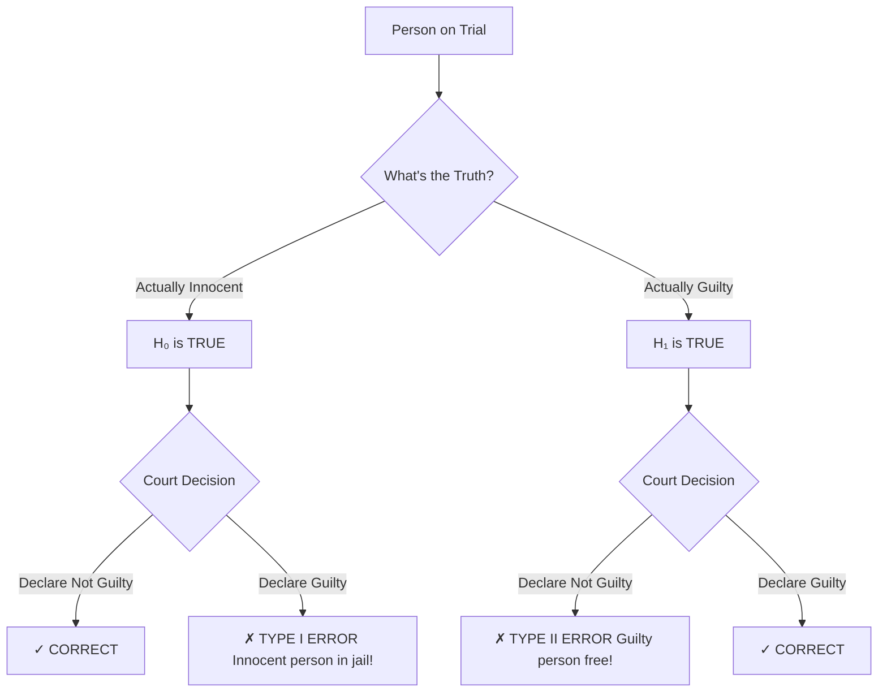
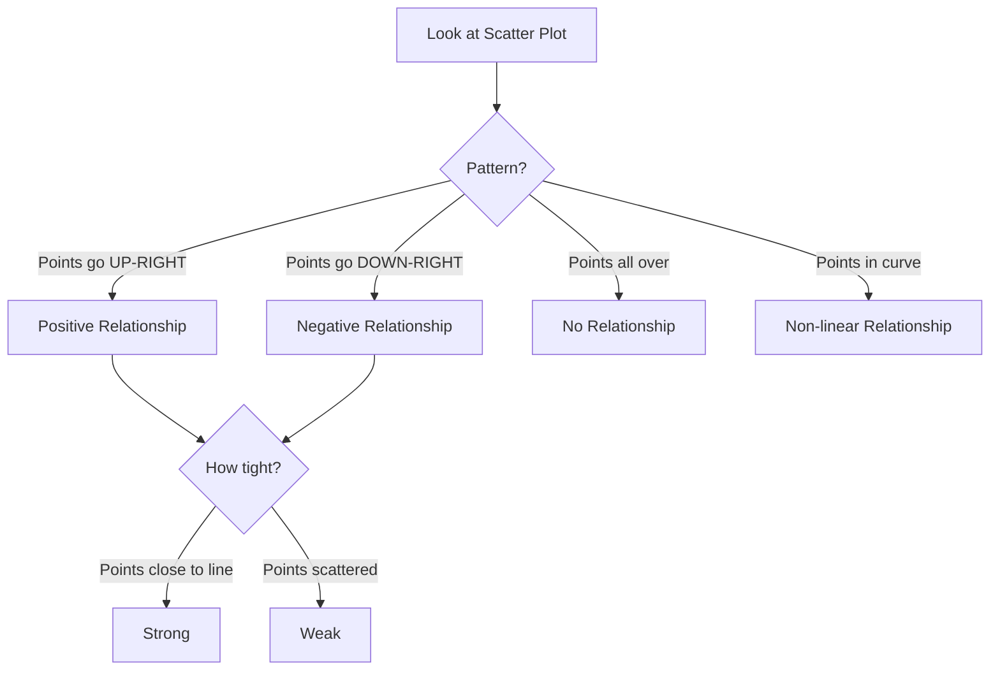
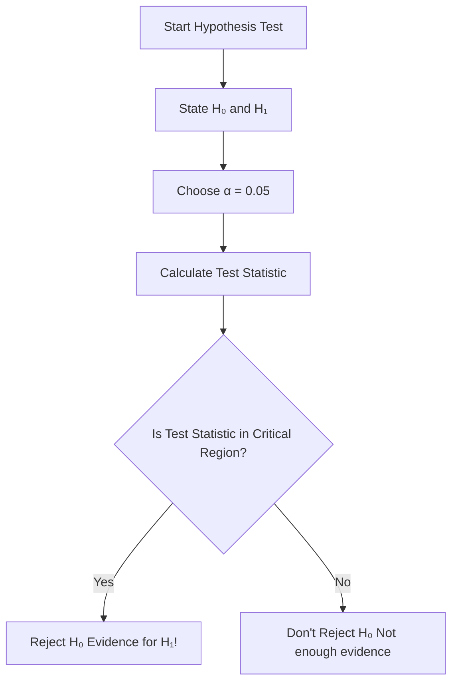

# Lesson 6: Hypothesis Testing & Correlation - Simple Student Notes

## 📹 Video Overview

<iframe 
  src="https://www.youtube.com/embed/jPMYlvWERuA" 
  title="Data True Story - YouTube video player" 
  width="560" 
  height="315" 
  frameborder="0" 
  allow="accelerometer; autoplay; clipboard-write; encrypted-media; gyroscope; picture-in-picture" 
  allowfullscreen>
</iframe>

## 📊 What We're Learning

1. **Hypothesis Testing** - How to test if claims about data are true

2. **Relationships Between Variables** - How two things are connected

3. **Correlation & Covariance** - Measuring the strength of relationships

---

## 🎯 PART 1: HYPOTHESIS TESTING

### The Big Picture

**The Problem:** We can't check EVERYONE in a population, so we use a sample. But samples have errors!

**The Solution:** Design a test that minimizes the chance of making wrong decisions.

---

## 🏛️ The Court Analogy (Best Way to Understand!)

Think of hypothesis testing like a court trial:

.png)



### The Two Hypotheses

| Hypothesis | Symbol | Meaning | Court Example |
|------------|--------|---------|---------------|
| **Null Hypothesis** | H₀ | The "default" assumption | Person is innocent |
| **Alternative Hypothesis** | H₁ | What we're trying to prove | Person is guilty |

### Memory Hack: "Innocent Until Proven Guilty"

- H₀ = Status quo (nothing special happening)
- H₁ = The exciting claim (something IS happening)

---

## ⚠️ Two Types of Errors

### Type I Error (α - Alpha)

**What it is:** Rejecting H₀ when it's actually TRUE

**Memory Hack:** "False Alarm" 🚨

- Like sending an innocent person to jail
- We SET this probability ourselves (usually α = 0.05 or 5%)

**Example:** Saying a medicine works when it actually doesn't

---

### Type II Error (β - Beta)

**What it is:** NOT rejecting H₀ when it's actually FALSE

**Memory Hack:** "Missed Detection" 🙈

- Like letting a guilty person go free
- Harder to control directly

**Example:** Saying a medicine doesn't work when it actually does

---

### Error Comparison Table

| Reality → Decision ↓ | H₀ is TRUE | H₁ is TRUE |
|----------------------|------------|------------|
| **Don't Reject H₀** | ✓ Correct | ✗ Type II Error (β) |
| **Reject H₀** | ✗ Type I Error (α) | ✓ Correct (Power = 1-β) |

---

## 🔢 Key Terms Explained Simply

### Level of Significance (α)

- The probability of Type I error we're willing to accept
- Usually 0.05 (5%) or 0.01 (1%)
- **Memory Hack:** "How much risk of false alarm we tolerate"

### Power of Test (1 - β)

- Probability of correctly rejecting H₀ when it's false
- **Memory Hack:** "How good our test is at catching the truth"

### Critical Value

- The dividing line: reject H₀ on one side, don't reject on the other
- **Memory Hack:** "The fence between guilty and not guilty"

---

## 📋 The 5 Steps of Hypothesis Testing


### Step-by-Step Example: Do Men and Women Earn Different Salaries?

#### Step 1: State Hypotheses

- **H₀:** W(m) = W(f) → Salaries are the SAME
- **H₁:** W(m) ≠ W(f) → Salaries are DIFFERENT

#### Step 2: Choose α

- Let's use α = 0.05 (5% chance of false alarm)

#### Step 3: Pick Test Statistic

- We use **two-sample t-test**

#### Step 4: Calculate T-statistic

```
T = Signal / Noise = Difference between groups / Variability of groups

T = |x̄₁ - x̄₂| / √(s₁²/n₁ + s₂²/n₂)
```

### Memory Hack for T-Test: "Signal vs Noise Radio"

- **Signal (numerator):** How different are the group averages?
- **Noise (denominator):** How much do the groups vary internally?
- **Big T = Strong signal** → Groups ARE different!
- **Small T = Weak signal** → Can't tell them apart from noise

#### Step 5: Make Decision

- If T is big enough → Reject H₀ (salaries ARE different!)
- If T is small → Don't reject H₀ (not enough evidence)

---

## 🎯 PART 2: RELATIONSHIPS BETWEEN VARIABLES

### What is a Statistical Relationship?

**Simple Definition:** When one variable changes, the other one changes too (in a predictable way)

**IMPORTANT:** Statistical relationship ≠ Causal relationship!

### Memory Hack: "Ice Cream and Drowning"

- Ice cream sales and drowning deaths are correlated
- But ice cream doesn't CAUSE drowning!
- Both happen more in summer (hidden variable)

---

## 📈 Scatter Plots (The Visual Way)

### Example: Experience vs Salary

| Employee | Experience (x) | Salary (y) |
|----------|----------------|------------|
| 1 | 2 | 7,000 |
| 2 | 4 | 10,000 |
| 3 | 5 | 8,000 |
| 4 | 7 | 11,000 |
| 5 | 8 | 13,000 |
| 6 | 9 | 15,000 |
| 7 | 12 | 13,000 |
| 8 | 14 | 16,000 |
| 9 | 20 | 17,000 |
| 10 | 25 | 19,000 |

When you plot this, you see points going UP-RIGHT → **positive relationship!**

---

## 🎨 Reading Scatter Plots



### Visual Guide

| Pattern | Relationship | Example |
|---------|--------------|---------|
| ↗️ Tight line | Perfect positive (r = 1) | Age vs Height (kids) |
| ↗️ Scattered up | Weak positive (r ≈ 0.3) | Study time vs Grade |
| ↘️ Tight line | Perfect negative (r = -1) | Gas in tank vs Distance driven |
| ↘️ Scattered down | Weak negative (r ≈ -0.3) | TV time vs Grade |
| 🌐 Random | No relationship (r = 0) | Shoe size vs IQ |
| 📈 Curve | Non-linear (r = 0) | Age vs Reaction time |

---

## 🔗 Covariance

### What It Measures

How two variables move TOGETHER (but in their original units)

### Formula

```
cov(x,y) = Σ[(xᵢ - x̄)(yᵢ - ȳ)] / n
```

### Memory Hack: "The Direction Detector"

- **cov(x,y) > 0** → Positive relationship (both increase together)
- **cov(x,y) < 0** → Negative relationship (one up, one down)
- **cov(x,y) = 0** → No linear relationship

### The Problem with Covariance

**It depends on the units!** Hard to interpret and compare.

---

## ⭐ Pearson Correlation Coefficient (r)

### What It Is

**Standardized covariance** → Same as covariance but on a scale of -1 to 1

### Formula

```
r(x,y) = cov(x,y) / (sₓ × sᵧ)
```

### Memory Hack: "Covariance with Training Wheels"

- Takes covariance
- Divides by both standard deviations
- Now it's always between -1 and 1!

---

## 🎯 Interpreting Correlation (r)

### The Scale

```
-1 ←------- 0 -------→ +1

Perfect    No      Perfect
Negative  Relationship  Positive
```

### Direction (Look at Sign)

- **r > 0** → Positive relationship ↗️
- **r < 0** → Negative relationship ↘️
- **r = 0** → No LINEAR relationship

### Strength (Look at Absolute Value)

| |r| value | Strength | Interpretation |
|-----------|----------|----------------|
| 0.00 - 0.10 | Negligible | Basically no relationship |
| 0.10 - 0.39 | Weak | Slight tendency |
| 0.40 - 0.69 | **Medium** | Noticeable pattern |
| 0.70 - 0.89 | Strong | Clear relationship |
| 0.90 - 1.00 | Very Strong | Almost perfect |

### Memory Hack: "The Absolute Rule"

- r = 0.85 → STRONG positive
- r = -0.85 → STRONG negative (same strength, opposite direction!)

---

## 📊 Complete Example: Stock Returns

### Given Data

| Day | Stock A (x) | Stock B (y) |
|-----|-------------|-------------|
| 1 | 1.0% | 3.0% |
| 2 | 1.5% | 4.5% |
| 3 | 2.2% | 4.7% |
| 4 | 1.4% | 4.0% |
| 5 | 0.2% | 3.5% |

### Step 1: Calculate Means

- x̄ = (1.0 + 1.5 + 2.2 + 1.4 + 0.2) / 5 = **1.26%**
- ȳ = (3.0 + 4.5 + 4.7 + 4.0 + 3.5) / 5 = **3.94%**

### Step 2: Calculate Covariance

```
cov(x,y) = [(1.0-1.26)(3.0-3.94) + (1.5-1.26)(4.5-3.94) + ... + (0.2-1.26)(3.5-3.94)] / 5

cov(x,y) = 0.31
```

**Interpretation:** Positive covariance → stocks tend to move together!

### Step 3: Calculate Standard Deviations

- sₓ = 0.66
- sᵧ = 0.62

### Step 4: Calculate Correlation

```
r(x,y) = 0.31 / (0.66 × 0.62) = 0.31 / 0.41 = 0.76
```

**Interpretation:** r = 0.76 → **STRONG positive correlation**

- When Stock A goes up, Stock B tends to go up too!

---

## 💰 BONUS: Portfolio Risk & Return

### Key Concepts

#### Return Formula

```
Return = (Price(t+1) + Dividend - Price(t)) / Price(t)
```

**Memory Hack:** "What you gained divided by what you paid"

#### Variance of a SUM (IMPORTANT!)

```
var(x + y) = var(x) + var(y) + 2×cov(x,y)
```

### Why This Matters for Investing

**Memory Hack: "Don't Put All Eggs in One Basket"**

If you invest in two stocks:

- **Positive correlation:** They move together → more risk!
- **Negative correlation:** They move opposite → LESS risk! (diversification)

---

## 📝 Real Example: Portfolio Calculation

### Scenario: WAR, RECESSION, STABLE, PROSPERITY, PEACE

| State | Prob | Stock C Return | Stock D Return |
|-------|------|----------------|----------------|
| WAR | 15% | 67% | -60% |
| RECESSION | 25% | -20% | -40% |
| STABLE | 35% | 7% | 13% |
| PROSPERITY | 15% | 27% | 67% |
| PEACE | 10% | -33% | 233% |

### Calculate Expected Returns

**Stock C:**

```
E(rC) = 15%×67% + 25%×(-20%) + 35%×7% + 15%×27% + 10%×(-33%)
E(rC) = 8%
```

**Stock D:**

```
E(rD) = 15%×(-60%) + 25%×(-40%) + 35%×13% + 15%×67% + 10%×233%
E(rD) = 19%
```

### Calculate Variance

```
VAR(rC) = 15%×(67%-8%)² + ... + 10%×(-33%-8%)²
VAR(rC) = 0.0069

VAR(rD) = 0.0152
```

### Calculate Covariance

```
COV(rC, rD) = 15%×(67%-8%)×(-60%-19%) + ... + 10%×(-33%-8%)×(233%-19%)
COV(rC, rD) = -0.00176
```

**Negative covariance = GOOD for portfolio!** Stocks move in opposite directions.

### Calculate Correlation

```
ρ = -0.00176 / √(0.0069 × 0.0152)
ρ = -0.171
```

**Interpretation:** Weak negative correlation → some diversification benefit!

---

## 🧠 Memory Hacks Summary

| Concept | Memory Trick |
|---------|--------------|
| Hypothesis Testing | "Court trial - innocent until proven guilty" |
| Type I Error | "False alarm - innocent in jail" |
| Type II Error | "Missed detection - guilty goes free" |
| Alpha (α) | "How much false alarm risk we accept" |
| T-test | "Signal vs Noise radio" |
| Covariance | "Direction detector (with units)" |
| Correlation | "Covariance with training wheels (-1 to 1)" |
| Portfolio Risk | "Don't put all eggs in one basket" |

---

## 🎯 Quick Reference Formulas

```
Two-Sample T-Test:
T = |x̄₁ - x̄₂| / √(s₁²/n₁ + s₂²/n₂)

Covariance:
cov(x,y) = Σ[(xᵢ - x̄)(yᵢ - ȳ)] / n

Pearson Correlation:
r(x,y) = cov(x,y) / (sₓ × sᵧ)

Variance of Sum:
var(x + y) = var(x) + var(y) + 2×cov(x,y)

Return:
Return = (Price(t+1) + Dividend - Price(t)) / Price(t)
```

---

## 📊 Decision Flow Chart



---

## 💡 Pro Tips for Exams

1. **Hypothesis Testing:**
   - Always start with H₀ (null)
   - H₁ is what you're trying to prove
   - Be careful: "Don't reject" ≠ "Accept"

2. **Correlation:**
   - Sign shows direction (+ or -)
   - Absolute value shows strength
   - r = 0 means NO LINEAR relationship (might be curved!)

3. **Common Mistakes:**
   - Don't confuse correlation with causation
   - Don't forget to take square root when going from variance to SD
   - Remember covariance has units, correlation doesn't

4. **Calculator Check:**
   - Correlation must be between -1 and 1
   - If you get r = 2.5, you made a mistake!

---

**Good luck! Remember: Statistics is about making the best decision with incomplete information! 🎲📊**

