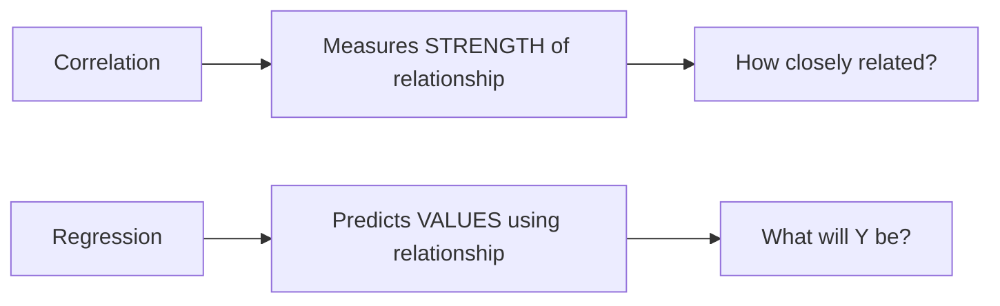
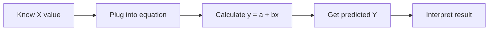

# Lesson 7: Regression Analysis - Simple Student Notes

## 📹 Video Overview

<iframe 
  src="https://www.youtube.com/embed/y2t4-V6gbUU" 
  title="Understanding Regression - YouTube video player" 
  width="560" 
  height="315" 
  frameborder="0" 
  allow="accelerometer; autoplay; clipboard-write; encrypted-media; gyroscope; picture-in-picture" 
  allowfullscreen>
</iframe>

## 📊 What We're Learning

**Regression** - How to predict one variable from another using a line equation

---

## 🎯 The Big Picture: Correlation vs Regression

### What's the Difference?



| Aspect | Correlation | Regression |
|--------|-------------|------------|
| **Question** | "Are X and Y related?" | "If X = 5, what is Y?" |
| **Output** | A number (r) from -1 to 1 | An equation: y = a + bx |
| **Purpose** | Measure relationship | **Predict** values |
| **Example** | "Study time and grades have r = 0.75" | "If you study 5 hours, expect grade = 82" |

### Memory Hack: "Correlation → How much? Regression → How to predict?"

- **Correlation:** Tells you there's a relationship
- **Regression:** Gives you the equation to USE that relationship

---

## 📈 What is Regression?

**Simple Definition:** Finding the "best fit" line through your data points so you can predict new values.

**Formal Definition:** A statistical technique to understand the relationship between:

- **Dependent variable (Y):** What you want to predict
- **Independent variable(s) (X):** What you use to predict

### Real-Life Examples

| Scenario | Independent (X) | Dependent (Y) |
|----------|-----------------|---------------|
| **Business** | Advertising spend | Sales revenue |
| **Education** | Study hours | Exam grade |
| **Real Estate** | House size (sq ft) | House price |
| **Health** | Exercise hours/week | Weight loss |

---

## 📊 Types of Regression

### 1. Linear vs Non-Linear

#### Linear Regression

**Shape:** Straight line

**Form:** y = mx + b (or y = a + bx)

```
     Y
     |     •
     |   •
     | •           ← Straight line!
     |•
     |____________ X
```

#### Non-Linear Regression

**Shape:** Curved line

**Examples:** Parabolas, exponentials, logarithms

```
     Y
     |         •
     |      •
     |   •          ← Curved!
     | •
     |____________ X
```

**In this course:** We focus on LINEAR regression only! ✅

---

### 2. Simple vs Multiple Regression

| Type | Number of X variables | Equation Example |
|------|----------------------|------------------|
| **Simple** | One X | y = a + bx |
| **Multiple** | Many X's | y = a + b₁x₁ + b₂x₂ + ... |

**In this lesson:** We focus on SIMPLE regression (one X)! ✅

---

## 📚 Data Types

### Cross-Sectional Data

**What:** Data collected at ONE point in time from different subjects

**Example:** Survey of 100 students' grades and study hours in ONE semester

### Time Series Data

**What:** Data collected over MULTIPLE time periods for one subject

**Example:** Company's monthly sales over 5 years

### Memory Hack

- **Cross-sectional:** "Snapshot" 📸 (one moment, many people)
- **Time series:** "Movie" 🎬 (many moments, one subject)

---

## 🎯 Key Terms You MUST Know

### Dependent Variable (Y)

- What you're trying to PREDICT or EXPLAIN
- Also called: **Response variable**, Output, Target
- **Symbol:** y or Y

### Independent Variable (X)

- What you USE to predict
- Also called: **Predictor variable**, Explanatory variable, Input
- **Symbol:** x or X

### Memory Hack: "Y depends on X"

- **Y = Grade** (depends on)
- **X = Study hours** (the predictor)

---

## 📐 The Linear Equation: y = mx + b

### Two Forms (Same Thing!)

| Math Class | Statistics Class |
|------------|------------------|
| y = mx + b | y = β₀ + β₁x |
| y = mx + b | y = a + bx |

**They're all the same!** Just different notation.

### What Each Part Means

```
y = a + bx

Where:
y = predicted value (dependent variable)
a = intercept (where line crosses Y-axis)
b = slope (steepness of line)
x = independent variable (what you know)
```

---

## 🎢 Understanding SLOPE (b or β₁)

### What It Means

**"For every 1-unit increase in X, Y changes by b units"**

### Examples

#### Slope = 2

```
y = 5 + 2x

If x increases by 1 → y increases by 2
```

- x = 1 → y = 5 + 2(1) = 7
- x = 2 → y = 5 + 2(2) = 9
- x = 3 → y = 5 + 2(3) = 11

**Each step in X = 2 steps up in Y!**

#### Slope = -3

```
y = 10 - 3x

If x increases by 1 → y DECREASES by 3
```

- x = 1 → y = 10 - 3(1) = 7
- x = 2 → y = 10 - 3(2) = 4
- x = 3 → y = 10 - 3(3) = 1

**Each step in X = 3 steps DOWN in Y!**

### Memory Hack for Slope

- **Positive slope:** "Going uphill" ↗️ (as X ↑, Y ↑)
- **Negative slope:** "Going downhill" ↘️ (as X ↑, Y ↓)
- **Slope = 0:** "Flat road" → (X doesn't affect Y)

---

## 🎯 Understanding INTERCEPT (a or β₀)

### What It Means

**"The value of Y when X = 0"**

### Visual Example

```
y = 5 + 2x

When x = 0:
y = 5 + 2(0) = 5  ← This is the intercept!
```

```
     Y
   10|
     |
    5|• ← Line crosses Y-axis here (intercept = 5)
     |
    0|____________ X
     0
```

### Memory Hack: "Starting Point"

The intercept is where your line **starts** when X = 0.

**Note:** Sometimes the intercept doesn't make practical sense!

- Example: "House price when size = 0" → You can't have a 0 sq ft house!
- It's just a mathematical necessity for the equation.

---

## 🧮 The Regression Model (Full Version)

### The Complete Formula

```
yᵢ = β₀ + β₁xᵢ + εᵢ

Where:
yᵢ = actual Y value for observation i
β₀ = intercept (population parameter)
β₁ = slope (population parameter)
xᵢ = X value for observation i
εᵢ = ERROR term (residual)
```

### Memory Hack: "Data = Model + Error"

```
Actual value = Predicted value + Mistake
```

**Why is there error?**

- Real data doesn't fall perfectly on a line!
- Other factors affect Y (not just X)
- Random variation

---

## 🎯 Residuals (Errors) - SUPER IMPORTANT!

### What is a Residual?

**The distance between actual Y and predicted Y**

```
Residual (ε) = Actual Y - Predicted Y
```

### Visual Understanding

.png)

```
     Y
     |
   10|    • ← Actual point (Y = 10)
     |    |
    8|----• ← Predicted point (Ŷ = 8)
     |    ↑
     |    Residual = 10 - 8 = 2
     |____________ X
```

### Positive vs Negative Residuals

| Residual | Meaning | Visual |
|----------|---------|--------|
| **Positive** | Actual Y > Predicted Y | Point ABOVE the line |
| **Negative** | Actual Y < Predicted Y | Point BELOW the line |
| **Zero** | Actual Y = Predicted Y | Point ON the line |

---

## 🎯 Finding the Best Line (Method of Least Squares)

### The Goal

**Minimize the sum of squared residuals (errors)**

### Why Square the Residuals?

1. Gets rid of negative values
2. Penalizes large errors more (like variance!)

### Formula to Minimize

```
Minimize: Σ(εᵢ)² = Σ(yᵢ - ŷᵢ)²

Where ŷᵢ = β₀ + β₁xᵢ
```

### Memory Hack: "Best Fit = Smallest Mistakes²"

- We want the line where the **total squared errors** are as small as possible
- This gives us ONE unique "best" line!

---

## 📐 The Formulas for β₁ and β₀

### Formula for Slope (β₁)

```
β₁ = Σ[(xᵢ - x̄)(yᵢ - ȳ)] / Σ[(xᵢ - x̄)²]
```

**Look familiar?** This is basically:

```
β₁ = Covariance(x,y) / Variance(x)
```

### Memory Hack: "How Y changes with X"

- Numerator: How X and Y vary **together**
- Denominator: How much X varies by itself
- Result: Change in Y per unit change in X

---

### Formula for Intercept (β₀)

```
β₀ = ȳ - β₁x̄
```

### Memory Hack: "Adjust the starting point"

- Take the average of Y
- Adjust it based on average of X and the slope
- This ensures the line goes through (x̄, ȳ)

**Cool Fact:** The regression line ALWAYS passes through the point (x̄, ȳ)! ✨

---

## 📝 Complete Example: Step-by-Step

### Given Data

| X (Advertising $1000s) | Y (Sales $1000s) |
|------------------------|------------------|
| 200 | 180 |
| 250 | 230 |
| 300 | 280 |
| 350 | 310 |

**Find the regression equation: y = β₀ + β₁x**

---

### Step 1: Calculate Means

```
x̄ = (200 + 250 + 300 + 350) / 4 = 1100 / 4 = 275

ȳ = (180 + 230 + 280 + 310) / 4 = 1000 / 4 = 250
```

---

### Step 2: Create a Table for Calculations

| i | xᵢ | yᵢ | (xᵢ - x̄) | (yᵢ - ȳ) | (xᵢ - x̄)(yᵢ - ȳ) | (xᵢ - x̄)² |
|---|----|----|----------|----------|-------------------|------------|
| 1 | 200 | 180 | -75 | -70 | 5,250 | 5,625 |
| 2 | 250 | 230 | -25 | -20 | 500 | 625 |
| 3 | 300 | 280 | 25 | 30 | 750 | 625 |
| 4 | 350 | 310 | 75 | 60 | 4,500 | 5,625 |
| **Sum** | | | | | **11,000** | **12,500** |

---

### Step 3: Calculate Slope (β₁)

```
β₁ = Σ[(xᵢ - x̄)(yᵢ - ȳ)] / Σ[(xᵢ - x̄)²]

β₁ = 11,000 / 12,500 = 0.88
```

**Interpretation:** For every $1,000 increase in advertising, sales increase by $880!

---

### Step 4: Calculate Intercept (β₀)

```
β₀ = ȳ - β₁x̄

β₀ = 250 - (0.88 × 275)

β₀ = 250 - 242 = 8
```

---

### Step 5: Write the Final Equation

```
y = 8 + 0.88x

Or more formally:
Sales = 8 + 0.88(Advertising)
```

**In words:** 

- Base sales (when advertising = 0) = $8,000
- Each $1,000 in advertising adds $880 in sales

---

### Step 6: Make Predictions!

**Question:** If we spend $400,000 on advertising, what will sales be?

```
y = 8 + 0.88(400)
y = 8 + 352
y = 360

Predicted sales = $360,000
```

---

## 🎯 The Prediction Process



### Example Flow

1. **Given:** x = 320 (advertising)
2. **Equation:** y = 8 + 0.88x
3. **Calculate:** y = 8 + 0.88(320) = 8 + 281.6 = 289.6
4. **Answer:** Predicted sales = $289,600

---

## 🧠 Key Insights

### 1. Why Linear Regression Works

**Memory Hack: "Straight line through the cloud"**

- Your data points form a "cloud"
- Regression finds the straight line that best represents that cloud
- Minimizes the distance of all points from the line (squared)

### 2. The Line Always Goes Through (x̄, ȳ)

**Why?** Because of how β₀ is calculated!

- This is a built-in property
- Useful for checking your work

### 3. Slope Shows Direction AND Magnitude

- **Sign:** Direction of relationship
  - Positive → both increase together
  - Negative → one increases, other decreases
- **Size:** How strong the relationship
  - Slope = 0.5 → weak relationship
  - Slope = 10 → strong relationship

---

## 📊 Assumptions of Linear Regression

For regression to work well, we assume:

1. **Linearity:** Relationship is actually linear (not curved)
2. **Independence:** Observations don't affect each other
3. **Constant variance:** Spread of residuals is constant (homoscedasticity)
4. **Normality:** Residuals are normally distributed

### Memory Hack: "LINE"

- **L**inearity
- **I**ndependence
- **N**ormality
- **E**qual variance

Don't worry too much about these now - just know they exist!

---

## 💡 Common Mistakes to Avoid

### 1. Extrapolation

**Don't predict outside your data range!**

**Example:**

- Your data: x = 200 to 350
- Don't predict for x = 1000 (way outside range!)
- The relationship might not hold there

### 2. Confusing Correlation and Causation

**Regression doesn't prove causation!**

**Example:**

- Ice cream sales predict drowning deaths
- But ice cream doesn't CAUSE drowning!
- Both caused by summer weather

### 3. Ignoring Outliers

**One extreme point can mess up your whole line!**

---

## 🎯 Quick Reference Formulas

```
REGRESSION EQUATION:
y = β₀ + β₁x

SLOPE:
β₁ = Σ[(xᵢ - x̄)(yᵢ - ȳ)] / Σ[(xᵢ - x̄)²]

INTERCEPT:
β₀ = ȳ - β₁x̄

RESIDUAL:
εᵢ = yᵢ - ŷᵢ

PREDICTION:
Plug in your X value into y = β₀ + β₁x
```

---

## 🧠 Memory Hacks Summary

| Concept | Memory Trick |
|---------|--------------|
| Regression | "Find the best line to predict" |
| Correlation vs Regression | "How much? vs How to predict?" |
| Slope | "Change in Y per 1-unit change in X" |
| Intercept | "Starting point when X = 0" |
| Residual | "Actual minus Predicted" |
| Best fit | "Smallest mistakes squared" |
| Data types | "Snapshot vs Movie" |
| Assumptions | "LINE" |

---

## 📝 Practice Problem Walkthrough

### Problem

Given this data, find the regression equation:

| Study Hours (X) | Grade (Y) |
|----------------|-----------|
| 2 | 70 |
| 4 | 80 |
| 6 | 85 |
| 8 | 95 |

### Solution Steps

**Step 1: Means**

- x̄ = (2+4+6+8)/4 = 5
- ȳ = (70+80+85+95)/4 = 82.5

**Step 2: Calculate Slope**

- Create the table (homework!)
- β₁ = Σ[(xᵢ - x̄)(yᵢ - ȳ)] / Σ[(xᵢ - x̄)²]
- β₁ = 50 / 20 = 2.5

**Step 3: Calculate Intercept**

- β₀ = 82.5 - 2.5(5) = 82.5 - 12.5 = 70

**Step 4: Final Equation**

```
Grade = 70 + 2.5(Study Hours)
```

**Interpretation:** Each extra study hour predicts a 2.5-point grade increase!

---

## 🎓 Exam Tips

1. **Always show your work:** Partial credit matters!
2. **Label your axes:** In scatter plots, always label X and Y
3. **Units matter:** Include units in your interpretation
4. **Check your slope sign:** Does it make sense? (more study → higher grade = positive ✓)
5. **Round appropriately:** Usually 2-3 decimal places is fine

---

## 🔗 Connection to Previous Lessons

| Previous Concept | How It Relates to Regression |
|-----------------|------------------------------|
| **Mean (x̄, ȳ)** | Line always passes through (x̄, ȳ) |
| **Variance** | Used in denominator of slope formula |
| **Covariance** | Used in numerator of slope formula |
| **Correlation (r)** | Related to slope: both measure relationship strength |
| **Standard Deviation** | Related to spread of residuals |

**Big Picture:** Everything builds on what came before! 🏗️

---

**Good luck! Remember: Regression lets you PREDICT the future based on the past! 🔮📈**

